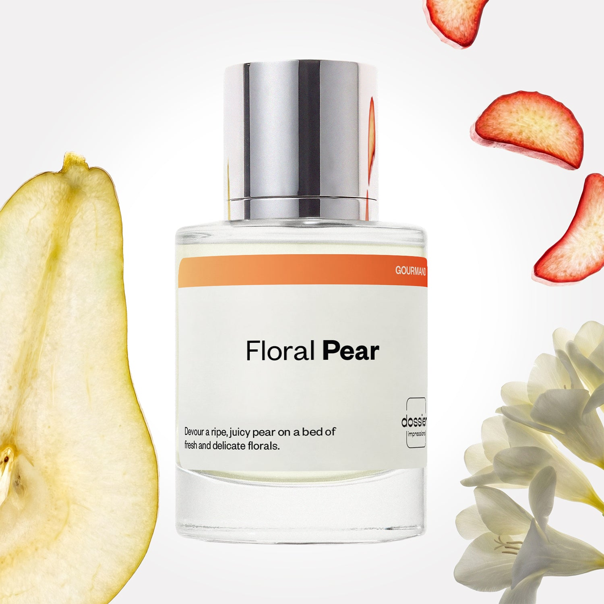

# Floral Pear

- **Dossier Inspired by Jo Malone's English Pear and Freesia**
- **URL:** https://dossier.co/products/floral-pear
- **SEO title:** Jo Malone’s English Pear and Freesia Dupe Perfume: Floral Pear - Dossier Perfumes

## Pricing (sizes)

| Size/SKU | Member price | List price | Currency |
|---|---|---|---|
| DI50FLPUS | 28.8 | 32 | USD |

## Content (scent notes, about, editorial)

Back Home / Perfumes / Dossier Impressions / FLORAL PEAR 

Unisex 

Floral Pear

Eau de Parfum. Size: 50ml / 1.7oz 

members: $28.80

Guest:
$32

Inspired by Jo Malone's English Pear and Freesia Inspired by Jo Malone's English Pear and Freesia 
Inspired by Jo Malone's English Pear and Freesia 

Retail price 118 Crafted in France 
Scent Family: gourmand 

Add to Cart 

Scent Notes This perfume is: A juicy, perfectly ripe pear 
Main Notes:

Pear

Bergamot

Watermelon

Rhubarb

Rose

Freesia

top: The first notes you smell 
Pear, Bergamot, Watermelon, Rhubarb 
middle: The heart of the perfume 
Quince, Rose, Freesia, Orange Blossom 
base: The notes that linger all day 
Woody Notes, Musk, Amber 
ingredients: Alcohol Denat., Fragrance/Parfum, Water/Aqua/Eau, Citrus Limon (Lemon) Peel Oil, Limonene, Linalool, Linalyl Acetate, Geraniol, Hexyl Cinnamal, Trimethylcyclopentenyl Methylisopentenol, Benzyl Benzoate, Pogostemon Cablin Oil, Citrus Aurantium Peel Oil, Pinene, Hexadecanolactone, Citronellol, Citral, Geranyl Acetate, Rose Ketones, Terpinolene, Beta-Caryophyllene, Alpha-Terpinene, Benzyl Alcohol, Eugenol, Terpineol. 

Vegan
Cruelty-free

Clean ingredients

About Ripe pear plays with the acidity and greenness of rhubarb, providing a natural freshness that is signature to Floral Pear (inspired by Jo Malone’s English Pear and Freesia). Paired with a delicate rose and freesia duet, this fragrance highlights natural elements in their simplicity and beauty, paying homage to them without disguising them.

Thanks to this construction, Floral Pear (our impression of Jo Malone’s English Pear and Freesia) could be worn alone or layered with other floral scents to offer a personal touch to your favorite fragrance.

Scent Intensity: Soft 

Concentration: 18%

Gender: Unisex 

Shipping
Free shipping with 2+ items. 

Standard Shipping (with 2+ items) Auto-selected with 2+ items 
FREE 

Standard Shipping Auto-selected under 2 items 
$3.95 

Express shipping: 2 business days Select in checkout 
$19.00 

Returns
Free exchanges for all. Free returns with 

Exchanges
Free exchange, 1 time per order for all.

Returns
D+ members get 1 FREE return per order.
Non-members incur a $3.99/bottle return fee, 1 time per order.
Returns must be postmarked within 30 days of the initial order. Learn More 

FAQs Are these fragrances long lasting? They are designed to be very long lasting, just like designer fragrances, in some cases even longer, depending on the composition. 
When does the new packaging come out? We'll begin rolling out our new packaging across the U.S. and international markets soon! If you want to shop IRL - our new packaging first hits stores on January 11, 2026 at Walmart. Please note that if you are shopping online, you may receive a combination of our current and new packaging while we transition our inventory. 
How will I know what scent I like? We get it, shopping for perfumes online is hard! That's why we created a scent quiz, which will find the perfect scent for you Take the quiz (opens in new tab) 
Unsure about something? Ask us! help@dossier.co 

Details We are not associated or affiliated with the brands mentioned here in any way.
Floral Pear

Sink into a heavenly dream of the wild and free

An essence of fantastical nature and wilderness, let the Jo Malone English Pear and Freesia cologne (the fragrance that inspired Dossier’s Floral Pear) blanket you with scintillating sensations of warmth and blossom, intertwined with the succulence of a dewy Amazonian rainforest.

With deliciously fruity top notes of pear and melon that enchant and leave you longing for more, the luxury fragrance that Floral Pear is inspired by opens with tenderness – the smell of ripe summer berries and fruits picked freshly from a forest. Embellished with base notes of spicy amber, rhubarb and patchouli, this cologne mirrors a picturesque summer’s day in a field of wild nature and flowers. The mellowing warmth of the base tones leaves you satisfied and homely, letting the infinite stars of an open sky at dusk fill you with wonder.

This fragrance lets you experience the unpredictability of the wilderness while being enraptured with a sense of serenity and calm. The subtle middle notes of elegant rose and freesia open the divine gates to a delightful bouquet of floral notes that mingle naturally with the warm and fruity tones to create the perfectly balanced fusion of wild and tame.

The luxury fragrance that Floral Pear is inspired by will leave you a vision of an English rose – captivatingly endearing, oozing with rays of laughter and passionate love.

If you fancy an experience of the tantalizing fruity flavors and retreat to the whimsical wilderness, you can get the Jo Malone English Pear and Freesia cologne in 3 sizes from 30 ml – 100 ml for the cost of $75.00 – $145.00. Or, to experience this delightful fragrance in other ways, you could indulge in the scent of the 60 mg travel candle costing $36.00 and a larger 200 mg candle for a longer lasting experience for $70.00. For the best-selling 165 ml diffuser in the fragrance, it will cost you $100.00. The scented body cream, which comes in 2 sizes – 50 ml and 175 ml, goes for $32.00 and $86.00 respectively. Alternatively, you can pamper yourself with the gift set that includes the body wash, body cream and the 30 ml cologne. It goes for $125.00.

To indulge in a delightful fragrance similar to that of the Jo Malone English Pear and Freesia cologne at a cheaper price point, look no further than Dossier’s Floral Pear. Our dupe offers a thrilling marriage of fresh pear and rhubarb that collide effortlessly to design a colorful cocktail of the floral wilderness and tangy fruit. With delicate hints of the rose and freesia tones, our Floral Pear fragrance flawlessly nods to the beauty of Mother Nature. We designed this fragrance to provide an air of natural opulence and grace, similar to that of the Jo Malone English Pear and Freesia cologne.

Best Layered With Combine 2 of our perfumes to create a third scent with layering, curated by our nose. Learn more 

You Might Love 

4.0 

Rated 4.0 out of 5 stars 

Based on 1,132 reviews 

Reviews 1,132 (tab expanded) Questions 1 (tab collapsed) 

Filters 
Write a Review (Opens in a new window) 

1,132 reviews 
Sort Highest Rating Most Helpful Photos & Videos Most Recent Oldest Lowest Rating Least Helpful 

K 

Kim 

6/17/26 

Rated 5 out of 5 stars 

5 Stars
I was not a fan of floral pear. It just was too overly older woman, floral for me.

Read More Read more about this review 

Was this helpful? Yes, this review from Kim was helpful. 0 people voted yes No, this review from Kim was not helpful. 0 people voted no 

A 

Amalia 

6/11/26 

Rated 5 out of 5 stars 

5 Stars
Love the scent

Read More Read more about this review 

Was this helpful? Yes, this review from Amalia was helpful. 0 people voted yes No, this review from Amalia was not helpful. 0 people voted no 

J 

Jesus 

6/3/26 

Rated 5 out of 5 stars 

5 Stars
Smells so great

Read More Read more about this review 

Was this helpful? Yes, this review from Jesus was helpful. 0 people voted yes No, this review from Jesus was not helpful. 0 people voted no 

C 

Cheryl 

5/4/26 

Rated 5 out of 5 stars 

5 Stars
Love it! Smells devine!

Read More Read more about this review 

Was this helpful? Yes, this review from Cheryl was helpful. 0 people voted yes No, this review from Cheryl was not helpful. 0 people voted no 

D 

Dionne 

4/20/26 

Rated 5 out of 5 stars 

5 Stars
Absolutely love them. I enjoy layering them as well

Read More Read more about this review 

Was this helpful? Yes, this review from Dionne was helpful. 0 people voted yes No, this review from Dionne was not helpful. 0 people voted no 

Loading... 

Loading... 

Show More 

Inspired by  Baccarat Rouge 540 
Inspired by  Black Opium 
Inspired by  Love, Don't Be Shy 
Inspired by  Good Girl 
Inspired by  Libre 
Inspired by  Flowerbomb 
Inspired by  Light Blue 
Inspired by  Not a Perfume 
Inspired by  Aventus 
Inspired by  Bleu de Chanel 
Inspired by  Mon Paris 
Inspired by  Coco Mademoiselle 
Inspired by  Tom Ford for Men 
Inspired by  For Her 
Inspired by  J'Adore Dior 
Inspired by  Alien 
Inspired by  Black Opium Perfume 
Inspired by  Lost Cherry Perfume 

GET UP TO 30% OFF 

Find us at these retailers. 

Be the first to know. 
Submit 

Shop the following countries. United States 

Discover.
AI Scent Finder 
Blog (opens in new tab) 
Scent Family 
Layering 
Scent Quiz 

Help.
Contact Us 
Returns 
FAQ 
Testimonials 
Accessibility 

More.
Store Locator 
Boutique 
Refer A Friend 
Index 

Download our app now.

Find us at these retailers. 

Be the first to know. 
Submit 

Shop the following countries. United States 

Discover.
AI Scent Finder 
Blog (opens in new tab) 
Scent Family 
Layering 
Scent Quiz 

Help.
Contact Us 
Returns 
FAQ 
Testimonials 
Accessibility 

More.

## Main Image

