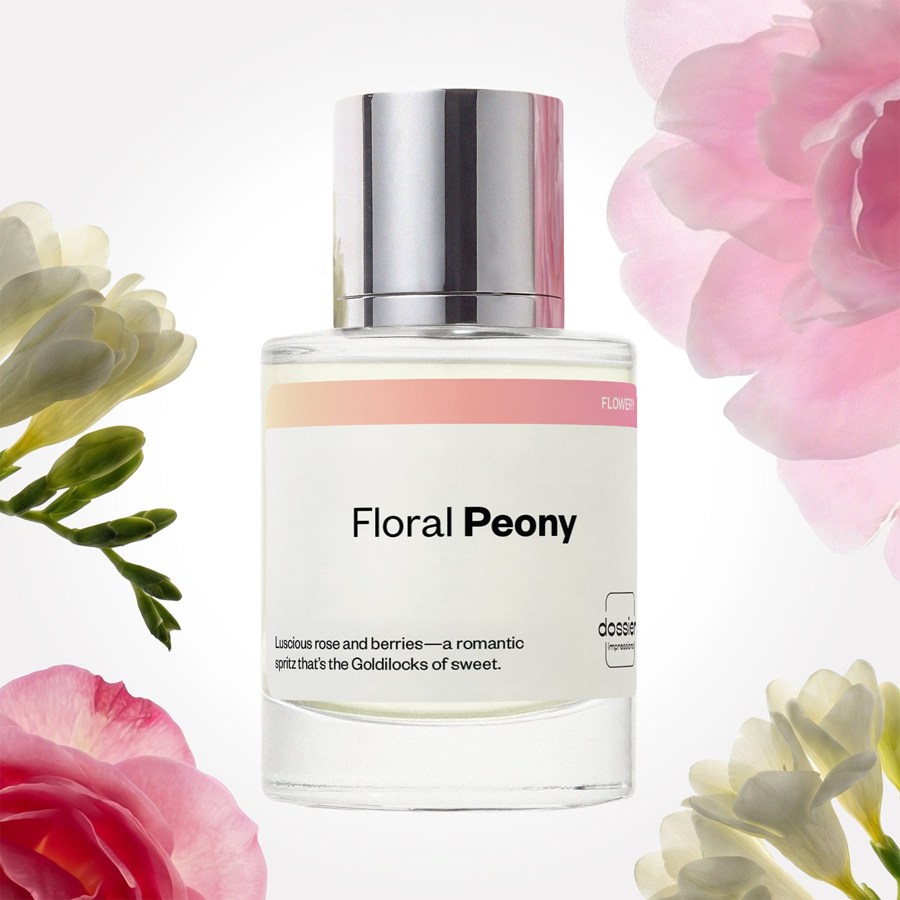

# Floral Peony

- **Dossier Inspired by Chloe's Chloe**
- **URL:** https://dossier.co/products/floral-peony
- **SEO title:** Chloe Dupe Perfume: Floral Peony - Dossier Perfumes

## Pricing (sizes)

| Size/SKU | Member price | List price | Currency |
|---|---|---|---|
| DI50FLPEUS | 28.8 | 32 | USD |

## Content (scent notes, about, editorial)

Back Home / Perfumes / Dossier Impressions / FLORAL PEONY 

Women 

Floral Peony

Eau de Parfum. Size: 50ml / 1.7oz 

members: $28.80

Guest:
$32

Inspired by Chloe's Chloe Inspired by Chloe's Chloe 
Inspired by Chloe's Chloe 

Retail price 138 Crafted in France 
Scent Family: flowery 

Add to Cart 

Scent Notes This perfume is: Berries and a drizzle of honey 
Main Notes:

Peony

Lychee

Lily

Rose

Magnolia

Freesia

top: The first notes you smell 
Peony, Lychee, Lily 
middle: The heart of the perfume 
Rose, Magnolia, Freesia 
base: The notes that linger all day 
Musk, Cedarwood, Honey 
ingredients: Alcohol Denat., Fragrance/Parfum, Water/Aqua/Eau, Tetramethyl Acetyloctahydronaphthalenes, Hexamethylindanopyran, Dimethyl Phenethyl Acetate, Citrus Aurantium Bergamia (Bergamot) Peel Oil, Hexyl Cinnamal, Rose Ketones, Limonene, Beta-Caryophyllene, Linalyl Acetate, Citronellol, Geraniol, Linalool, Benzyl Salicylate, Pelargonium Graveolens Flower Oil, Alpha-Isomethyl Ionone, Hydroxycitronellal, Pinene, Rose Flower Oil/Extract, Geranyl Acetate, Vanillin. 

Vegan
Cruelty-free

Clean ingredients

About Floral Peony (inspired by Chloe's Chloe) offers a subtle take on traditional rose, combining rose essence, peony - with its fresh, leafy and soft rosy smell - and lychee -with its liquorous and rosy inflections. This bouquet is refreshed with pure freesia and lily floralcy.

Romantic and delicately-petaled, Floral Peony (our impression of Chloe's Chloe) is a journey to the heart of a hatching rose, expressing a natural and refined, yet not girly, femininity. 

Scent Intensity: Significant 

Concentration: 15%

Gender: Feminine 

Shipping
Free shipping with 2+ items. 

Standard Shipping (with 2+ items) Auto-selected with 2+ items 
FREE 

Standard Shipping Auto-selected under 2 items 
$3.95 

Express shipping: 2 business days Select in checkout 
$19.00 

Returns
Free exchanges for all. Free returns with 

Exchanges
Free exchange, 1 time per order for all.

Returns
D+ members get 1 FREE return per order.
Non-members incur a $3.99/bottle return fee, 1 time per order.
Returns must be postmarked within 30 days of the initial order. Learn More 

FAQs Are these fragrances long lasting? They are designed to be very long lasting, just like designer fragrances, in some cases even longer, depending on the composition. 
When does the new packaging come out? We'll begin rolling out our new packaging across the U.S. and international markets soon! If you want to shop IRL - our new packaging first hits stores on January 11, 2026 at Walmart. Please note that if you are shopping online, you may receive a combination of our current and new packaging while we transition our inventory. 
How will I know what scent I like? We get it, shopping for perfumes online is hard! That's why we created a scent quiz, which will find the perfect scent for you Take the quiz (opens in new tab) 
Unsure about something? Ask us! help@dossier.co 

Details A modern essence of the traditional rose – free and flirtatious

A melodious song of swallows that swoop with grace familiarly among the fields of peonies and roses, Chloé’s Chloé is a feminine scent of flirtatious nature. An uncomplicated scent of free-spirited springtime interlaced with a sensual romance, this 14-year-old Eau de Parfum is a floral bouquet of simplicity and adoration.

Although consumed by floral notes of springtime aromas and enchanted woodland, Chloé’s Chloé maintains an air of refreshing grace and love without overpowering the senses. It is an olfactory portal to the Garden of Eden – a beautiful blend of white freesia and blushing peony. These are notes that whisper a loving melody and caress the nose with a blossoming bouquet of aromas.

Tradition takes the reins with the indulgent middle notes of class and beauty – elegant rose, gorgeously innocent Lily-of-the-Valley, and magnolia. Together, these notes create a heavenly aura of love and beauty. A divine atmosphere is brought to earth with every spritz. It is a gorgeous experience right from the first opening. Sport to captivate the senses and win hearts.

A scent of empowering femininity, this dreamy fragrance still preserves a subtle self-assurance while flirting with free-spirited personality. The bottle distinctly complements the gorgeous femininity that this scent stands for. A lusciously delicate pink that mirrors the beauty of the flowers inside, with the simplicity of the Chloé name forged into the silver, carefully asserting its designer’s signature with precise poise and clarity. But to keep the neck of the bottle decorated, a chiffon ribbon in a light shade of pink has been laced into a bow to add an elegant womanly touch of sophistication.

To indulge in an elegant bed of traditional roses and gloriously radiant floral notes, Chloé’s Chloé Eau de Toilette can be bought in 3 different sizes (30 ml, 50 ml, and 75 ml) for $68.00, $95.00, and $115.00 respectively. Alternatively, you can lather your skin in this self-possessed fragrance with a Chloé 200 ml body lotion for $60.00. Or you can bathe in luxury with the pampering treat: the Chloé 200 ml body wash. It goes for $44.00. Finally, if you wish to surprise your nearest and dearest with a befitting present, be sure to get the Chloé’s Chloé gift set. It includes a 75 ml Eau de Parfum, a mini 10 ml Eau de Parfum, and a 100 ml bottle of body lotion, and it goes for $127.00.

To experience a lusciously free-spirited and lightly floral fragrance, look no further than Dossier’s Floral Peony. An ode to traditional rose and a beautiful entanglement of flowery elegance, our Chloé’s Chloé dupe infuses a myriad form of rose into an aromatic bouquet, with a syrupy rose essence laced with lychee that resembles the supple petals of a rose. These dance joyously with the refreshing notes of peony and clean crispness of natural freesia and lily to design a scent intimately inspired by the original scent. The empowering essence of mature femininity and assurance is bottled elegantly in Floral Peony.

Best Layered With Combine 2 of our perfumes to create a third scent with layering, curated by our nose. Learn more 

You Might Love 

4.3 

Rated 4.3 out of 5 stars 

Based on 1,031 reviews 

Reviews 1,031 (tab expanded) Questions 1 (tab collapsed) 

Filters 
Write a Review (Opens in a new window) 

1,031 reviews 
Sort Highest Rating Most Helpful Photos & Videos Most Recent Oldest Lowest Rating Least Helpful 

J 

Jordan 
Verified Buyer 

5/29/26 

Rated 5 out of 5 stars 

Beautiful Scent and Close enough to Chloe to be Happy with it
FIrst of all, this scent is very beautiful. It's unapologetically feminine, and a little goes a long way. Once made the mistake of overspraying, and I smelled like a perfumery for the day. 
It's giving "romantic trip to Europe that I'll never forget". It's giving 1000 red roses delivered on valentines day. It's giving bridesmaid at a spring wedding, and the weather is perfect. 
This scent is romance in a bottle: botanical garden stroll with the guy of your dreams, blush-colored flower petals and a date at the ballet. Very coquette-eleganza.

Read More Read more about this review 

Was this helpful? Yes, this review from Jordan was helpful. 0 people voted yes No, this review from Jordan was not helpful. 0 people voted no 

DP 

Dossier Perfumes 
5/29/26 
Jordan! We’re so thrilled this scent feels like romance bottled, and that just a spritz takes you on that dreamy getaway. Thanks for sharing your lovely story with us.

SD 

Samantha D. 
Verified Buyer 

3/18/26 

Rated 5 out of 5 stars 

Mood Lifting 
I usually buy the floral violet but for some inexplicable reason it started to just smell bad to me. Idk if it's my nose or what. I even got a new bottle and it still smelled bad. But I had a good two years with it before that happened so I wanted to try a different Dossier scent. This seemed like a good one to try based on its similarities to what I loved about floral violet. And it's really amazing. I immediately fell in love. Although I miss the fruityness of floral violet a little, the honey comes through in this one surprisingly well and makes up for the sweetness in a really smooth way. Its like rain in a flower garden, freshly cut cucumbers, nectar and honey all together. I'm obsessed and can't stop smelling myself.

Read More Read more about this review 

Was this helpful? Yes, this review from Samantha D. was helpful. 0 people voted yes No, this review from Samantha D. was not helpful. 0 people voted no 

DP 

Dossier Perfumes 
3/18/26 
Hey Samantha! It’s awesome you found something that clicks after floral violet. Trying new scents can really surprise you, and we’re glad this one feels like a perfect fresh twist.

HC 

Hannah C. H. 
Verified Buyer 

3/18/26 

Rated 5 out of 5 stars 

Love. Dupe. 
Smells just like Chloe. I love it. So spring. So fresh. 

Read More Read more about this review 

Was this helpful? Yes, this review from Hannah C. H. was helpful. 0 people voted yes No, this review from Hannah C. H. was not helpful. 0 people voted no 

DP 

Dossier Perfumes 
3/18/26 
Hannah, so happy it feels like spring and has you loving every spritz!

G 

Gabrielle 

3/14/26 

Rated 5 out of 5 stars 

5 Stars
Smells just like the original

Read More Read more about this review 

Was this helpful? Yes, this review from Gabrielle was helpful. 0 people voted yes No, this review from Gabrielle was not helpful. 0 people voted no 

J 

Jannah 

2/27/26 

Rated 5 out of 5 stars 

5 Stars
I loved the smell it was perfect!

Read More Read more about this review 

Was this helpful? Yes, this review from Jannah was helpful. 0 people voted yes No, this review from Jannah was not helpful. 0 people voted no 

Loading... 

Loading... 

Show More 

Inspired by  Baccarat Rouge 540 
Inspired by  Black Opium 
Inspired by  Love, Don't Be Shy 
Inspired by  Good Girl 
Inspired by  Libre 
Inspired by  Flowerbomb 
Inspired by  Light Blue 
Inspired by  Not a Perfume 
Inspired by  Aventus 
Inspired by  Bleu de Chanel 
Inspired by  Mon Paris 
Inspired by  Coco Mademoiselle 
Inspired by  Tom Ford for Men 
Inspired by  For Her 
Inspired by  J'Adore Dior 
Inspired by  Alien 
Inspired by  Black Opium Perfume 
Inspired by  Lost Cherry Perfume 

GET UP TO 30% OFF 

Find us at these retailers. 

Be the first to know. 
Submit 

Shop the following countries. United States 

Discover.
AI Scent Finder 
Blog (opens in new tab) 
Scent Family 
Layering 
Scent Quiz 

Help.
Contact Us 
Returns 
FAQ 
Testimonials 
Accessibility 

More.
Store Locator 
Boutique 
Refer A Friend 
Index 

Download our app now.

Find us at these retailers. 

Be the first to know. 
Submit 

Shop the following countries. United States 

Discover.
AI Scent Finder 
Blog (opens in new tab) 
Scent Family 
Layering 
Scent Quiz 

Help.
Contact Us 
Returns 
FAQ 
Testimonials 
Accessibility 

More.

## Main Image

