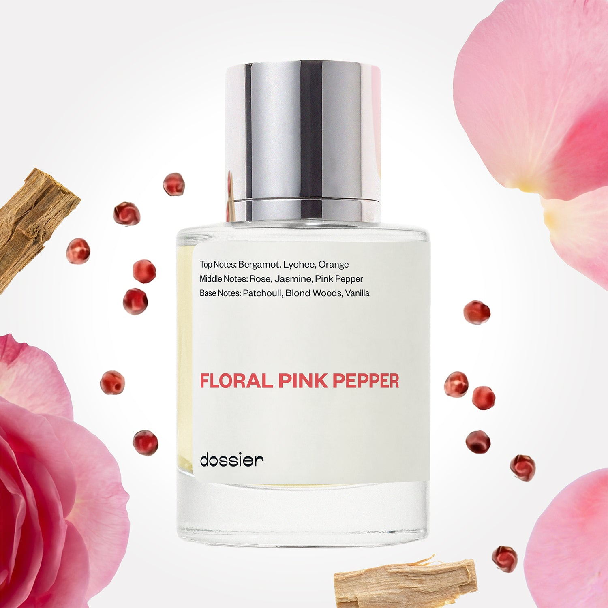

# Floral Pink Pepper

- **Dossier Inspired by Miss Dior Cherie (2017 version)**
- **URL:** https://dossier.co/products/floral-pink-pepper
- **SEO title:** Miss Dior Cherie (2017 version) Dupe Perfume: Floral Pink Pepper - Dossier Perfumes

## Pricing (sizes)

| Size/SKU | Member price | List price | Currency |
|---|---|---|---|
| 32212810334275 | 28.8 | 32 | USD |

## Content (scent notes, about, editorial)

Back Home / Perfumes / Dossier Impressions / FLORAL PINK PEPPER 

Women 

Sold out 

Floral Pink Pepper

Eau de Parfum. Size: 50ml / 1.7oz 

members: $28.80

Guest:
$32

Inspired by Dior's Miss Dior Cherie (2017 version) Inspired by Dior's Miss Dior Cherie (2017 version) 
Inspired by Dior's Miss Dior Cherie (2017 version) 

Retail price 113 Crafted in France 
Scent Family: gourmand 

Notify Me 

Scent Notes This perfume is: Colorful, a sprinkle of spice 
Main Notes:

Lychee

Rose

Jasmine

Pink Pepper

top: The first notes you smell 
Bergamot, Lychee, Orange 
middle: The heart of the perfume 
Rose, Jasmine, Pink Pepper 
base: The notes that linger all day 
Patchouli, Blond Woods, Vanilla 
ingredients: Alcohol Denat., Fragrance/Parfum, Water/Aqua/Eau, Tetramethyl Acetyloctahydronaphthalenes, Linalool, Benzyl Salicylate, Limonene, Linalyl Acetate, Vanillin, Hydroxycitronellal, Citrus Aurantium Peel Oil, Pogostemon Cablin Oil, Coumarin, Geraniol, Geranyl Acetate, Citrus Limon (Lemon) Peel Oil, Citronellol, Hexyl Cinnamal, Cananga Odorata Oil/Extract, Juniperus Virginiana Oil, Trimethylbenzenepropanol, Pinene, Beta-Caryophyllene, Benzyl Benzoate, Rose Ketones, Cedrus Atlantica Oil/Extract, Citral, Terpineol, Isoeugenol, Rose Flower Oil/Extract, Farnesol, Terpinolene, Benzyl Alcohol, Alpha-Terpinene, Eugenol. 

Vegan
Cruelty-free

Clean ingredients

About Floral Pink Pepper (inspired by Miss Dior Cherie 2017 version) is a tender walk in a rose garden. Top notes of lychee - with its fresh, rosy accents - allows a smooth entry to Damascena rose and May rose, which flow through the heart. Pink pepper sprinkled on this bouquet gives it a wink of impertinence. A touch of woods and vanilla on the base ensure comfort and hold to the perfume.

Delicate and feminine, Floral Pink Pepper (our impression of Miss Dior Cherie 2017 version) captures rare and qualitative raw materials in a joyful and colorful fragrance.

Scent Intensity: Significant 

Concentration: 18%

Gender: Feminine 

Shipping
Free shipping with 2+ items. 

Standard Shipping (with 2+ items) Auto-selected with 2+ items 
FREE 

Standard Shipping Auto-selected under 2 items 
$3.95 

Express shipping: 2 business days Select in checkout 
$19.00 

Returns
Free exchanges for all. Free returns with 

Exchanges
Free exchange, 1 time per order for all.

Returns
D+ members get 1 FREE return per order.
Non-members incur a $3.99/bottle return fee, 1 time per order.
Returns must be postmarked within 30 days of the initial order. Learn More 

FAQs Are these fragrances long lasting? They are designed to be very long lasting, just like designer fragrances, in some cases even longer, depending on the composition. 
When does the new packaging come out? We'll begin rolling out our new packaging across the U.S. and international markets soon! If you want to shop IRL - our new packaging first hits stores on January 11, 2026 at Walmart. Please note that if you are shopping online, you may receive a combination of our current and new packaging while we transition our inventory. 
How will I know what scent I like? We get it, shopping for perfumes online is hard! That's why we created a scent quiz, which will find the perfect scent for you Take the quiz (opens in new tab) 
Unsure about something? Ask us! help@dossier.co 

Details We are not associated or affiliated with the brands mentioned here in any way.
Floral Pink Pepper

A sweet, lingering warmth

Miss Dior Cherie’s title as one of the world’s most authoritative feminine fragrance lines is well deserved, and this is the fragrance that Dossier’s Floral Pink Pepper is inspired by. Miss Dior Cherieis an ingeniously uninhibited, freshly snapped petal that evokes the spirit of passion and appeal. It is an innovative floral that imbues you with the crisp scent of a winter’s evening – and one that makes you stay fresh all day long.

A velvety scent with strawberry and mandarin orange tops, this perfume is the textbook definition of what it means to love and be loved. It is a sweet kiss of allure – a fragrance that works closely with you as you face and best what the day throws at you.

The luxury fragrance that Floral Pink Pepper is inspired by never gets old. In fact, just when you think you’ve seen it all, you discover notes of rose and jasmine, a formula that is so sinfully sweet it takes you on vacation to the gorgeous Lake Nakuru – with the marshes and the bright pink flamingos. It is an ode to the royal frankincense of the 16th century.

You would think a perfume this bold would overbear you – but nothing could be farther from the truth. Miss Dior Cherie is far too gentle to be a bully. It is a sweet soul – and one that mimics the flow of the winds that surf the terraced rice fields of Indonesia.

The best part? There are also underlying notes of patchouli, sandalwood, amber, oakmoss and vetiver, a phenomenal mix that conjures a picturesque view of the blue-green waters of Verdon Gorges.

A sugary, cooling calm avails itself on first spritz, while the embodiment of feminine charisma erupts as the fragrance settles down. This is what you wear to leave behind an intoxicating trail of affection and addition. Spray copiously to mesmerize everything and everyone that comes close.

If you’re itching for an affordable fragrance that takes cues from the original Miss Dior Cherie, Dossier’s Floral Pink Pepper is the perfume for you. This dupe is a truly gifted scent that takes you for a walk along the banks of the crystal-clear Maroon Lake. It is an artfully concocted blend of lychee (with its fresh, sensual spark), Damascena rose (with its sweet, lingering warmth) and May rose (with its crisp, radiant style). Live in harmony with yourself as this fragrance provokes a feeling akin to sweet nostalgia. It creates a joyful and colorful fragrance that mimics a cozy, rainy, moonlit night. Enliven your olfactories and merge with freshness with every spritz. If you crave a touch of beauty and delicate femininity, here’s your ticket.

You Might Love 

4.3 

Rated 4.3 out of 5 stars 

Based on 780 reviews 

Reviews 780 (tab expanded) Questions 2 (tab collapsed) 

Filters 
Write a Review (Opens in a new window) 

780 reviews 
Sort Highest Rating Most Helpful Photos & Videos Most Recent Oldest Lowest Rating Least Helpful 

J 

Joy 
Verified Buyer 

1/18/26 

Rated 5 out of 5 stars 

5 Stars
My favorite of their impressions because it is the closest I can get to Miss Dior Cherie! Love it and use it ti stretch my Miss Dior EDP

Read More Read more about this review 

Was this helpful? Yes, this review from Joy was helpful. 0 people voted yes No, this review from Joy was not helpful. 0 people voted no 

DP 

Dossier Perfumes 
1/18/26 
We’re so happy Floral Pink Pepper helps you stretch your favorite EDP, and that it’s become your go-to impression! Keep layering it with your signature scent for even more magic 😊

J 

Joy 

1/18/26 

Rated 5 out of 5 stars 

5 Stars
My favorite of their impressions because it is the closest I can get to Miss Dior Cherie! Love it and use it ti stretch my Miss Dior EDP

Read More Read more about this review 

Was this helpful? Yes, this review from Joy was helpful. 0 people voted yes No, this review from Joy was not helpful. 0 people voted no 

JC 

Jamee C. 

12/2/25 

Rated 5 out of 5 stars 

My Absolute Fave!
Never had the original but this here is 🔥. My go to. And here to get my second bottle. Definitely gives off a peppery scent not too overwhelming, sweet notes as well. I just love it.

Read More Read more about this review 

Was this helpful? Yes, this review from Jamee C. was helpful. 0 people voted yes No, this review from Jamee C. was not helpful. 0 people voted no 

DP 

Dossier Perfumes 
12/2/25 
Jamee, wow thanks for loving Floral Pink Pepper! So happy it’s become your go-to and that perfect spicy-sweet balance won you over. Congrats on your second bottle, enjoy every spritz!

M 

Maria 

11/29/25 

Rated 5 out of 5 stars 

5 Stars
love this one, smells really good… 
I can not ask for more…

Read More Read more about this review 

Was this helpful? Yes, this review from Maria was helpful. 0 people voted yes No, this review from Maria was not helpful. 0 people voted no 

M 

Maria 
Verified Buyer 

11/29/25 

Rated 5 out of 5 stars 

5 Stars
love this one, smells really good… 
I can not ask for more…

Read More Read more about this review 

Was this helpful? Yes, this review from Maria was helpful. 0 people voted yes No, this review from Maria was not helpful. 0 people voted no 

DP 

Dossier Perfumes 
12/10/25 
So glad you love it, Maria! Your words just made our day 😊

Loading... 

Loading... 

Show More 

Inspired by  Baccarat Rouge 540 
Inspired by  Black Opium 
Inspired by  Love, Don't Be Shy 
Inspired by  Good Girl 
Inspired by  Libre 
Inspired by  Flowerbomb 
Inspired by  Light Blue 
Inspired by  Not a Perfume 
Inspired by  Aventus 
Inspired by  Bleu de Chanel 
Inspired by  Mon Paris 
Inspired by  Coco Mademoiselle 
Inspired by  Tom Ford for Men 
Inspired by  For Her 
Inspired by  J'Adore Dior 
Inspired by  Alien 
Inspired by  Black Opium Perfume 
Inspired by  Lost Cherry Perfume 

GET UP TO 30% OFF 

Find us at these retailers. 

Be the first to know. 
Submit 

Shop the following countries. United States 

Discover.
AI Scent Finder 
Blog (opens in new tab) 
Scent Family 
Layering 
Scent Quiz 

Help.
Contact Us 
Returns 
FAQ 
Testimonials 
Accessibility 

More.
Store Locator 
Boutique 
Refer A Friend 
Index 

Download our app now.

Find us at these retailers. 

Be the first to know. 
Submit 

Shop the following countries. United States 

Discover.
AI Scent Finder 
Blog (opens in new tab) 
Scent Family 
Layering 
Scent Quiz 

Help.
Contact Us 
Returns 
FAQ 
Testimonials 
Accessibility 

More.

## Main Image

