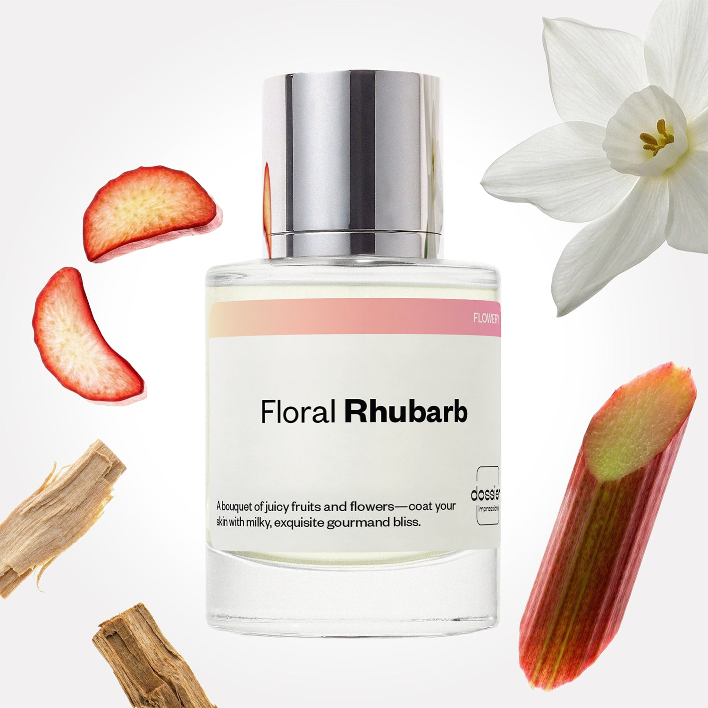

# Floral Rhubarb

- **Dossier Inspired by Marc Jacobs' Perfect**
- **URL:** https://dossier.co/products/floral-rhubarb
- **SEO title:** Marc Jacobs' Perfect Dupe Perfume: Floral Rhubarb - Dossier Perfumes

## Pricing (sizes)

| Size/SKU | Member price | List price | Currency |
|---|---|---|---|
| DI50FLRHUS | 28.8 | 32 | USD |

## Content (scent notes, about, editorial)

Back Home / Perfumes / Dossier Impressions / FLORAL RHUBARB 

Women 

It's back! 

Floral Rhubarb

Eau de Parfum. Size: 50ml / 1.7oz 

members: $28.80

Guest:
$32

Inspired by Marc Jacobs's Perfect Inspired by Marc Jacobs's Perfect 
Inspired by Marc Jacobs's Perfect 

Retail price 125 Crafted in France 
Scent Family: flowery 

Add to Cart 

Scent Notes This perfume is: A bouquet of fruit and flowers 
Main Notes:

Rhubarb

Narcissus

Cedarwood

Blond Woods

Musks

top: The first notes you smell 
Rhubarb, Orange Blossom, Peach 
middle: The heart of the perfume 
Daffodil, Milky Accord, Narcissus 
base: The notes that linger all day 
Cedarwood , Blond Woods, Musks 
ingredients: Alcohol Denat., Fragrance/Parfum, Water/Aqua/Eau, Tetramethyl Acetyloctahydronaphthalenes, Hexamethylindanopyran, Hexadecanolactone, Linalool, Juniperus Virginiana Oil, Hydroxycitronellal, Alpha-Isomethyl Ionone, Linalyl Acetate, Limonene, Citronellol, Hexyl Cinnamal, Coumarin, Citrus Aurantium Peel Oil, Rose Ketones, Trimethylcyclopentenyl Methylisopentenol, Pinene, Jasmine Oil/Extract, Beta-Caryophyllene, Geranyl Acetate, Pogostemon Cablin Oil, Dimethyl Phenethyl Acetate. 

Vegan
Cruelty-free

Clean ingredients

About Floral Rhubarb (inspired by Marc Jacobs' Perfect) is an astonishing association of daffodil and narcissus, flowers rarely used in perfumery. So it's no surprise that this floral combination comes with an original gourmand accord, made of juicy and salivating rhubarb tempered by a reassuring milky note.

Cheerful, unexpected, Floral Rhubarb (our impression of Marc Jacobs' Perfect) is a fragrance that plays on its contradictions by harmoniously associating underused flowers with an assumed gourmand impish touch.

Scent Intensity: Significant 

Concentration: 18%

Gender: Feminine 

Shipping
Free shipping with 2+ items. 

Standard Shipping (with 2+ items) Auto-selected with 2+ items 
FREE 

Standard Shipping Auto-selected under 2 items 
$3.95 

Express shipping: 2 business days Select in checkout 
$19.00 

Returns
Free exchanges for all. Free returns with 

Exchanges
Free exchange, 1 time per order for all.

Returns
D+ members get 1 FREE return per order.
Non-members incur a $3.99/bottle return fee, 1 time per order.
Returns must be postmarked within 30 days of the initial order. Learn More 

FAQs Are these fragrances long lasting? They are designed to be very long lasting, just like designer fragrances, in some cases even longer, depending on the composition. 
When does the new packaging come out? We'll begin rolling out our new packaging across the U.S. and international markets soon! If you want to shop IRL - our new packaging first hits stores on January 11, 2026 at Walmart. Please note that if you are shopping online, you may receive a combination of our current and new packaging while we transition our inventory. 
How will I know what scent I like? We get it, shopping for perfumes online is hard! That's why we created a scent quiz, which will find the perfect scent for you Take the quiz (opens in new tab) 
Unsure about something? Ask us! help@dossier.co 

Details We are not associated or affiliated with the brands mentioned here in any way.
Floral Rhubarb

Matching the fairest of spring blossoms

The thing about a perfect first impression is that you only get one chance to nail it – and with the Marc Jacobs Perfect Eau De Parfum (the fragrance that inspired Dossier’s Floral Rhubarb), one chance is all you really need. Launched in 2020, the luxury fragrance that Floral Rhubarb was inspired by was an instant hit – with even the most hardened of critics falling head over heels for it. But who can blame them?

The perfume combines the allure of rhubarb, the appeal of almond milk, and the cheerfulness of cashmeran into a captivating, floral scent you simply can’t get enough of. It also offers some of the best note blends with its variants: the Decadence Eau So Decadent, Daisy Dream, Daisy Love, and Daisy Eau So Fresh.

Even the fairest of spring blossoms and the charm of the honeycomb pale in comparison to these aromas. One sniff and you’re transported to the tropical island of Zanzibar – with the breadfruits, coconuts, mountain apples, and songbirds. Talk of a comforting floral fragrance that beats even the sweetest of lilies – an aromatic spicy smell that mocks even the finest of myrrhs.

No matter the occasion, no matter the time of day, and no matter the audience, the luxury fragrance that Floral Rhubarb was inspired by provides all the stylishness and swankiness you need to establish your presence. It gives you a voguish, seductive aura that all but bewitches your sphere of contact and bends their will to your advantage. Call it a piece of paradise, a taste of Elysium, or a touch of the idyll – whatever best suits your idea of a crispy, floral scent that gives you glimpses of utopia.

For a product this good, you would think the packaging will be ‘intimidatingly’ complicated. But in the case of the Marc Jacobs Perfect, that couldn’t be farther from the truth. The perfume comes in a simple box – much like a majestic king with a humble persona. That adds to the many reasons why it’ll make an amazing gift for that special someone.

The Marc Jacobs Perfect lists on various e-commerce websites and is also available at all major perfume shops near you. For $139 you can get your hands on an Intense Eau De Parfum 3.4 oz – and for $100, you can get the Eau De Parfum 50 ml, 1.6 oz. Similarly, the Mini Eau de Parfum Set and the Body Lotion go for $30 and $32, respectively. Also, if you fancy the Eau De Parfum Gift Set, you can get one for $99.

For a Marc Jacobs Perfect dupe that embodies similar notes, spirit, and essence as the original, but at more than half the price, consider Dossier’s Floral Rhubarb. It offers the same amount of delightful floral fragrance as the Eau de Parfum it draws inspiration from. Use it in conjunction with Dossier’s Floral Berries and see what it really means to experience the comforting satisfaction of self-love. Gift it to someone and open up their world to the marvels of the coral islands of Maldives – with the radiant diving, snorkeling, and white-sand beaches. 

Best Layered With Combine 2 of our perfumes to create a third scent with layering, curated by our nose. Learn more 

You Might Love 

4.6 

Rated 4.6 out of 5 stars 

Based on 1,128 reviews 

Reviews 1,128 (tab expanded) Questions 1 (tab collapsed) 

Filters 
Write a Review (Opens in a new window) 

1,128 reviews 
Sort Highest Rating Most Helpful Photos & Videos Most Recent Oldest Lowest Rating Least Helpful 

LD 

Leonila D. 
Verified Buyer 

6/11/26 

Rated 5 out of 5 stars 

excellent
The fragrance is perfect!!! 

Read More Read more about this review 

Was this helpful? Yes, this review from Leonila D. was helpful. 0 people voted yes No, this review from Leonila D. was not helpful. 0 people voted no 

DP 

Dossier Perfumes 
6/11/26 
Thanks Leonila, so happy this scent is a perfect fit for you! ✨

DF 

DEON F. 
Verified Buyer 

6/11/26 

Rated 5 out of 5 stars 

FLORAL RHUBARB
LOVE IT!!

Read More Read more about this review 

Was this helpful? Yes, this review from DEON F. was helpful. 0 people voted yes No, this review from DEON F. was not helpful. 0 people voted no 

DP 

Dossier Perfumes 
6/11/26 
Deon, thanks for the love! We’re thrilled Floral Rhubarb’s a winner for you 😊

B 

Brittany 

6/6/26 

Rated 5 out of 5 stars 

Love this scent
Absolutely love this! It’s not very flowery, really fresh, stays on all day! 

Read More Read more about this review 

Was this helpful? Yes, this review from Brittany was helpful. 0 people voted yes No, this review from Brittany was not helpful. 0 people voted no 

DP 

Dossier Perfumes 
6/6/26 
Brittany, we’re so happy it’s hitting that fresh vibe and sticking around all day! Enjoy exploring more scents. 😊

L 

Lafateia 

5/26/26 

Rated 5 out of 5 stars 

5 Stars
Beautiful floral fragrance Youthful and perfect for the office and everday.

Read More Read more about this review 

Was this helpful? Yes, this review from Lafateia was helpful. 0 people voted yes No, this review from Lafateia was not helpful. 0 people voted no 

G 

Gwen 

5/23/26 

Rated 5 out of 5 stars 

5 Stars
It smells EXACTLY like Marc Jacobs Perfect. I hope it lasts long. I sprayed it on last night, i have a faint smell of it on my arm this morning. Def worth it!

Read More Read more about this review 

Was this helpful? Yes, this review from Gwen was helpful. 0 people voted yes No, this review from Gwen was not helpful. 0 people voted no 

Loading... 

Loading... 

Show More 

Inspired by  Baccarat Rouge 540 
Inspired by  Black Opium 
Inspired by  Love, Don't Be Shy 
Inspired by  Good Girl 
Inspired by  Libre 
Inspired by  Flowerbomb 
Inspired by  Light Blue 
Inspired by  Not a Perfume 
Inspired by  Aventus 
Inspired by  Bleu de Chanel 
Inspired by  Mon Paris 
Inspired by  Coco Mademoiselle 
Inspired by  Tom Ford for Men 
Inspired by  For Her 
Inspired by  J'Adore Dior 
Inspired by  Alien 
Inspired by  Black Opium Perfume 
Inspired by  Lost Cherry Perfume 

GET UP TO 30% OFF 

Find us at these retailers. 

Be the first to know. 
Submit 

Shop the following countries. United States 

Discover.
AI Scent Finder 
Blog (opens in new tab) 
Scent Family 
Layering 
Scent Quiz 

Help.
Contact Us 
Returns 
FAQ 
Testimonials 
Accessibility 

More.
Store Locator 
Boutique 
Refer A Friend 
Index 

Download our app now.

Find us at these retailers. 

Be the first to know. 
Submit 

Shop the following countries. United States 

Discover.
AI Scent Finder 
Blog (opens in new tab) 
Scent Family 
Layering 
Scent Quiz 

Help.
Contact Us 
Returns 
FAQ 
Testimonials 
Accessibility 

More.

## Main Image

