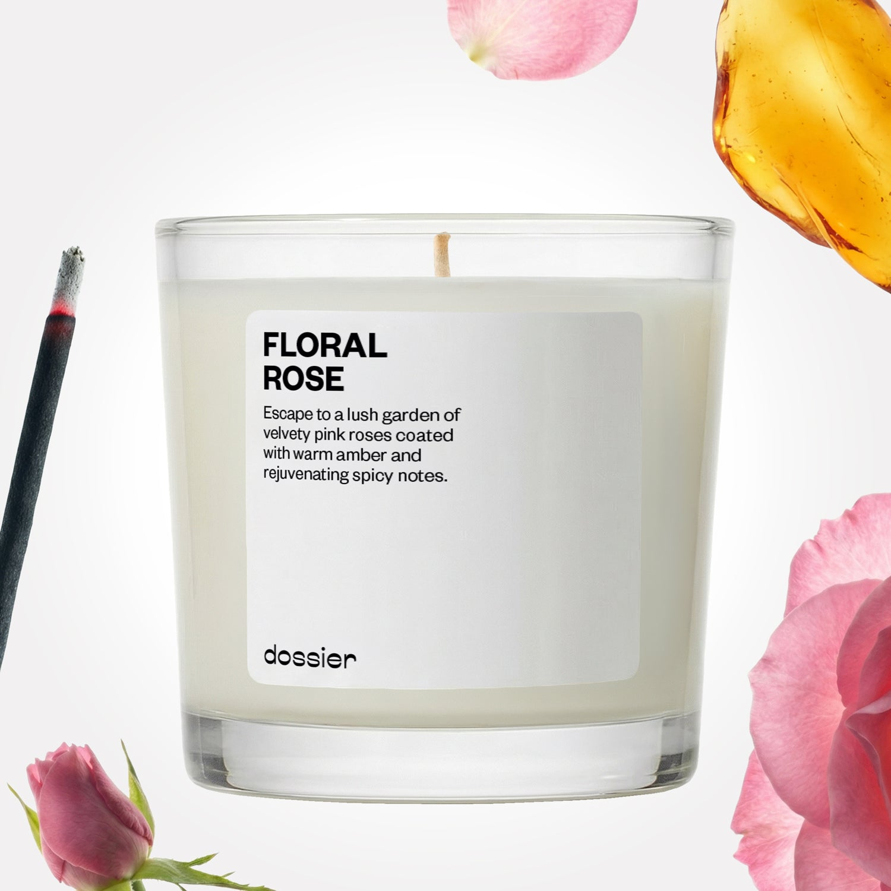

# Floral Rose Candle

- **Dossier Inspired by Le Labo Fragrances' Rose 31 Perfume**
- **URL:** https://dossier.co/products/floral-rose-candle
- **SEO title:** Le Labo Rose 31 Candle Dupe Impression: Floral Rose Candle

## Pricing (sizes)

| Size/SKU | Member price | List price | Currency |
|---|---|---|---|
| 9oz | 35.1 | 39 | USD |
| 14oz | 48.6 | 54 | USD |

## Content (scent notes, about, editorial)

Back Home / Home Scents / Candles / FLORAL ROSE CANDLE 

Sold out 

Floral Rose Candle

Size: 14oz / 4 x 4 in. 

members: $48.60

Guest:
$54

Inspired by Le Labo's Rose 31 Perfume Inspired by Le Labo's Rose 31 Perfume 
Inspired by Le Labo's Rose 31 Perfume 

Size
9oz $39
OUT OF STOCK 
Best Value
14oz $54
OUT OF STOCK 

Crafted in France 
Scent Family: flowery 

Notify Me 

Scent Notes Main Notes:

Rose Centifolia

Cumin

Incense

Amber

top: The first notes you smell 
Rose Centifolia, Cumin 
middle: The heart of the perfume 
Vetiver, Incense, Cedarwood 
base: The notes that linger all day 
Musk, Cistus, Amber 
While Perfume Has Top, Middle, And Base Notes, Candles Burn In A Linear Pattern With A Few Main Scent Characteristics. Less Forward And Present. More Subtle And Permanent. That’s Because It’s Lit -The Flame Mixes With The Wax And Affects Our Scent Perception. 

Vegan
Cruelty-free

Clean ingredients

About Think a velvety bouquet of roses got together with spicy amber tones derived from smoky cumin and incense to strike the perfect balance of floral and sultry warmth. Spark rich and mystical vibes day or night. 

At Dossier, we not only want our products to smell amazing, but we want our consumers to feel good when they use them, too! That’s why our candles are 100% soy wax, with no additives or stabilizers. These natural formulas may cause textural irregularities on the edge of the glass, but this is completely normal and has no effect on the quality of the product. 

Tips Tips and wicks. 
Tip #1: First burn.
Your first burn should last 2 to 3 hours. Let the wax melt all across the top surface. Anything less than that will create a tunnel effect where a hole forms in the center.
A long first burn will also prevent hot wax from extinguishing your flame in the future. The scent of your candle will be stronger during the second lighting.

Tip #2: Trimmed wicks.
Hold that match! Before burning, cut your wick to about ¼ inch. This will avoid soot buildup. If you see your wick leaning, use tweezers to center it while the wax is still hot.

Tip #3: Safe storage.
Keep your candle out of direct sunlight. Ideally, your room should be 60° to 80° so your candle is not too hot or too cold — but just right. 

Tip #4: Burn time.
Each candle has a total burn time of about 25 hours before all of the wax is melted. 

Shipping + Returns
Free exchanges for all. Free returns with 

Standard Shipping (with 2+ items) Auto-selected with 2+ items 
FREE 

Standard Shipping Auto-selected under 2 items 
$3.95 

Express shipping: 2 business days Select in checkout 
$19.00 

Returns for Candles
We cannot accept any returns for candles that had been used (lit). In order to return a candle, proceed to our regular returns portal, and upload and image of your unused candle. If your candle has been used, your return request will be denied. 

You Might Love 

3.7 

Rated 3.7 out of 5 stars 

Based on 63 reviews 

Reviews 63 (tab expanded) Questions 2 (tab collapsed) 

Filters 
Write a Review (Opens in a new window) 

63 reviews 
Sort Highest Rating Most Helpful Photos & Videos Most Recent Oldest Lowest Rating Least Helpful 

JB 

Jonathan B. 
Verified Buyer 

6/11/26 

Rated 5 out of 5 stars 

Wow, just wow
Thoroughly enjoying this lusciously spicy candle, which comes in a great size and burns evenly with a nicely weighted wick. I find the fragrance to be elegant and gorgeous and fills the room nicely. Definitely will buy this candle again! Kinda wish Dossier sold wax refills, because I plan to reuse the glass. 

Read More Read more about this review 

Was this helpful? Yes, this review from Jonathan B. was helpful. 0 people voted yes No, this review from Jonathan B. was not helpful. 0 people voted no 

DP 

Dossier Perfumes 
6/11/26 
Jonathan, we’re so happy you’re loving how it burns and fills your space. Reusing the glass is such a smart idea, and we’ll pass along your refill wish!

TB 

ty b. 
Verified Buyer 

3/4/26 

Rated 5 out of 5 stars 

review
candle

Read More Read more about this review 

Was this helpful? Yes, this review from ty b. was helpful. 0 people voted yes No, this review from ty b. was not helpful. 0 people voted no 

DP 

Dossier Perfumes 
3/17/26 
We appreciate it, Ty! ❤️

B 

Brittany 

4/8/25 

Rated 5 out of 5 stars 

Personally, a Staple
Rose 31 is my absolute favorite fragrance, and I bought this immediately when I saw they made a candle! Le Labo doesn't make a Rose 31 candle, so this is something you really can't get anywhere else. I light it when I'm getting ready or getting into bed and it feels so luxurious. Please never discontinue this!

Read More Read more about this review 

Was this helpful? Yes, this review from Brittany was helpful. 0 people voted yes No, this review from Brittany was not helpful. 0 people voted no 

DP 

Dossier Perfumes 
4/16/25 
We hear you loud and clear, Brittany, candlelit luxury must stay! Your routine sounds dreamy, and we’re so happy this Rosey glow-up made it into your ritual. Noted: never discontinue. Got it!

LC 

Lola C. 

3/23/25 

Rated 5 out of 5 stars 

Love the scent
Love the scent

Read More Read more about this review 

Was this helpful? Yes, this review from Lola C. was helpful. 0 people voted yes No, this review from Lola C. was not helpful. 0 people voted no 

DP 

Dossier Perfumes 
3/24/25 
That’s what we like to hear, Lola—pure candle bliss in every burn!

SB 

Sheri B. 

4/25/24 

Rated 5 out of 5 stars 

A Must Have Candle
This scent is so fresh and makes the room a flower garden! I love candles and now that I’ve discovered Dossier candles I will recommend to all my friends! Also would make a lovely gift

Read More Read more about this review 

Was this helpful? Yes, this review from Sheri B. was helpful. 0 people voted yes No, this review from Sheri B. was not helpful. 0 people voted no 

Loading... 

Loading... 

Show More 

Inspired by  Baccarat Rouge 540 
Inspired by  Black Opium 
Inspired by  Love, Don't Be Shy 
Inspired by  Good Girl 
Inspired by  Libre 
Inspired by  Flowerbomb 
Inspired by  Light Blue 
Inspired by  Not a Perfume 
Inspired by  Aventus 
Inspired by  Bleu de Chanel 
Inspired by  Mon Paris 
Inspired by  Coco Mademoiselle 
Inspired by  Tom Ford for Men 
Inspired by  For Her 
Inspired by  J'Adore Dior 
Inspired by  Alien 
Inspired by  Black Opium Perfume 
Inspired by  Lost Cherry Perfume 

GET UP TO 30% OFF 

Find us at these retailers. 

Be the first to know. 
Submit 

Shop the following countries. United States 

Discover.
AI Scent Finder 
Blog (opens in new tab) 
Scent Family 
Layering 
Scent Quiz 

Help.
Contact Us 
Returns 
FAQ 
Testimonials 
Accessibility 

More.
Store Locator 
Boutique 
Refer A Friend 
Index 

Download our app now.

Find us at these retailers. 

Be the first to know. 
Submit 

Shop the following countries. United States 

Discover.
AI Scent Finder 
Blog (opens in new tab) 
Scent Family 
Layering 
Scent Quiz 

Help.
Contact Us 
Returns 
FAQ 
Testimonials 
Accessibility 

More.

## Main Image

