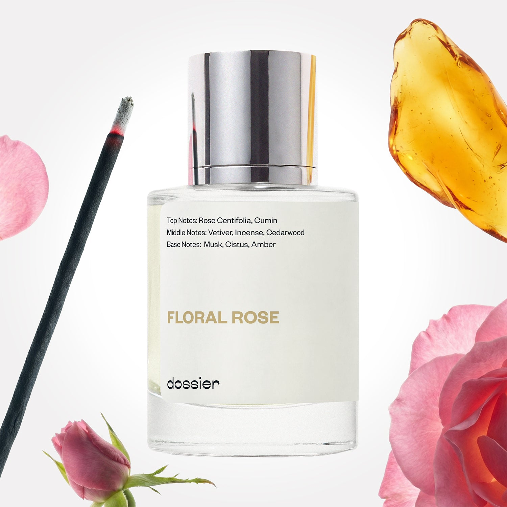

# Floral Rose

- **Dossier Inspired by Le Labo Fragrances' Rose 31**
- **URL:** https://dossier.co/products/floral-rose
- **SEO title:** Le Labo's Rose 31 Dupe Perfume: Floral Rose - Dossier Perfumes

## Pricing (sizes)

| Size/SKU | Member price | List price | Currency |
|---|---|---|---|
| 32017688985667 | 44.1 | 49 | USD |

## Content (scent notes, about, editorial)

Back Home / Perfumes / Dossier Impressions / FLORAL ROSE 

Unisex 

It's back! 

Floral Rose

Eau de Parfum. Size: 50ml / 1.7oz 

members: $44.10

Guest:
$49

Inspired by Le Labo's Rose 31 Inspired by Le Labo's Rose 31 
Inspired by Le Labo's Rose 31 

Retail price 235 Crafted in France 
Scent Family: flowery 

Notify Me 

Scent Notes This perfume is: A warm bouquet of pink roses 
Main Notes:

Rose Centifolia

Cumin

Incense

Amber

top: The first notes you smell 
Rose Centifolia, Cumin 
middle: The heart of the perfume 
Vetiver, Incense, Cedarwood 
base: The notes that linger all day 
Musk, Cistus, Amber 
ingredients: Alcohol Denat., Fragrance/Parfum, Water/Aqua/Eau, Tetramethyl Acetyloctahydronaphthalenes, Linalyl Acetate, Limonene, Citrus Aurantium Bergamia (Bergamot) Peel Oil, Pinene, Alpha-Isomethyl Ionone, Cedrus Atlantica Oil/Extract, Eugenol, Citrus Limon (Lemon) Peel Oil, Linalool, Rose Flower Oil/Extract, Citronellol, Geraniol, Beta-Caryophyllene, Vanillin, Acetyl Cedrene, Terpinolene, Santalol, Alpha-Terpinene, Citral, Santalum Album (Sandalwood) Oil, Terpineol, Geranyl Acetate, Farnesol, Isoeugenol, Cinnamal.l. 

Vegan
Cruelty-free

Clean ingredients

About Floral Rose (inspired by Le Labo's Rose 31) capitalizes on the rich scent of the beloved queen amongst flowers: Rose Centifolia. Boasting a soft floral finish and rich femininity, Floral Rose is paired with smoky cumin, mystical incense, unexpected ciste, and warm amber. Together, these additions result in the unveiling of the dark side of Rose Centifolia, not unlike highlighting the unlit face of the moon... 

Gender fluid and highly qualitative, Floral Rose (our impression of Le Labo's Rose 31) perfectly alternates between feminine and masculine, without any false notes.

Scent Intensity: Significant 

Concentration: 20%

Gender: Unisex 

Shipping
Free shipping with 2+ items. 

Standard Shipping (with 2+ items) Auto-selected with 2+ items 
FREE 

Standard Shipping Auto-selected under 2 items 
$3.95 

Express shipping: 2 business days Select in checkout 
$19.00 

Returns
Free exchanges for all. Free returns with 

Exchanges
Free exchange, 1 time per order for all.

Returns
D+ members get 1 FREE return per order.
Non-members incur a $3.99/bottle return fee, 1 time per order.
Returns must be postmarked within 30 days of the initial order. Learn More 

FAQs Are these fragrances long lasting? They are designed to be very long lasting, just like designer fragrances, in some cases even longer, depending on the composition. 
When does the new packaging come out? We'll begin rolling out our new packaging across the U.S. and international markets soon! If you want to shop IRL - our new packaging first hits stores on January 11, 2026 at Walmart. Please note that if you are shopping online, you may receive a combination of our current and new packaging while we transition our inventory. 
How will I know what scent I like? We get it, shopping for perfumes online is hard! That's why we created a scent quiz, which will find the perfect scent for you Take the quiz (opens in new tab) 
Unsure about something? Ask us! help@dossier.co 

Details A tantalizing floral medley to indulge the senses

We are not associated or affiliated with the brands mentioned here in any way.
Floral Rose

A gorgeous feast of floral notes, Le Labo Rose 31 (the luxury fragrance that Dossier’s Floral Rose is inspired by) presents a bouquet of sensational tones worn to flatter and envelope its owner. The unique blend of rose and cumin top notes, along with the woody cedar and agarwood undertones lets anyone experience the complexity of it. The subtle freshness of the unisex luxury fragrance that Floral Rose is inspired by means it is worn to accessorise you, like a delicate piece of jewellery that subliminally accentuates the décolletage. The fusion of these beautiful botanical top and base notes creates an unguarded scent of vulnerability that demands to be discovered and understood by whoever passes by. The central floral note of the luxury fragrance that Floral Rose is inspired by is that of Centifolia rose, a deliciously traditional fragrance used to make every spritz feel like stepping into a blooming woodland of Spring roses.

A modern adaptation of the classic rose, this perfume captivates you through the soft scents of the flowers and intrigues you with undertones of amber, musk, and vetiver to create an indulging spice that will continue to entice you all day. This modern inspiration allows the luxury fragrance that Floral Rose is inspired by to enter a new era and pleasure anyone with its effortlessly fresh scents, to be experienced by both masculine and feminine energy. For something so seemingly complex however, Le Labo Rose 31’s signature sweetness doesn’t allow itself to overpower you, instead it stands as a youthful scent of exuberance and joyousness – the innocent feeling of a baby’s first giggle.

The humble modesty of the luxury fragrance that Floral Rose is inspired by bottle itself displays the gentle nature of the fragrance. The simplicity of the label attached to the bottle has been clearly carefully thought out, even indicating who bottled each beautiful creation – as if only you and the crafter are allowed into the secret of the scent. With a clean and straightforward bottle design and cap, it is made certain that the money is all in the fragrance.

If a freshly fused bouquet of sweet and spicy is what you have been after, a 50 ml bottle of Le Labo Rose 31 goes for $202.00 from online retailers. Alternatively, for a smaller sample, it will cost $12.30. There are also many other ways to experience this fragrance – the shower gel goes for $41.00 and the body lotion can be bought at $51.00. If these don’t take your fancy, thebar soap is also available for $33.00.

To experience a similar indulgence of this floral medley for less, the Floral Rose fragrance from Dossier is the one to get. Our Le Labo Rose 31 dupe allows anyone to delight themselves in the alluring scents of fresh rose and a darker amber. Not unlike the feeling of walking into a field of colorful roses, Floral Rose emulates the youthful innocence of the springtime. Paying close attention to the original, our Floral Rose beams a spotlight onto the star of the show – Rose Centifolia, creating a similarly gorgeous floral scent that innocently plays with the tingling base notes of amber and warm incense.

Best Layered With Combine 2 of our perfumes to create a third scent with layering, curated by our nose. Learn more 

You Might Love 

4.3 

Rated 4.3 out of 5 stars 

Based on 864 reviews 

Reviews 864 (tab expanded) Questions 2 (tab collapsed) 

Filters 
Write a Review (Opens in a new window) 

864 reviews 
Sort Highest Rating Most Helpful Photos & Videos Most Recent Oldest Lowest Rating Least Helpful 

DS 

Ditra S. 
Verified Reviewer 

6/30/26 

Rated 5 out of 5 stars 

Signature Scent Worthy
Please bring back Floral Rose! I own the OG and prefer the Dossier version. It’s my favorite fragrance from my entire collection. Absolute perfection. 

Read More Read more about this review 

Was this helpful? Yes, this review from Ditra S. was helpful. 0 people voted yes No, this review from Ditra S. was not helpful. 0 people voted no 

DP 

Dossier Perfumes 
7/1/26 
Oh wow, hearing that Floral Rose is your go-to makes our day, and we’ll share your love with our team. In the meantime enjoy exploring our catalog for new favorites.

SG 

Shelby G. 

5/21/26 

Rated 5 out of 5 stars 

Please restock
This in my favorite scent and it’s been out of stock for a very long time. Please bring it back I beg you! 

Read More Read more about this review 

Was this helpful? Yes, this review from Shelby G. was helpful. 0 people voted yes No, this review from Shelby G. was not helpful. 0 people voted no 

DP 

Dossier Perfumes 
5/21/26 
Shelby, we know that wait is tough! Signing up for back-in-stock alerts can help you grab it ASAP 😊

AS 

Anne S. 

Verified Buyer 

2/3/26 

Rated 5 out of 5 stars 

One of my favorite Dossier fragrances
My go to. This is more of a woody floral to me but maybe a better description is spicy rose floral.

Read More Read more about this review 

Was this helpful? Yes, this review from Anne S. was helpful. 0 people voted yes No, this review from Anne S. was not helpful. 0 people voted no 

DP 

Dossier Perfumes 
2/3/26 
Anne! Hearing this is your go-to really made our day. We love that it brings that spicy rose vibe you’re craving, and we’re so happy it’s hitting the mark.

M 

Mariejoy 

2/1/26 

Rated 5 out of 5 stars 

5 Stars
Always super fast delivery!

Read More Read more about this review 

Was this helpful? Yes, this review from Mariejoy was helpful. 0 people voted yes No, this review from Mariejoy was not helpful. 0 people voted no 

M 

Mariejoy 
Verified Buyer 

2/1/26 

Rated 5 out of 5 stars 

5 Stars
Always super fast delivery!

Read More Read more about this review 

Was this helpful? Yes, this review from Mariejoy was helpful. 0 people voted yes No, this review from Mariejoy was not helpful. 0 people voted no 

DP 

Dossier Perfumes 
2/1/26 
Mariejoy, yay! We live for speedy drops so you get your scents fast 😊

Loading... 

Loading... 

Show More 

Inspired by  Baccarat Rouge 540 
Inspired by  Black Opium 
Inspired by  Love, Don't Be Shy 
Inspired by  Good Girl 
Inspired by  Libre 
Inspired by  Flowerbomb 
Inspired by  Light Blue 
Inspired by  Not a Perfume 
Inspired by  Aventus 
Inspired by  Bleu de Chanel 
Inspired by  Mon Paris 
Inspired by  Coco Mademoiselle 
Inspired by  Tom Ford for Men 
Inspired by  For Her 
Inspired by  J'Adore Dior 
Inspired by  Alien 
Inspired by  Black Opium Perfume 
Inspired by  Lost Cherry Perfume 

GET UP TO 30% OFF 

Find us at these retailers. 

Be the first to know. 
Submit 

Shop the following countries. United States 

Discover.
AI Scent Finder 
Blog (opens in new tab) 
Scent Family 
Layering 
Scent Quiz 

Help.
Contact Us 
Returns 
FAQ 
Testimonials 
Accessibility 

More.
Store Locator 
Boutique 
Refer A Friend 
Index 

Download our app now.

Find us at these retailers. 

Be the first to know. 
Submit 

Shop the following countries. United States 

Discover.
AI Scent Finder 
Blog (opens in new tab) 
Scent Family 
Layering 
Scent Quiz 

Help.
Contact Us 
Returns 
FAQ 
Testimonials 
Accessibility 

More.

## Main Image

