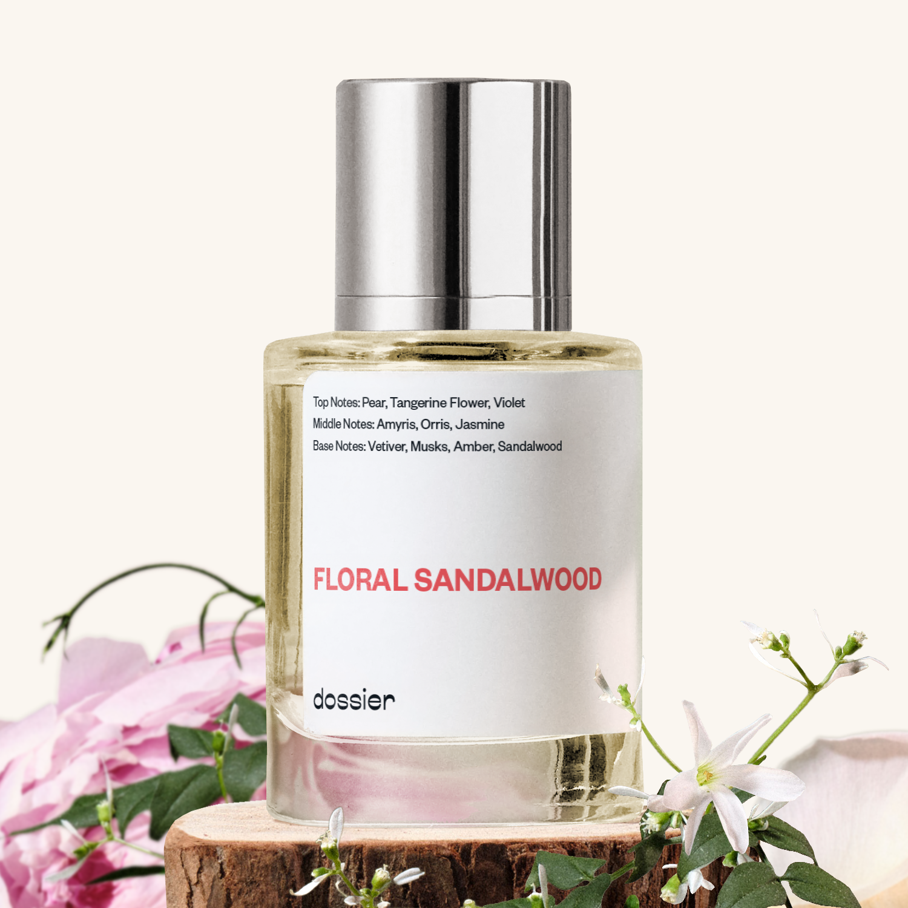

# Floral Sandalwood

- **Dossier Inspired by MFK's Amyris Femme**
- **URL:** https://dossier.co/products/floral-sandalwood
- **SEO title:** Amyris by Maison Francis Kurkdjian Dupe Dupe Perfume: Floral Sandalwood - Dossier Perfumes

## Pricing (sizes)

| Size/SKU | Member price | List price | Currency |
|---|---|---|---|
| 3.96702E+13 | 44.1 | 49 | USD |

## Content (scent notes, about, editorial)

Back Home / Perfumes / Dossier Impressions / FLORAL SANDALWOOD 

Women 

Sold out 

Floral Sandalwood

Eau de Parfum. Size: 50ml / 1.7oz 

members: $44.10

Guest:
$49

Inspired by Maison Francis Kurkdjian's Amyris Femme Inspired by Maison Francis Kurkdjian's Amyris Femme 
Inspired by Maison Francis Kurkdjian's Amyris Femme 

Retail price 245 Crafted in France 
Scent Family: earthy 

Notify Me 

Scent Notes This perfume is: Elegant, a string of pearls 
Main Notes:

Pear

Tangerine Flower

Violet

Amyris

Orris

Jasmine

Sandalwood

top: The first notes you smell 
Pear, Tangerine flower, Violet 
middle: The heart of the perfume 
Amyris, Orris, Jasmine 
base: The notes that linger all day 
Vetiver, Musks, Amber, Sandalwood 
ingredients: Alcohol, Water, Parfum/Perfume, alpha-iso-Methylionone, Benzyl alcohol, Benzyl Benzoate, Benzyl Salicylate, Citral, Citronellol, Limonene, Eugenol, Farnesol, Geraniol, Isoeugenol, Linalool, Evernia Prunastri (Oakmoss). 

Vegan
Cruelty-free

Clean ingredients

About Opening notes evoke citrusy and spicy tangerine flower combined with juicy pear. This tantalizing freshness quickly gives way to sensual florals including jasmine and orris, as well as wood and musk. Most unique and rarely used in perfumery, we blend the secret ingredient of amyris, commonly known as “Haitian sandalwood.” The beautiful tree native to Haiti is part of the citrus family, although it manifests as a woody warmth.

Sophisticated and radiant, Floral Sandalwood (inspired by Maison Francis Kurkdjian's Amyris) is a flowery breeze carrying in its momentum the density of the woods, a tribute to a free and naturally elegant femininity.

Concentration: 20%

Gender: Feminine 

Shipping
Free shipping with 2+ items. 

Standard Shipping (with 2+ items) Auto-selected with 2+ items 
FREE 

Standard Shipping Auto-selected under 2 items 
$3.95 

Express shipping: 2 business days Select in checkout 
$19.00 

Returns
Free exchanges for all. Free returns with 

Exchanges
Free exchange, 1 time per order for all.

Returns
D+ members get 1 FREE return per order.
Non-members incur a $3.99/bottle return fee, 1 time per order.
Returns must be postmarked within 30 days of the initial order. Learn More 

FAQs Are these fragrances long lasting? They are designed to be very long lasting, just like designer fragrances, in some cases even longer, depending on the composition. 
When does the new packaging come out? We'll begin rolling out our new packaging across the U.S. and international markets soon! If you want to shop IRL - our new packaging first hits stores on January 11, 2026 at Walmart. Please note that if you are shopping online, you may receive a combination of our current and new packaging while we transition our inventory. 
How will I know what scent I like? We get it, shopping for perfumes online is hard! That's why we created a scent quiz, which will find the perfect scent for you Take the quiz (opens in new tab) 
Unsure about something? Ask us! help@dossier.co 

You Might Love 

3.9 

Rated 3.9 out of 5 stars 

Based on 399 reviews 

Reviews 399 (tab expanded) Questions 1 (tab collapsed) 

Filters 
Write a Review (Opens in a new window) 

399 reviews 
Sort Highest Rating Most Helpful Photos & Videos Most Recent Oldest Lowest Rating Least Helpful 

MH 

Mary H. 
Verified Buyer 

4/30/26 

Rated 5 out of 5 stars 

This Scent Is So Beautiful and Long Lasting!
I don't think I will ever buy scented from Anyone Else Even The Sesigner Brands!
Each Scent I bought smelled like The Original Almost Exactly!

Read More Read more about this review 

Was this helpful? Yes, this review from Mary H. was helpful. 0 people voted yes No, this review from Mary H. was not helpful. 0 people voted no 

DP 

Dossier Perfumes 
5/1/26 
We’re so glad you feel this way, Mary! It’s awesome that our scents hit the mark and keep you coming back. Can’t wait to see what else you’ll explore next!

IP 

Iliana P. 
Verified Buyer 

4/13/26 

Rated 5 out of 5 stars 

I really like it
I really like this scent. The smell lasts much longer than I thought it would. I would get this again

Read More Read more about this review 

Was this helpful? Yes, this review from Iliana P. was helpful. 0 people voted yes No, this review from Iliana P. was not helpful. 0 people voted no 

DP 

Dossier Perfumes 
4/13/26 
Iliana, that’s amazing to hear! We love knowing it lasts on you, and can’t wait for another spritz 😊

PS 

praveen s. 
Verified Buyer 

4/8/26 

Rated 5 out of 5 stars 

One of the best 
Classic feel, last longer 

Read More Read more about this review 

Was this helpful? Yes, this review from praveen s. was helpful. 0 people voted yes No, this review from praveen s. was not helpful. 0 people voted no 

DP 

Dossier Perfumes 
4/8/26 
So happy you’re loving that classic vibe and lasting power, praveen! 😊

A 

Ailin 

4/2/26 

Rated 5 out of 5 stars 

5 Stars
Fabulous. Smells exactly like the original MFK Amyris.

Read More Read more about this review 

Was this helpful? Yes, this review from Ailin was helpful. 0 people voted yes No, this review from Ailin was not helpful. 0 people voted no 

M 

Maria 

2/19/26 

Rated 5 out of 5 stars 

5 Stars
It doesn’t last long but is beatiful loved it!

Read More Read more about this review 

Was this helpful? Yes, this review from Maria was helpful. 0 people voted yes No, this review from Maria was not helpful. 0 people voted no 

Loading... 

Loading... 

Show More 

Inspired by  Baccarat Rouge 540 
Inspired by  Black Opium 
Inspired by  Love, Don't Be Shy 
Inspired by  Good Girl 
Inspired by  Libre 
Inspired by  Flowerbomb 
Inspired by  Light Blue 
Inspired by  Not a Perfume 
Inspired by  Aventus 
Inspired by  Bleu de Chanel 
Inspired by  Mon Paris 
Inspired by  Coco Mademoiselle 
Inspired by  Tom Ford for Men 
Inspired by  For Her 
Inspired by  J'Adore Dior 
Inspired by  Alien 
Inspired by  Black Opium Perfume 
Inspired by  Lost Cherry Perfume 

GET UP TO 30% OFF 

Find us at these retailers. 

Be the first to know. 
Submit 

Shop the following countries. United States 

Discover.
AI Scent Finder 
Blog (opens in new tab) 
Scent Family 
Layering 
Scent Quiz 

Help.
Contact Us 
Returns 
FAQ 
Testimonials 
Accessibility 

More.
Store Locator 
Boutique 
Refer A Friend 
Index 

Download our app now.

Find us at these retailers. 

Be the first to know. 
Submit 

Shop the following countries. United States 

Discover.
AI Scent Finder 
Blog (opens in new tab) 
Scent Family 
Layering 
Scent Quiz 

Help.
Contact Us 
Returns 
FAQ 
Testimonials 
Accessibility 

More.

## Main Image

