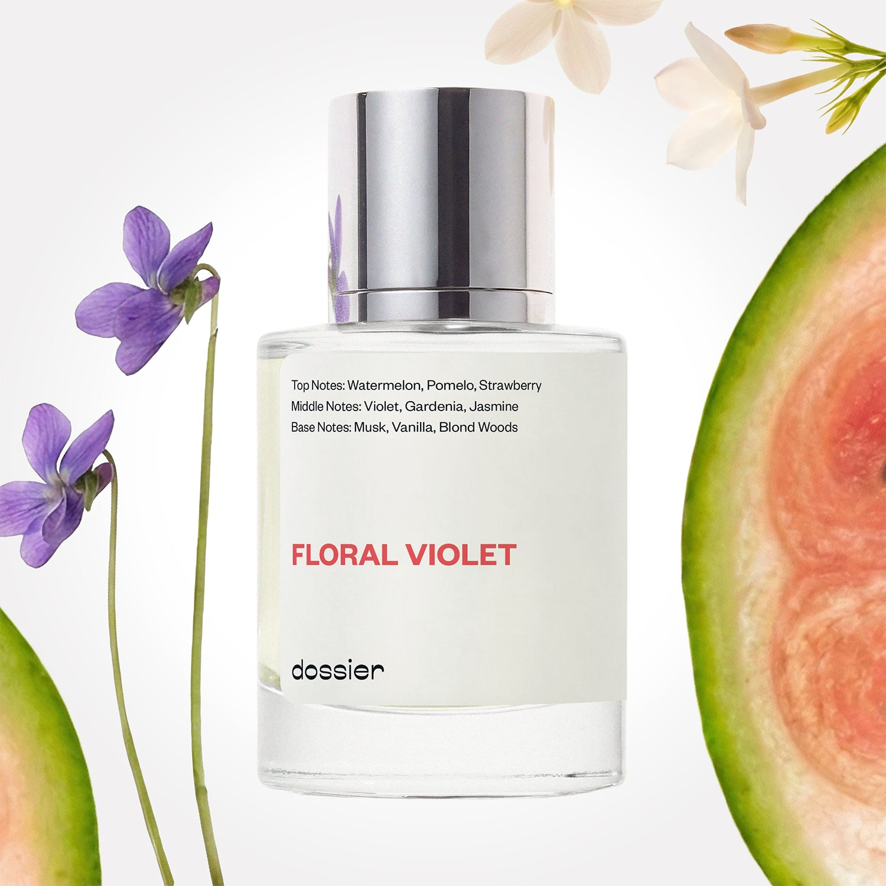

# Floral Violet

- **Dossier Inspired by Marc Jacobs' Daisy**
- **URL:** https://dossier.co/products/floral-violet
- **SEO title:** Marc Jacobs Daisy Dupe Perfume: Floral Violet - Dossier Perfumes

## Pricing (sizes)

| Size/SKU | Member price | List price | Currency |
|---|---|---|---|
| 39453474259011 | 28.8 | 32 | USD |

## Content (scent notes, about, editorial)

Back Home / Perfumes / Dossier Impressions / FLORAL VIOLET 

Women 

Sold out 

Floral Violet

Eau de Parfum. Size: 50ml / 1.7oz 

members: $28.80

Guest:
$32

Inspired by Marc Jacobs's Daisy Inspired by Marc Jacobs's Daisy 
Inspired by Marc Jacobs's Daisy 

Retail price 101 Crafted in France 
Scent Family: gourmand 

Notify Me 

Scent Notes This perfume is: Romantic, soft and dewy 
Main Notes:

Watermelon

Musks

Vanilla

Blond Woods

top: The first notes you smell 
Watermelon, Pomelo, Strawberry 
middle: The heart of the perfume 
Violet, Gardenia, Jasmine 
base: The notes that linger all day 
Musk, Vanilla, Blond Woods 
ingredients: Alcohol Denat., Fragrance/Parfum, Water/Aqua/Eau, Tetramethyl Acetyloctahydronaphthalenes, Hexamethylindanopyran, Alpha-Isomethyl Ionone, Juniperus Virginiana Oil, Linalyl Acetate, Citronellol, Linalool, Hydroxycitronellal, Citrus Aurantium Bergamia (Bergamot) Peel Oil, Rose Flower Oil/Extract, Hexyl Cinnamal, Limonene, Dimethyl Phenethyl Acetate, Beta-Caryophyllene, Vanillin, Geraniol, Rose Ketones, Pinene, Methyl 2-Octynoate, Hexadecanolactone, Citral, Benzyl Benzoate, Eugenol, Benzyl Alcohol. 

Vegan
Cruelty-free

Clean ingredients

About The opening notes are fruit forward, reminiscent of watermelon, strawberry, and pomelo, quickly followed by violet. The natural violet notes in perfumery actually come from the leaves rather than the petals. Violet leaves bring a very natural green glow to the fragrance. These fresh middle notes are infused with base notes of jasmine, wood, and vanilla, rounding out the scent with a full and complex depth. 

Romantic and feminine, Floral Violet (our impression of Marc Jacobs' Daisy) evokes a light dewiness and mellow sweetness that is both natural and sophisticated.

Scent Intensity: Significant 

Concentration: 18%

Gender: Feminine 

Shipping
Free shipping with 2+ items. 

Standard Shipping (with 2+ items) Auto-selected with 2+ items 
FREE 

Standard Shipping Auto-selected under 2 items 
$3.95 

Express shipping: 2 business days Select in checkout 
$19.00 

Returns
Free exchanges for all. Free returns with 

Exchanges
Free exchange, 1 time per order for all.

Returns
D+ members get 1 FREE return per order.
Non-members incur a $3.99/bottle return fee, 1 time per order.
Returns must be postmarked within 30 days of the initial order. Learn More 

FAQs Are these fragrances long lasting? They are designed to be very long lasting, just like designer fragrances, in some cases even longer, depending on the composition. 
When does the new packaging come out? We'll begin rolling out our new packaging across the U.S. and international markets soon! If you want to shop IRL - our new packaging first hits stores on January 11, 2026 at Walmart. Please note that if you are shopping online, you may receive a combination of our current and new packaging while we transition our inventory. 
How will I know what scent I like? We get it, shopping for perfumes online is hard! That's why we created a scent quiz, which will find the perfect scent for you Take the quiz (opens in new tab) 
Unsure about something? Ask us! help@dossier.co 

Details We are not associated or affiliated with the brands mentioned here in any way.
Floral Violet

Discover Effortless Charm and Youthful Elegance

Marc Jacobs consistently produces such appealing products that we’ve never questioned his ability to deliver exceptional fragrances. Here, the Daisy fragrance line is no exception.

Marc Jacobs’ Daisy (the luxury perfume that Dossier’s Floral Violet is inspired by) is the house’s best-selling fragrance for women. It offers a classic and well-rounded fragrance with notes that aren’t overly complex, while still managing to capture a world of youthful femininity, packed to the brim with all of its playful innocence and wistful daydreaming.

The luxury fragrance that Floral Violet is inspired by is decidedly feminine, with a sweet, floral style that we absolutely love. It’s soft and maybe even slightly aquatic, as if the flowers were being submerged in a glass of water.

Wild berries and grapefruit adorn the opening scents of the luxury fragrance that Floral Violet is inspired by. Neither too heavy nor too sweet — it’s a gentle, if not simple, opener. At its heart, jasmine, gardenia, and violets produce a fabulous bouquet of floral scents. An elegant base of sandalwood is complemented by creamy notes of vanilla that linger long after the fragrance has dried down. And even now, near the final notes, the opening fruity blast lingers and never truly dissipates. Instead, it chooses to wrap itself tightly within a blanket of vanilla and musk, lending a pleasant depth to the fragrance’s final notes.

We already know how effortlessly the luxury fragrance that Floral Violet is inspired by transports you to a world filled with charm and elegance. Perhaps what’s even more impressive is the fact that it does this with a scent that doesn’t overpower anything. It’s a light scent that gently lingers on the skin, leaving just enough for you to enjoy. Longevity is approximately six hours on average. 

You’ve come to the right place if you are looking for an intense yet affordable floral scent. Dossier’s Floral Violet is a Marc Jacobs Daisy dupe with plenty of the same undertones. Expect familiar scents such as berries, violet, jasmine, and vanilla. We’ve created a floral concoction where the freshness is always apparent, and the sweetness never gets out of hand. Together, these features make Floral Violet the perfect replica for everyday wear.

Best Layered With Combine 2 of our perfumes to create a third scent with layering, curated by our nose. Learn more 

You Might Love 

4.5 

Rated 4.5 out of 5 stars 

Based on 1,621 reviews 

Reviews 1,621 (tab expanded) Questions 1 (tab collapsed) 

Filters 
Write a Review (Opens in a new window) 

1,621 reviews 
Sort Highest Rating Most Helpful Photos & Videos Most Recent Oldest Lowest Rating Least Helpful 

S 

Stef 
Verified Buyer 

6/14/26 

Rated 5 out of 5 stars 

so happy!
I am an avid user of the Daisy and the fact that they have it here for less of the price?! This will be a repeat order of mine! Smells exactly the same and lasts almost the same. Love it!

Read More Read more about this review 

Was this helpful? Yes, this review from Stef was helpful. 0 people voted yes No, this review from Stef was not helpful. 0 people voted no 

DP 

Dossier Perfumes 
6/14/26 
Stef, we’re so happy to hear you’re getting those Daisy vibes (and savings!) here. It means a lot that you’re making us your go-to. Can’t wait to see you again!

KC 

Krystal C. 
Verified Buyer 

6/7/26 

Rated 5 out of 5 stars 

Classic office lady scent
My husband says that this is "Secretary Perfume". He explained that it smells like woman who work the front office or front desk. So basically the first impression of a business. I view it as a compliment. I love the scent!

Read More Read more about this review 

Was this helpful? Yes, this review from Krystal C. was helpful. 0 people voted yes No, this review from Krystal C. was not helpful. 0 people voted no 

DP 

Dossier Perfumes 
6/7/26 
Krystal, we love that your husband crowned it ‘front desk chic,’ what a fun compliment. Knowing it makes that first impression means so much. Here’s to many more spritzes!

B 

Bree 
Verified Reviewer 

6/6/26 

Rated 5 out of 5 stars 

Smells so lovely
Such a clean fresh scent 

Read More Read more about this review 

Was this helpful? Yes, this review from Bree was helpful. 0 people voted yes No, this review from Bree was not helpful. 0 people voted no 

DP 

Dossier Perfumes 
6/6/26 
Bree, that clean fresh feeling is our favorite too 😊 Thanks a bunch!

AI 

Abdul I. 
Verified Buyer 

5/17/26 

Rated 5 out of 5 stars 

It was good
I LOVE IT!

Read More Read more about this review 

Was this helpful? Yes, this review from Abdul I. was helpful. 0 people voted yes No, this review from Abdul I. was not helpful. 0 people voted no 

DP 

Dossier Perfumes 
5/18/26 
Abdul, yay! We’re so happy you love it 😊

AN 

Alana N. 
Verified Buyer 

5/9/26 

Rated 5 out of 5 stars 

Just like my favorite perfume
It smells exactly like my favorite perfume Daisy by Marc Jacobs! My bottle of that has started to wear down, but this new Floral Violet has reminded me of why it is my favorite. It is the perfect combo of clean, sweet, and floral!

Read More Read more about this review 

Was this helpful? Yes, this review from Alana N. was helpful. 0 people voted yes No, this review from Alana N. was not helpful. 0 people voted no 

DP 

Dossier Perfumes 
5/9/26 
Alana! We’re so glad Floral Violet brought back those familiar vibes and reminded you why you fell for that scent. Thanks for sharing, and here’s to many more happy spritzes!

Loading... 

Loading... 

Show More 

Inspired by  Baccarat Rouge 540 
Inspired by  Black Opium 
Inspired by  Love, Don't Be Shy 
Inspired by  Good Girl 
Inspired by  Libre 
Inspired by  Flowerbomb 
Inspired by  Light Blue 
Inspired by  Not a Perfume 
Inspired by  Aventus 
Inspired by  Bleu de Chanel 
Inspired by  Mon Paris 
Inspired by  Coco Mademoiselle 
Inspired by  Tom Ford for Men 
Inspired by  For Her 
Inspired by  J'Adore Dior 
Inspired by  Alien 
Inspired by  Black Opium Perfume 
Inspired by  Lost Cherry Perfume 

GET UP TO 30% OFF 

Find us at these retailers. 

Be the first to know. 
Submit 

Shop the following countries. United States 

Discover.
AI Scent Finder 
Blog (opens in new tab) 
Scent Family 
Layering 
Scent Quiz 

Help.
Contact Us 
Returns 
FAQ 
Testimonials 
Accessibility 

More.
Store Locator 
Boutique 
Refer A Friend 
Index 

Download our app now.

Find us at these retailers. 

Be the first to know. 
Submit 

Shop the following countries. United States 

Discover.
AI Scent Finder 
Blog (opens in new tab) 
Scent Family 
Layering 
Scent Quiz 

Help.
Contact Us 
Returns 
FAQ 
Testimonials 
Accessibility 

More.

## Main Image

