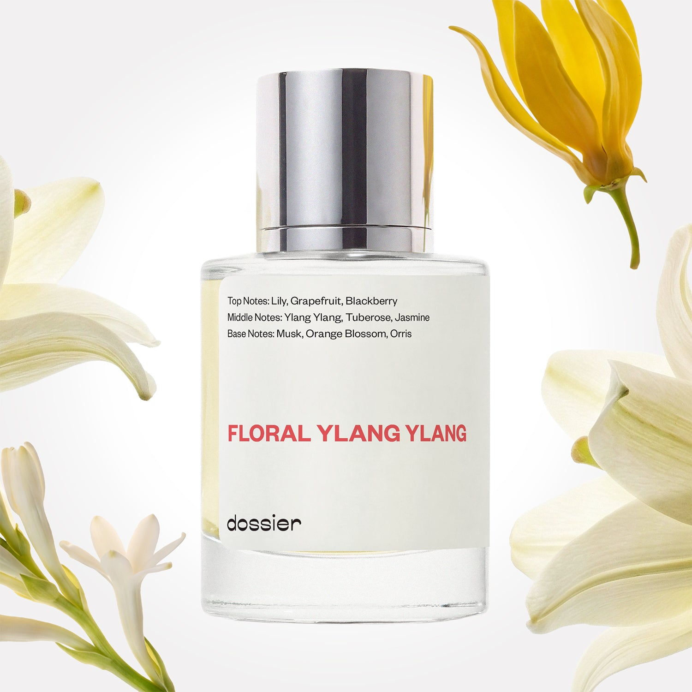

# Floral Ylang Ylang

- **Dossier Inspired by Chanel's Gabrielle**
- **URL:** https://dossier.co/products/floral-ylang-ylang
- **SEO title:** Chanel's Gabrielle Dupe Perfume: Floral Ylang Ylang - Dossier Perfumes

## Pricing (sizes)

| Size/SKU | Member price | List price | Currency |
|---|---|---|---|
| 32040606466115 | 28.8 | 32 | USD |

## Content (scent notes, about, editorial)

Back Home / Perfumes / Dossier Impressions / FLORAL YLANG YLANG 

Women 

Sold out 

Floral Ylang Ylang

Eau de Parfum. Size: 50ml / 1.7oz 

members: $28.80

Guest:
$32

Inspired by Chanel's Gabrielle Inspired by Chanel's Gabrielle 
Inspired by Chanel's Gabrielle 

Retail price 143 Crafted in France 
Scent Family: flowery 

Notify Me 

Scent Notes This perfume is: An ode to soft white flowers 
Main Notes:

Lily

Grapefruit

Blackberry

Ylang Ylang

Tuberose

Jasmine

top: The first notes you smell 
Lily, Grapefruit, Blackberry 
middle: The heart of the perfume 
Ylang Ylang, Tuberose, Jasmine 
base: The notes that linger all day 
Musk, Orange Blossom, Orris 
ingredients: Alcohol Denat., Fragrance/Parfum, Water/Aqua/Eau, Hexyl Cinnamal, Limonene, Linalool, Citronellol, Geraniol, Benzyl Salicylate, Alpha-Isomethyl Ionone, Benzyl Benzoate, Citral, Coumarin, Eugenol, Hydroxycitronellal, Isoeugenol, Farnesol, Benzyl Alcohol. 

Vegan
Cruelty-free

Clean ingredients

About Floral Ylang Ylang (inspired by Chanel's Gabrielle) is a rare combination of the four "star white flowers" of perfumery: Orange Blossom, Ylang Ylang, Jasmine, and Tuberose. Perfectly balanced in order to provide the ideal white flower scent, this combination will tickle the senses. 

Flowery and highly qualitative, this imaginary white flower has density but also freshness, thanks to a sparkling grapefruit, blackcurrant, and lily opening. 

Scent Intensity: Significant 

Concentration: 18%

Gender: Feminine 

Shipping
Free shipping with 2+ items. 

Standard Shipping (with 2+ items) Auto-selected with 2+ items 
FREE 

Standard Shipping Auto-selected under 2 items 
$3.95 

Express shipping: 2 business days Select in checkout 
$19.00 

Returns
Free exchanges for all. Free returns with 

Exchanges
Free exchange, 1 time per order for all.

Returns
D+ members get 1 FREE return per order.
Non-members incur a $3.99/bottle return fee, 1 time per order.
Returns must be postmarked within 30 days of the initial order. Learn More 

FAQs Are these fragrances long lasting? They are designed to be very long lasting, just like designer fragrances, in some cases even longer, depending on the composition. 
When does the new packaging come out? We'll begin rolling out our new packaging across the U.S. and international markets soon! If you want to shop IRL - our new packaging first hits stores on January 11, 2026 at Walmart. Please note that if you are shopping online, you may receive a combination of our current and new packaging while we transition our inventory. 
How will I know what scent I like? We get it, shopping for perfumes online is hard! That's why we created a scent quiz, which will find the perfect scent for you Take the quiz (opens in new tab) 
Unsure about something? Ask us! help@dossier.co 

Details An intoxicating take on white floral fragrance

Introduced in 2017, the Chanel Gabrielle Eau de Parfum from the house of Chanel is a brilliant combination of vibrant white flowers. It is designed to evoke the spirit of Aphrodite, the ancient Greek goddess of love and beauty. One spritz will envelop you in the lush green accords of Monet’s Gardens.

As timeless as the tides, this perfume starts with tones of grapefruit, mandarin orange, blackcurrant, and orange blossom, before merging into enduring lily-of-the-valley, pear, and pink pepper scent. The musk, sandalwood, and orris base notes also hit differently, producing a truly miraculous scent.

Draw the Chanel Gabrielle Eau de Parfum in and you’re instantly teleported to the coral islands of the Pacific, where the succulent fruits mingle with the flowering plants. Wear it and you’ll experience the seductive and mysterious freshness of a sweet bouquet.

Such an audacious and otherworldly scent is what you need to light a fire in the air – and you can bet the alluring undertones will create a massive bonfire. It’s a high-end perfume with a personality that lights up your world with clear blue skies – a powerful force that defies traditional scent conventions to warm you with a soothing depth. The Chanel Gabrielle Eau de Parfum is a smell you can’t quite put your finger on but it will bring back so many sweet memories.

As for the bottle, it is a posh and sensual aesthetic – and one that adds to the many reasons why this perfume easily qualifies as a timeless classic. Its unique style is reminiscent of royalty.
Along with a cocktail and a swimsuit, this perfume is a vacation must-have – part calm, part tense, and an overall fantastic fragrance for a summer holiday. Pair it with an equally smooth floral fragrance and conjure a hyper-realistic feeling akin to taking a swim in the translucent, turquoise waters of Fiji islands.

You can get Chanel Gabrielle on all major online retailers where it goes for $146 for Gabrielle Chanel Eau de Parfum Spray - 3.4 fl. oz, $146 for Chanel Gabrielle Essence, and $170 for the 3.4 fl. oz Eau de Parfum Twist and Spray Gift Set. You can also get the Gabrielle Chanel Essence Eau de Parfum Spray for $146, and the Coco Chanel Mademoiselle 3.4 fl. oz. Eau de Parfum Twist and Spray Set for $186, and the Gabrielle Chanel Moisturizing Body Lotion - 6.8 fl. oz for $60.

For a Chanel Gabrielle replica that can transport you to Kaua’i, try Dossier’s Floral Ylang Ylang. Our Chanel Gabrielle dupe is designed to relocate your senses to the cobalt-blue seas of the Garden Isle, where rainforests hide the ground, waterfalls cascade from lava cliffs, and tropical blossoms hang heavy in the steamy air. Orange blossom and ylang-ylang fizz on the first spritz and leave an intoxicating trail of white-floral heart fragrance. With jasmine and Grasse tuberose in the mix, it is a fruity scent with a subtle touch. It is carefully matched to give you the perfect white flower aroma – an intoxicatingly delightful blend. If you want a masterful scent escort for late-night get-togethers and other special occasions, don’t think twice about it.

Best Layered With Combine 2 of our perfumes to create a third scent with layering, curated by our nose. Learn more 

You Might Love 

4.4 

Rated 4.4 out of 5 stars 

Based on 661 reviews 

Reviews 661 (tab expanded) Questions 1 (tab collapsed) 

Filters 
Write a Review (Opens in a new window) 

661 reviews 
Sort Highest Rating Most Helpful Photos & Videos Most Recent Oldest Lowest Rating Least Helpful 

SS 

Sherry S. 

Verified Buyer 

11/22/25 

Rated 5 out of 5 stars 

Mild Floral sent
Love it!

Read More Read more about this review 

Was this helpful? Yes, this review from Sherry S. was helpful. 0 people voted yes No, this review from Sherry S. was not helpful. 0 people voted no 

DP 

Dossier Perfumes 
11/22/25 
So happy you’re loving it, Sherry! Enjoy every spritz 😊

MF 

Martha F. 

Verified Buyer 

11/10/25 

Rated 5 out of 5 stars 

This is my all-time favorite
This is my all-time favorite scent

Read More Read more about this review 

Was this helpful? Yes, this review from Martha F. was helpful. 0 people voted yes No, this review from Martha F. was not helpful. 0 people voted no 

DP 

Dossier Perfumes 
11/10/25 
Martha, we’re so glad Floral Ylang Ylang hit the spot for you!

PZ 

Patti Z. 

9/26/25 

Rated 5 out of 5 stars 

Floral Ylang Ylang versus Fruity Gardenia
I bought Floral Ylang Ylang because Fruity Gardenia is out of stock. The frangrance is fine but it's not nearly as enchanting as Fruity Gardenia.

Read More Read more about this review 

Was this helpful? Yes, this review from Patti Z. was helpful. 0 people voted yes No, this review from Patti Z. was not helpful. 0 people voted no 

DP 

Dossier Perfumes 
9/26/25 
Hang in there, Patti—Ylang Ylang has its own charm, but FG does feel more magical. You can sign up for restock alerts, and maybe layer Ylang Ylang meanwhile 💛

I 

Iris 

9/24/25 

Rated 5 out of 5 stars 

5 Stars
delicious!

Read More Read more about this review 

Was this helpful? Yes, this review from Iris was helpful. 0 people voted yes No, this review from Iris was not helpful. 0 people voted no 

I 

Iris 

9/24/25 

Rated 5 out of 5 stars 

5 Stars
delicious!

Read More Read more about this review 

Was this helpful? Yes, this review from Iris was helpful. 0 people voted yes No, this review from Iris was not helpful. 0 people voted no 

DP 

Dossier Perfumes 
9/24/25 
That’s a scent-sational shout-out, Iris! So glad it’s hitting the spot 😊

Loading... 

Loading... 

Show More 

Inspired by  Baccarat Rouge 540 
Inspired by  Black Opium 
Inspired by  Love, Don't Be Shy 
Inspired by  Good Girl 
Inspired by  Libre 
Inspired by  Flowerbomb 
Inspired by  Light Blue 
Inspired by  Not a Perfume 
Inspired by  Aventus 
Inspired by  Bleu de Chanel 
Inspired by  Mon Paris 
Inspired by  Coco Mademoiselle 
Inspired by  Tom Ford for Men 
Inspired by  For Her 
Inspired by  J'Adore Dior 
Inspired by  Alien 
Inspired by  Black Opium Perfume 
Inspired by  Lost Cherry Perfume 

GET UP TO 30% OFF 

Find us at these retailers. 

Be the first to know. 
Submit 

Shop the following countries. United States 

Discover.
AI Scent Finder 
Blog (opens in new tab) 
Scent Family 
Layering 
Scent Quiz 

Help.
Contact Us 
Returns 
FAQ 
Testimonials 
Accessibility 

More.
Store Locator 
Boutique 
Refer A Friend 
Index 

Download our app now.

Find us at these retailers. 

Be the first to know. 
Submit 

Shop the following countries. United States 

Discover.
AI Scent Finder 
Blog (opens in new tab) 
Scent Family 
Layering 
Scent Quiz 

Help.
Contact Us 
Returns 
FAQ 
Testimonials 
Accessibility 

More.

## Main Image

