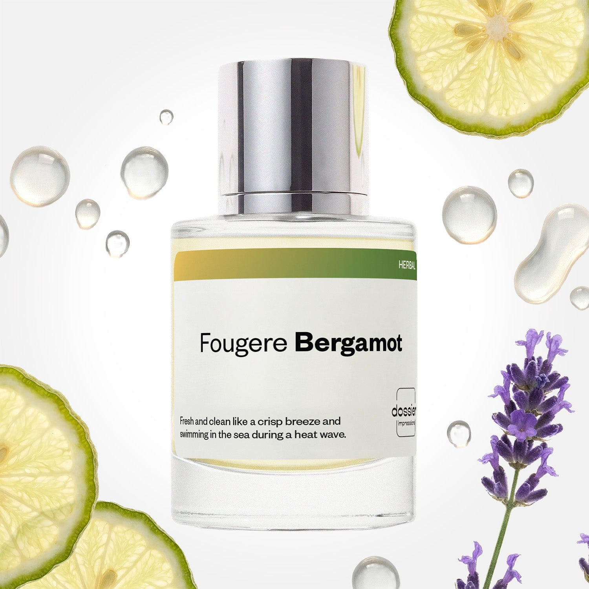

# Fougere Bergamot

- **Dossier Inspired by Versace's Dylan Blue**
- **URL:** https://dossier.co/products/fougere-bergamot
- **SEO title:** Versace's Dylan Blue Dupe Perfume: Fougere Bergamot - Dossier Perfumes

## Pricing (sizes)

| Size/SKU | Member price | List price | Currency |
|---|---|---|---|
| DI50FGBUS | 28.8 | 32 | USD |

## Content (scent notes, about, editorial)

Back Home / Perfumes / Dossier Impressions / FOUGERE BERGAMOT 

Men 

Fougere Bergamot

Eau de Toilette. Size: 50ml / 1.7oz 

members: $28.80

Guest:
$32

Inspired by Versace's Dylan Blue Inspired by Versace's Dylan Blue 
Inspired by Versace's Dylan Blue 

Retail price 79 Crafted in France 
Scent Family: herbal 

Add to Cart 

Scent Notes This perfume is: A swim in the sea on a hot day 
Main Notes:

Geranium

Lavender

Aquatic Accord

top: The first notes you smell 
Bergamot, Grapefruit, Fig Leaf 
middle: The heart of the perfume 
Geranium, Lavender, Aquatic Accord 
base: The notes that linger all day 
Tonka Bean, Patchouli, Ambroxan 
ingredients: Alcohol Denat.,Fragrance/Parfum, Water/Aqua/Eau, Tetramethyl Acetyloctahydronaphthalenes, Pogostemon Cablin Oil, Linalyl Acetate, Hexamethylindanopyran, Linalool, Citrus Limon (Lemon) Peel Oil, Limonene, Coumarin, Citronellol, Beta-Caryophyllene, Pinene, Alpha-Isomethyl Ionone, Rose Ketones, Citral, Geranyl Acetate, Anethole, Pelargonium Graveolens Flower Oil, Menthol, Terpinolene, Geraniol, Alpha-Terpinene, Vanillin, Camphor, Eugenol, Hexadecanolactone, Terpineol. 

Vegan
Cruelty-free

Clean ingredients

About Fougere Bergamot (inspired by Versace's Dylan Blue) opens with a splash of grapefruit and bergamot, enhanced by the coolness of an aquatic accord. A touch of fig leaf and lavender reinforces the Mediterranean inking of the fragrance. The heart and base of the scent blend geranium, tonka bean, and patchouli - key ingredients of the fougere family - modernized with ambroxan, a high-end molecule with woody and musky inflections.

Cool and invigorating, Fougere Bergamot (our impression of Versace's Dylan Blue) has a long-lasting masculine freshness.

Scent Intensity: Significant 

Concentration: 15%

Gender: Masculine 

Shipping
Free shipping with 2+ items. 

Standard Shipping (with 2+ items) Auto-selected with 2+ items 
FREE 

Standard Shipping Auto-selected under 2 items 
$3.95 

Express shipping: 2 business days Select in checkout 
$19.00 

Returns
Free exchanges for all. Free returns with 

Exchanges
Free exchange, 1 time per order for all.

Returns
D+ members get 1 FREE return per order.
Non-members incur a $3.99/bottle return fee, 1 time per order.
Returns must be postmarked within 30 days of the initial order. Learn More 

FAQs Are these fragrances long lasting? They are designed to be very long lasting, just like designer fragrances, in some cases even longer, depending on the composition. 
When does the new packaging come out? We'll begin rolling out our new packaging across the U.S. and international markets soon! If you want to shop IRL - our new packaging first hits stores on January 11, 2026 at Walmart. Please note that if you are shopping online, you may receive a combination of our current and new packaging while we transition our inventory. 
How will I know what scent I like? We get it, shopping for perfumes online is hard! That's why we created a scent quiz, which will find the perfect scent for you Take the quiz (opens in new tab) 
Unsure about something? Ask us! help@dossier.co 

Details We are not associated or affiliated with the brands mentioned here in any way.
Fougere Bergamot

Experience the Sensual Scents of the Mediterranean

Versace Dylan Blue (the luxury fragrance that inspired Dossier’s Fougere Bergamot) was released in 2016 with promises to deliver lasting freshness to the senses. Fresh and uplifting, this fragrance is an ambroxan explosion of citrus and spices. There’s also this fresh-out-the-shower scent profile, filled with synthetic citrus, aquatic, and incense notes that gives it a distinctly youthful aroma. 

Initial impressions are aquatic, with notes of citrusy grapefruit and Calabrian bergamot that create a fresh presence. Also present is an ambroxan note mixed with fig leaves, which only gets stronger as the scent progresses. The strong masculine layer of the luxury scent that Fougere Bergamot is inspired by exists at the heart of the fragrance, juxtaposing classic black pepper with an excellent combination of violet leaves and patchouli. It’s invigorating, although not for everyone. As Versace Dylan Blue dries down, the citrus settles, allowing for a greater flourish of ambroxan. You’ll also detect a seductive, earthy blend of tonka beans, mineral musk, and saffron in between the final notes.

The fig note paired with the citrus note at the top is very pleasing. It has this desirable zingy taste, making this masculine scent all the more exciting. Plus, the fig and aquatic notes set it apart from the rest of the competition ( Bleu , we’re looking at you). Overall, it’s a delightful scent of youthful masculinity all around, even if the lingering notes of ambroxan can be a little heavy at some moments.

The beauty of the luxury scent that Fougere Bergamot is inspired by lies in its versatility. You can wear it almost anywhere, even in warm weather. It also performs well, easily lasting more than six hours. The scent isn’t offensive and typically belongs in the crowd-pleaser category. The fragrance projects well, too, so expect to be noticed everywhere you go.

The luxury fragrance that Fougere Bergamot is inspired by is a gender-bending scent. There are two variants for both men and women (Pour Homme and Pour Femme, respectively). You can get it as an Eau de Toilette (EDT), with an additional after shave lotion, deodorant, and bath & shower gel.

Dossier’s Fougere Bergamot might be just the thing for you if you’re looking for something fresh and masculine but at a far more affordable price. Our Versace Dylan Blue dupe showcases its distinct layer of masculinity with fresh, soft notes that linger throughout the day. And combined with a slightly sweet, musky base, our replica of Versace Dylan Blue delivers the same amounts of sensuality that has become so synonymous with the famous Italian design house and its products. 

You Might Love 

4.4 

Rated 4.4 out of 5 stars 

Based on 372 reviews 

Reviews 372 (tab expanded) Questions 1 (tab collapsed) 

Filters 
Write a Review (Opens in a new window) 

372 reviews 
Sort Highest Rating Most Helpful Photos & Videos Most Recent Oldest Lowest Rating Least Helpful 

LW 

Linat W. 
Verified Buyer 

6/10/26 

Rated 5 out of 5 stars 

Delicious !!
Very yummy warm light blue fragrance, new favorite of mine!

Read More Read more about this review 

Was this helpful? Yes, this review from Linat W. was helpful. 0 people voted yes No, this review from Linat W. was not helpful. 0 people voted no 

DP 

Dossier Perfumes 
6/10/26 
Linat, that’s awesome to hear! So happy this scent became your new go-to 😊

R 

Rontrale 

5/29/26 

Rated 5 out of 5 stars 

5 Stars
Smells exactly like the original Dylan Blue...EXACTLY!!! This did not miss any beats when it came to the notes

Read More Read more about this review 

Was this helpful? Yes, this review from Rontrale was helpful. 0 people voted yes No, this review from Rontrale was not helpful. 0 people voted no 

HB 

Hana B. 

Verified Buyer 

11/8/25 

Rated 5 out of 5 stars 

Amazing
This smells better than the original it’s amazing buy buy don’t think twice sexy

Read More Read more about this review 

Was this helpful? Yes, this review from Hana B. was helpful. 0 people voted yes No, this review from Hana B. was not helpful. 0 people voted no 

JR 

Justin R. 

10/19/25 

Rated 5 out of 5 stars 

Love it
Its perfect! Fragrance is on point! Lasts twice as long as the real deal!

Read More Read more about this review 

Was this helpful? Yes, this review from Justin R. was helpful. 0 people voted yes No, this review from Justin R. was not helpful. 0 people voted no 

DP 

Dossier Perfumes 
10/19/25 
That’s music to our ears, Justin! Hearing this scent outlasts expectations feels like a real win 💫

SB 

Sean B. 

8/26/25 

Rated 5 out of 5 stars 

Slowly becoming my go-to
This is slowly becoming my go-to fragrance for warm weather. I love the opening of citrus that gives me a fresh clean scent when I first put it on. But I think it smells best after about 30 mins when it really opens up to the floral and woody notes that last throughout the day.

Read More Read more about this review 

Was this helpful? Yes, this review from Sean B. was helpful. 0 people voted yes No, this review from Sean B. was not helpful. 0 people voted no 

DP 

Dossier Perfumes 
8/28/25 
Love hearing that, Sean! A scent that keeps you coming back and lasts all day is exactly the vibe we aim for.

Loading... 

Loading... 

Show More 

Inspired by  Baccarat Rouge 540 
Inspired by  Black Opium 
Inspired by  Love, Don't Be Shy 
Inspired by  Good Girl 
Inspired by  Libre 
Inspired by  Flowerbomb 
Inspired by  Light Blue 
Inspired by  Not a Perfume 
Inspired by  Aventus 
Inspired by  Bleu de Chanel 
Inspired by  Mon Paris 
Inspired by  Coco Mademoiselle 
Inspired by  Tom Ford for Men 
Inspired by  For Her 
Inspired by  J'Adore Dior 
Inspired by  Alien 
Inspired by  Black Opium Perfume 
Inspired by  Lost Cherry Perfume 

GET UP TO 30% OFF 

Find us at these retailers. 

Be the first to know. 
Submit 

Shop the following countries. United States 

Discover.
AI Scent Finder 
Blog (opens in new tab) 
Scent Family 
Layering 
Scent Quiz 

Help.
Contact Us 
Returns 
FAQ 
Testimonials 
Accessibility 

More.
Store Locator 
Boutique 
Refer A Friend 
Index 

Download our app now.

Find us at these retailers. 

Be the first to know. 
Submit 

Shop the following countries. United States 

Discover.
AI Scent Finder 
Blog (opens in new tab) 
Scent Family 
Layering 
Scent Quiz 

Help.
Contact Us 
Returns 
FAQ 
Testimonials 
Accessibility 

More.

## Main Image

