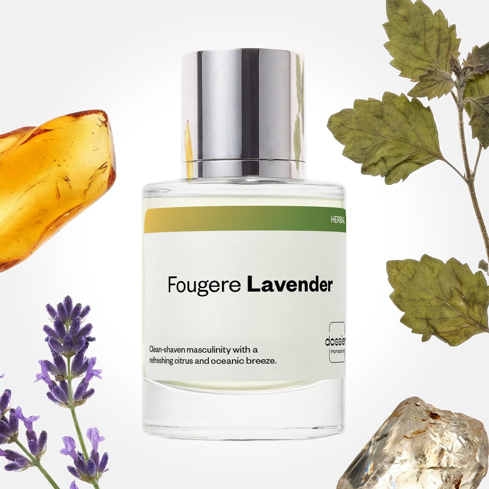

# Fougere Lavender

- **Dossier Inspired by Prada's Luna Rossa Carbon**
- **URL:** https://dossier.co/products/fougere-lavender
- **SEO title:** Prada's Luna Rossa Carbon Dupe Perfume: Fougere Lavender - Dossier Perfumes

## Pricing (sizes)

| Size/SKU | Member price | List price | Currency |
|---|---|---|---|
| DI50FGLAUS | 28.8 | 32 | USD |

## Content (scent notes, about, editorial)

Back Home / Perfumes / Dossier Impressions / FOUGERE LAVENDER 

Men 

It's back! 

Fougere Lavender

Eau de Toilette. Size: 50ml / 1.7oz 

members: $28.80

Guest:
$32

Inspired by Prada's Luna Rossa Carbon Inspired by Prada's Luna Rossa Carbon 
Inspired by Prada's Luna Rossa Carbon 

Retail price 100 Crafted in France 
Scent Family: herbal 

Add to Cart 

Scent Notes This perfume is: Change 
Main Notes:

Patchouli

Ambroxan

Amber

top: The first notes you smell 
Lavender, Bergamot, Grapefruit 
middle: The heart of the perfume 
Aquatic Accord, Pepper 
base: The notes that linger all day 
Patchouli, Ambroxan, Amber 
ingredients: Alcohol Denat., Water/Aqua/Eau, Fragrance/Parfum, Tetramethyl Acetyloctahydronaphthalenes, Citrus Aurantium Bergamia (Bergamot) Peel Oil, Pogostemon Cablin Oil, Linalool, Limonene, Hexamethylindanopyran, Linalyl Acetate, Coumarin, Citronellol, Pinene, Citrus Aurantium Peel Oil, Beta-Caryophyllene, Pelargonium Graveolens Flower Oil, Lavandula Oil/Extract, Amyl Salicylate, Geranyl Acetate, Citral, Geraniol, Terpineol, Terpinolene, Alpha-Terpinene, Vanillin, Rose Ketones. 

Vegan
Cruelty-free

Clean ingredients

About Fougere Lavender (inspired by Prada's Luna Rossa Carbon) opens with metallic notes of lavender supported by an aquatic accord. On top of that we have aromatic powdery notes that manage to maintain a strongly masculine base. The result is a fragrance that masters re-inventing a classically masculine scent.
Qualitative, fine tuned, and unique, Fougere Lavender (our impression of Prada's Luna Rossa Carbon) conveys a strong sense of being outdoors in fresh air, evoking the sharp sensation of a cold rock, combined with the comforting reminders of grooming.

Scent Intensity: Significant 

Concentration: 12%

Gender: Masculine 

Shipping
Free shipping with 2+ items. 

Standard Shipping (with 2+ items) Auto-selected with 2+ items 
FREE 

Standard Shipping Auto-selected under 2 items 
$3.95 

Express shipping: 2 business days Select in checkout 
$19.00 

Returns
Free exchanges for all. Free returns with 

Exchanges
Free exchange, 1 time per order for all.

Returns
D+ members get 1 FREE return per order.
Non-members incur a $3.99/bottle return fee, 1 time per order.
Returns must be postmarked within 30 days of the initial order. Learn More 

FAQs Are these fragrances long lasting? They are designed to be very long lasting, just like designer fragrances, in some cases even longer, depending on the composition. 
When does the new packaging come out? We'll begin rolling out our new packaging across the U.S. and international markets soon! If you want to shop IRL - our new packaging first hits stores on January 11, 2026 at Walmart. Please note that if you are shopping online, you may receive a combination of our current and new packaging while we transition our inventory. 
How will I know what scent I like? We get it, shopping for perfumes online is hard! That's why we created a scent quiz, which will find the perfect scent for you Take the quiz (opens in new tab) 
Unsure about something? Ask us! help@dossier.co 

Details We are not associated or affiliated with the brands mentioned here in any way.
Fougere Lavender

The taste of the darkest rock

Easily one of the most audacious perfumes in the world, the 2017 Prada Luna Rossa Carbon (the fragrance Dossier’s Fougere Lavender is inspired by) unites the intensity of the darkest rock with the freshness of the air to provide a rich and deep experience. Imagine taking a stroll along the airy, rocky coastlines of the Faroe Islands. That is the feeling this perfume provides. It is a fragrance for the man who believes in himself and is willing to go to any length to ensure that others do as well. It embodies perseverance, diligence, poise, and zeal.

Aromatic Fougere fragrances should be bold, firm, and potent enough to evoke the comforting warmth of a crackling fire. And Prada Luna Rossa Carbon does it better than any other men’s fragrance.

Opening with distilled notes of bergamot and pepper, the perfume progressively mellows and then develops into lavender, metal, and coal. Captivating and deliciously daring hints of soil tincture, ambroxan, and patchouli compete for prominence as the fragrance dries down. It has a soothing depth that warms from the inside. Steam-distilled botanicals meet synthetics here, and the result is a mystery aroma of conviction, power, and resolve – a fragrance that is mature, robust, and authoritative.

The courageous and resolute nature of the luxury fragrance Fougere Lavender is inspired by readies you for the demanding responsibilities of the day. It is an adventuresome, feisty, and gallant concoction that perfectly complements men of valor.

An olfactory marvel that creates mental images of the Playa de Las Catedrales, this fragrance is an apt choice for those who wish to spread good vibes everywhere they go. Spritz casually and be transported to the postcard-worthy Na Pali Coast, with the cascading falls and the lovely crescent beaches.

If you’re looking to buy a Prada Luna Rossa Carbon Eau de Parfum, log on to your favorite online retailer. Over there, you can get the Eau de Parfum Spray, 3.4 oz for $145, the Eau de Toilette Spray, 5.1 oz for $120, the 1.7 oz (50 ml) for $94.49, and the Eau de Toilette Spray 100 ml for $90.34. You can also get the Eau de Toilette for Men, 3.4 oz for $89.99, the Eau de Toilette, two travel-size sprays for $108, and the 3 Piece Gift Set for $77.

For a Prada Luna Rossa Carbon dupe that creates a scent as magnificent as the Andean Peaks of Machu Picchu, Dossier’s Fougere Lavender is the way to go. Our replica reinvents the sharp sensation masculine fragrances are known for. Metallic lavender notes are encased in a duvet of aquatic harmony in this sublime new scent. Aromatic powdery delivers an earthy base, while an addictive trail of outdoor freshness sweetens the deal. This inventive floral is a happy twist on intoxicating freshness, with a lot more class than your average fragrance. It is the finest choice for those who want to taste power – a comforting, unique option for anyone looking to walk with the greats.

Best Layered With Combine 2 of our perfumes to create a third scent with layering, curated by our nose. Learn more 

You Might Love 

4.4 

Rated 4.4 out of 5 stars 

Based on 473 reviews 

Reviews 473 (tab expanded) Questions 3 (tab collapsed) 

Filters 
Write a Review (Opens in a new window) 

473 reviews 
Sort Highest Rating Most Helpful Photos & Videos Most Recent Oldest Lowest Rating Least Helpful 

J 

jake 

1/7/26 

Rated 5 out of 5 stars 

5 Stars
Love these scents and prices

Read More Read more about this review 

Was this helpful? Yes, this review from jake was helpful. 0 people voted yes No, this review from jake was not helpful. 0 people voted no 

J 

jake 
Verified Buyer 

1/7/26 

Rated 5 out of 5 stars 

5 Stars
Love these scents and prices

Read More Read more about this review 

Was this helpful? Yes, this review from jake was helpful. 0 people voted yes No, this review from jake was not helpful. 0 people voted no 

DP 

Dossier Perfumes 
1/7/26 
Jake, woo! Thrilled you’re loving our scents and prices 😊

PW 

Patrick W. 

Verified Buyer 

12/27/25 

Rated 5 out of 5 stars 

Great scent profile
I need this in a bigger bottle please!

Read More Read more about this review 

Was this helpful? Yes, this review from Patrick W. was helpful. 0 people voted yes No, this review from Patrick W. was not helpful. 0 people voted no 

DP 

Dossier Perfumes 
12/27/25 
Patrick, love that you’re enjoying it. A bigger bottle would be dreamy too! 😊

B 

Bryana 
Verified Buyer 

12/24/25 

Rated 5 out of 5 stars 

5 Stars
Love this company

Read More Read more about this review 

Was this helpful? Yes, this review from Bryana was helpful. 0 people voted yes No, this review from Bryana was not helpful. 0 people voted no 

DP 

Dossier Perfumes 
12/24/25 
Bryana! Your love means the world to us. Thanks for the sunshine!

B 

Bryana 

12/24/25 

Rated 5 out of 5 stars 

5 Stars
Love this company

Read More Read more about this review 

Was this helpful? Yes, this review from Bryana was helpful. 0 people voted yes No, this review from Bryana was not helpful. 0 people voted no 

Loading... 

Loading... 

Show More 

Inspired by  Baccarat Rouge 540 
Inspired by  Black Opium 
Inspired by  Love, Don't Be Shy 
Inspired by  Good Girl 
Inspired by  Libre 
Inspired by  Flowerbomb 
Inspired by  Light Blue 
Inspired by  Not a Perfume 
Inspired by  Aventus 
Inspired by  Bleu de Chanel 
Inspired by  Mon Paris 
Inspired by  Coco Mademoiselle 
Inspired by  Tom Ford for Men 
Inspired by  For Her 
Inspired by  J'Adore Dior 
Inspired by  Alien 
Inspired by  Black Opium Perfume 
Inspired by  Lost Cherry Perfume 

GET UP TO 30% OFF 

Find us at these retailers. 

Be the first to know. 
Submit 

Shop the following countries. United States 

Discover.
AI Scent Finder 
Blog (opens in new tab) 
Scent Family 
Layering 
Scent Quiz 

Help.
Contact Us 
Returns 
FAQ 
Testimonials 
Accessibility 

More.
Store Locator 
Boutique 
Refer A Friend 
Index 

Download our app now.

Find us at these retailers. 

Be the first to know. 
Submit 

Shop the following countries. United States 

Discover.
AI Scent Finder 
Blog (opens in new tab) 
Scent Family 
Layering 
Scent Quiz 

Help.
Contact Us 
Returns 
FAQ 
Testimonials 
Accessibility 

More.

## Main Image

