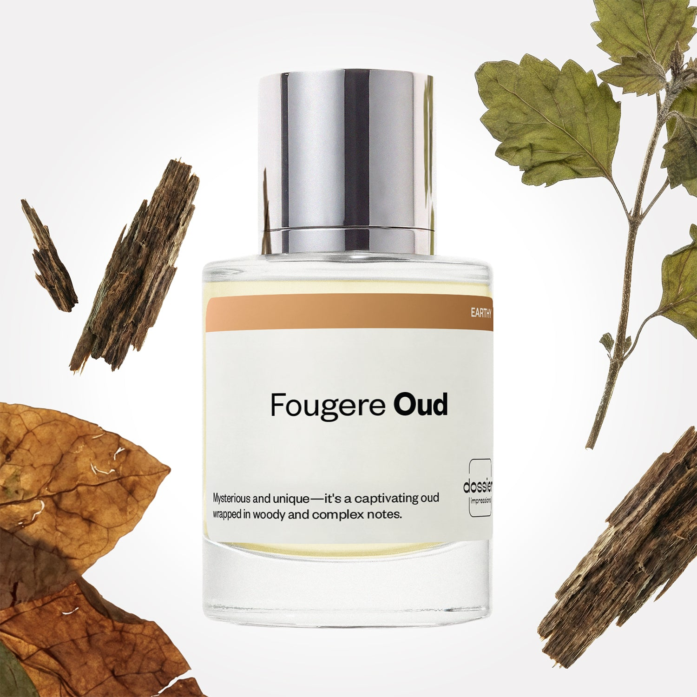

# Fougere Oud

- **Dossier Inspired by Tom Ford's Oud Wood**
- **URL:** https://dossier.co/products/fougere-oud
- **SEO title:** Tom Ford's Oud Wood Dupe Perfume: Fougere Oud - Dossier Perfumes

## Pricing (sizes)

| Size/SKU | Member price | List price | Currency |
|---|---|---|---|
| DI50FOUUS | 44.1 | 49 | USD |
| BF20258 | 117 | 130 | USD |

## Content (scent notes, about, editorial)

Back Home / Perfumes / Dossier Impressions / FOUGERE OUD 

Unisex 

It's back! 

Fougere Oud

Eau de Parfum. Size: 50ml / 1.7oz 

members: $44.10

Guest:
$49

Inspired by Tom Ford's Oud Wood Inspired by Tom Ford's Oud Wood 
Inspired by Tom Ford's Oud Wood 

Retail price 300 Crafted in France 
Scent Family: earthy 

Add to Cart 

Scent Notes This perfume is: The caviar of fragrances 
Main Notes:

Tobacco

Oud

Patchouli

Vetiver

top: The first notes you smell 
Rosewood, Tobacco, Pink Pepper, Coriander 
middle: The heart of the perfume 
Oud, Patchouli, Vetiver 
base: The notes that linger all day 
Tonka Bean, Labdanum, Cedarwood 
ingredients: Alcohol Denat., Fragrance/Parfum, Water/Aqua/Eau, Tetramethyl Acetyloctahydronaphthalenes, Pogostemon Cablin Oil, Linalool, Beta-Caryophyllene, Hydroxycitronellal, Pinene, Coumarin, Vanillin, Evernia Prunastri (Oakmoss) Extract, Limonene, Santalol, Santalum Album (Sandalwood) Oil, Farnesol, Linalyl Acetate, Cedrus Atlantica Oil/Extract, Lavandula Oil/Extract, Eugenol, Benzyl Benzoate, Benzyl Cinnamate, Terpineol, Acetyl Cedrene, Citrus Aurantium Flower Oil, Eucalyptus Globulus Oil, Citral, Geraniol, Terpinolene. 

Vegan
Cruelty-free

Clean ingredients

About Oud - also named Agarwood - is one of the most exclusive raw materials in perfumery, coming from a tropical evergreen tree called the Agar tree. When certain fungi grow on this tree, the tree naturally responds by releasing a resin which gives rise to the formation of resinous heartwood, known as Oud. Mainly used in the Middle East, Oud contributes mesmerizingly deep, warm, spicy, leathery, balsamic, and woody notes. 

Mysterious and intense, Fougere Oud (inspired by Tom Ford's Oud Wood) offers a twist of Orient with a traditional masculine fragrance structure named "fougere" (a blend of citrus, geranium, and patchouli notes).

Scent Intensity: Significant 

Concentration: 15%

Gender: Unisex 

Shipping
Free shipping with 2+ items. 

Standard Shipping (with 2+ items) Auto-selected with 2+ items 
FREE 

Standard Shipping Auto-selected under 2 items 
$3.95 

Express shipping: 2 business days Select in checkout 
$19.00 

Returns
Free exchanges for all. Free returns with 

Exchanges
Free exchange, 1 time per order for all.

Returns
D+ members get 1 FREE return per order.
Non-members incur a $3.99/bottle return fee, 1 time per order.
Returns must be postmarked within 30 days of the initial order. Learn More 

FAQs Are these fragrances long lasting? They are designed to be very long lasting, just like designer fragrances, in some cases even longer, depending on the composition. 
When does the new packaging come out? We'll begin rolling out our new packaging across the U.S. and international markets soon! If you want to shop IRL - our new packaging first hits stores on January 11, 2026 at Walmart. Please note that if you are shopping online, you may receive a combination of our current and new packaging while we transition our inventory. 
How will I know what scent I like? We get it, shopping for perfumes online is hard! That's why we created a scent quiz, which will find the perfect scent for you Take the quiz (opens in new tab) 
Unsure about something? Ask us! help@dossier.co 

Details We are not associated or affiliated with the brands mentioned here in any way.
Fougere Oud

An Ode (Oud) For Dark Lovely Woods

Tom Ford’s Oud Wood Eau de Parfum is a popular perfume for women and men and inspired Dossier’s Fougere Oud. It was released as part of the perfume house’s Private Blend collection in 2007. The cologne uses the rare resin of a specific genus of trees (oud), combined with sandalwood, rosewood, eastern spices, and sensual amber for a sophisticated yet compelling aroma.

Maybe a crash course in oud is in order before we go any further.

What exactly is oud? Oud is a highly precious resin produced from trees in the agarwood genus, and it’s the smell that gives Middle Eastern fragrances their unique scent. Oud is made by a process of carving out pieces of wood into flakes and then processing them into essential oils, thus giving the scent its woody quality. In addition to smelling woody or sweet, oud can have undertones of leather, and spices, and will often also have floral notes. 

Tom Ford’s Oud Wood carries on the same woodsy, spice-filled scent trail in its opening notes. Also present are other woody notes coming from Brazilian rosewood and sandalwood. In addition, you might detect cardamom and a peppery spice note, with the former being especially noticeable. We don’t mind, though, as the combination of oud and cardamom is absolutely delicious with its sweet, nutty, aromatic properties. Toward the middle notes, the oud steps aside ever so slightly, allowing other woody notes like vetiver and amber to shine through. Nearer to the dry down, the scent is almost back to how it smelled at the beginning, with a resurgence of oud accompanied by lingering notes of sandalwood and vetiver.

The luxury fragrance that Fougere Oud is inspired by is not especially complex or complicated. There are no unexpected twists, nor any surprises. This is an easy perfume to wear. Although, there is definitely a very soft effect in the base — perhaps a tad too soft for some people.

Nonetheless, if you’re looking for a scent that’s perfect for work or everyday casual wear, this is it. The luxury fragrance that Fougere Oud is inspired by is a light enough scent that definitely won’t offend anyone. Then there’s the fact that it’s incredibly versatile, easy, and uncomplicated. Bonus points for that oud and sandalwood dry-down, which is just gorgeous. Do note that performance is not this fragrance’s strong suit, with a projection and longevity that may leave some wanting.

The luxury fragrance that Fougere Oud is inspired b comes as an Eau de Parfum and is available as a 1.7 oz (50 ml) bottle, 3.4 oz (100 ml) bottle, or 8.45 oz (200 ml) bottle. For a stronger version, there’s Tom Ford Oud Wood Intense, a flanker with monster levels of performance compared to the original.

If you’re smitten with Tom Ford’s Oud Wood cologne, but find it too expensive, or are disappointed for some reason, then perhaps a high-quality, equally woodsy clone will whet your olfactory appetite. Fougere Oud, our very own dupe carries over all similar amazing qualities, with improved performance that outlasts the original. For something mesmerizingly deep, warm, spicy, and at an affordable price, you can’t go wrong with our replica.

You Might Love 

4.3 

Rated 4.3 out of 5 stars 

Based on 1,233 reviews 

Reviews 1,233 (tab expanded) Questions (tab collapsed) 

Filters 
Write a Review (Opens in a new window) 

1,233 reviews 
Sort Highest Rating Most Helpful Photos & Videos Most Recent Oldest Lowest Rating Least Helpful 

PD 

Peter D. 
Verified Buyer 

6/25/26 

Rated 5 out of 5 stars 

Welcome to the Rich Carlton
The scent is opulent, nocturnal, intriguing, and familiar. It smells like the lobby you stood in as a child when your parents scolded you not to touch anything before you’d even touched anything.
This is the rich atmospheric scent of being swaddled in baby cashmere as you nestle into a deep leather couch while sipping vanilla hot chocolate as a metrosexual wood worker, redolent with the essence of a sequoia grove, hand rolls you a pure tobacco ciggy.

Read More Read more about this review 

Was this helpful? Yes, this review from Peter D. was helpful. 0 people voted yes No, this review from Peter D. was not helpful. 0 people voted no 

DP 

Dossier Perfumes 
6/25/26 
Peter, wow your description paints such a cozy scene. We love how you connect those childhood memories to the fragrance. Enjoy layering and exploring more moments with it! 😊

MS 

Mary S. 
Verified Buyer 

6/6/26 

Rated 5 out of 5 stars 

Fougere Oud
I love this, it is my favorite scent from Dossier. I am a teacher and my students always tell me my classroom smells so good because of the perfume I’m wearing.

Read More Read more about this review 

Was this helpful? Yes, this review from Mary S. was helpful. 0 people voted yes No, this review from Mary S. was not helpful. 0 people voted no 

DP 

Dossier Perfumes 
6/6/26 
Mary, that’s so awesome to hear! Knowing your students enjoy the scent makes our day. Thanks for sharing how your classroom comes alive with compliments, your enthusiasm truly shines 😊

S 

Steven 

6/4/26 

Rated 5 out of 5 stars 

5 Stars
Fantastic products at a good price.

Read More Read more about this review 

Was this helpful? Yes, this review from Steven was helpful. 0 people voted yes No, this review from Steven was not helpful. 0 people voted no 

SS 

Sara S. 
Verified Buyer 

5/10/26 

Rated 5 out of 5 stars 

Love it
Smells really amazing I’m glad I have it. It’s one of three I use every day. Warm and earthy and a little sweet with great lasting power. Not sickly sweet and doesn’t overwhelm. 

Read More Read more about this review 

Was this helpful? Yes, this review from Sara S. was helpful. 0 people voted yes No, this review from Sara S. was not helpful. 0 people voted no 

DP 

Dossier Perfumes 
5/10/26 
Sara, we’re so happy Fougere Oud has become one of your daily top three and that its warmth, earthiness, and balanced sweetness hit the mark without ever overwhelming you. 🙌

M 

Misael 

4/19/26 

Rated 5 out of 5 stars 

5 Stars
I’m really impressed with the fragrances I purchased from Dossier. The scents are high quality, smell very close to the originals, and perform much better than I expected for the price. They last a good amount of time on my skin and have a nice, noticeable projection without being overpowering.
Overall, great value for the money and a solid option if you want luxury-inspired fragrances without spending a fortune. I’ll definitely be buying mor

Read More Read more about this review 

Was this helpful? Yes, this review from Misael was helpful. 0 people voted yes No, this review from Misael was not helpful. 0 people voted no 

Loading... 

Loading... 

Show More 

Inspired by  Baccarat Rouge 540 
Inspired by  Black Opium 
Inspired by  Love, Don't Be Shy 
Inspired by  Good Girl 
Inspired by  Libre 
Inspired by  Flowerbomb 
Inspired by  Light Blue 
Inspired by  Not a Perfume 
Inspired by  Aventus 
Inspired by  Bleu de Chanel 
Inspired by  Mon Paris 
Inspired by  Coco Mademoiselle 
Inspired by  Tom Ford for Men 
Inspired by  For Her 
Inspired by  J'Adore Dior 
Inspired by  Alien 
Inspired by  Black Opium Perfume 
Inspired by  Lost Cherry Perfume 

GET UP TO 30% OFF 

Find us at these retailers. 

Be the first to know. 
Submit 

Shop the following countries. United States 

Discover.
AI Scent Finder 
Blog (opens in new tab) 
Scent Family 
Layering 
Scent Quiz 

Help.
Contact Us 
Returns 
FAQ 
Testimonials 
Accessibility 

More.
Store Locator 
Boutique 
Refer A Friend 
Index 

Download our app now.

Find us at these retailers. 

Be the first to know. 
Submit 

Shop the following countries. United States 

Discover.
AI Scent Finder 
Blog (opens in new tab) 
Scent Family 
Layering 
Scent Quiz 

Help.
Contact Us 
Returns 
FAQ 
Testimonials 
Accessibility 

More.

## Main Image

