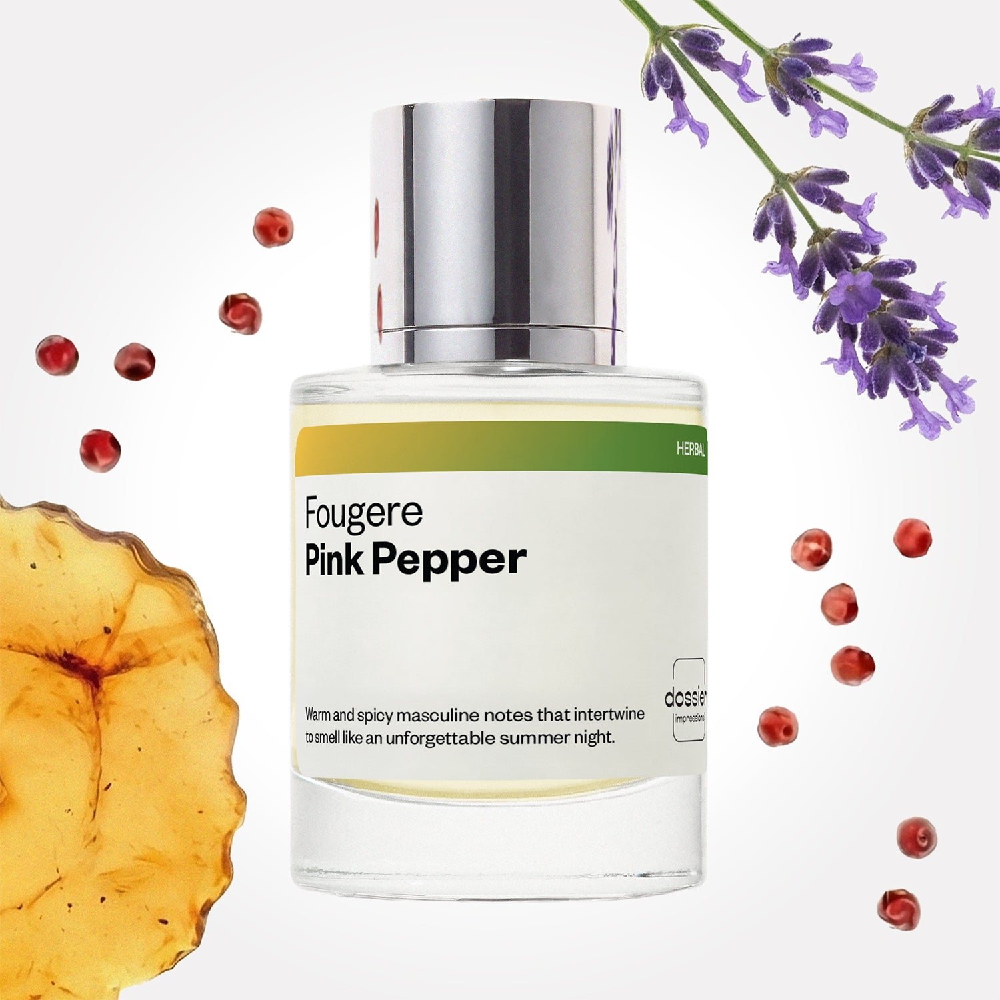

# Fougere Pink Pepper

- **Dossier Inspired by Gucci’s Guilty**
- **URL:** https://dossier.co/products/fougere-pink-pepper
- **SEO title:** Gucci's Guilty Dupe Perfume: Fougere Pink Pepper - Dossier Perfumes

## Pricing (sizes)

| Size/SKU | Member price | List price | Currency |
|---|---|---|---|
| DI50FOPPUS | 26.1 | 29 | USD |
| DOSWA50FOPP | 26.1 | 29 | USD |

## Content (scent notes, about, editorial)

Back Home / Perfumes / Dossier Impressions / FOUGERE PINK PEPPER 

Men 

It's back! 

Fougere Pink Pepper

Eau de Parfum. Size: 50ml / 1.7oz 

members: $26.10

Guest:
$29

Inspired by Gucci's Guilty Inspired by Gucci's Guilty 
Inspired by Gucci's Guilty 

Retail price 99 Crafted in France 
Scent Family: herbal 

Add to Cart 

Scent Notes This perfume is: An unforgettable summer night 
Main Notes:

Pink Pepper

Amber

top: The first notes you smell 
Pink Pepper, Lemon, Neroli 
middle: The heart of the perfume 
Orange Blossom, Lavender, Geranium 
base: The notes that linger all day 
Amber, Patchouli, Cedarwood 
ingredients: Alcohol Denat., Water/Aqua/Eau, Fragrance/Parfum, Linalyl Acetate, Tetramethyl Acetyloctahydronaphthalenes, Limonene, Linalool, Citrus Aurantium Bergamia (Bergamot) Peel Oil, Citrus Aurantium Peel Oil, Hexamethylindanopyran, Pogostemon Cablin Oil, Hydroxycitronellal, Pinene, Citrus Limon (Lemon) Peel Oil, Benzyl Salicylate, Alpha-Isomethyl Ionone, Amyl Salicylate, Vanillin, Trimethylcyclopentenyl Methylisopentenol, Lavandula Oil/Extract, Beta-Caryophyllene, Geranyl Acetate, Terpineol, Citral, Rose Ketones, Citronellol, Terpinolene, Camphor, Geraniol, Pelargonium Graveolens Flower Oil, Alpha-Terpinene, Carvone. 

Vegan
Cruelty-free

Clean ingredients

About Fougere Pink Pepper’s hook (inspired by Gucci's Guilty) is a spicy green accord full of freshness. Behind this vivacious opening, a masculine, woody, ambery structure gradually expresses itself fully.

Contrasted, sensual, and intriguing, Fougere Pink Pepper (our impression of Gucci's Guilty) is both the warmest and the freshest amongst the masculine fragrances. 

Scent Intensity: Significant 

Concentration: 12%

Gender: Masculine 

Shipping
Free shipping with 2+ items. 

Standard Shipping (with 2+ items) Auto-selected with 2+ items 
FREE 

Standard Shipping Auto-selected under 2 items 
$3.95 

Express shipping: 2 business days Select in checkout 
$19.00 

Returns
Free exchanges for all. Free returns with 

Exchanges
Free exchange, 1 time per order for all.

Returns
D+ members get 1 FREE return per order.
Non-members incur a $3.99/bottle return fee, 1 time per order.
Returns must be postmarked within 30 days of the initial order. Learn More 

FAQs Are these fragrances long lasting? They are designed to be very long lasting, just like designer fragrances, in some cases even longer, depending on the composition. 
When does the new packaging come out? We'll begin rolling out our new packaging across the U.S. and international markets soon! If you want to shop IRL - our new packaging first hits stores on January 11, 2026 at Walmart. Please note that if you are shopping online, you may receive a combination of our current and new packaging while we transition our inventory. 
How will I know what scent I like? We get it, shopping for perfumes online is hard! That's why we created a scent quiz, which will find the perfect scent for you Take the quiz (opens in new tab) 
Unsure about something? Ask us! help@dossier.co 

Details We are not associated or affiliated with the brands mentioned here in any way.
Fougere Pink Pepper

Gucci Guilty – Freedom’s Fragrance

First launched in 2010 and now a house legend, the fragrance line that inspired Dossier’s Fougere Pink Pepper has evolved over time and has even been dubbed one of the most sought-after scents in the 21st century. It’s a hallmark fragrance that plays on being "guilt-free", encapsulating the notion of complete liberation — one that allows you to take risks and be whoever you want to be.

You’ll notice that Gucci Guilty (the luxury scent that inspired Dossier’s Fougere Pink Pepper) is a fragrance that both men and women can share. Smelling of a life lived free of unreasonable expectations, the luxury scent that Fougere Pink Pepper is inspired by is an effortlessly unisex fragrance that sits comfortably within the same sphere as similarly gender-neutral fragrances such as Le Labo’s Santal 33 and CK’s CK One.

The luxury fragrance that Fougere Pink Pepper is inspired by opens with an initial explosion of pink pepper, Amalfi lemon, and lavender. In the heart of this evocative scent lies a complex and nuanced bouquet of aphrodisiac orange blossom – stimulating and entrancing – fused with neroli and rich, verdant aromatic notes. It’s nothing but a celebration of bold, confident masculinity. As the fragrance’s final phase unfolds, patchouli, a signature Gucci scent, gains a new strength bolstered by the inclusion of earthy cedarwood. This gives the perfume an overall light intensity tempered with warm spice.

The luxury scent that Fougere Pink Pepper is inspired by is glaringly bright but delicately soft at the same time. And that’s the beauty of it. For that reason, it’s a fragrance that can be worn for any occasion: at work, out shopping, on a date, or special occasions. Just spritz some on your neck, and you’re good to go. We’d lean more toward using this during the day since it isn’t quite sultry enough for a night out.

Pink Pepper Fougere from Dossier is a luxury perfume without the luxury price. After all, you wear the scent, not the bottle. This Gucci Guilty replica shares the same spicy green accord that melds into a woody base, creating a contrasted, sensual, and intriguing scent. Dossier’s dupe might just be the perfect mix of expressive masculinity and edginess your lifestyle calls for. 

Best Layered With Combine 2 of our perfumes to create a third scent with layering, curated by our nose. Learn more 

You Might Love 

4.4 

Rated 4.4 out of 5 stars 

Based on 645 reviews 

Reviews 645 (tab expanded) Questions 3 (tab collapsed) 

Filters 
Write a Review (Opens in a new window) 

645 reviews 
Sort Highest Rating Most Helpful Photos & Videos Most Recent Oldest Lowest Rating Least Helpful 

SR 

Susana R. 
Verified Buyer 

6/20/26 

Rated 5 out of 5 stars 

Fougere Pink Pepper
Super Fresh!

Read More Read more about this review 

Was this helpful? Yes, this review from Susana R. was helpful. 0 people voted yes No, this review from Susana R. was not helpful. 0 people voted no 

DP 

Dossier Perfumes 
6/20/26 
Love hearing how fresh it feels, Susana! Thanks for sharing with us.

F 

Francheska 
Verified Buyer 

6/19/26 

Rated 5 out of 5 stars 

Lovely
I love peppery scents, and this really does it for me without being to spicy!

Read More Read more about this review 

Was this helpful? Yes, this review from Francheska was helpful. 0 people voted yes No, this review from Francheska was not helpful. 0 people voted no 

DP 

Dossier Perfumes 
6/19/26 
Hey Francheska! So glad you’re enjoying that perfect peppery pop without the burn. Thanks for sharing! 😊

DG 

David G. 
Verified Buyer 

6/10/26 

Rated 5 out of 5 stars 

Fougere Pink Perfection! 
Absolutely love this scent! Exactly what I wanted. First scent I’ve ordered from Dossier, and I love the magnetic top, and also how full and strong the spray nozzle of the cologne is. I can get much better coverage of the scent. 

Read More Read more about this review 

Was this helpful? Yes, this review from David G. was helpful. 0 people voted yes No, this review from David G. was not helpful. 0 people voted no 

DP 

Dossier Perfumes 
6/10/26 
David, we’re so happy you love this scent! Magnetic top and strong spray are such small details that make a big difference. Thanks for sharing and enjoy every spritz!

TP 

Tonya P. 
Verified Buyer 

5/19/26 

Rated 5 out of 5 stars 

My teenage boy loves it
Nice masculine smell. Very close to OG.

Read More Read more about this review 

Was this helpful? Yes, this review from Tonya P. was helpful. 0 people voted yes No, this review from Tonya P. was not helpful. 0 people voted no 

DP 

Dossier Perfumes 
5/19/26 
Hey Tonya, so glad your teen enjoys that bold scent and finds it spot on!

PS 

Preeti S. 
Verified Buyer 

5/4/26 

Rated 5 out of 5 stars 

Really close to my preference 
This is pretty close to the expected fragrance i like - spice and cologne 

Read More Read more about this review 

Was this helpful? Yes, this review from Preeti S. was helpful. 0 people voted yes No, this review from Preeti S. was not helpful. 0 people voted no 

DP 

Dossier Perfumes 
5/4/26 
Hey Preeti! So happy this hit that spicy cologne vibe you love. Feel free to explore more scents anytime 😊

Loading... 

Loading... 

Show More 

Inspired by  Baccarat Rouge 540 
Inspired by  Black Opium 
Inspired by  Love, Don't Be Shy 
Inspired by  Good Girl 
Inspired by  Libre 
Inspired by  Flowerbomb 
Inspired by  Light Blue 
Inspired by  Not a Perfume 
Inspired by  Aventus 
Inspired by  Bleu de Chanel 
Inspired by  Mon Paris 
Inspired by  Coco Mademoiselle 
Inspired by  Tom Ford for Men 
Inspired by  For Her 
Inspired by  J'Adore Dior 
Inspired by  Alien 
Inspired by  Black Opium Perfume 
Inspired by  Lost Cherry Perfume 

GET UP TO 30% OFF 

Find us at these retailers. 

Be the first to know. 
Submit 

Shop the following countries. United States 

Discover.
AI Scent Finder 
Blog (opens in new tab) 
Scent Family 
Layering 
Scent Quiz 

Help.
Contact Us 
Returns 
FAQ 
Testimonials 
Accessibility 

More.
Store Locator 
Boutique 
Refer A Friend 
Index 

Download our app now.

Find us at these retailers. 

Be the first to know. 
Submit 

Shop the following countries. United States 

Discover.
AI Scent Finder 
Blog (opens in new tab) 
Scent Family 
Layering 
Scent Quiz 

Help.
Contact Us 
Returns 
FAQ 
Testimonials 
Accessibility 

More.

## Main Image

