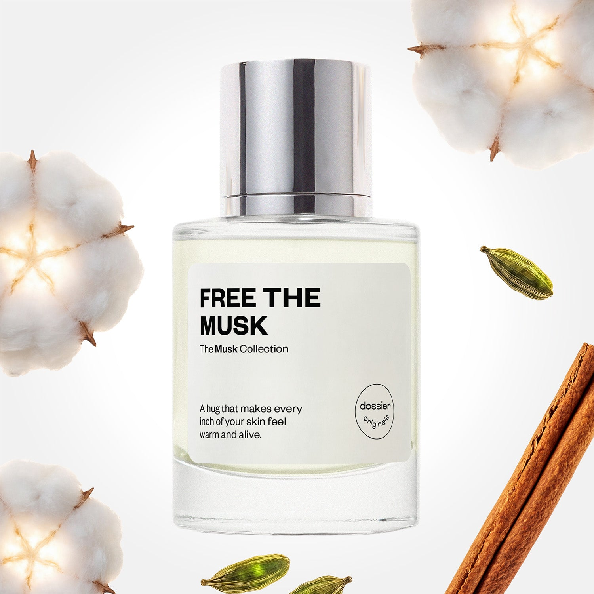

# Free the Musk

- **Dossier Dossier Originals**
- **URL:** https://dossier.co/products/free-the-musk
- **SEO title:** Free the Musk

## Pricing (sizes)

| Size/SKU | Member price | List price | Currency |
|---|---|---|---|
| 41568121716803 | 35.1 | 39 | USD |

## Content (scent notes, about, editorial)

Back Home / Perfumes / Dossier Originals / FREE THE MUSK 

Unisex 

New 

Free the Musk

Eau de Parfum. Size: 50ml / 1.7oz 

members: $35.10

Guest:
$39

Dossier Originals: The musk collection 

Liberate your second skin. Meet our NEW first-ever, in-house musk collection–––developed via the Dossier Creative Lab. 
Crafted in France 
Scent Family: warm 

Add to Cart 

Scent Notes Main Notes:

Cardamom

Cinnamon

White Musks

Amber Woods

top: The first notes you smell 
Cardamom, Cinnamon, Lily of the Valley 
middle: The heart of the perfume 
Clove, Ylang Ylang, Fresh Jasmine 
base: The notes that linger all day 
White Musks, Amber Woods, Myrrh, Caramel 
ingredients: Alcohol Denat., Fragrance/Parfum, Water/Aqua/Eau, Benzyl Salicylate, Hexamethylindanopyran, Cananga Odorata Oil/Extract, Alpha-Isomethyl Ionone, Cinnamal, Cinnamomum Zeylanicum Bark Oil, Linalyl Acetate, Linalool, Geraniol, Terpineol, Eugenia Caryophyllus Oil, Eugenol, Limonene, Beta-Caryophyllene, Pinene, Benzyl Benzoate, Citronellol, Vanillin, Farnesol, Isoeugenyl Acetate, Terpinolene, Eugenyl Acetate, Citrus Aurantium Peel Oil, Benzyl Alcohol, Citral, Isoeugenol, Geranyl Acetate. 

Vegan
Cruelty-free

Clean ingredients

About The ravishing combination of warm cardamom and tactile musk stands out among the alluring bouquet of spicy, floral and rich notes. Envelop yourself in a sensual blend of enlivening spice, fresh florals, and a lush base of subtly sweet white musks, amber woods, smoky myrrh, and caramel. 

Warm spices juxtapose fresh floral, powdery, and sweet woodiness to create a magnetic scent. The complexity embodies a desire to caress every inch––becoming one––with your skin. Born captivating, layered, and harmonious, Free the Musk embodies liberation in a fragrance.

Scent Intensity: Soft 

Concentration: 22%

Gender: Unisex 

Shipping
Free shipping with 2+ items. 

Standard Shipping (with 2+ items) Auto-selected with 2+ items 
FREE 

Standard Shipping Auto-selected under 2 items 
$3.95 

Express shipping: 2 business days Select in checkout 
$19.00 

Returns
Free exchanges for all. Free returns with 

Exchanges
Free exchange, 1 time per order for all.

Returns
D+ members get 1 FREE return per order.
Non-members incur a $3.99/bottle return fee, 1 time per order.
Returns must be postmarked within 30 days of the initial order. Learn More 

FAQs Are these fragrances long lasting? They are designed to be very long lasting, just like designer fragrances, in some cases even longer, depending on the composition. 
When does the new packaging come out? We'll begin rolling out our new packaging across the U.S. and international markets soon! If you want to shop IRL - our new packaging first hits stores on January 11, 2026 at Walmart. Please note that if you are shopping online, you may receive a combination of our current and new packaging while we transition our inventory. 
How will I know what scent I like? We get it, shopping for perfumes online is hard! That's why we created a scent quiz, which will find the perfect scent for you Take the quiz (opens in new tab) 
Unsure about something? Ask us! help@dossier.co 

Best Layered With Combine 2 of our perfumes to create a third scent with layering, curated by our nose. Learn more 

You Might Love 

4.3 

Rated 4.3 out of 5 stars 

Based on 64 reviews 

Reviews 64 (tab expanded) Questions (tab collapsed) 

Filters 
Write a Review (Opens in a new window) 

64 reviews 
Sort Highest Rating Most Helpful Photos & Videos Most Recent Oldest Lowest Rating Least Helpful 

A 

Amber 

6/21/26 

Rated 5 out of 5 stars 

5 Stars
My favorite by far!!!!

Read More Read more about this review 

Was this helpful? Yes, this review from Amber was helpful. 0 people voted yes No, this review from Amber was not helpful. 0 people voted no 

M 

Myasia 

6/16/26 

Rated 5 out of 5 stars 

5 Stars
Probably one of the best dossier fragrances to date. Clean and musky but with depth and warmth. The cardamom, cinnamon, and myrrh adds such a sexy quality to this fragrance. It’s addictive!

Read More Read more about this review 

Was this helpful? Yes, this review from Myasia was helpful. 0 people voted yes No, this review from Myasia was not helpful. 0 people voted no 

JR 

Jennifer R. 
Verified Buyer 

6/10/26 

Rated 5 out of 5 stars 

A Phenomenal Musk
This one is special. I wasn’t sure what to expect with the notes, but it’s meant to feel like a gentle hug, and that it does. It’s a fresh, modern take on musk with comforting spices, that’s a slightly sweet, soft, and powdery. If you’re looking for a your-skin-but-better fragrance, this is it! 

Read More Read more about this review 

Was this helpful? Yes, this review from Jennifer R. was helpful. 0 people voted yes No, this review from Jennifer R. was not helpful. 0 people voted no 

DP 

Dossier Perfumes 
6/10/26 
Hey Jennifer! We love hearing this gave you that soft embrace and just-right sweetness. It’s awesome you found your modern musk moment. Thanks for sharing your experience 😊

ML 

Michael L. 
Verified Buyer 

6/4/26 

Rated 5 out of 5 stars 

Love it
I love it 

Read More Read more about this review 

Was this helpful? Yes, this review from Michael L. was helpful. 0 people voted yes No, this review from Michael L. was not helpful. 0 people voted no 

DP 

Dossier Perfumes 
6/4/26 
Love hearing that, Michael! Thanks for sharing the love and happy spritzing!

J 

Jennifer 

6/3/26 

Rated 5 out of 5 stars 

5 Stars
I am fully in my Musk Era, and this one did NOT disappoint. I’m becoming such a fan of the Dossier Originals, and hope to scoop them all up at some point, but Free the Musk is fantastic and for sure one of my favorites I’ve experienced so far!

Read More Read more about this review 

Was this helpful? Yes, this review from Jennifer was helpful. 0 people voted yes No, this review from Jennifer was not helpful. 0 people voted no 

Loading... 

Loading... 

Show More 

Inspired by  Baccarat Rouge 540 
Inspired by  Black Opium 
Inspired by  Love, Don't Be Shy 
Inspired by  Good Girl 
Inspired by  Libre 
Inspired by  Flowerbomb 
Inspired by  Light Blue 
Inspired by  Not a Perfume 
Inspired by  Aventus 
Inspired by  Bleu de Chanel 
Inspired by  Mon Paris 
Inspired by  Coco Mademoiselle 
Inspired by  Tom Ford for Men 
Inspired by  For Her 
Inspired by  J'Adore Dior 
Inspired by  Alien 
Inspired by  Black Opium Perfume 
Inspired by  Lost Cherry Perfume 

GET UP TO 30% OFF 

Find us at these retailers. 

Be the first to know. 
Submit 

Shop the following countries. United States 

Discover.
AI Scent Finder 
Blog (opens in new tab) 
Scent Family 
Layering 
Scent Quiz 

Help.
Contact Us 
Returns 
FAQ 
Testimonials 
Accessibility 

More.
Store Locator 
Boutique 
Refer A Friend 
Index 

Download our app now.

Find us at these retailers. 

Be the first to know. 
Submit 

Shop the following countries. United States 

Discover.
AI Scent Finder 
Blog (opens in new tab) 
Scent Family 
Layering 
Scent Quiz 

Help.
Contact Us 
Returns 
FAQ 
Testimonials 
Accessibility 

More.

## Main Image

