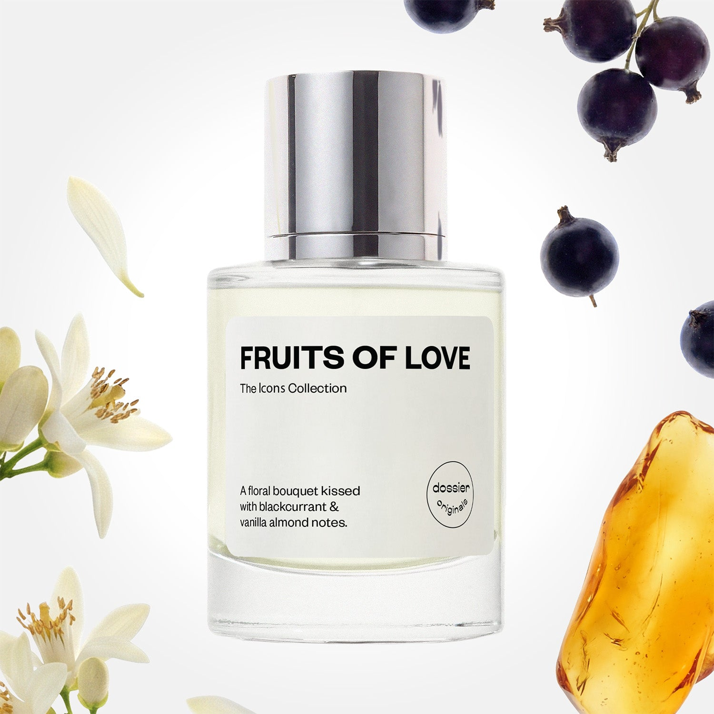

# Fruits of Love

- **Dossier Dossier Originals**
- **URL:** https://dossier.co/products/fruits-of-love
- **SEO title:** Fruits of Love

## Pricing (sizes)

| Size/SKU | Member price | List price | Currency |
|---|---|---|---|
| 41570584133699 | 35.1 | 39 | USD |

## Content (scent notes, about, editorial)

Back Home / Perfumes / Dossier Originals / FRUITS OF LOVE 

Women 

New 

Fruits of Love

Eau de Parfum. Size: 50ml / 1.7oz 

members: $35.10

Guest:
$39

Dossier Originals: The icons collection 

Our most noteworthy fragrances EVER.
Expertly crafted magic with your most beloved notes via the Creative Lab.

Crafted in France 
Scent Family: flowery 

Add to Cart 

Scent Notes Main Notes:

Blackcurrant

Orange Flower

Amber

top: The first notes you smell 
Blackcurrant, Mandarin, Grapefruit 
middle: The heart of the perfume 
Orange Flower, Rose, Plum, Orris 
base: The notes that linger all day 
Amber, Vanilla, Almondy notes 
ingredients: Alcohol Denat. Fragrance/Parfum, Water/Aqua/Eau, Tetramethyl Acetyloctahydronaphthalenes, Limonene, Linalyl Acetate, Linalool, Vanillin, Citrus Limon (Lemon) Peel Oil, Benzyl Salicylate, Hydroxycitronellal, Citrus Aurantium Bergamia (Bergamot) Peel Oil, Citrus Aurantium Peel Oil, Pinene, Coumarin, Geraniol, Citronellol, Geranyl Acetate, Benzyl Benzoate, Citral, Terpinolene, Beta-Caryophyllene, Rose Ketones, Hexadecanolactone, Terpineol, Isoeugenol, Jasmine Oil/Extract, Benzyl Alcohol, Alpha-Terpinene. 

Vegan
Cruelty-free

Clean ingredients

About Imagine a warm, sweet, and almondy breeze over lush floral florals. This magic recipe blossoms with notes of orange flower and ambery notes with sparkling blackcurrant (cassis) and soft almond infusions folded into the mix. 

Fruits of Love opens with blackcurrant-forward fruity top notes, supported by a citrusy duo (bright mandarin and grapefruit). The fragrance unfolds into an orange flower bouquet intertwined with rose, plum, and orris before unveiling a warm, delectable base of ambery vanilla and almond notes. 

A refreshing and intoxicating floral garden–––flourishing via fragrance.

Concentration: 18%

Gender: Feminine 

Shipping
Free shipping with 2+ items. 

Standard Shipping (with 2+ items) Auto-selected with 2+ items 
FREE 

Standard Shipping Auto-selected under 2 items 
$3.95 

Express shipping: 2 business days Select in checkout 
$19.00 

Returns
Free exchanges for all. Free returns with 

Exchanges
Free exchange, 1 time per order for all.

Returns
D+ members get 1 FREE return per order.
Non-members incur a $3.99/bottle return fee, 1 time per order.
Returns must be postmarked within 30 days of the initial order. Learn More 

FAQs Are these fragrances long lasting? They are designed to be very long lasting, just like designer fragrances, in some cases even longer, depending on the composition. 
When does the new packaging come out? We'll begin rolling out our new packaging across the U.S. and international markets soon! If you want to shop IRL - our new packaging first hits stores on January 11, 2026 at Walmart. Please note that if you are shopping online, you may receive a combination of our current and new packaging while we transition our inventory. 
How will I know what scent I like? We get it, shopping for perfumes online is hard! That's why we created a scent quiz, which will find the perfect scent for you Take the quiz (opens in new tab) 
Unsure about something? Ask us! help@dossier.co 

Best Layered With Combine 2 of our perfumes to create a third scent with layering, curated by our nose. Learn more 

You Might Love 

4.5 

Rated 4.5 out of 5 stars 

Based on 58 reviews 

Reviews 58 (tab expanded) Questions 1 (tab collapsed) 

Filters 
Write a Review (Opens in a new window) 

58 reviews 
Sort Highest Rating Most Helpful Photos & Videos Most Recent Oldest Lowest Rating Least Helpful 

MD 

Morgan D. 
Verified Buyer 

6/1/26 

Rated 5 out of 5 stars 

My new favorite scent 
Wish I could gatekeep this but it’s just too good not to share 

Read More Read more about this review 

Was this helpful? Yes, this review from Morgan D. was helpful. 0 people voted yes No, this review from Morgan D. was not helpful. 0 people voted no 

DP 

Dossier Perfumes 
6/1/26 
Morgan, we get it, some scents are too good not to share 😊 Thanks for the love and happy spritzing!

K 

Kali 

5/25/26 

Rated 5 out of 5 stars 

Summer Fragrance for sure!
These are truly summertime fragrances. Imagine beautiful sundresses, straw sun hats, and daytime lounge events, that’s exactly what came to mind the moment I smelled these! They are completely what I’ve been looking for.
I also absolutely LOVE that Dossier has such a great return policy with the membership. I will definitely be layering all three of these fragrances together or wearing them individually depending on the mood. I genuinely love them all!
And just to be clear, I am NOT paid for these reviews 😂 I’m just a girl’s girl and I want everybody to smell good! A good fragrance really is good for the soul.
These are the 3 perfumes:
Chasing the Sun
Fruits of Love
Fruity Orange

Read More Read more about this review 

Was this helpful? Yes, this review from Kali was helpful. 0 people voted yes No, this review from Kali was not helpful. 0 people voted no 

DP 

Dossier Perfumes 
5/26/26 
Kali, your summer vibe description has us absolutely glowing! Sundresses and straw hats with Fruits of Love sounds like pure perfection. We're so thrilled you found exactly what you've been looking for and that you're planning to layer all three together, wow, that's going to smell incredible! We totally agree that good fragrance is good for the soul ✨

J 

Jenifer 

5/16/26 

Rated 5 out of 5 stars 

5 Stars
Love it. I want to keep smelling myself.

Read More Read more about this review 

Was this helpful? Yes, this review from Jenifer was helpful. 0 people voted yes No, this review from Jenifer was not helpful. 0 people voted no 

A 

Anita 

4/30/26 

Rated 5 out of 5 stars 

5 Stars
Love it!

Read More Read more about this review 

Was this helpful? Yes, this review from Anita was helpful. 0 people voted yes No, this review from Anita was not helpful. 0 people voted no 

DL 

destiny L. d. L. 
Verified Buyer 

4/24/26 

Rated 5 out of 5 stars 

Sweet
Its perfect for a spring day

Read More Read more about this review 

Was this helpful? Yes, this review from destiny L. d. L. was helpful. 0 people voted yes No, this review from destiny L. d. L. was not helpful. 0 people voted no 

DP 

Dossier Perfumes 
4/24/26 
Thanks so much, Destiny! We’re so happy it’s perfect for a spring day 😊

Loading... 

Loading... 

Show More 

Inspired by  Baccarat Rouge 540 
Inspired by  Black Opium 
Inspired by  Love, Don't Be Shy 
Inspired by  Good Girl 
Inspired by  Libre 
Inspired by  Flowerbomb 
Inspired by  Light Blue 
Inspired by  Not a Perfume 
Inspired by  Aventus 
Inspired by  Bleu de Chanel 
Inspired by  Mon Paris 
Inspired by  Coco Mademoiselle 
Inspired by  Tom Ford for Men 
Inspired by  For Her 
Inspired by  J'Adore Dior 
Inspired by  Alien 
Inspired by  Black Opium Perfume 
Inspired by  Lost Cherry Perfume 

GET UP TO 30% OFF 

Find us at these retailers. 

Be the first to know. 
Submit 

Shop the following countries. United States 

Discover.
AI Scent Finder 
Blog (opens in new tab) 
Scent Family 
Layering 
Scent Quiz 

Help.
Contact Us 
Returns 
FAQ 
Testimonials 
Accessibility 

More.
Store Locator 
Boutique 
Refer A Friend 
Index 

Download our app now.

Find us at these retailers. 

Be the first to know. 
Submit 

Shop the following countries. United States 

Discover.
AI Scent Finder 
Blog (opens in new tab) 
Scent Family 
Layering 
Scent Quiz 

Help.
Contact Us 
Returns 
FAQ 
Testimonials 
Accessibility 

More.

## Main Image

