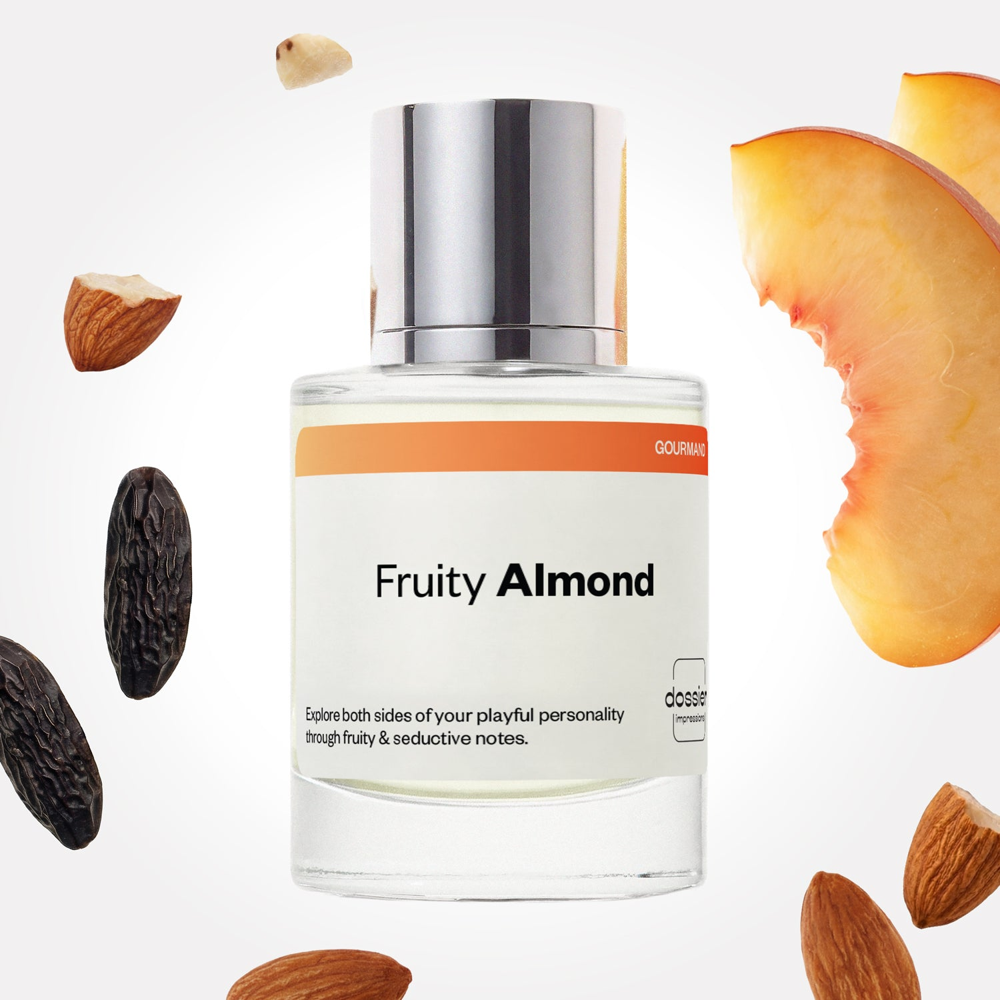

# Fruity Almond

- **Dossier Inspired by Carolina Herrera’s Good Girl**
- **URL:** https://dossier.co/products/fruity-almond
- **SEO title:** Carolina Herrera's Good Girl Dupe Perfume: Fruity Almond - Dossier Perfumes

## Pricing (sizes)

| Size/SKU | Member price | List price | Currency |
|---|---|---|---|
| DI50FRALUS | 26.1 | 29 | USD |
| DI100FRALUS | 44.1 | 49 | USD |
| DOS150BDLFRAL | 70.2 | 78 | USD |
| BF202539 | 88.2 | 98 | USD |
| BF202550 | 52.2 | 58 | USD |
| DOSWA50FRAL | 26.1 | 29 | USD |
| DOSWA50FRAL2BD | 52.2 | 58 | USD |

## Content (scent notes, about, editorial)

Back Home / Perfumes / Dossier Impressions / FRUITY ALMOND 

Women 

Bestseller 

Fruity Almond

Eau de Parfum. Size: 100ml / 3.4oz 

members: $44.10

Guest:
$49

Inspired by Carolina Herrera's Good Girl Inspired by Carolina Herrera's Good Girl 
Inspired by Carolina Herrera's Good Girl 

Retail price 450 Pack
50ml $29

Best Value
100ml $49

Crafted in France 
Scent Family: gourmand 

Add to Cart 

Scent Notes This perfume is: Playfully seductive 
Main Notes:

Almond

Peach

Tonka Bean

Vanilla

Cocoa

top: The first notes you smell 
Almond, Peach 
middle: The heart of the perfume 
Orris, Orange Blossom, Tuberose 
base: The notes that linger all day 
Tonka Bean, Vanilla, Cocoa 
ingredients: Alcohol Denat., Fragrance/Parfum, Water/Aqua/Eau, Hexamethylindanopyran, Tetramethyl Acetyloctahydronaphthalenes, Hydroxycitronellal, Linalool, Benzyl Salicylate, Linalyl Acetate, Vanillin, Coumarin, Benzyl Benzoate, Citrus Limon (Lemon) Peel Oil, Limonene, Trimethylcyclopentenyl Methylisopentenol, Pinene, Geraniol, Trimethylbenzenepropanol, Rose Ketones, Hexadecanolactone, Citronellol, Beta-Caryophyllene, Isoeugenol, Benzaldehyde, Benzyl Alcohol, Citral, Isoeugenyl Acetate, Geranyl Acetate. 

Vegan
Cruelty-free

Clean ingredients

About Fruity Almond (inspired by Carolina Herrera's Good Girl) combines joyful peach and almond, with a rich floral bouquet of tuberose and orange blossom. Next, tonka bean (sweet vanilla, intense almond, and cacao) is added to the lineup to bring in a sensual thrill. 

Feminine and colorful, Fruity Almond (our impression of Carolina Herrera's Good Girl) is a contrasted fragrance that takes you step-by-step from a luminous freshness to a saturated sensuality.

Scent Intensity: Statement 

Concentration: 15%

Gender: Feminine 

Shipping
Free shipping with 2+ items. 

Standard Shipping (with 2+ items) Auto-selected with 2+ items 
FREE 

Standard Shipping Auto-selected under 2 items 
$3.95 

Express shipping: 2 business days Select in checkout 
$19.00 

Returns
Free exchanges for all. Free returns with 

Exchanges
Free exchange, 1 time per order for all.

Returns
D+ members get 1 FREE return per order.
Non-members incur a $3.99/bottle return fee, 1 time per order.
Returns must be postmarked within 30 days of the initial order. Learn More 

FAQs Are these fragrances long lasting? They are designed to be very long lasting, just like designer fragrances, in some cases even longer, depending on the composition. 
When does the new packaging come out? We'll begin rolling out our new packaging across the U.S. and international markets soon! If you want to shop IRL - our new packaging first hits stores on January 11, 2026 at Walmart. Please note that if you are shopping online, you may receive a combination of our current and new packaging while we transition our inventory. 
How will I know what scent I like? We get it, shopping for perfumes online is hard! That's why we created a scent quiz, which will find the perfect scent for you Take the quiz (opens in new tab) 
Unsure about something? Ask us! help@dossier.co 

Details We are not associated or affiliated with the brands mentioned here in any way.
Fruity Almond

Be a charismatic, powerful woman

In 2016, the world was introduced to the Good Girl Carolina Herrera Eau de Parfum (the luxury perfume that Dossier’s Fruity Almond is inspired by) through a TV commercial. Six years down the line, it remains one of the world’s most emblematic names in perfumery.

Built around a mix note of jasmine, Bulgarian rose, almond, and sandalwood, the luxury fragrance that Fruity Almond is inspired by produces a delicious floral scent replete with an oriental outer layer. It begins with a spicy, fruity fragrance (owing to a combination of lemon and cinnamon) before developing into an ultra-bold and creamy scent.

Every opening reverberates with the breathtaking crispness of an October rain shower. And every application feels like a touch of the breeze that accompanies the rippling sea waves.

But that’s not even the best part. A good smell isn’t all there is to the luxury scent that Fruity Almond is inspired by. It also has longevity and lets you radiate positive energy until everyone sees how much of a confident, vivacious strong woman you are. You could even say it enables you to balance femininity and power with its rich and enticing combination that stays on the skin for hours.

So, why stick with mundane, routine experiences, when there are newer, fresher experiences yet to be had? This seductive floral is the way to go if you wish to be whisked away to an orchard where delicious fruits flourish on the blossoming green meadows. The luxury fragrance that Fruity Almond is inspired by is your best bet for a quick vacation to lush hillsides — with the shimmering winds and the chilly falls. A more modern expression of the traditional floral perfume, even the bottle is special.

The Carolina Herrera Good Girl Eau de Parfum is available on most online retailers where it goes for $86.84 for the 50 ml Supreme Eau de Parfum Spray, $76 for the Eau de Parfum Supreme, $59.95 for the Body Cream For Women, and $104 for the Eau de Parfum Spray 2.7 oz Good Girl Legere. Also, if you want the whole Gift Set (Eau de Parfum Spray 2.7 oz + Body Lotion 3.4 oz), you can get it for $105.79. 
Now, for anyone who likes this Eau de Parfum but can’t have the original, Dossier’s Fruity Almond offers a way out. With an aroma seething with praline, sandalwood, cedar, and jasmine, Fruity Almond smells great enough to eat. The highlights, praline and sandalwood, transport you to the awe-inspiring natural landscapes of the Jiuzhaigou National Park, where the waterfalls force their way down the softly floral and bracingly green, natural steps. There’s no fuss, no fluff, and no salesy lingo here — only the truth of how our Good Girl Carolina Herrera dupe intertwines the vibrant notes of floral, spice, and fruit to provide true glitz and glamor. This is what you wear to conjure the breezy days on the Sicily Island if you want like-minded people of class drawn to you.

You Might Love 

4.5 

Rated 4.5 out of 5 stars 

Based on 3,510 reviews 

Reviews 3,510 (tab expanded) Questions 4 (tab collapsed) 

Filters 
Write a Review (Opens in a new window) 

3,510 reviews 
Sort Highest Rating Most Helpful Photos & Videos Most Recent Oldest Lowest Rating Least Helpful 

RW 

Rhiannon W. 
Verified Buyer 

6/24/26 

Rated 5 out of 5 stars 

I'm in love with Fruity Almond!
This scent is everything that I hoped it would be. It smells amazing and I get compliments daily! The price point is perfect as well! 

Read More Read more about this review 

Was this helpful? Yes, this review from Rhiannon W. was helpful. 0 people voted yes No, this review from Rhiannon W. was not helpful. 0 people voted no 

DP 

Dossier Perfumes 
6/24/26 
Rhiannon, wow, we’re so happy Fruity Almond hit the mark (compliments are such a mood booster). And yay for that wallet-friendly vibe! Keep enjoying every spritz ✨

A 

Ashlee 

6/20/26 

Rated 5 out of 5 stars 

My Favorite perfume by far
I’ve tried so many other perfumes but they were to mature for my age (as a teen) then I landed on this one, I’ve repurchased this 3 times already. The scent is strong but not overwhelming, I’ve tried other perfumes while I’ve had this one and have always came back to Fruity Almond by Dossier.

Read More Read more about this review 

Was this helpful? Yes, this review from Ashlee was helpful. 0 people voted yes No, this review from Ashlee was not helpful. 0 people voted no 

DP 

Dossier Perfumes 
6/20/26 
Ashlee, thanks so much! We’re thrilled Fruity Almond hits that perfect sweet spot and keeps you coming back. Keep enjoying it and exploring our collection 🌸

JF 

Jennifer F. 
Verified Buyer 

6/19/26 

Rated 5 out of 5 stars 

Heavenly!
I absolutely love this scent! It’s based off of Carolina Herrera Good Girl, but it reminds me of Burberry Brit for Her. Very lovely! This is one I’ll be wearing in the fall and winter. Very pleased! 🥰

Read More Read more about this review 

Was this helpful? Yes, this review from Jennifer F. was helpful. 0 people voted yes No, this review from Jennifer F. was not helpful. 0 people voted no 

DP 

Dossier Perfumes 
6/19/26 
Jennifer it’s awesome to hear this scent feels so right for chilly months, and that it brings you joy. Keep layering it for cozy vibes all season long!

MB 

Morgan B. 
Verified Buyer 

6/17/26 

Rated 5 out of 5 stars 

Amazing Smell
I will definitely be buying this again, it really does smell like the Carolina Herrera Good Girl, I’m so glad I found this company and this perfume :)

Read More Read more about this review 

Was this helpful? Yes, this review from Morgan B. was helpful. 0 people voted yes No, this review from Morgan B. was not helpful. 0 people voted no 

DP 

Dossier Perfumes 
6/17/26 
Morgan, we’re so happy you found us and that our Fruity Almond is a keeper! Thanks for sharing and we can’t wait to welcome you back for more spritzes soon 😊

H◡̈ 

Harlie ◡̈ 

6/12/26 

Rated 5 out of 5 stars 

5 Stars
i ALWAYS get compliments on this.

Read More Read more about this review 

Was this helpful? Yes, this review from Harlie ◡̈ was helpful. 0 people voted yes No, this review from Harlie ◡̈ was not helpful. 0 people voted no 

Loading... 

Loading... 

Show More 

Inspired by  Baccarat Rouge 540 
Inspired by  Black Opium 
Inspired by  Love, Don't Be Shy 
Inspired by  Good Girl 
Inspired by  Libre 
Inspired by  Flowerbomb 
Inspired by  Light Blue 
Inspired by  Not a Perfume 
Inspired by  Aventus 
Inspired by  Bleu de Chanel 
Inspired by  Mon Paris 
Inspired by  Coco Mademoiselle 
Inspired by  Tom Ford for Men 
Inspired by  For Her 
Inspired by  J'Adore Dior 
Inspired by  Alien 
Inspired by  Black Opium Perfume 
Inspired by  Lost Cherry Perfume 

GET UP TO 30% OFF 

Find us at these retailers. 

Be the first to know. 
Submit 

Shop the following countries. United States 

Discover.
AI Scent Finder 
Blog (opens in new tab) 
Scent Family 
Layering 
Scent Quiz 

Help.
Contact Us 
Returns 
FAQ 
Testimonials 
Accessibility 

More.
Store Locator 
Boutique 
Refer A Friend 
Index 

Download our app now.

Find us at these retailers. 

Be the first to know. 
Submit 

Shop the following countries. United States 

Discover.
AI Scent Finder 
Blog (opens in new tab) 
Scent Family 
Layering 
Scent Quiz 

Help.
Contact Us 
Returns 
FAQ 
Testimonials 
Accessibility 

More.

## Main Image

