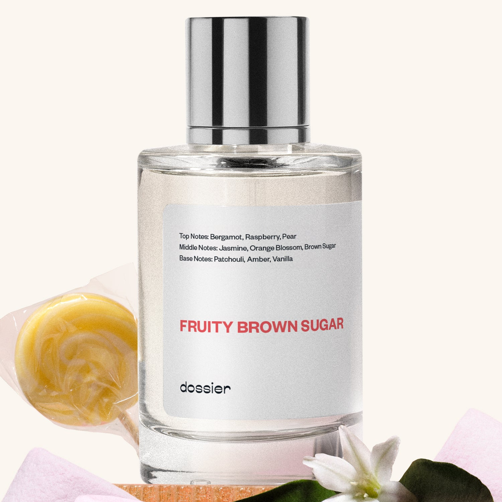

# Fruity Brown Sugar

- **Dossier Inspired by YSL's Mon Paris**
- **URL:** https://dossier.co/products/fruity-brown-sugar
- **SEO title:** YSL Mon Paris Dupe Perfume: Fruity Brown Sugar - Dossier Perfumes

## Pricing (sizes)

| Size/SKU | Member price | List price | Currency |
|---|---|---|---|
| DI50FRBSUS | 26.1 | 29 | USD |
| BUNDLEFBS50ML1 | 52.2 | 58 | USD |
| BUNDLEFBS50ML2 | 78.3 | 87 | USD |
| 42335051972675 | 44.1 | 49 | USD |

## Content (scent notes, about, editorial)

Back Home / Perfumes / Dossier Impressions / FRUITY BROWN SUGAR 

Women 

New 

Fruity Brown Sugar

Eau de Parfum. Size: 100ml / 3.4oz 

members: $44.10

Guest:
$49

Inspired by YSL's Mon Paris Inspired by YSL's Mon Paris 
Inspired by YSL's Mon Paris 

Retail price 145 Pack
50ml $29

Best Value
100ml $49

Crafted in France 
Scent Family: gourmand 

Add to Cart 

Scent Notes This perfume is: That "first crush" feeling 
Main Notes:

Raspberry

Brown Sugar

Vanilla

top: The first notes you smell 
Bergamot, Raspberry, Pear 
middle: The heart of the perfume 
Jasmine, Orange Blossom, Brown Sugar 
base: The notes that linger all day 
Patchouli, Amber, Vanilla 
ingredients: Alcohol Denat., Fragrance/Parfum, Water/Aqua/Eau, Benzyl Salicylate, Linalool, Hydroxycitronellal, Tetramethyl Acetyloctahydronaphthalenes, Linalyl Acetate, Pogostemon Cablin Oil, Citrus Limon (Lemon) Peel Oil, Limonene, Hexyl Cinnamal, Geraniol, Dimethyl Phenethyl Acetate, Citronellol, Geranyl Acetate, Pinene, Vanillin, Citrus Aurantium Peel Oil, Beta-Caryophyllene, Terpineol, Rose Ketones, Citral, Benzyl Alcohol, Hexadecanolactone, Terpinolene, Benzyl Benzoate, Eugenol. 

Vegan
Cruelty-free

Clean ingredients

About Fruity Brown Sugar (inspired by YSL's Mon Paris) opens with a vibrant raspberry pear cocktail. With no gimmicks, this joyful scent is sustained with a beautiful floral density. As the scent evolves, crispy brown sugar, vanilla, and a touch of patchouli warm up the fragrance to new heights. 

Floral and gourmand, Fruity Brown Sugar (our impression of YSL's Mon Paris) is a radiant fragrance, expressing a sense of playful seduction.

Scent Intensity: Statement 

Concentration: 18%

Gender: Feminine 

Shipping
Free shipping with 2+ items. 

Standard Shipping (with 2+ items) Auto-selected with 2+ items 
FREE 

Standard Shipping Auto-selected under 2 items 
$3.95 

Express shipping: 2 business days Select in checkout 
$19.00 

Returns
Free exchanges for all. Free returns with 

Exchanges
Free exchange, 1 time per order for all.

Returns
D+ members get 1 FREE return per order.
Non-members incur a $3.99/bottle return fee, 1 time per order.
Returns must be postmarked within 30 days of the initial order. Learn More 

FAQs Are these fragrances long lasting? They are designed to be very long lasting, just like designer fragrances, in some cases even longer, depending on the composition. 
When does the new packaging come out? We'll begin rolling out our new packaging across the U.S. and international markets soon! If you want to shop IRL - our new packaging first hits stores on January 11, 2026 at Walmart. Please note that if you are shopping online, you may receive a combination of our current and new packaging while we transition our inventory. 
How will I know what scent I like? We get it, shopping for perfumes online is hard! That's why we created a scent quiz, which will find the perfect scent for you Take the quiz (opens in new tab) 
Unsure about something? Ask us! help@dossier.co 

Details We are not associated or affiliated with the brands mentioned here in any way.
Fruity Brown Sugar

Infuse your atmosphere with thrill and magic

YSL’s Mon Paris is a portal into a fantasy world where magic meets reality. It is a fresh floral that exudes the mystery and intrigue of magical surrealism. One spritz lands you in the wonderworld of your fancy – with all the fantastic creatures and fierce battles you can imagine.

Top notes of raspberry, orange, tangerine, strawberry, pear, calone, and Calabrian bergamot take you on a dreamy adventure of magic and witchcraft. Middle notes of jasmine sambac, peony, orange blossom and datura ground you with their comforting earthiness. Base notes of white musk, ambroxan, Indonesian patchouli leaf, vanilla, moss, and cedar imbue you with enough power to tame a dragon.

Feel the wild and eluding winds of the Land of Oz as they caress your skin. Bask in the sunlight of this magical realm as it lights up your world.

YSL’s Mon Paris produces a scent that blooms on the skin in a very special way. It is a mystical potion that conjures up images of resplendent beauty. It is a force of nature that sends forth a magnificent burst of classic glitz.

Discover a distinctive yet fresh take on florals with every opening. This fragrance is for those who wish to wear a brighter yet lighter new guise. Summon your sorcerer side and relocate your senses to wild, untamed landscapes – where fairytale creatures walk amongst thriving nature.

All this makes YSL’s Mon Paris a graceful standout from regular fragrances. It is an elegant and delectable bouquet that leaves an exceptional trail each time you sport it. If you want to start your day in high spirits, this is the floral for you. Just spritz, step outside, and bend wills as you please. It is a genuinely singularly pleasing experience from start to finish.

Finally, if you fancy an affordable scent that takes cues from the YSL’s Mon Paris, consider Dossier’s Fruity Brown Sugar. Our dupe is a chic classic that exudes excellent radiance, playful seduction, and remarkable appeal. It is what you wear if you wish to step into a mystically wild world. Dive into an ocean of vibrant raspberry pear cocktail, crispy brown sugar, vanilla, and patchouli and emerge a new person. Look no further if you crave an enchanting floral that infuses your atmosphere with thrill and magic.

Best Layered With Combine 2 of our perfumes to create a third scent with layering, curated by our nose. Learn more 

You Might Love 

4.4 

Rated 4.4 out of 5 stars 

Based on 2,051 reviews 

Reviews 2,051 (tab expanded) Questions 1 (tab collapsed) 

Filters 
Write a Review (Opens in a new window) 

2,051 reviews 
Sort Highest Rating Most Helpful Photos & Videos Most Recent Oldest Lowest Rating Least Helpful 

VW 

Vickie W. 
Verified Buyer 

6/22/26 

Rated 5 out of 5 stars 

Fruity Brown Sugar
Smells very good 

Read More Read more about this review 

Was this helpful? Yes, this review from Vickie W. was helpful. 0 people voted yes No, this review from Vickie W. was not helpful. 0 people voted no 

DP 

Dossier Perfumes 
6/22/26 
Vickie, thanks for sharing! So glad you’re loving it 😊

C 

Cheri 
Verified Reviewer 

6/17/26 

Rated 5 out of 5 stars 

Super ****!
This scent was recommended to me because of previous purchases with Dossier. I've never smelled the original and I really dont need to! This scent is amazing!! I love the balance of sweet and musk, so ****. I wish they had a lotion. I'll be wearing this all summer long!!

Read More Read more about this review 

Was this helpful? Yes, this review from Cheri was helpful. 0 people voted yes No, this review from Cheri was not helpful. 0 people voted no 

DP 

Dossier Perfumes 
6/18/26 
Wow, Cheri! So excited that it's going to be your summer signature scent. Thanks for sharing the love!

A 

Amber 

6/5/26 

Rated 5 out of 5 stars 

5 Stars
One of my absolute favorites! Such a lovely sweet fragrance.

Read More Read more about this review 

Was this helpful? Yes, this review from Amber was helpful. 0 people voted yes No, this review from Amber was not helpful. 0 people voted no 

M 

Meg 
Verified Reviewer 

6/2/26 

Rated 5 out of 5 stars 

Love this!!!!
Beautiful scent on its own, but I have discovered that it elevates and enhances just about any other dossier perfume you layer it with! I will not be without this scent again!!!!

Read More Read more about this review 

Was this helpful? Yes, this review from Meg was helpful. 0 people voted yes No, this review from Meg was not helpful. 0 people voted no 

DP 

Dossier Perfumes 
6/2/26 
Hey Meg! We’re thrilled you love how it plays with your entire collection. Layering truly brings extra magic. Thanks for sharing your secret hack and sticking with us 🌟

MW 

Mishanna W. 
Verified Buyer 

6/1/26 

Rated 5 out of 5 stars 

Good Dry Down 
The dry down is beautiful 

Read More Read more about this review 

Was this helpful? Yes, this review from Mishanna W. was helpful. 0 people voted yes No, this review from Mishanna W. was not helpful. 0 people voted no 

DP 

Dossier Perfumes 
6/1/26 
Mishanna, we’re thrilled you’re loving the way it settles on your skin! 😊

Loading... 

Loading... 

Show More 

Inspired by  Baccarat Rouge 540 
Inspired by  Black Opium 
Inspired by  Love, Don't Be Shy 
Inspired by  Good Girl 
Inspired by  Libre 
Inspired by  Flowerbomb 
Inspired by  Light Blue 
Inspired by  Not a Perfume 
Inspired by  Aventus 
Inspired by  Bleu de Chanel 
Inspired by  Mon Paris 
Inspired by  Coco Mademoiselle 
Inspired by  Tom Ford for Men 
Inspired by  For Her 
Inspired by  J'Adore Dior 
Inspired by  Alien 
Inspired by  Black Opium Perfume 
Inspired by  Lost Cherry Perfume 

GET UP TO 30% OFF 

Find us at these retailers. 

Be the first to know. 
Submit 

Shop the following countries. United States 

Discover.
AI Scent Finder 
Blog (opens in new tab) 
Scent Family 
Layering 
Scent Quiz 

Help.
Contact Us 
Returns 
FAQ 
Testimonials 
Accessibility 

More.
Store Locator 
Boutique 
Refer A Friend 
Index 

Download our app now.

Find us at these retailers. 

Be the first to know. 
Submit 

Shop the following countries. United States 

Discover.
AI Scent Finder 
Blog (opens in new tab) 
Scent Family 
Layering 
Scent Quiz 

Help.
Contact Us 
Returns 
FAQ 
Testimonials 
Accessibility 

More.

## Main Image

