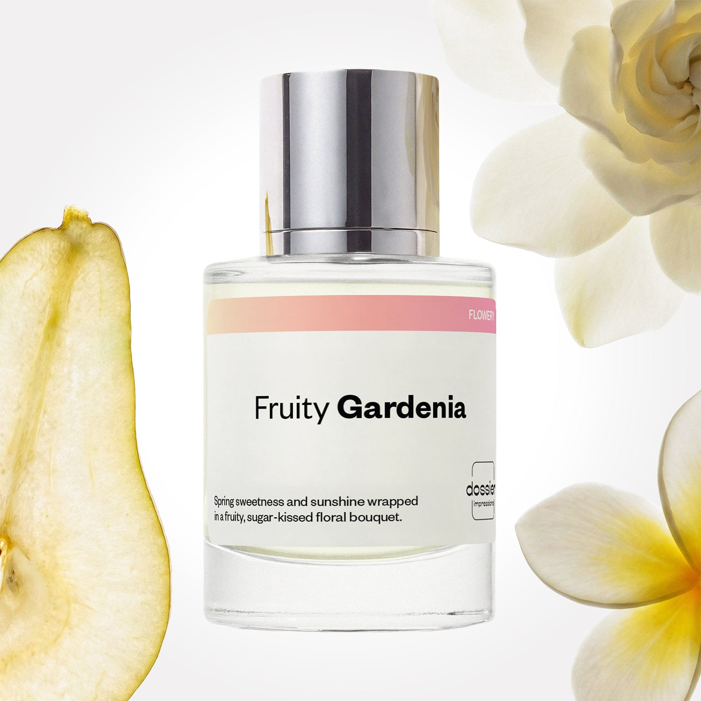

# Fruity Gardenia

- **Dossier Inspired by Gucci’s Flora Gorgeous Gardenia**
- **URL:** https://dossier.co/products/fruity-gardenia
- **SEO title:** Fruity Gardenia

## Pricing (sizes)

| Size/SKU | Member price | List price | Currency |
|---|---|---|---|
| 50ml | 28.8 | 32 | USD |

## Content (scent notes, about, editorial)

Back Home / Perfumes / Dossier Impressions / FRUITY GARDENIA 

Women 

Sold out 

Fruity Gardenia

Eau de Parfum. Size: 50ml / 1.7oz 

members: $28.80

Guest:
$32

Inspired by Gucci's Flora Gorgeous Gardenia Inspired by Gucci's Flora Gorgeous Gardenia 
Inspired by Gucci's Flora Gorgeous Gardenia 

Retail price 138 Crafted in France 
Scent Family: flowery 

Notify Me 

Scent Notes Main Notes:

Pear

Gardenia

top: The first notes you smell 
Pear, Red Fruits, Mandarine 
middle: The heart of the perfume 
Gardenia, Jasmine, Frangipani Flower 
base: The notes that linger all day 
Patchouli, Dry Fruits, Brown Sugar 
ingredients: Alcohol Denat., Fragrance/Parfum, Water/Aqua/Eau, Hexamethylindanopyran, Benzyl Salicylate, Hydroxycitronellal, Limonene, Geranyl Acetate, Citrus Aurantium Peel Oil, Pogostemon Cablin Oil, Coumarin, Rose Ketones, Pinene, Linalool, Benzyl Alcohol, Vanillin, Hexadecanolactone, Benzyl Benzoate, Citronellol, Beta-Caryophyllene, Geraniol, Citral, Terpinolene, Terpineol, Acetyl Cedrene. 

Vegan
Cruelty-free

Clean ingredients

About Fruity Gardenia opens with the crispness of pear and provides radiant freshness to a floral bouquet of gardenia (frangipani blossom and jasmine). As it becomes one with your skin, this delicious floral scent unfolds on a patchouli base, interlaced with the blissful indulgence of brown sugar and dried fruits. Sensual, playful, and feminine, Floral Gardenia succeeds in lending brilliance, modernity, and a sunny glow to the naturally bewitching but rather intense gardenia flower.

Scent Intensity: Significant 

Concentration: 15%

Gender: Feminine 

Shipping
Free shipping with 2+ items. 

Standard Shipping (with 2+ items) Auto-selected with 2+ items 
FREE 

Standard Shipping Auto-selected under 2 items 
$3.95 

Express shipping: 2 business days Select in checkout 
$19.00 

Returns
Free exchanges for all. Free returns with 

Exchanges
Free exchange, 1 time per order for all.

Returns
D+ members get 1 FREE return per order.
Non-members incur a $3.99/bottle return fee, 1 time per order.
Returns must be postmarked within 30 days of the initial order. Learn More 

FAQs Are these fragrances long lasting? They are designed to be very long lasting, just like designer fragrances, in some cases even longer, depending on the composition. 
When does the new packaging come out? We'll begin rolling out our new packaging across the U.S. and international markets soon! If you want to shop IRL - our new packaging first hits stores on January 11, 2026 at Walmart. Please note that if you are shopping online, you may receive a combination of our current and new packaging while we transition our inventory. 
How will I know what scent I like? We get it, shopping for perfumes online is hard! That's why we created a scent quiz, which will find the perfect scent for you Take the quiz (opens in new tab) 
Unsure about something? Ask us! help@dossier.co 

Best Layered With Combine 2 of our perfumes to create a third scent with layering, curated by our nose. Learn more 

You Might Love 

4.3 

Rated 4.3 out of 5 stars 

Based on 249 reviews 

Reviews 249 (tab expanded) Questions 2 (tab collapsed) 

Filters 
Write a Review (Opens in a new window) 

249 reviews 
Sort Highest Rating Most Helpful Photos & Videos Most Recent Oldest Lowest Rating Least Helpful 

BW 

Bonnie W. 
Verified Buyer 

5/24/26 

Rated 5 out of 5 stars 

Intoxicating 
One of the best dupes ever! 

Read More Read more about this review 

Was this helpful? Yes, this review from Bonnie W. was helpful. 0 people voted yes No, this review from Bonnie W. was not helpful. 0 people voted no 

DP 

Dossier Perfumes 
5/24/26 
Bonnie, thanks so much! We’re thrilled it’s become such a standout for you 😊

IV 

Idibeth V. 
Verified Buyer 

5/18/26 

Rated 5 out of 5 stars 

🥰🥰🥰
Ame🥰🥰🥰

Read More Read more about this review 

Was this helpful? Yes, this review from Idibeth V. was helpful. 0 people voted yes No, this review from Idibeth V. was not helpful. 0 people voted no 

DP 

Dossier Perfumes 
5/18/26 
Love hearing that, Idibeth! Your excitement made our day 😊

E7 

Evita 7. P. 
Verified Buyer 

5/18/26 

Rated 5 out of 5 stars 

❤️
It smells really good 

Read More Read more about this review 
Translated from Spanish Show original 

Was this helpful? Yes, this review from Evita 7. P. was helpful. 0 people voted yes No, this review from Evita 7. P. was not helpful. 0 people voted no 

DP 

Dossier Perfumes 
5/18/26 
¡Gracias por compartir, Evita! Qué bueno que te gusta tanto el aroma 😊

CD 

Carla D. 
Verified Buyer 

5/14/26 

Rated 5 out of 5 stars 

Soft & Femine
I don't own any expensive perfumes except for a handful, mostly gifts. So I cant compare it to the "original". However it's a gorgeous scent. I was afraid it would be too floral for me so the fruity part got me. Its feminine and spring time wrapped in a bottle which is exactly what I was looking for.
Dossier is quickly becoming my go to for new perfumes. Can"t beat the price. The quality is amazing and I can actually afford perfume again!

Read More Read more about this review 

Was this helpful? Yes, this review from Carla D. was helpful. 0 people voted yes No, this review from Carla D. was not helpful. 0 people voted no 

DP 

Dossier Perfumes 
5/14/26 
Carla, we’re thrilled you found the perfect balance between floral and fruity... thanks for making us your go-to for springtime vibes. Here’s to affordable luxury that never disappoints! 😊

SS 

Shelly S. 
Verified Buyer 

5/6/26 

Rated 5 out of 5 stars 

Fabulous!
I fell n love with this scent the minute I tried it!

Read More Read more about this review 

Was this helpful? Yes, this review from Shelly S. was helpful. 0 people voted yes No, this review from Shelly S. was not helpful. 0 people voted no 

DP 

Dossier Perfumes 
5/6/26 
Shelly, that’s so awesome to hear! Thank you for embracing it instantly 😊

Loading... 

Loading... 

Show More 

Inspired by  Baccarat Rouge 540 
Inspired by  Black Opium 
Inspired by  Love, Don't Be Shy 
Inspired by  Good Girl 
Inspired by  Libre 
Inspired by  Flowerbomb 
Inspired by  Light Blue 
Inspired by  Not a Perfume 
Inspired by  Aventus 
Inspired by  Bleu de Chanel 
Inspired by  Mon Paris 
Inspired by  Coco Mademoiselle 
Inspired by  Tom Ford for Men 
Inspired by  For Her 
Inspired by  J'Adore Dior 
Inspired by  Alien 
Inspired by  Black Opium Perfume 
Inspired by  Lost Cherry Perfume 

GET UP TO 30% OFF 

Find us at these retailers. 

Be the first to know. 
Submit 

Shop the following countries. United States 

Discover.
AI Scent Finder 
Blog (opens in new tab) 
Scent Family 
Layering 
Scent Quiz 

Help.
Contact Us 
Returns 
FAQ 
Testimonials 
Accessibility 

More.
Store Locator 
Boutique 
Refer A Friend 
Index 

Download our app now.

Find us at these retailers. 

Be the first to know. 
Submit 

Shop the following countries. United States 

Discover.
AI Scent Finder 
Blog (opens in new tab) 
Scent Family 
Layering 
Scent Quiz 

Help.
Contact Us 
Returns 
FAQ 
Testimonials 
Accessibility 

More.

## Main Image

