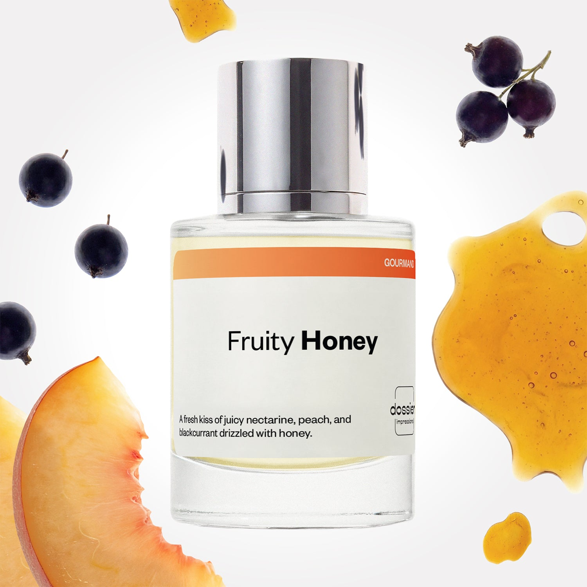

# Fruity Honey

- **Dossier Inspired by Jo Malone's Nectarine Blossom & Honey**
- **URL:** https://dossier.co/products/fruity-honey
- **SEO title:** Jo Malone's Nectarine Blossom & Honey Dupe Perfume : Fruity Honey - Dossier Perfumes

## Pricing (sizes)

| Size/SKU | Member price | List price | Currency |
|---|---|---|---|
| DI50FRHUS | 28.8 | 32 | USD |

## Content (scent notes, about, editorial)

Back Home / Perfumes / Dossier Impressions / FRUITY HONEY 

Unisex 

Fruity Honey

Eau de Parfum. Size: 50ml / 1.7oz 

members: $28.80

Guest:
$32

Inspired by Jo Malone's Nectarine Blossom & Honey Inspired by Jo Malone's Nectarine Blossom & Honey 
Inspired by Jo Malone's Nectarine Blossom & Honey 

Retail price 168 Crafted in France 
Scent Family: gourmand 

Add to Cart 

Scent Notes This perfume is: Biting into a juicy peach 
Main Notes:

Blackcurrant

Green Leaves

Honey

Nectarine

Peach

Vetiver

top: The first notes you smell 
Blackcurrant, Green Leaves 
middle: The heart of the perfume 
Honey, Nectarine 
base: The notes that linger all day 
Peach, Vetiver 
ingredients: Alcohol Denat., Fragrance/Parfum, Water/Aqua/Eau, Hexamethylindanopyran, Tetramethyl Acetyloctahydronaphthalenes, Linalyl Acetate, Pinene, Limonene, Citrus Limon (Lemon) Peel Oil, Linalool, Citronellol, Geranyl Acetate, Rose Ketones, Citral, Terpinolene, Geraniol. 

Vegan
Cruelty-free

Clean ingredients

About Fruity Honey (inspired by Jo Malone's Nectarine Blossom & Honey) is a sparkling combination of juicy nectarine and ripe blackcurrant, giving the fragrance a crisp edge to its traditionally more fruity notes. In addition, the pairing of honey and tender peach, sustained with vetiver, offer beautiful continuity to the starting tone of the fragrance.
Fizzy, joyful, and natural, Fruity Honey (our impression of Jo Malone's Nectarine Blossom & Honey) is an incredible "feel good" scent that will inevitably bring good vibes to your day!

Scent Intensity: Soft 

Concentration: 18%

Gender: Unisex 

Shipping
Free shipping with 2+ items. 

Standard Shipping (with 2+ items) Auto-selected with 2+ items 
FREE 

Standard Shipping Auto-selected under 2 items 
$3.95 

Express shipping: 2 business days Select in checkout 
$19.00 

Returns
Free exchanges for all. Free returns with 

Exchanges
Free exchange, 1 time per order for all.

Returns
D+ members get 1 FREE return per order.
Non-members incur a $3.99/bottle return fee, 1 time per order.
Returns must be postmarked within 30 days of the initial order. Learn More 

FAQs Are these fragrances long lasting? They are designed to be very long lasting, just like designer fragrances, in some cases even longer, depending on the composition. 
When does the new packaging come out? We'll begin rolling out our new packaging across the U.S. and international markets soon! If you want to shop IRL - our new packaging first hits stores on January 11, 2026 at Walmart. Please note that if you are shopping online, you may receive a combination of our current and new packaging while we transition our inventory. 
How will I know what scent I like? We get it, shopping for perfumes online is hard! That's why we created a scent quiz, which will find the perfect scent for you Take the quiz (opens in new tab) 
Unsure about something? Ask us! help@dossier.co 

Details We are not associated or affiliated with the brands mentioned here in any way.
Fruity Honey

A youthful explosion of the fresh and sprightly

Clean and crisp, with hints of innocence and novelty encased in Mother Nature’s caring cradle, the Jo Malone Nectarine Blossom and Honey cologne for men and women (which inspired Dossier’s Fruity Honey fragrance) embodies the delights of boundless youthful glory. Launched by Jo Malone London in 2005, the luxury fragrance that Fruity Honey is inspired by is a harmonious medley of natural green scents that dance delicately with fragrant ripe fruits.

Embark on this intensely juicy experience with appetizing top tones that scintillate the taste buds – summery blackcurrant paired with plump nectarine, an appealing appetizer to entice you into a flavorsome fiesta of gorgeously ripe fruits. To continue the refreshing journey, these notes gently hold hands with luscious peach, freshly picked plum, and green vetiver – a tranquil festival of succulence and dewy youth. The luxury fragrance that Fruity Honey is inspired by essentially invites you to take a swim in the blue waters of Lake Coeur d’Alene.

Feel the summer breeze gently brush against your cheek, a familiar nostalgic sensation of your lovely childhood days. The dewy middle tones of black locust, honied apricot, and crushed greens reinvent a feeling of youth and delight the senses with their fruity charisma. It is a polaroid picture of you walking through the saccharine gardens of the Château de Villandry.

The luxury fragrance that Fruity Honey is inspired by is a fresh scent of personal identity blended with the beautifully aged wisdom of nature. It is sprightly floral, like pure contentment trapped in bottled. Find yourself and your spark as you embrace this lovely bouquet.

To fill every room you enter with this caring natural scent of crushed green and summer berries, visit your favorite e-retailer. It comes in 2 sizes: 30 ml at $75.00 and 100 ml at $145.00. The Jo Malone Nectarine Blossom and Honey fragrance also comes in a travel size of 10 ml and costs $37.00. Alternatively, you can buy the 200g candle for $70.00 (with a burn time of 45 hours), the soap collection set for $79.99, and the 250 ml body and hand cream for $62.00. Also, the 175 ml body crème goes for $75.00, and the 165 ml diffuser sells at $105.00.

If you fancy the youthful dewdrops of the Jo Malone Nectarine Blossom and Honey but want something more affordable, turn to Dossier’s Fruity Honey. Our dupe is a careful resemblance designed for your liking. It is a refreshing mixture of sweet blackcurrant and blissful nectarine, coupled with juicy peach and acacia honey that have been inspired by the original. Find our energetic scent of Fruity Honey presents a joyous and sparkling aroma that surrounds your day with liveliness and joy – to leave you feeling delicious and satisfied on a feast of summer’s natural greens and fruits. Look no further if you want to walk the Gardens of Versailles. 

Best Layered With Combine 2 of our perfumes to create a third scent with layering, curated by our nose. Learn more 

You Might Love 

4.3 

Rated 4.3 out of 5 stars 

Based on 1,611 reviews 

Reviews 1,611 (tab expanded) Questions 2 (tab collapsed) 

Filters 
Write a Review (Opens in a new window) 

1,611 reviews 
Sort Highest Rating Most Helpful Photos & Videos Most Recent Oldest Lowest Rating Least Helpful 

MB 

Monika B. 
Verified Buyer 

6/20/26 

Rated 5 out of 5 stars 

Love this scent!
Amazing and no different from the inspiration, as a matter of fact I like that it lasts longer than the “other”. 

Read More Read more about this review 

Was this helpful? Yes, this review from Monika B. was helpful. 0 people voted yes No, this review from Monika B. was not helpful. 0 people voted no 

DP 

Dossier Perfumes 
6/20/26 
Monika, we’re so happy to hear it lives up to the original and even outlasts it! That longevity is the best compliment. Thanks for sharing your experience 😊

S 

Sonjay 

6/15/26 

Rated 5 out of 5 stars 

5 Stars
I love it. I will purchase this one again

Read More Read more about this review 

Was this helpful? Yes, this review from Sonjay was helpful. 0 people voted yes No, this review from Sonjay was not helpful. 0 people voted no 

CD 

Crysta D. 
Verified Buyer 

6/9/26 

Rated 5 out of 5 stars 

Summertime perfection! 
Fruity Honey is sweet, juicy, and effortlessly pretty. The fruity opening is fresh and vibrant, while the honey adds the perfect touch of warmth. Easy to wear, great for everyday, and a fantastic value. I’ve reached for it constantly since getting it!

Read More Read more about this review 

Was this helpful? Yes, this review from Crysta D. was helpful. 0 people voted yes No, this review from Crysta D. was not helpful. 0 people voted no 

DP 

Dossier Perfumes 
6/9/26 
Crysta, we’re so happy Fruity Honey feels like your go-to daily pick. Knowing it’s delivering that easy sparkle and value makes our day. Keep enjoying! 😊

CG 

Constance G. P. 
Verified Buyer 

5/23/26 

Rated 5 out of 5 stars 

Fruity honey
Love it. So fresh and not heavy

Read More Read more about this review 

Was this helpful? Yes, this review from Constance G. P. was helpful. 0 people voted yes No, this review from Constance G. P. was not helpful. 0 people voted no 

DP 

Dossier Perfumes 
5/23/26 
Constance, we’re thrilled you’re loving Fruity Honey’s light, fresh vibes 😊

TU 

Tiffany U. 
Verified Buyer 

5/14/26 

Rated 5 out of 5 stars 

Warm and sweet. 
Love this scent. I've been layering it with fruity peony. So many compliments in the 2 days since I started that!

Read More Read more about this review 

Was this helpful? Yes, this review from Tiffany U. was helpful. 0 people voted yes No, this review from Tiffany U. was not helpful. 0 people voted no 

DP 

Dossier Perfumes 
5/14/26 
Tiffany, we’re thrilled you’re getting so much love after layering those two scents! Compliments are the best reward. Keep experimenting with layering for even more fun spritz moments 😊

Loading... 

Loading... 

Show More 

Inspired by  Baccarat Rouge 540 
Inspired by  Black Opium 
Inspired by  Love, Don't Be Shy 
Inspired by  Good Girl 
Inspired by  Libre 
Inspired by  Flowerbomb 
Inspired by  Light Blue 
Inspired by  Not a Perfume 
Inspired by  Aventus 
Inspired by  Bleu de Chanel 
Inspired by  Mon Paris 
Inspired by  Coco Mademoiselle 
Inspired by  Tom Ford for Men 
Inspired by  For Her 
Inspired by  J'Adore Dior 
Inspired by  Alien 
Inspired by  Black Opium Perfume 
Inspired by  Lost Cherry Perfume 

GET UP TO 30% OFF 

Find us at these retailers. 

Be the first to know. 
Submit 

Shop the following countries. United States 

Discover.
AI Scent Finder 
Blog (opens in new tab) 
Scent Family 
Layering 
Scent Quiz 

Help.
Contact Us 
Returns 
FAQ 
Testimonials 
Accessibility 

More.
Store Locator 
Boutique 
Refer A Friend 
Index 

Download our app now.

Find us at these retailers. 

Be the first to know. 
Submit 

Shop the following countries. United States 

Discover.
AI Scent Finder 
Blog (opens in new tab) 
Scent Family 
Layering 
Scent Quiz 

Help.
Contact Us 
Returns 
FAQ 
Testimonials 
Accessibility 

More.

## Main Image

