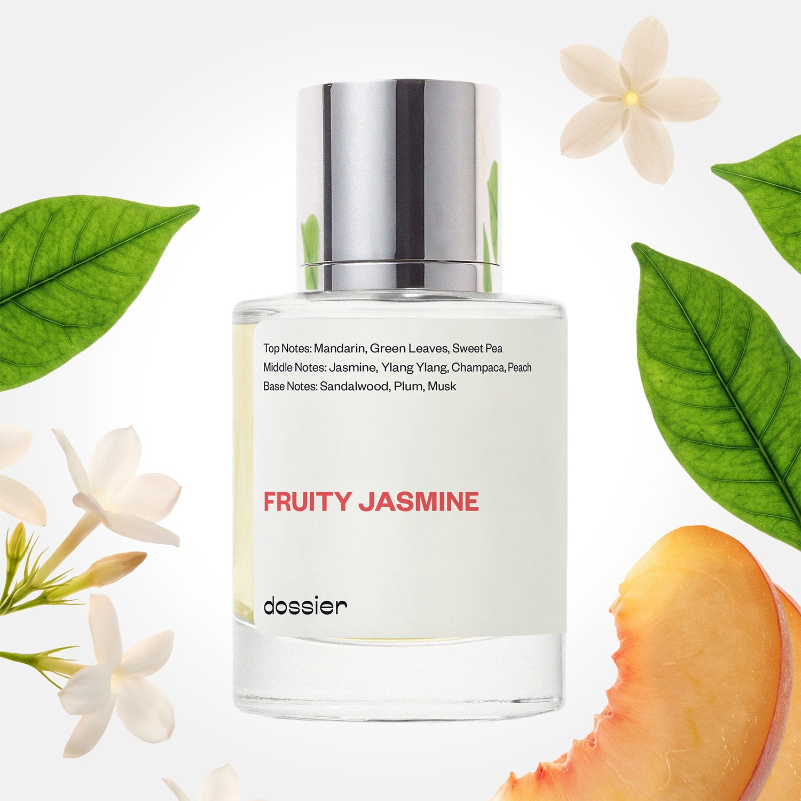

# Fruity Jasmine

- **Dossier Inspired by Dior's J’Adore**
- **URL:** https://dossier.co/products/fruity-jasmine
- **SEO title:** Dior's J’Adore Dupe Perfume: Fruity Jasmine - Dossier Perfumes

## Pricing (sizes)

| Size/SKU | Member price | List price | Currency |
|---|---|---|---|
| 14164829896771 | 26.1 | 29 | USD |
| DOSWA50FRJ | 26.1 | 29 | USD |

## Content (scent notes, about, editorial)

Back Home / Perfumes / Dossier Impressions / FRUITY JASMINE 

Women 

Sold out 

Fruity Jasmine

Eau de Parfum. Size: 50ml / 1.7oz 

members: $26.10

Guest:
$29

Inspired by Dior's J’Adore Inspired by Dior's J’Adore 
Inspired by Dior's J’Adore 

Retail price 138 Crafted in France 
Scent Family: flowery 

Notify Me 

Scent Notes This perfume is: An instant mood booster 
Main Notes:

Green Leaves

Jasmine

Ylang Ylang

Champaca

Peach

top: The first notes you smell 
Mandarin, Green leaves, Sweet Pea 
middle: The heart of the perfume 
Jasmine, Ylang Ylang ,Champaca, Peach 
base: The notes that linger all day 
Sandalwood, Plum, Musk 
ingredients: Alcohol Denat., Fragrance/Parfum, Water/Aqua/Eau, Benzyl Salicylate, Hexyl Cinnamal, Linalyl Acetate, Citronellol, Hydroxycitronellal, Tetramethyl Acetyloctahydronaphthalenes, Alpha-Isomethyl Ionone, Terpineol, Benzyl Benzoate, Linalool, Santalol, Santalum Album (Sandalwood) Oil, Trimethylcyclopentenyl Methylisopentenol, Citrus Aurantium Peel Oil, Limonene, Pinene, Cananga Odorata Oil/Extract, Pelargonium Graveolens Flower Oil, Geraniol, Jasmine Oil/Extract, Terpinolene, Trimethylbenzenepropanol, Beta-Caryophyllene, Vanillin, Isoeugenyl Acetate, Myroxylon Pereirae Oil/Extract, Citral, Benzyl Alcohol, Benzyl Cinnamate, Rose Flower Oil/Extract, Rose Ketones, Geranyl Acetate, Farnesol, Cinnamyl Alcohol, Benzaldehyde, Amyl Cinnamal, Isoeugenol, Cinnamal, Eugenol. 

Vegan
Cruelty-free

Clean ingredients

About Fruity Jasmine (inspired by Dior's J’Adore) presents a blend of explosive green accord and sharp floralcy. It combines jasmine, champaca (a flower similar to magnolia), and ylang-ylang to create an entirely new floral scent that does not exist in nature. This contrasted creation is softened with sweet plum and peach notes laying on a musky sandalwood veil.

Glamorous and feminine, Fruity Jasmine (our impression of Dior's J’Adore) is an opulent, luminous, floral fragrance shimmering on the skin like sunbeams. 

Scent Intensity: Statement 

Concentration: 15%

Gender: Feminine 

Shipping
Free shipping with 2+ items. 

Standard Shipping (with 2+ items) Auto-selected with 2+ items 
FREE 

Standard Shipping Auto-selected under 2 items 
$3.95 

Express shipping: 2 business days Select in checkout 
$19.00 

Returns
Free exchanges for all. Free returns with 

Exchanges
Free exchange, 1 time per order for all.

Returns
D+ members get 1 FREE return per order.
Non-members incur a $3.99/bottle return fee, 1 time per order.
Returns must be postmarked within 30 days of the initial order. Learn More 

FAQs Are these fragrances long lasting? They are designed to be very long lasting, just like designer fragrances, in some cases even longer, depending on the composition. 
When does the new packaging come out? We'll begin rolling out our new packaging across the U.S. and international markets soon! If you want to shop IRL - our new packaging first hits stores on January 11, 2026 at Walmart. Please note that if you are shopping online, you may receive a combination of our current and new packaging while we transition our inventory. 
How will I know what scent I like? We get it, shopping for perfumes online is hard! That's why we created a scent quiz, which will find the perfect scent for you Take the quiz (opens in new tab) 
Unsure about something? Ask us! help@dossier.co 

Details We are not associated or affiliated with the brands mentioned here in any way.
Fruity Jasmine

A Nod to Vivacious Florals

Christian Dior’s J’Adore Parfum (the fragrance that inspired Dossier’s Fruity Jasmine) is a fruity floral fragrance launched in 1999. Infused with a feminine, classy, elegant, and sophisticated aroma, the luxury fragrance that Fruity Jasmine is inspired by is a sensual perfume that charms in a subtle, ladylike manner.

The luxury fragrance that Fruity Jasmine is inspired by is like the perfect bouquet – elegant and meticulously crafted – a floral arrangement made to order. Quite a claim, for sure. But one that we can certainly get behind. Using Comoros ylang-ylang, Damask rose, and Arabian jasmine as its primary ingredients, the luxury Eau de Parfum that Fruity Jasmine is inspired by provides an exotic floral bouquet like no other. With a flawless balance of sensuality and intensity, here is a composition that brings together opposites to produce an alluring, mysterious floral ensemble.

The opening of the luxury fragrance that Fruity Jasmine is inspired by contains a punching essence of bergamot, followed by fruity and fresh flavors of pear and melon. Damask rose, luxurious and exuberant, adds a soft exotic touch with its soft and enveloping fragrance. At this point, the floral bouquet manifests itself in its entirety, displaying a dazzling array of lilies of the valley, tuberose, magnolia, and more. And just before the scent moves into its final act, a chorus of Jasmines bursts forth to envelop the wearer with a sense of sensuality. Then comes the base notes, which are a mixture of woody with a little floral – a pine scent on top of a cedar cream, with hints of vanilla and blueberry.

Overall, we find this to be a sweet, crowd-pleasing scent. There’s a feeling of youth and vitality but with a certain sense of sophistication. Considering that it’s such a luxurious and exceptional fragrance, it’s easy to see why this would be a favorite for formal dinners, black-tie parties, or even work.

The floral scent holds up well to humidity in warmer weather. Many people mistake it for a loud scent, but it’s actually quite soft. This does not, however, mean it is weak. Especially since this is an Eau de parfum, you will still smell J’adore. Expect a full day of wear with this EDP – easily over eight hours of solid performance.

The luxury fragrance that Fruity Jasmine is inspired by is a sophisticated, elegant floral fragrance. And despite being released in 1999, it remains popular to this day. It’s so iconic and distinct that several reinterpretations have been brought to market over the years.

Elegant, feminine, and quintessentially French, Dior’s J’Adore Eau de Parfum exceeds all expectations. It’s the kind of perfume that makes you feel beautiful and confident, as though you’re wearing something extra special (which you are!). You can get a similar experience at a much more affordable price with Dossier’s own Dior J’Adore dupe – Fruity Jasmine. Our replica captures all the luminous, radiant aspects of the iconic floral scent while providing a burst of freshness that is sure to captivate any nose within reach.

Best Layered With Combine 2 of our perfumes to create a third scent with layering, curated by our nose. Learn more 

You Might Love 

4.5 

Rated 4.5 out of 5 stars 

Based on 1,890 reviews 

Reviews 1,890 (tab expanded) Questions 2 (tab collapsed) 

Filters 
Write a Review (Opens in a new window) 

1,890 reviews 
Sort Highest Rating Most Helpful Photos & Videos Most Recent Oldest Lowest Rating Least Helpful 

D 

Danielle 

6/29/26 

Rated 5 out of 5 stars 

5 Stars
INCREDIBLE, I see why this is a best seller!!

Read More Read more about this review 

Was this helpful? Yes, this review from Danielle was helpful. 0 people voted yes No, this review from Danielle was not helpful. 0 people voted no 

AJ 

Abigail J. 
Verified Buyer 

6/28/26 

Rated 5 out of 5 stars 

Love it
I’ve been looking for a somewhat sweet floral and this is it exactly, balanced, fresh, while also being youthful. Lately my perfumes have been giving me headaches unfortunately but this one is headache free! Got many compliments on it.

Read More Read more about this review 

Was this helpful? Yes, this review from Abigail J. was helpful. 0 people voted yes No, this review from Abigail J. was not helpful. 0 people voted no 

DP 

Dossier Perfumes 
6/28/26 
Abigail really happy you found that sweet floral match that plays nicely and stays headache-free! Fresh compliments sound like music. Keep it cool, spritz lightly, and enjoy every moment! ✨

CS 

Cara S. 
Verified Buyer 

6/19/26 

Rated 5 out of 5 stars 

Perfect 
Love Love 💗

Read More Read more about this review 

Was this helpful? Yes, this review from Cara S. was helpful. 0 people voted yes No, this review from Cara S. was not helpful. 0 people voted no 

DP 

Dossier Perfumes 
6/19/26 
Cara, your double love brightens our day! Thanks for sharing those good vibes 😊

MJ 

Marlon J. 
Verified Buyer 

6/13/26 

Rated 5 out of 5 stars 

Love it 
Love It 

Read More Read more about this review 

Was this helpful? Yes, this review from Marlon J. was helpful. 0 people voted yes No, this review from Marlon J. was not helpful. 0 people voted no 

DP 

Dossier Perfumes 
6/13/26 
Marlon, we’re thrilled you’re loving Fruity Jasmine! Thanks for sharing 🙌

UY 

Umber Y. 
Verified Buyer 

6/13/26 

Rated 5 out of 5 stars 

Fruity jasmine 
Loved it so much

Read More Read more about this review 

Was this helpful? Yes, this review from Umber Y. was helpful. 0 people voted yes No, this review from Umber Y. was not helpful. 0 people voted no 

DP 

Dossier Perfumes 
6/13/26 
Umber, we’re so happy Fruity Jasmine hit the spot for you! 😊

Loading... 

Loading... 

Show More 

Inspired by  Baccarat Rouge 540 
Inspired by  Black Opium 
Inspired by  Love, Don't Be Shy 
Inspired by  Good Girl 
Inspired by  Libre 
Inspired by  Flowerbomb 
Inspired by  Light Blue 
Inspired by  Not a Perfume 
Inspired by  Aventus 
Inspired by  Bleu de Chanel 
Inspired by  Mon Paris 
Inspired by  Coco Mademoiselle 
Inspired by  Tom Ford for Men 
Inspired by  For Her 
Inspired by  J'Adore Dior 
Inspired by  Alien 
Inspired by  Black Opium Perfume 
Inspired by  Lost Cherry Perfume 

GET UP TO 30% OFF 

Find us at these retailers. 

Be the first to know. 
Submit 

Shop the following countries. United States 

Discover.
AI Scent Finder 
Blog (opens in new tab) 
Scent Family 
Layering 
Scent Quiz 

Help.
Contact Us 
Returns 
FAQ 
Testimonials 
Accessibility 

More.
Store Locator 
Boutique 
Refer A Friend 
Index 

Download our app now.

Find us at these retailers. 

Be the first to know. 
Submit 

Shop the following countries. United States 

Discover.
AI Scent Finder 
Blog (opens in new tab) 
Scent Family 
Layering 
Scent Quiz 

Help.
Contact Us 
Returns 
FAQ 
Testimonials 
Accessibility 

More.

## Main Image

