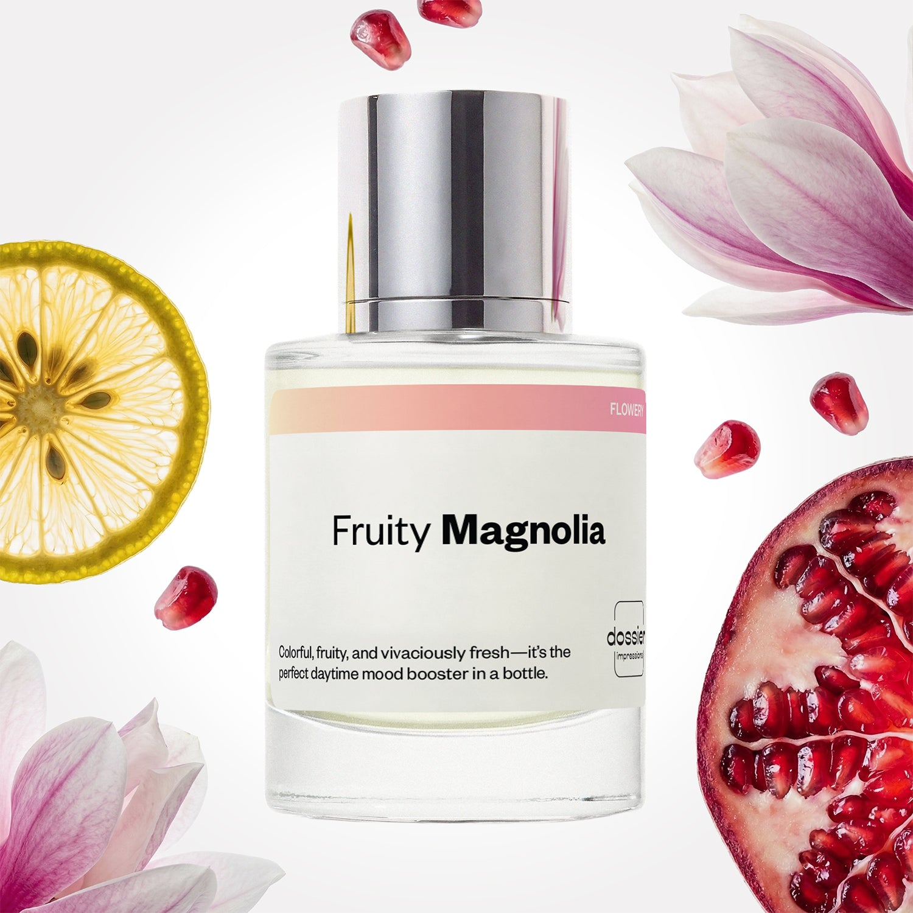

# Fruity Magnolia

- **Dossier Inspired by Versace's Bright Crystal**
- **URL:** https://dossier.co/products/fruity-magnolia
- **SEO title:** Versace's Bright Crystal Dupe Perfume: Fruity Magnolia - Dossier Perfumes

## Pricing (sizes)

| Size/SKU | Member price | List price | Currency |
|---|---|---|---|
| DI50FRMUS | 28.8 | 32 | USD |

## Content (scent notes, about, editorial)

Back Home / Perfumes / Dossier Impressions / FRUITY MAGNOLIA 

Women 

It's back! 

Fruity Magnolia

Eau de Parfum. Size: 50ml / 1.7oz 

members: $28.80

Guest:
$32

Inspired by Versace's Bright Crystal Inspired by Versace's Bright Crystal 
Inspired by Versace's Bright Crystal 

Retail price 92 Crafted in France 
Scent Family: flowery 

Add to Cart 

Scent Notes This perfume is: Lively mimosas at brunch 
Main Notes:

Pomegranate

Yuzu

Aquatic Accord

Magnolia

Peony

Rose

top: The first notes you smell 
Pomegranate, Yuzu, Aquatic accord 
middle: The heart of the perfume 
Magnolia, Peony, Rose 
base: The notes that linger all day 
Amber, Musk, Acajou Wood 
ingredients: Alcohol Denat., Fragrance/Parfum, Water/Aqua/Eau, Tetramethyl Acetyloctahydronaphthalenes, Hexamethylindanopyran, Hydroxycitronellal, Linalool, Citronellol, Pinene, Rose Ketones, Hexadecanolactone, Limonene. 

Vegan
Cruelty-free

Clean ingredients

About At first, Fruity Magnolia (inspired by Versace's Bright Crystal) opens with fizzy pomegranate and yuzu chilled with marine notes. Slowly, the magnolia develops, allowing for the scent to blossom into a radiant bouquet of feminine florals.

Colorful and vivacious, Fruity Magnolia (our impression of Versace's Bright Crystal) is a daytime fragrance that is both powerfully awakening and softly soothing, all at the same time.

Scent Intensity: Significant 

Concentration: 18%

Gender: Feminine 

Shipping
Free shipping with 2+ items. 

Standard Shipping (with 2+ items) Auto-selected with 2+ items 
FREE 

Standard Shipping Auto-selected under 2 items 
$3.95 

Express shipping: 2 business days Select in checkout 
$19.00 

Returns
Free exchanges for all. Free returns with 

Exchanges
Free exchange, 1 time per order for all.

Returns
D+ members get 1 FREE return per order.
Non-members incur a $3.99/bottle return fee, 1 time per order.
Returns must be postmarked within 30 days of the initial order. Learn More 

FAQs Are these fragrances long lasting? They are designed to be very long lasting, just like designer fragrances, in some cases even longer, depending on the composition. 
When does the new packaging come out? We'll begin rolling out our new packaging across the U.S. and international markets soon! If you want to shop IRL - our new packaging first hits stores on January 11, 2026 at Walmart. Please note that if you are shopping online, you may receive a combination of our current and new packaging while we transition our inventory. 
How will I know what scent I like? We get it, shopping for perfumes online is hard! That's why we created a scent quiz, which will find the perfect scent for you Take the quiz (opens in new tab) 
Unsure about something? Ask us! help@dossier.co 

Details We are not associated or affiliated with the brands mentioned here in any way.
Fruity Magnolia

The Scent of Floral Dreams

From florals to fruity florals to woodsy notes to exotic spices, fragrances are at the center of our olfactory experience. And why shouldn’t they be? Perfumes define our identities, reinforce our memories and distinguish our personalities. The modern woman’s beauty routine surely wouldn’t be complete without them.

But there’s something else you wouldn’t want to skip out on when it comes to your beauty regime. Enter: Versace’s Bright Crystal, the luxury perfume that inspired Dossier’s Fruity Magnolia.

From the genius minds that brought you Dylan Blue and Eros, Versace Bright Crystal’s velvety scent is a must-have for any woman’s collection and just might be one of the best feminine perfumes we’ve ever come across. Simple, gentle, and oh-so-subtle — it’s one of those scents that when you try it for the first time, you wonder why you haven’t done that sooner.

This alluring feminine fragrance from renowned perfumer Alberto Morillas is filled with fruity notes entwined with delightful floral notes, further enhanced with hints of wood. The opening flavors of the luxury perfume that Fruity Magnolia is inspired by are refreshing, with slightly aquatic notes, along with cold yuzu and fizzy pomegranate. It’s mouth-wateringly juicy, though a bit tart to begin with. But give it a few minutes, and it bursts into a glistening bouquet of ultra-feminine peony, lotus, and magnolia middle notes. In the dry down, the floral notes become powdery with musk and blend with the amber and mahogany to form this tender, woody scent.

Versace did a great job of preventing the luxury fragrance that Fruity Magnolia is inspired by from being overly floral or fruity. The citrus and aquatic notes provide a sense of balance, providing a nice contrast between energetic and calm.

The luxury perfume that Fruity Magnolia is inspired by is as unsophisticated as they come. And that’s a good thing. Versace Bright Crystal’s essence is rooted in a certain level of simplicity that makes it so easy to use. Clean and energetic, there’s no fuss or unnecessary complexity here. Instead, it sticks to its original purpose — being a floral scent that leaves any woman smelling gorgeous for hours on end. 

Fruity Magnolia, our dupe of this luxury fragrance, provides a similar effect. Our take on the iconic perfume for women includes a unique combination of natural fruit flavors to create a refreshing and fresh scent. Vibrant and colorful, Dossier’s replica is the perfect gift for anyone who yearns for a nostalgic trip back in time — to an era of innocent youth and playful naivety.

Best Layered With Combine 2 of our perfumes to create a third scent with layering, curated by our nose. Learn more 

You Might Love 

4.5 

Rated 4.5 out of 5 stars 

Based on 1,600 reviews 

Reviews 1,600 (tab expanded) Questions 1 (tab collapsed) 

Filters 
Write a Review (Opens in a new window) 

1,600 reviews 
Sort Highest Rating Most Helpful Photos & Videos Most Recent Oldest Lowest Rating Least Helpful 

RS 

Rebecca S. 
Verified Buyer 

6/21/26 

Rated 5 out of 5 stars 

In love with Dossier
I love that I’ve found dupes of favorite scents that last. This smells fantastic and lasts all day. 

Read More Read more about this review 

Was this helpful? Yes, this review from Rebecca S. was helpful. 0 people voted yes No, this review from Rebecca S. was not helpful. 0 people voted no 

DP 

Dossier Perfumes 
6/21/26 
Rebecca! We’re thrilled our scents hit the mark and stick with you all day. Happy spritzing!

H 

Heidi 
Verified Reviewer 

6/1/26 

Rated 5 out of 5 stars 

So good!
I love Bright Crystal but it's so expensive and doesn't last long on me. This is so good - and smells a bit stronger, at least on me. And it lasts a long time on my skin! Win-win! 

Read More Read more about this review 

Was this helpful? Yes, this review from Heidi was helpful. 0 people voted yes No, this review from Heidi was not helpful. 0 people voted no 

DP 

Dossier Perfumes 
6/1/26 
Heidi, we’re so happy you’re loving our version! Great to hear it’s hanging around all day. For extra pop, try layering on pulse points, you’ve got longevity down! Enjoy! 😊

V 

Valerie 

5/11/26 

Rated 5 out of 5 stars 

5 Stars
Love it!

Read More Read more about this review 

Was this helpful? Yes, this review from Valerie was helpful. 0 people voted yes No, this review from Valerie was not helpful. 0 people voted no 

AD 

Ashley D. 
Verified Buyer 

5/6/26 

Rated 5 out of 5 stars 

5 star
So
Good

Read More Read more about this review 

Was this helpful? Yes, this review from Ashley D. was helpful. 0 people voted yes No, this review from Ashley D. was not helpful. 0 people voted no 

DP 

Dossier Perfumes 
5/6/26 
Thanks Ashley! We’re so happy you love it and keeping the good vibes.

PN 

Pooja N. 
Verified Buyer 

5/5/26 

Rated 5 out of 5 stars 

Freaking GREAT
This smells exactly the same as the original.
90-95% similar to the original.
Great dupe. Would buy again.

Read More Read more about this review 

Was this helpful? Yes, this review from Pooja N. was helpful. 0 people voted yes No, this review from Pooja N. was not helpful. 1 person voted no 

DP 

Dossier Perfumes 
5/5/26 
Pooja wow thanks for letting us know it matches so closely! It’s awesome to hear you’d pick it again 🙌

Loading... 

Loading... 

Show More 

Inspired by  Baccarat Rouge 540 
Inspired by  Black Opium 
Inspired by  Love, Don't Be Shy 
Inspired by  Good Girl 
Inspired by  Libre 
Inspired by  Flowerbomb 
Inspired by  Light Blue 
Inspired by  Not a Perfume 
Inspired by  Aventus 
Inspired by  Bleu de Chanel 
Inspired by  Mon Paris 
Inspired by  Coco Mademoiselle 
Inspired by  Tom Ford for Men 
Inspired by  For Her 
Inspired by  J'Adore Dior 
Inspired by  Alien 
Inspired by  Black Opium Perfume 
Inspired by  Lost Cherry Perfume 

GET UP TO 30% OFF 

Find us at these retailers. 

Be the first to know. 
Submit 

Shop the following countries. United States 

Discover.
AI Scent Finder 
Blog (opens in new tab) 
Scent Family 
Layering 
Scent Quiz 

Help.
Contact Us 
Returns 
FAQ 
Testimonials 
Accessibility 

More.
Store Locator 
Boutique 
Refer A Friend 
Index 

Download our app now.

Find us at these retailers. 

Be the first to know. 
Submit 

Shop the following countries. United States 

Discover.
AI Scent Finder 
Blog (opens in new tab) 
Scent Family 
Layering 
Scent Quiz 

Help.
Contact Us 
Returns 
FAQ 
Testimonials 
Accessibility 

More.

## Main Image

