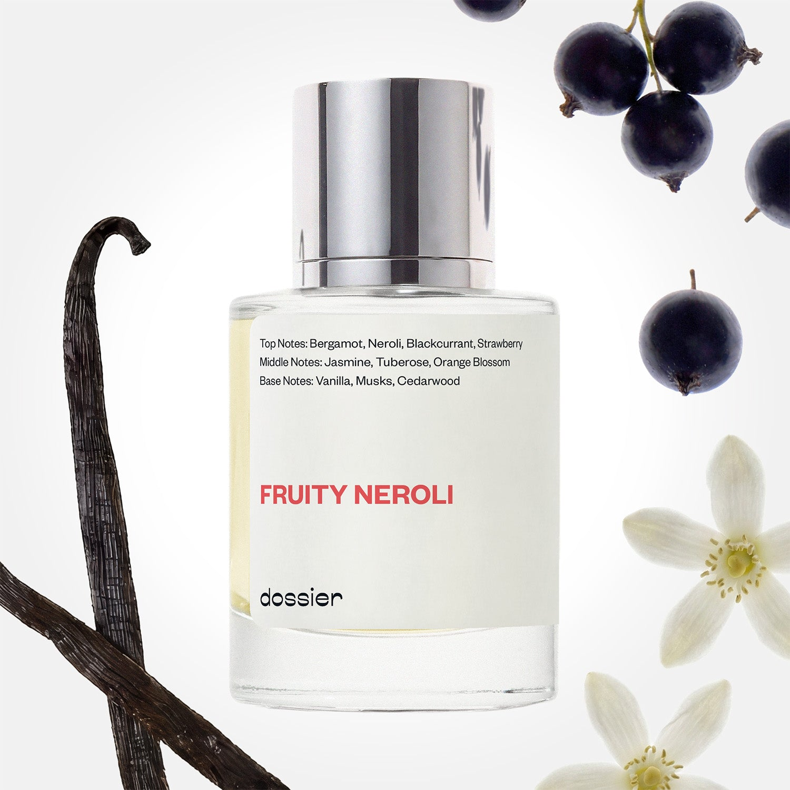

# Fruity Neroli

- **Dossier Inspired by Armani's My Way**
- **URL:** https://dossier.co/products/fruity-neroli
- **SEO title:** Armani's My Way Dupe Perfume : Fruity Neroli - Dossier Perfumes

## Pricing (sizes)

| Size/SKU | Member price | List price | Currency |
|---|---|---|---|
| 39443195920451 | 26.1 | 29 | USD |

## Content (scent notes, about, editorial)

Back Home / Perfumes / Dossier Impressions / FRUITY NEROLI 

Women 

Fruity Neroli

Eau de Parfum. Size: 50ml / 1.7oz 

members: $26.10

Guest:
$29

Inspired by Giorgio Armani's My Way Inspired by Giorgio Armani's My Way 
Inspired by Giorgio Armani's My Way 

Retail price 130 Crafted in France 
Scent Family: flowery 

Add to Cart 

Scent Notes This perfume is: Sweet sunshine in a bottle 
Main Notes:

Bergamot

Neroli

Blackcurrant

Strawberry

Orange Blossom

Vanilla

top: The first notes you smell 
Bergamot, Neroli, Blackcurrant, Strawberry 
middle: The heart of the perfume 
Jasmine, Tuberose, Orange Blossom 
base: The notes that linger all day 
Vanilla, Musks, Cedarwood 
ingredients: Alcohol Denat., Fragrance/Parfum, Water/Aqua/Eau, Tetramethyl Acetyloctahydronaphthalenes, Linalool, Citrus Aurantium Bergamia (Bergamot) Peel Oil, Benzyl Salicylate, Hydroxycitronellal, Linalyl Acetate, Limonene, Juniperus Virginiana Oil, Geranyl Acetate, Hexyl Cinnamal, Geraniol, Citronellol, Pinene, Trimethylcyclopentenyl Methylisopentenol, Vanillin, Citrus Aurantium Peel Oil, Eugenol, Citral, Beta-Caryophyllene, Cananga Odorata Oil/Extract, Terpinolene, Rose Ketones, Jasmine Oil/Extract, Terpineol, Alpha-Isomethyl Ionone, Methyl Salicylate, Benzyl Benzoate, Isoeugenol, Benzyl Alcohol, Farnesol, Alpha-Terpinene, Citrus Limon (Lemon) Peel Oil. 

Vegan
Cruelty-free

Clean ingredients

About Fruity Neroli (inspired by Armani's My Way) opens on a lively fruity accord dominated by strawberry and blackcurrant. However, the real heart of the fragrance is about orange blossom and neroli, both coming from the flowers of the bitter orange tree. Vanilla, on the base, gently softens the fragrance.

Feminine, radiant, Fruity Neroli (our impression of Armani's My Way) is a very beautiful staging of this magnificent key flower of perfumery that neroli is. 

Scent Intensity: Statement 

Concentration: 18%

Gender: Feminine 

Shipping
Free shipping with 2+ items. 

Standard Shipping (with 2+ items) Auto-selected with 2+ items 
FREE 

Standard Shipping Auto-selected under 2 items 
$3.95 

Express shipping: 2 business days Select in checkout 
$19.00 

Returns
Free exchanges for all. Free returns with 

Exchanges
Free exchange, 1 time per order for all.

Returns
D+ members get 1 FREE return per order.
Non-members incur a $3.99/bottle return fee, 1 time per order.
Returns must be postmarked within 30 days of the initial order. Learn More 

FAQs Are these fragrances long lasting? They are designed to be very long lasting, just like designer fragrances, in some cases even longer, depending on the composition. 
When does the new packaging come out? We'll begin rolling out our new packaging across the U.S. and international markets soon! If you want to shop IRL - our new packaging first hits stores on January 11, 2026 at Walmart. Please note that if you are shopping online, you may receive a combination of our current and new packaging while we transition our inventory. 
How will I know what scent I like? We get it, shopping for perfumes online is hard! That's why we created a scent quiz, which will find the perfect scent for you Take the quiz (opens in new tab) 
Unsure about something? Ask us! help@dossier.co 

Details We are not associated or affiliated with the brands mentioned here in any way.
Fruity Neroli

An enchantment of innocence and mystery

A seamless blend of sweetness and woody undertones, Giorgio Armani’s My Way Eau de Parfum (the fragrance that Dossier’s Fruity Neroli is inspired by) is where luxury and indulgence converge. Arriving on the shelves in 2020, this perfume combines gorgeous floral orange blossom and tangy citrus top tones with mysteriously deep and musky base notes of Indian tuberose and cedar. This harmoniously flawless mix creates a scent that is worn to be transported to a delightful field of flowers where the golden sunset kisses the warm summer’s evening.

The luxury fragrance Fruity Neroli is inspired by introduces the classic scent of the American dream to the contemporary and modern where they flirt in a passionate love affair. The enticingly appealing hints of jasmine, cedarwood, and citrusy blossom allow for sensuality, freedom, and innocence all in one spritz. This feminine blend of scents is an effortless creation for any time of the day, as well as any occasion. The perfect match for this perfume is an unsuspected dark horse –  evoking innocence during the working hours of the day and romance at dusk. Mirroring an escape to Egypt with its distinct notes of bergamot, the luxury fragrance Fruity Neroli is inspired by grants entry to a meditative state of peace when you realize you are wearing nothing except the elegance and endearing mystery of the East.

The sleek simplicity of the rose-tinted Armani My Way Eau de Parfum bottle, paired with the striking royal blue cap, stands with a quiet confidence that would simply demand you wear it.

If you are browsing for this timeless marriage of the classic and modern, Giorgio Armani’s My Way Eau de Parfum comes in 4 sizes, ranging from 10 ml to 90 ml. Being sold at the same price point by most online retailers, this perfume starts at $30.00 for a 10 ml bottle and makes its way to $128 for a 90 ml bottle. Similarly, the Intense version of the perfume ranges between $30.00-$132.00 for the same 4 sizes. To get a 1.4 ml sample spray, it will cost you $7.88. The 2-piece gift set is sold at $82.00 and the 3-piece gift set which includes the lotion and shower gel goes for $135.00. You could also get the 50 ml bottle and refill set for $228.00.

To find a perfume similar in elegance to the Armani My Way perfume but at a cheaper price point, look no further than Dossier’s Fruity Neroli. Our dupe pairs fruity top tones with vanilla base notes to create a delightful thrill of sensuality and innocence. Our Fruity Neroli is a carefully crafted perfume that emanates a sensational fusion of citrus and orange, along with deeper notes to pleasure the senses. Our creation offers an experience of enchantment, while lacing in the delicious strawberry and blackcurrant hints of fruitiness.

You Might Love 

4.5 

Rated 4.5 out of 5 stars 

Based on 1,376 reviews 

Reviews 1,376 (tab expanded) Questions 1 (tab collapsed) 

Filters 
Write a Review (Opens in a new window) 

1,376 reviews 
Sort Highest Rating Most Helpful Photos & Videos Most Recent Oldest Lowest Rating Least Helpful 

CL 

Celia L. 
Verified Buyer 

7/1/26 

Rated 5 out of 5 stars 

Fruity Neroli
This Fragrance is fascinating I am in love with this excellent Fragrance 👍 

Read More Read more about this review 
Translated from Portuguese (Brazil) Show original 

Was this helpful? Yes, this review from Celia L. was helpful. 0 people voted yes No, this review from Celia L. was not helpful. 0 people voted no 

DP 

Dossier Perfumes 
7/1/26 
Celia, que bom saber que essa fragrância te conquistou, obrigada pelo carinho! 😊

MM 

Marquetta M. 
Verified Buyer 

6/26/26 

Rated 5 out of 5 stars 

Girgeous scent
It was at a good price. The scent was long lasting. Will purchase again 

Read More Read more about this review 

Was this helpful? Yes, this review from Marquetta M. was helpful. 0 people voted yes No, this review from Marquetta M. was not helpful. 0 people voted no 

DP 

Dossier Perfumes 
6/26/26 
Marquetta, we’re thrilled you found such a great price and that it lasts all day 🌸

V 

Venus 

6/18/26 

Rated 5 out of 5 stars 

Perfect Neroli Aroma
I love this one by itself, but love it layered with Citrus Neroli!!! 🥰

Read More Read more about this review 

Was this helpful? Yes, this review from Venus was helpful. 0 people voted yes No, this review from Venus was not helpful. 0 people voted no 

DP 

Dossier Perfumes 
6/18/26 
Venus, love that you’re mixing it up 😊 Fruity Neroli shines on its own, and layering with Citrus Neroli sounds awesome!

JF 

Julie F. 
Verified Buyer 

6/14/26 

Rated 5 out of 5 stars 

Spot on!
This is so much like "my way"... love it

Read More Read more about this review 

Was this helpful? Yes, this review from Julie F. was helpful. 0 people voted yes No, this review from Julie F. was not helpful. 0 people voted no 

DP 

Dossier Perfumes 
6/14/26 
Julie, so happy it’s giving you those My Way vibes—cheers to love at first spritz! ✨

UY 

Umber Y. 
Verified Buyer 

6/13/26 

Rated 5 out of 5 stars 

Fruity Neroli
Loved it so much

Read More Read more about this review 

Was this helpful? Yes, this review from Umber Y. was helpful. 0 people voted yes No, this review from Umber Y. was not helpful. 0 people voted no 

DP 

Dossier Perfumes 
6/13/26 
Umber, we’re so happy you loved it, thanks for sharing your joy! 😊

Loading... 

Loading... 

Show More 

Inspired by  Baccarat Rouge 540 
Inspired by  Black Opium 
Inspired by  Love, Don't Be Shy 
Inspired by  Good Girl 
Inspired by  Libre 
Inspired by  Flowerbomb 
Inspired by  Light Blue 
Inspired by  Not a Perfume 
Inspired by  Aventus 
Inspired by  Bleu de Chanel 
Inspired by  Mon Paris 
Inspired by  Coco Mademoiselle 
Inspired by  Tom Ford for Men 
Inspired by  For Her 
Inspired by  J'Adore Dior 
Inspired by  Alien 
Inspired by  Black Opium Perfume 
Inspired by  Lost Cherry Perfume 

GET UP TO 30% OFF 

Find us at these retailers. 

Be the first to know. 
Submit 

Shop the following countries. United States 

Discover.
AI Scent Finder 
Blog (opens in new tab) 
Scent Family 
Layering 
Scent Quiz 

Help.
Contact Us 
Returns 
FAQ 
Testimonials 
Accessibility 

More.
Store Locator 
Boutique 
Refer A Friend 
Index 

Download our app now.

Find us at these retailers. 

Be the first to know. 
Submit 

Shop the following countries. United States 

Discover.
AI Scent Finder 
Blog (opens in new tab) 
Scent Family 
Layering 
Scent Quiz 

Help.
Contact Us 
Returns 
FAQ 
Testimonials 
Accessibility 

More.

## Main Image

