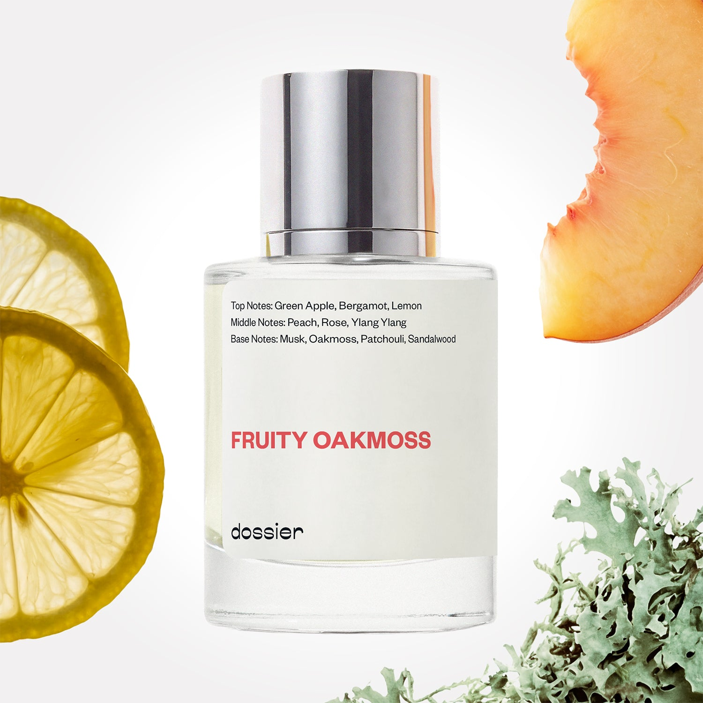

# Fruity Oakmoss

- **Dossier Inspired by Creed's Aventus For Her**
- **URL:** https://dossier.co/products/fruity-oakmoss
- **SEO title:** Creed's Aventus For Her Dupe Perfume: Fruity Oakmoss - Dossier Perfumes

## Pricing (sizes)

| Size/SKU | Member price | List price | Currency |
|---|---|---|---|
| FROA050IMUSP2XX | 44.1 | 49 | USD |

## Content (scent notes, about, editorial)

Back Home / Perfumes / Dossier Impressions / FRUITY OAKMOSS 

Women 

Sold out 

Fruity Oakmoss

Eau de Parfum. Size: 50ml / 1.7oz 

members: $44.10

Guest:
$49

Inspired by Creed's Aventus For Her Inspired by Creed's Aventus For Her 
Inspired by Creed's Aventus For Her 

Retail price 445 Crafted in France 
Scent Family: gourmand 

Notify Me 

Scent Notes This perfume is: A rich glass of red wine 
Main Notes:

Green Apple

Bergamot

Lemon

Musks

Oakmoss

Patchouli

Sandalwood

top: The first notes you smell 
Green Apple, Bergamot, Lemon 
middle: The heart of the perfume 
Peach, Rose, Ylang 
base: The notes that linger all day 
Musk, Oakmoss, Patchouli, Sandalwood 
ingredients: Alcohol Denat., Fragrance/Parfum, Water/Aqua/Eau, Citrus Limon (Lemon) Peel Oil, Limonene, Linalyl Acetate, Pogostemon Cablin Oil, Tetramethyl Acetyloctahydronaphthalenes, Juniperus Virginiana Oil, Linalool, Pinene, Citrus Aurantium Peel Oil, Citronellol, Beta-Caryophyllene, Citral, Geraniol, Hexyl Cinnamal, Geranyl Acetate, Terpinolene, Terpineol, Hydroxycitronellal, Alpha-Terpinene, Eugenol, Rose Ketones, Benzyl Alcohol. 

Vegan
Cruelty-free

Clean ingredients

About Fruity Oakmoss (inspired by Creed's Aventus For Her) starts with a burst of citrus freshness and fruity crispiness. After a while, it turns into the most exclusive perfume writing structure, the Chypre (a blend of bergamot, rose, oakmoss and patchouli). 

Fresh, refined, Fruity Oakmoss (our impression of Creed's Aventus For Her) - as its masculine counterpart Musky Oakmoss - has a kind of British phlegm, hiding high sophistication under a casual appearance.

Scent Intensity: Significant 

Concentration: 15%

Gender: Feminine 

Shipping
Free shipping with 2+ items. 

Standard Shipping (with 2+ items) Auto-selected with 2+ items 
FREE 

Standard Shipping Auto-selected under 2 items 
$3.95 

Express shipping: 2 business days Select in checkout 
$19.00 

Returns
Free exchanges for all. Free returns with 

Exchanges
Free exchange, 1 time per order for all.

Returns
D+ members get 1 FREE return per order.
Non-members incur a $3.99/bottle return fee, 1 time per order.
Returns must be postmarked within 30 days of the initial order. Learn More 

FAQs Are these fragrances long lasting? They are designed to be very long lasting, just like designer fragrances, in some cases even longer, depending on the composition. 
When does the new packaging come out? We'll begin rolling out our new packaging across the U.S. and international markets soon! If you want to shop IRL - our new packaging first hits stores on January 11, 2026 at Walmart. Please note that if you are shopping online, you may receive a combination of our current and new packaging while we transition our inventory. 
How will I know what scent I like? We get it, shopping for perfumes online is hard! That's why we created a scent quiz, which will find the perfect scent for you Take the quiz (opens in new tab) 
Unsure about something? Ask us! help@dossier.co 

Details We are not associated or affiliated with the brands mentioned here in any way.
Fruity Oakmoss

A delightful mellow fruitiness

It’s never a dull moment with Creed Aventus For Her, the resplendent Eau de Parfum that reflects the drive, poise, and innate elegance of the motivated woman. Evoke the spirit of femininity with this olfactory celebration of womanhood – and command respect everywhere you go.

This floral perfume opens with notes of bergamot, lemon, green apple, pink pepper, patchouli, and violet – making it one of the most endearing fragrances of all time. You should also expect middle notes of musk, rose, and styrax working together to enliven your olfactory senses – before a delicious blend of peach, lilacs, amber, blackcurrant, and ylang-ylang brings it all down. Creed Aventus For Her envelops its wearer in a delightful mellow fruitiness that boosts the mood and lifts the spirits. It is a cult icon that embodies the very essence of freshness.

There are only a few perfumes as addictive as this floral – a long-standing favorite that promises a mysterious yet familiar scent of feminine radiance, glitz, and glamor. This legendary perfume is a slice of luxury and one that is perfect for every occasion. It is a bottled shot of adrenaline that imbues you with the strength to brave the odds. It is gentle, sweet, and a perfect option for those who wish to own a designer piece.

Every woman needs a dazzling and decadent feminine fragrance – and there’s no better choice than Creed Aventus For Her. A classic fragrance and one that is proudly complex, provocative, and beautiful, this scent flips the script on how traditional fragrances are perceived.

Discover the rising bamboo heights of Arashiyama Grovehills and inhale their majesty as you wear this scent. Just spray, close your eyes and enjoy the ride to the blue hydrangeas and gentle waterfalls of the Azores.

If you’re down for a Creed Aventus For Her dupe that inspires a sense of tranquility comparable to walking through the lavender fields of Provence, consider Dossier’s Fruity Oakmoss. This fragrance is a powerful and compelling take on ease and versatility, and one that blooms with citrus freshness and fruity crispiness. It features effervescent notes of bergamot, rose, and patchouli, as well as fresh, refined oakmoss. The result is a golden, breezy fragrance that soothes the soul, gratifies the heart, and leaves a feeling of utter satisfaction. If you want a sweet blast of glamour that lingers for hours, don’t second-guess yourself and try this one.

Best Layered With Combine 2 of our perfumes to create a third scent with layering, curated by our nose. Learn more 

You Might Love 

4.1 

Rated 4.1 out of 5 stars 

Based on 512 reviews 

Reviews 512 (tab expanded) Questions 1 (tab collapsed) 

Filters 
Write a Review (Opens in a new window) 

512 reviews 
Sort Highest Rating Most Helpful Photos & Videos Most Recent Oldest Lowest Rating Least Helpful 

L 

Lakesha 
Verified Buyer 

12/12/25 

Rated 5 out of 5 stars 

5 Stars
These dupes smell so close to the actual designer it’s insane!!!!

Read More Read more about this review 

Was this helpful? Yes, this review from Lakesha was helpful. 0 people voted yes No, this review from Lakesha was not helpful. 0 people voted no 

DP 

Dossier Perfumes 
12/12/25 
Isn’t that wild! We love bringing that luxe vibe without the luxe markup 😊

L 

Lakesha 

12/12/25 

Rated 5 out of 5 stars 

5 Stars
These dupes smell so close to the actual designer it’s insane!!!!

Read More Read more about this review 

Was this helpful? Yes, this review from Lakesha was helpful. 0 people voted yes No, this review from Lakesha was not helpful. 0 people voted no 

RK 

Raquel K. 

Verified Buyer 

12/11/25 

Rated 5 out of 5 stars 

ALL of the purchases are BOMB. com!!
I purchased a few of your scents and I absolutely love them. I highly recommend your products to everyone who is in the hunt o amazing, lasting frangraces!!!

Read More Read more about this review 

Was this helpful? Yes, this review from Raquel K. was helpful. 0 people voted yes No, this review from Raquel K. was not helpful. 0 people voted no 

DP 

Dossier Perfumes 
12/11/25 
Raquel, thanks a ton! We’re thrilled you’re loving your new scents and sharing the love. Enjoy those lasting vibes, and happy spritzing, can’t wait to hear what you try next 😊

N 

Nakia 
Verified Buyer 

12/8/25 

Rated 5 out of 5 stars 

5 Stars
One of my favs!

Read More Read more about this review 

Was this helpful? Yes, this review from Nakia was helpful. 0 people voted yes No, this review from Nakia was not helpful. 0 people voted no 

DP 

Dossier Perfumes 
12/10/25 
Yesss Nakia, we’re thrilled Fruity Oakmoss made your favorites list! Thanks a ton 😊

N 

Nakia 

12/8/25 

Rated 5 out of 5 stars 

5 Stars
One of my favs!

Read More Read more about this review 

Was this helpful? Yes, this review from Nakia was helpful. 0 people voted yes No, this review from Nakia was not helpful. 0 people voted no 

Loading... 

Loading... 

Show More 

Inspired by  Baccarat Rouge 540 
Inspired by  Black Opium 
Inspired by  Love, Don't Be Shy 
Inspired by  Good Girl 
Inspired by  Libre 
Inspired by  Flowerbomb 
Inspired by  Light Blue 
Inspired by  Not a Perfume 
Inspired by  Aventus 
Inspired by  Bleu de Chanel 
Inspired by  Mon Paris 
Inspired by  Coco Mademoiselle 
Inspired by  Tom Ford for Men 
Inspired by  For Her 
Inspired by  J'Adore Dior 
Inspired by  Alien 
Inspired by  Black Opium Perfume 
Inspired by  Lost Cherry Perfume 

GET UP TO 30% OFF 

Find us at these retailers. 

Be the first to know. 
Submit 

Shop the following countries. United States 

Discover.
AI Scent Finder 
Blog (opens in new tab) 
Scent Family 
Layering 
Scent Quiz 

Help.
Contact Us 
Returns 
FAQ 
Testimonials 
Accessibility 

More.
Store Locator 
Boutique 
Refer A Friend 
Index 

Download our app now.

Find us at these retailers. 

Be the first to know. 
Submit 

Shop the following countries. United States 

Discover.
AI Scent Finder 
Blog (opens in new tab) 
Scent Family 
Layering 
Scent Quiz 

Help.
Contact Us 
Returns 
FAQ 
Testimonials 
Accessibility 

More.

## Main Image

