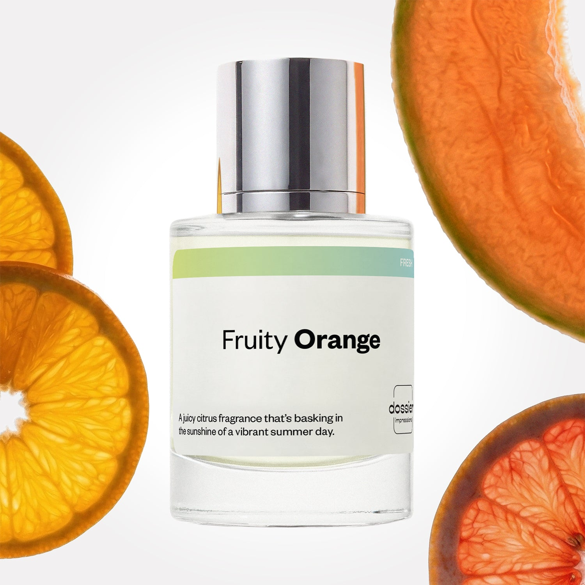

# Fruity Orange

- **Dossier Inspired by Clinique's Happy**
- **URL:** https://dossier.co/products/fruity-orange
- **SEO title:** Clinique's Happy Dupe Perfume: Fruity Orange - Dossier Perfumes

## Pricing (sizes)

| Size/SKU | Member price | List price | Currency |
|---|---|---|---|
| DI50FRORUS | 28.8 | 32 | USD |

## Content (scent notes, about, editorial)

Back Home / Perfumes / Dossier Impressions / FRUITY ORANGE 

Women 

It's back! 

Fruity Orange

Eau de Parfum. Size: 50ml / 1.7oz 

members: $28.80

Guest:
$32

Inspired by Clinique's Happy Inspired by Clinique's Happy 
Inspired by Clinique's Happy 

Retail price 85 Crafted in France 
Scent Family: fresh 

Add to Cart 

Scent Notes This perfume is: Juicy, a sunny summer day 
Main Notes:

Grapefruit

Bergamot

Tangerine

Melon

Orange

Lily

Green Apple

Magnolia

top: The first notes you smell 
Grapefruit, Bergamot, Tangerine, Melon 
middle: The heart of the perfume 
Orange, Lily, Green Apple, Magnolia 
base: The notes that linger all day 
Jasmine, Musks, Plum 
ingredients: Alcohol Denat., Fragrance/Parfum, Water/Aqua/Eau, Hexamethylindanopyran, Hydroxycitronellal, Limonene, Citrus Aurantium Peel Oil, Citronellol, Benzyl Alcohol, Alpha-Isomethyl Ionone, Citrus Aurantium Bergamia (Bergamot) Peel Oil, Geranyl Acetate, Linalool, Dimethyl Phenethyl Acetate, Jasmine Oil/Extract, Linalyl Acetate, Rose Ketones, Citrus Aurantium Flower Oil, Pinene, Citral, Hexadecanolactone, Terpineol, Geraniol, Benzyl Benzoate, Terpinolene, Farnesol. 

Vegan
Cruelty-free

Clean ingredients

About Fruity Orange (inspired by Clinique's Happy) features the aquatic coolness of watermelon, the zesty feeling of orange, grapefruit, and tangerine, the crunchy freshness of green apple, and the floral transparency of lily and magnolia to create a colorful and effervescent fragrance.
Lively and sparkling, Fruity Orange (our impression of Clinique's Happy) is a classic to rediscover, with an incredibly long-lasting burst of fizz, giving us a genuine feeling of joy and positivity. 

Scent Intensity: Significant 

Concentration: 20%

Gender: Feminine 

Shipping
Free shipping with 2+ items. 

Standard Shipping (with 2+ items) Auto-selected with 2+ items 
FREE 

Standard Shipping Auto-selected under 2 items 
$3.95 

Express shipping: 2 business days Select in checkout 
$19.00 

Returns
Free exchanges for all. Free returns with 

Exchanges
Free exchange, 1 time per order for all.

Returns
D+ members get 1 FREE return per order.
Non-members incur a $3.99/bottle return fee, 1 time per order.
Returns must be postmarked within 30 days of the initial order. Learn More 

FAQs Are these fragrances long lasting? They are designed to be very long lasting, just like designer fragrances, in some cases even longer, depending on the composition. 
When does the new packaging come out? We'll begin rolling out our new packaging across the U.S. and international markets soon! If you want to shop IRL - our new packaging first hits stores on January 11, 2026 at Walmart. Please note that if you are shopping online, you may receive a combination of our current and new packaging while we transition our inventory. 
How will I know what scent I like? We get it, shopping for perfumes online is hard! That's why we created a scent quiz, which will find the perfect scent for you Take the quiz (opens in new tab) 
Unsure about something? Ask us! help@dossier.co 

Details We are not associated or affiliated with the brands mentioned here in any way.
Fruity Orange

Where nature meets emotion

A wonderful sense of tranquility. An odd sense of ease. A genuine guarantee of peace. That is what you get from living in harmony with nature. But how do you get there? By sporting the Clinique Happy Perfume Spray, Dossier’s inspiration for our Fruity Orange fragrance.

The fragrance that Fruity Orange is inspired by is a perfectly struck balance between nature and emotion. It mixes a plethora of florals, a dash of citrus, and a touch of love into a sweet-scented nectar that grants you the peace of a sunny, happy day. It essentially imbues you with the gracefulness of ruby red grapefruit, the divineness of spring mimosa, and the sublime finish of a Hawaiian wedding flower.

Tracing its roots back to 1997, the fragrance that inspired Fruity Orange is inspired by is the brainchild of Jean-Claude Delville and Rodrigo Flores-Roux, two master perfumers known for producing some of the world’s most acclaimed and timeless esters. The fragrance that Fruity Orange is inspired by was by no means the least of their creations, as it garnered a dozen 5-star reviews just moments after its launch and went on to win the prestigious 1998 FiFi Award.

As far as notes go, the fragrance that Fruity Orange is inspired by is a spicy, crisp concoction comprising the freshest of plums, the softest of bergamots, and the tastiest of accords. The perfume’s exotic floral heart is also composed of a delectable mix of freesia, lily, rose, and morning orchid. Plus, there’s musk and amber in the base. 

An entrancing fragrance, it takes only a little Clinique Happy on your pulse points to make you the center of attraction – the feast of all eyes in the room. It is an oriental floral fragrance that lets you portray your ideal self without fear. So, step into the light and make a bold statement as this morale-boosting fragrance urges you on. It’s perfect for a date night, ideal for quiet parties, and just right for sexy after-midnight beverages. Wear it and be happy. Wear it to amp up your self-confidence. Wear it and celebrate the romantic side of happiness.

For a Clinique Happy Perfume Spray dupe that comes close to the real deal at more than half, try Dossier’s Fruity Orange. Our Clinique Happy Perfume Spray replica is scented with the zesty sense of watermelon, the crisp freshness of orange, grapefruit, and tangerine, the flowery clarity of green apple, and the floral transparency of lily and magnolia. Sport it and experience a waking dream – and one that is more pleasant than taking a swim in the tranquil waters of Lake Erie. 

You Might Love 

4.3 

Rated 4.3 out of 5 stars 

Based on 952 reviews 

Reviews 952 (tab expanded) Questions 2 (tab collapsed) 

Filters 
Write a Review (Opens in a new window) 

952 reviews 
Sort Highest Rating Most Helpful Photos & Videos Most Recent Oldest Lowest Rating Least Helpful 

SH 

Sally H. 
Verified Buyer 

6/25/26 

Rated 5 out of 5 stars 

My second order!
I absolutely love your Fruity Orange perfume! This is the second time I've ordered it. 

Read More Read more about this review 

Was this helpful? Yes, this review from Sally H. was helpful. 0 people voted yes No, this review from Sally H. was not helpful. 0 people voted no 

DP 

Dossier Perfumes 
6/25/26 
Sally, thank you so much for ordering again and sharing the love for Fruity Orange! We appreciate you!

K 

Kilie 

6/6/26 

Rated 5 out of 5 stars 

Its amazing!
It's smells identical to Clinique happy! The only difference is the price! I was gifted Clinique Happy as a teen and fell in love with the scent and gifted again when I was in my 20s! I'm now in my 30s and I can't justify paying a high price for the Clinique Happy perfume i loved so much so I stopped wearing it. I'm so happy I found this dossier perfume! My collection of dossier is growing! Its amazing what a scent can do, it brought back memories. Thank you 🍊🫶

Read More Read more about this review 

Was this helpful? Yes, this review from Kilie was helpful. 0 people voted yes No, this review from Kilie was not helpful. 0 people voted no 

DP 

Dossier Perfumes 
6/6/26 
Kilie, we’re thrilled this scent brought back memories and fits your budget so perfectly. It’s awesome to hear your Dossier collection is growing, here’s to many more happy spritzes 😊

K 

Kali 

5/25/26 

Rated 5 out of 5 stars 

Another wonderful summer fragrance!
These are truly summertime fragrances. Imagine beautiful sundresses, straw sun hats, and daytime lounge events, that’s exactly what came to mind the moment I smelled these! They are completely what I’ve been looking for.
I also absolutely LOVE that Dossier has such a great return policy with the membership. I will definitely be layering all three of these fragrances together or wearing them individually depending on the mood. I genuinely love them all!
And just to be clear, I am NOT paid for these reviews 😂 I’m just a girl’s girl and I want everybody to smell good! A good fragrance really is good for the soul.
These are the 3 perfumes:
Chasing the Sun
Fruits of Love
Fruity Orange

Read More Read more about this review 

Was this helpful? Yes, this review from Kali was helpful. 0 people voted yes No, this review from Kali was not helpful. 0 people voted no 

DP 

Dossier Perfumes 
5/26/26 
We're so happy Fruity Orange and the whole trio captured that dreamy daytime energy you were searching for, Kali! That energy is everything and we love that you're spreading the good vibes. Welcome to the Dossier family!

M 

Meg 

5/6/26 

Rated 5 out of 5 stars 

Enchanting!
There’s really something magical about this perfume. One sniff and I was in love 🥰 The scent is definitely more complex than I thought it would be. This is an instant favorite and an immediate reorder!

Read More Read more about this review 

Was this helpful? Yes, this review from Meg was helpful. 0 people voted yes No, this review from Meg was not helpful. 0 people voted no 

DP 

Dossier Perfumes 
5/6/26 
Wow, so happy this perfume swept you off your feet! It’s awesome to hear you’re falling for its layers and that reorder is coming right up 😊 Thanks for the love!

BH 

Brittney H. 
Verified Buyer 

4/27/26 

Rated 5 out of 5 stars 

Smells Happy! 
The scent is great. Not overpowering. I feel like it last all day 

Read More Read more about this review 

Was this helpful? Yes, this review from Brittney H. was helpful. 0 people voted yes No, this review from Brittney H. was not helpful. 0 people voted no 

DP 

Dossier Perfumes 
4/27/26 
Brittney, so glad you’re loving it and getting all-day wear. Keep spritzing and explore other vibes anytime! 🙌

Loading... 

Loading... 

Show More 

Inspired by  Baccarat Rouge 540 
Inspired by  Black Opium 
Inspired by  Love, Don't Be Shy 
Inspired by  Good Girl 
Inspired by  Libre 
Inspired by  Flowerbomb 
Inspired by  Light Blue 
Inspired by  Not a Perfume 
Inspired by  Aventus 
Inspired by  Bleu de Chanel 
Inspired by  Mon Paris 
Inspired by  Coco Mademoiselle 
Inspired by  Tom Ford for Men 
Inspired by  For Her 
Inspired by  J'Adore Dior 
Inspired by  Alien 
Inspired by  Black Opium Perfume 
Inspired by  Lost Cherry Perfume 

GET UP TO 30% OFF 

Find us at these retailers. 

Be the first to know. 
Submit 

Shop the following countries. United States 

Discover.
AI Scent Finder 
Blog (opens in new tab) 
Scent Family 
Layering 
Scent Quiz 

Help.
Contact Us 
Returns 
FAQ 
Testimonials 
Accessibility 

More.
Store Locator 
Boutique 
Refer A Friend 
Index 

Download our app now.

Find us at these retailers. 

Be the first to know. 
Submit 

Shop the following countries. United States 

Discover.
AI Scent Finder 
Blog (opens in new tab) 
Scent Family 
Layering 
Scent Quiz 

Help.
Contact Us 
Returns 
FAQ 
Testimonials 
Accessibility 

More.

## Main Image

