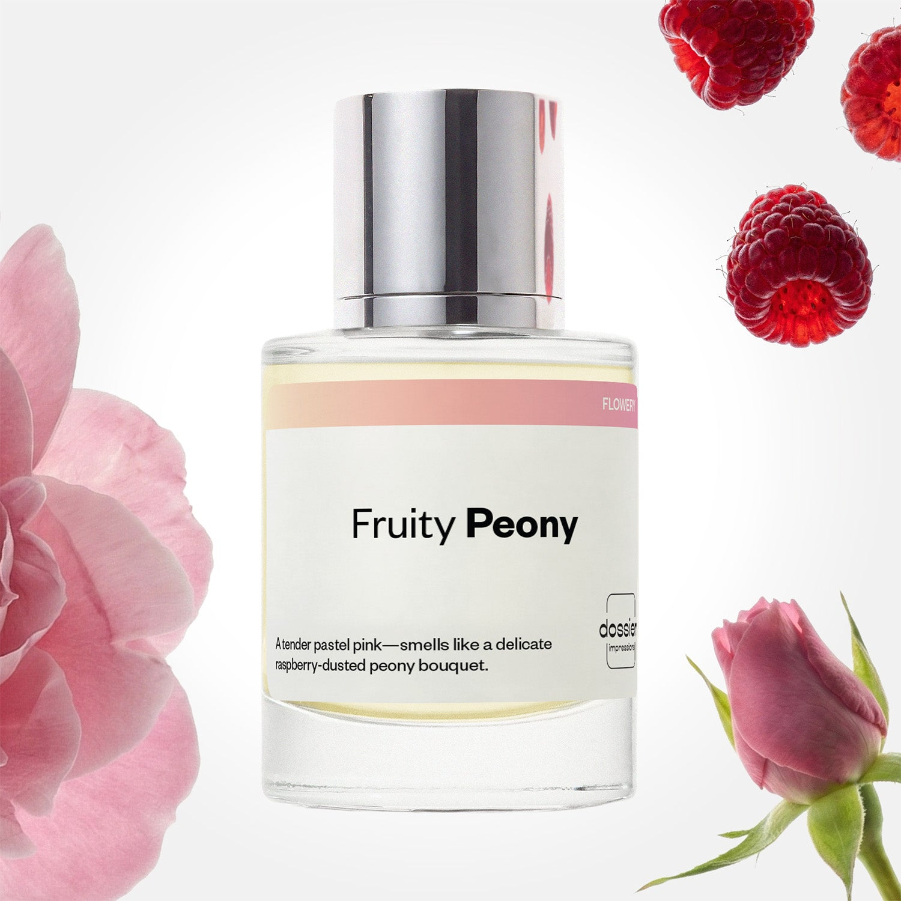

# Fruity Peony

- **Dossier Inspired by Giorgio Armani’s Prive Pivoine Suzhou**
- **URL:** https://dossier.co/products/fruity-peony
- **SEO title:** Fruity Peony

## Pricing (sizes)

| Size/SKU | Member price | List price | Currency |
|---|---|---|---|
| DI50FRPUS | 28.8 | 32 | USD |

## Content (scent notes, about, editorial)

Back Home / Perfumes / Dossier Impressions / FRUITY PEONY 

Women 

New 

Fruity Peony

Eau de Parfum. Size: 50ml / 1.7oz 

members: $28.80

Guest:
$32

Inspired by Giorgio Armani's Prive Pivoine Suzhou Inspired by Giorgio Armani's Prive Pivoine Suzhou 
Inspired by Giorgio Armani's Prive Pivoine Suzhou 

Retail price 145 Crafted in France 
Scent Family: flowery 

Add to Cart 

Scent Notes Main Notes:

Raspberry

Peony

Rose

Musks

Patchouli

top: The first notes you smell 
Raspberry, Pink Pepper, Mandarin 
middle: The heart of the perfume 
Peony, Rose 
base: The notes that linger all day 
Musks, Patchouli, Amber 
ingredients: Alcohol Denat., Fragrance/Parfum, Water/Aqua/Eau, Hexamethylindanopyran, Tetramethyl Acetyloctahydronaphthalenes, Dimethyl Phenethyl Acetate, Benzyl Salicylate, Limonene, Citrus Limon (Lemon) Peel Oil, Linalyl Acetate, Citronellol, Linalool, Pinene, Citrus Aurantium Peel Oil, Geranyl Acetate, Alpha-Isomethyl Ionone, Pogostemon Cablin Oil, Hexadecanolactone, Geraniol, Rose Ketones, Rose Flower Oil/Extract, Anethole, Citral, Beta-Caryophyllene, Benzyl Alcohol Terpinolene. 

Vegan
Cruelty-free

Clean ingredients

About Imagine the most tender and delicate raspberry-dusted bouquet, reincarnated as a fragrance. If this scent was a color, it would be a pastel pink. Think delicate, feminine, and natural harmony. 

Inspired by Giorgio Armani’s Prive Pivoine Suzhou, Fruity Peony opens with tender raspberry with zesty pink pepper and mandarin that offers a burst of freshness and sweet elegance. The fragrance unfolds into a floral heart of peonies and rose, which smells like a delicate, sheer, and airy bouquet––blossoming with pure, quiet opulence. This luminous scent dries down with a smooth musk, patchouli, and amber base for a warm, natural, and intimate aroma that becomes one with your skin. 

Scent Intensity: Soft 

Concentration: 18%

Gender: Feminine 

Shipping
Free shipping with 2+ items. 

Standard Shipping (with 2+ items) Auto-selected with 2+ items 
FREE 

Standard Shipping Auto-selected under 2 items 
$3.95 

Express shipping: 2 business days Select in checkout 
$19.00 

Returns
Free exchanges for all. Free returns with 

Exchanges
Free exchange, 1 time per order for all.

Returns
D+ members get 1 FREE return per order.
Non-members incur a $3.99/bottle return fee, 1 time per order.
Returns must be postmarked within 30 days of the initial order. Learn More 

FAQs Are these fragrances long lasting? They are designed to be very long lasting, just like designer fragrances, in some cases even longer, depending on the composition. 
When does the new packaging come out? We'll begin rolling out our new packaging across the U.S. and international markets soon! If you want to shop IRL - our new packaging first hits stores on January 11, 2026 at Walmart. Please note that if you are shopping online, you may receive a combination of our current and new packaging while we transition our inventory. 
How will I know what scent I like? We get it, shopping for perfumes online is hard! That's why we created a scent quiz, which will find the perfect scent for you Take the quiz (opens in new tab) 
Unsure about something? Ask us! help@dossier.co 

Details We are not associated or affiliated with the brands mentioned here in any way.
Floral Peony

A modern essence of the traditional rose – free and flirtatious

A melodious song of swallows that swoop with grace familiarly among the fields of peonies and roses, Chloé’s Chloé (the fragrance that Dossier’s Floral Peony is inspired by) is a feminine scent of flirtatious nature. An uncomplicated scent of free-spirited springtime interlaced with a sensual romance, this 14-year-old Eau de Parfum is a floral bouquet of simplicity and adoration.

Although consumed by floral notes of springtime aromas and enchanted woodland, the luxury fragrance that Floral Peony is inspired bymaintains an air of refreshing grace and love without overpowering the senses. It is an olfactory portal to the Garden of Eden – a beautiful blend of white freesia and blushing peony. These are notes that whisper a loving melody and caress the nose with a blossoming bouquet of aromas.

Tradition takes the reins with the indulgent middle notes of class and beauty – elegant rose, gorgeously innocent Lily-of-the-Valley, and magnolia. Together, these notes create a heavenly aura of love and beauty. A divine atmosphere is brought to earth with every spritz. It is a gorgeous experience right from the first opening. Sport to captivate the senses and win hearts.

A scent of empowering femininity, this dreamy fragrance still preserves a subtle self-assurance while flirting with free-spirited personality. The bottle distinctly complements the gorgeous femininity that this scent stands for. A lusciously delicate pink that mirrors the beauty of the flowers inside, with the simplicity of the Chloé name forged into the silver, carefully asserting its designer’s signature with precise poise and clarity. But to keep the neck of the bottle decorated, a chiffon ribbon in a light shade of pink has been laced into a bow to add an elegant womanly touch of sophistication.

To indulge in an elegant bed of traditional roses and gloriously radiant floral notes, Chloé’s Chloé Eau de Toilette can be bought in 3 different sizes (30 ml, 50 ml, and 75 ml) for $68.00, $95.00, and $115.00 respectively. Alternatively, you can lather your skin in this self-possessed fragrance with a 200 ml body lotion for $60.00. Or you can bathe in luxury with the pampering treat: the 200 ml body wash. It goes for $44.00. Finally, if you wish to surprise your nearest and dearest with a befitting present, be sure to get the gift set. It includes a 75 ml Eau de Parfum, a mini 10 ml Eau de Parfum, and a 100 ml bottle of body lotion, and it goes for $127.00.

To experience a lusciously free-spirited and lightly floral fragrance, look no further than Dossier’s Floral Peony. An ode to traditional rose and a beautiful entanglement of flowery elegance, our Chloé’s Chloé dupe infuses a myriad form of rose into an aromatic bouquet, with a syrupy rose essence laced with lychee that resembles the supple petals of a rose. These dance joyously with the refreshing notes of peony and clean crispness of natural freesia and lily to design a scent intimately inspired by the original scent. The empowering essence of mature femininity and assurance is bottled elegantly in Floral Peony. 

Best Layered With Combine 2 of our perfumes to create a third scent with layering, curated by our nose. Learn more 

You Might Love 

4.2 

Rated 4.2 out of 5 stars 

Based on 68 reviews 

Reviews 68 (tab expanded) Questions (tab collapsed) 

Filters 
Write a Review (Opens in a new window) 

68 reviews 
Sort Highest Rating Most Helpful Photos & Videos Most Recent Oldest Lowest Rating Least Helpful 

TB 

Tanya B. 
Verified Buyer 

6/28/26 

Rated 5 out of 5 stars 

Fruity
In love!

Read More Read more about this review 

Was this helpful? Yes, this review from Tanya B. was helpful. 0 people voted yes No, this review from Tanya B. was not helpful. 0 people voted no 

DP 

Dossier Perfumes 
6/28/26 
Tanya, we’re thrilled you’re loving it! Thanks for sharing the love 💛

VS 

Veronica S. 
Verified Buyer 

5/5/26 

Rated 5 out of 5 stars 

Love it
The perfect balance between floral and fruity perfume, not too floral not too sweet, I just love it and has become my everyday fragrance.

Read More Read more about this review 

Was this helpful? Yes, this review from Veronica S. was helpful. 0 people voted yes No, this review from Veronica S. was not helpful. 0 people voted no 

DP 

Dossier Perfumes 
5/5/26 
Hey Veronica! We love hearing this fragrance hit that sweet spot for you. Now you’ve got a trusty daily companion to kick off every morning with confidence. 🙌

DR 

Deiondra R. 
Verified Buyer 

4/18/26 

Rated 5 out of 5 stars 

Top notch stuff
My dossier collection is getting out of hand now🫢😊. What can I say, I love smelling amazing on a budget. This was a love at first sniff. So sophisticated 

Read More Read more about this review 

Was this helpful? Yes, this review from Deiondra R. was helpful. 1 person voted yes No, this review from Deiondra R. was not helpful. 0 people voted no 

DP 

Dossier Perfumes 
4/18/26 
Hey Deiondra! Wow, your collection is growing, budget-friendly vibes all the way. We’re thrilled this scent felt sophisticated from the first spritz. Keep enjoying the hunt 🙌

HO 

Hermelinda O. Z. 
Verified Buyer 

4/1/26 

Rated 5 out of 5 stars 

Fruity peony
I really loved 

Read More Read more about this review 

Was this helpful? Yes, this review from Hermelinda O. Z. was helpful. 0 people voted yes No, this review from Hermelinda O. Z. was not helpful. 0 people voted no 

DP 

Dossier Perfumes 
4/1/26 
Hermelinda, we’re so happy you loved it! Thanks for sharing 💛

RK 

Renata K. 
Verified Buyer 

3/25/26 

Rated 5 out of 5 stars 

Great scent. 
Got a lot of compliments wearing this fragrance. Light and fresh! 

Read More Read more about this review 

Was this helpful? Yes, this review from Renata K. was helpful. 0 people voted yes No, this review from Renata K. was not helpful. 0 people voted no 

DP 

Dossier Perfumes 
3/25/26 
Renata, that’s awesome! We love hearing about all those compliments and how effortlessly it wears. Keep enjoying it 😊

Loading... 

Loading... 

Show More 

Inspired by  Baccarat Rouge 540 
Inspired by  Black Opium 
Inspired by  Love, Don't Be Shy 
Inspired by  Good Girl 
Inspired by  Libre 
Inspired by  Flowerbomb 
Inspired by  Light Blue 
Inspired by  Not a Perfume 
Inspired by  Aventus 
Inspired by  Bleu de Chanel 
Inspired by  Mon Paris 
Inspired by  Coco Mademoiselle 
Inspired by  Tom Ford for Men 
Inspired by  For Her 
Inspired by  J'Adore Dior 
Inspired by  Alien 
Inspired by  Black Opium Perfume 
Inspired by  Lost Cherry Perfume 

GET UP TO 30% OFF 

Find us at these retailers. 

Be the first to know. 
Submit 

Shop the following countries. United States 

Discover.
AI Scent Finder 
Blog (opens in new tab) 
Scent Family 
Layering 
Scent Quiz 

Help.
Contact Us 
Returns 
FAQ 
Testimonials 
Accessibility 

More.
Store Locator 
Boutique 
Refer A Friend 
Index 

Download our app now.

Find us at these retailers. 

Be the first to know. 
Submit 

Shop the following countries. United States 

Discover.
AI Scent Finder 
Blog (opens in new tab) 
Scent Family 
Layering 
Scent Quiz 

Help.
Contact Us 
Returns 
FAQ 
Testimonials 
Accessibility 

More.

## Main Image

