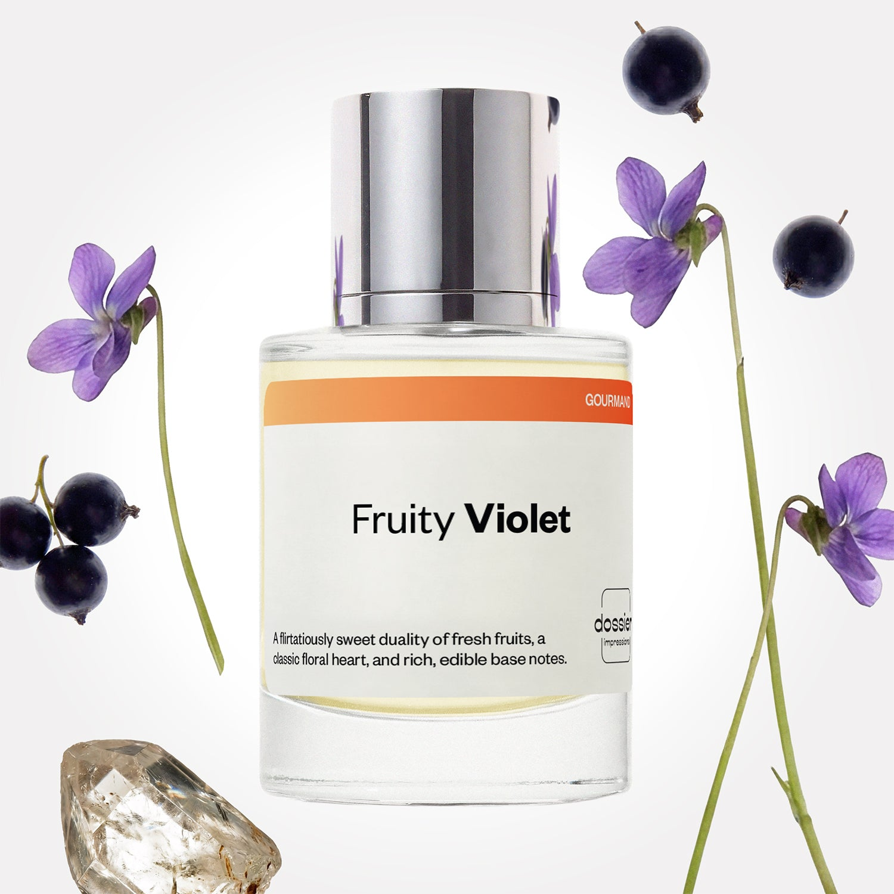

# Fruity Violet

- **Dossier Inspired by Burberry’s Her**
- **URL:** https://dossier.co/products/fruity-violet
- **SEO title:** Fruity Violet

## Pricing (sizes)

| Size/SKU | Member price | List price | Currency |
|---|---|---|---|
| 50ml | 28.8 | 32 | USD |
| 2x50ml | 57.6 | 64 | USD |

## Content (scent notes, about, editorial)

Back Home / Perfumes / Dossier Impressions / FRUITY VIOLET 

Women 

Sold out 

Fruity Violet

Eau de Parfum. Size: 50ml / 1.7oz 

members: $28.80

Guest:
$32

Inspired by Burberry's Her Inspired by Burberry's Her 
Inspired by Burberry's Her 

Retail price 135 Crafted in France 
Scent Family: gourmand 

Notify Me 

Scent Notes Main Notes:

Blackcurrant

Peach

Violet

Caramel

Ambroxan

top: The first notes you smell 
cassis, peach , Strawberry, Pink Berries 
middle: The heart of the perfume 
violet, Iris, Jasmine, White Woods 
base: The notes that linger all day 
caramel, ambroxan, Oakmoss, Honey 
ingredients: Alcohol Denat., Fragrance/Parfum, Water/Aqua/Eau, Tetramethyl Acetyloctahydronaphthalenes, Hexamethylindanopyran, Alpha-Isomethyl Ionone, Citrus Aurantium Peel Oil, Limonene, Hexyl Cinnamal, Linalool, Citronellol, Vanillin, Dimethyl Phenethyl Acetate, Pinene, Isoeugenyl Acetate, Rose Ketones, Terpinolene, Terpineol, Benzyl Alcohol, Alpha-Terpinene. 

Vegan
Cruelty-free

Clean ingredients

About Crafted to perfection, Fruity Violet enamors your senses with a striking duality of flirtatiously sweet and grown-up sensuality. The fragrance straddles jubilance and sophistication with balanced fresh, fruity notes, elegant florals, and rich, edible base notes. The fragrance opens with a vibrant burst of lively and playful fruity notes of blackcurrant, peach, strawberry, and pink berries. Its lush fruit bowl aroma evolves into a more mature, powdery, and floral bouquet at the heart with notes of violet, iris, jasmine, and white woods. Once settled onto the skin, Fruity Violet reveals its edible side with a warm, creamy, and gourmand delight of caramel, ambroxan, and oakmoss base notes. Devourable and wearable, embrace every facet of sweetness and femininity via fragrance.

Scent Intensity: Significant 

Concentration: 15%

Gender: Feminine 

Shipping
Free shipping with 2+ items. 

Standard Shipping (with 2+ items) Auto-selected with 2+ items 
FREE 

Standard Shipping Auto-selected under 2 items 
$3.95 

Express shipping: 2 business days Select in checkout 
$19.00 

Returns
Free exchanges for all. Free returns with 

Exchanges
Free exchange, 1 time per order for all.

Returns
D+ members get 1 FREE return per order.
Non-members incur a $3.99/bottle return fee, 1 time per order.
Returns must be postmarked within 30 days of the initial order. Learn More 

FAQs Are these fragrances long lasting? They are designed to be very long lasting, just like designer fragrances, in some cases even longer, depending on the composition. 
When does the new packaging come out? We'll begin rolling out our new packaging across the U.S. and international markets soon! If you want to shop IRL - our new packaging first hits stores on January 11, 2026 at Walmart. Please note that if you are shopping online, you may receive a combination of our current and new packaging while we transition our inventory. 
How will I know what scent I like? We get it, shopping for perfumes online is hard! That's why we created a scent quiz, which will find the perfect scent for you Take the quiz (opens in new tab) 
Unsure about something? Ask us! help@dossier.co 

Best Layered With Combine 2 of our perfumes to create a third scent with layering, curated by our nose. Learn more 

You Might Love 

4.4 

Rated 4.4 out of 5 stars 

Based on 154 reviews 

Reviews 154 (tab expanded) Questions (tab collapsed) 

Filters 
Write a Review (Opens in a new window) 

154 reviews 
Sort Highest Rating Most Helpful Photos & Videos Most Recent Oldest Lowest Rating Least Helpful 

A 

April 

6/8/26 

Rated 5 out of 5 stars 

5 Stars
Beautiful Scent

Read More Read more about this review 

Was this helpful? Yes, this review from April was helpful. 0 people voted yes No, this review from April was not helpful. 0 people voted no 

SM 

Santiago M. 
Verified Buyer 

5/22/26 

Rated 5 out of 5 stars 

Wondefullll… but 
My girlfriend loved this perfume and it’s the second one. Only thing is every time I have bought both I have had a fear of what they smell like. It’d be wonderful if you guys had a store where you can smell them or like get samples. Besides that, REALLY GREAT WORK !!!! Keep that going and you’ll be bigger. Thank you !!! 

Read More Read more about this review 

Was this helpful? Yes, this review from Santiago M. was helpful. 0 people voted yes No, this review from Santiago M. was not helpful. 0 people voted no 

YM 

y**** M. 
Verified Buyer 

5/21/26 

Rated 5 out of 5 stars 

Fruity Violet
Loved it. Smells just, maybe even better than Burburry Her!

Read More Read more about this review 

Was this helpful? Yes, this review from y**** M. was helpful. 0 people voted yes No, this review from y**** M. was not helpful. 0 people voted no 

DP 

Dossier Perfumes 
5/21/26 
Y****, thanks so much! We’re thrilled it hit the spot 😊

D 

Dasia 

5/21/26 

Rated 5 out of 5 stars 

5 Stars
Absolutely love this scent goes well in my hair with my Burberry her!

Read More Read more about this review 

Was this helpful? Yes, this review from Dasia was helpful. 0 people voted yes No, this review from Dasia was not helpful. 0 people voted no 

DR 

Desiree R. 
Verified Buyer 

5/21/26 

Rated 5 out of 5 stars 

Better then HER
My signature scent in Berberry her. This is even better. I have 4 bottles now 

Read More Read more about this review 

Was this helpful? Yes, this review from Desiree R. was helpful. 0 people voted yes No, this review from Desiree R. was not helpful. 0 people voted no 

DP 

Dossier Perfumes 
5/21/26 
We’re thrilled it became your go-to over your signature pick! Four bottles now, wow that’s commitment! Keep enjoying your fave.

Loading... 

Loading... 

Show More 

Inspired by  Baccarat Rouge 540 
Inspired by  Black Opium 
Inspired by  Love, Don't Be Shy 
Inspired by  Good Girl 
Inspired by  Libre 
Inspired by  Flowerbomb 
Inspired by  Light Blue 
Inspired by  Not a Perfume 
Inspired by  Aventus 
Inspired by  Bleu de Chanel 
Inspired by  Mon Paris 
Inspired by  Coco Mademoiselle 
Inspired by  Tom Ford for Men 
Inspired by  For Her 
Inspired by  J'Adore Dior 
Inspired by  Alien 
Inspired by  Black Opium Perfume 
Inspired by  Lost Cherry Perfume 

GET UP TO 30% OFF 

Find us at these retailers. 

Be the first to know. 
Submit 

Shop the following countries. United States 

Discover.
AI Scent Finder 
Blog (opens in new tab) 
Scent Family 
Layering 
Scent Quiz 

Help.
Contact Us 
Returns 
FAQ 
Testimonials 
Accessibility 

More.
Store Locator 
Boutique 
Refer A Friend 
Index 

Download our app now.

Find us at these retailers. 

Be the first to know. 
Submit 

Shop the following countries. United States 

Discover.
AI Scent Finder 
Blog (opens in new tab) 
Scent Family 
Layering 
Scent Quiz 

Help.
Contact Us 
Returns 
FAQ 
Testimonials 
Accessibility 

More.

## Main Image

