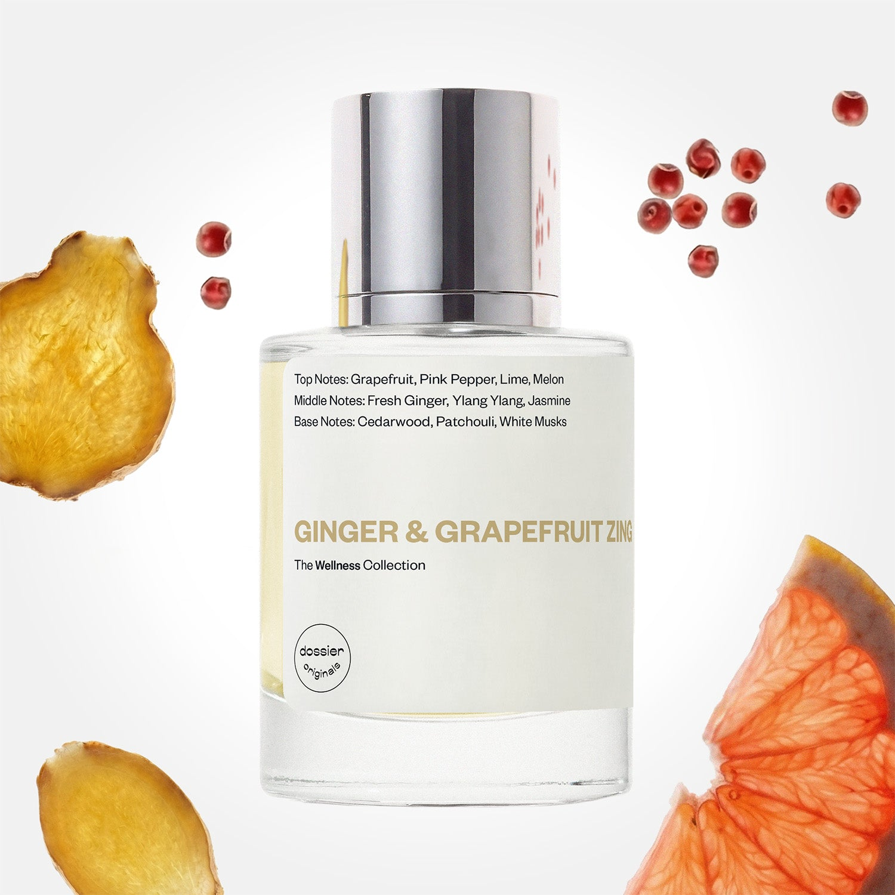

# Ginger & Grapefruit Zing

- **Dossier Dossier Originals**
- **URL:** https://dossier.co/products/ginger-grapefruit-zing
- **SEO title:** Ginger & Grapefruit Zing - Dossier Perfumes

## Pricing (sizes)

| Size/SKU | Member price | List price | Currency |
|---|---|---|---|
| 810086661398 | 35.1 | 39 | USD |

## Content (scent notes, about, editorial)

Back Home / Perfumes / Dossier Originals / GINGER & GRAPEFRUIT ZING 

Unisex 

Ginger & Grapefruit Zing

Eau de Parfum. Size: 50ml / 1.7oz 

members: $35.10

Guest:
$39

Dossier Originals: The wellness collection 

Refresh, re-energize, and rejuvenate. Aromatic therapy through fragrance for a heightened scent-sory experience. 
Crafted in France 
Scent Family: fresh 

Add to Cart 

Scent Notes Main Notes:

Grapefruit

Pink Pepper

Peppermint

Fresh Ginger

White Musks

top: The first notes you smell 
Grapefruit, Pink Pepper, Lime, Melon 
middle: The heart of the perfume 
Fresh Ginger, Ylang Ylang, Jasmine 
base: The notes that linger all day 
Cedarwood, Patchouli, White Musks 
ingredients: Alcohol Denat., Fragrance/Parfum, Water/Aqua/Eau, Tetramethyl Acetyloctahydronaphthalenes, Hexamethylindanopyran, Limonene, Citrus Limon (Lemon) Peel Oil, Juniperus Virginiana Oil, Geraniol, Citrus Aurantium Peel Oil, Pogostemon Cablin Oil, Pinene, Citral, Citronellol, Terpineol, Alpha-Isomethyl Ionone, Linalool, Terpinolene, Beta-Caryophyllene, Geranyl Acetate, Cananga Odorata Oil/Extract, Linalyl Acetate, Alpha-Terpinene, Rose Ketones, Farnesol, Camphor, Benzyl Benzoate, Amyl Salicylate, Benzyl Salicylate. 

Vegan
Cruelty-free

Clean ingredients

About The Virtue: Ginger and grapefruit are both known for their energizing and invigorating properties.

The Scent: Lively, effervescent ginger blends naturally with zesty grapefruit, supported by fiery pink pepper and refreshing lime to bring you pure joy with every sniff.

Scent Intensity: Significant 

Concentration: 22%

Gender: Unisex 

Shipping
Free shipping with 2+ items. 

Standard Shipping (with 2+ items) Auto-selected with 2+ items 
FREE 

Standard Shipping Auto-selected under 2 items 
$3.95 

Express shipping: 2 business days Select in checkout 
$19.00 

Returns
Free exchanges for all. Free returns with 

Exchanges
Free exchange, 1 time per order for all.

Returns
D+ members get 1 FREE return per order.
Non-members incur a $3.99/bottle return fee, 1 time per order.
Returns must be postmarked within 30 days of the initial order. Learn More 

FAQs Are these fragrances long lasting? They are designed to be very long lasting, just like designer fragrances, in some cases even longer, depending on the composition. 
When does the new packaging come out? We'll begin rolling out our new packaging across the U.S. and international markets soon! If you want to shop IRL - our new packaging first hits stores on January 11, 2026 at Walmart. Please note that if you are shopping online, you may receive a combination of our current and new packaging while we transition our inventory. 
How will I know what scent I like? We get it, shopping for perfumes online is hard! That's why we created a scent quiz, which will find the perfect scent for you Take the quiz (opens in new tab) 
Unsure about something? Ask us! help@dossier.co 

You Might Love 

4.1 

Rated 4.1 out of 5 stars 

Based on 101 reviews 

Reviews 101 (tab expanded) Questions (tab collapsed) 

Filters 
Write a Review (Opens in a new window) 

101 reviews 
Sort Highest Rating Most Helpful Photos & Videos Most Recent Oldest Lowest Rating Least Helpful 

LH 

Laura H. 
Verified Buyer 

6/20/26 

Rated 5 out of 5 stars 

Warm Grown-Woman Spa Day
This is SUCH a well done fragrance. The ginger transforms all day long on me, from a slightly fresher but still earthy initial spray, then lingering into this warm ginger, patchouli, cedarwood base. This is my longest lasting dossier fragrance, easily lasting 6+ hours on my skin while still projecting + it lasts all day on my clothes. If I smell those clothes the next day, the fragrance is still there. You could truly wear this anytime of year, and each season would bring something special out. It's also versatile for day or night, given the refreshing top notes and the substantial base. I could see this lightened up with some cucumber melon deodorant and body spray too,. I feel competent, calm, and grounded when I wear this fragrance, and it's pretty close to a signature scent for me, even as someone who likes to switch it up. 

Read More Read more about this review 

Was this helpful? Yes, this review from Laura H. was helpful. 0 people voted yes No, this review from Laura H. was not helpful. 0 people voted no 

DP 

Dossier Perfumes 
6/20/26 
Laura, we love hearing how this scent keeps revealing new layers all day and becomes a signature vibe. Versatility for any season is the dream, right? Enjoy every spritz!

D 

Delia 

6/9/26 

Rated 5 out of 5 stars 

I don't know
Blind buy .. i like grapefruit so gave this a try .. Different than expected.. more floral ? Got something in there that smells odd .. Definitely not Origins ginger perfume .. different from anything I've ever smelled .. interesting.. don't know how I feel about it yet But .. it IS a pretty scent .. mom LOVED it Quality is good

Read More Read more about this review 

Was this helpful? Yes, this review from Delia was helpful. 0 people voted yes No, this review from Delia was not helpful. 0 people voted no 

DP 

Dossier Perfumes 
6/9/26 
Hey Delia! Blind buys can surprise you once they settle on your skin, so give it a little time. It’s amazing your mom loved it and quality’s solid. If you need anything, reach help@dossier.co 😊

L 

Lexi 
Verified Buyer 

1/28/26 

Rated 5 out of 5 stars 

5 Stars
An intricate scent without being overwhelming. I would describe the scent as clean with a slight edge in a good way. Probably in my top 5 perfumes I’ve tried!

Read More Read more about this review 

Was this helpful? Yes, this review from Lexi was helpful. 0 people voted yes No, this review from Lexi was not helpful. 0 people voted no 

DP 

Dossier Perfumes 
1/28/26 
Lexi, we’re thrilled that this one hit your top five! It’s awesome that it feels intricate yet balanced, and that little edge makes it so special on your skin.

L 

Lexi 

1/28/26 

Rated 5 out of 5 stars 

5 Stars
An intricate scent without being overwhelming. I would describe the scent as clean with a slight edge in a good way. Probably in my top 5 perfumes I’ve tried!

Read More Read more about this review 

Was this helpful? Yes, this review from Lexi was helpful. 0 people voted yes No, this review from Lexi was not helpful. 0 people voted no 

JD 

Judith D. 

Verified Buyer 

9/14/25 

Rated 5 out of 5 stars 

Summer in a bottle
Such a delicious scent! Please don’t ever discontinue this one, this reminds me so much of how Hollister stores use to smell back in the early 2000’s. It’s such a core memory with the dim lights and the super loud music. This isn’t an exact dupe but it’s super close. I would say this is slightly more citrusy and sweeter. But again it’s very close. Perfect for combining with other scents but smells AMAZING on its own. Both my husband and I love it.

Read More Read more about this review 

Was this helpful? Yes, this review from Judith D. was helpful. 0 people voted yes No, this review from Judith D. was not helpful. 0 people voted no 

DP 

Dossier Perfumes 
9/15/25 
Judith, core memory in a bottle is our favorite review today. So happy it brings back those iconic vibes for you and your husband!

Loading... 

Loading... 

Show More 

Inspired by  Baccarat Rouge 540 
Inspired by  Black Opium 
Inspired by  Love, Don't Be Shy 
Inspired by  Good Girl 
Inspired by  Libre 
Inspired by  Flowerbomb 
Inspired by  Light Blue 
Inspired by  Not a Perfume 
Inspired by  Aventus 
Inspired by  Bleu de Chanel 
Inspired by  Mon Paris 
Inspired by  Coco Mademoiselle 
Inspired by  Tom Ford for Men 
Inspired by  For Her 
Inspired by  J'Adore Dior 
Inspired by  Alien 
Inspired by  Black Opium Perfume 
Inspired by  Lost Cherry Perfume 

GET UP TO 30% OFF 

Find us at these retailers. 

Be the first to know. 
Submit 

Shop the following countries. United States 

Discover.
AI Scent Finder 
Blog (opens in new tab) 
Scent Family 
Layering 
Scent Quiz 

Help.
Contact Us 
Returns 
FAQ 
Testimonials 
Accessibility 

More.
Store Locator 
Boutique 
Refer A Friend 
Index 

Download our app now.

Find us at these retailers. 

Be the first to know. 
Submit 

Shop the following countries. United States 

Discover.
AI Scent Finder 
Blog (opens in new tab) 
Scent Family 
Layering 
Scent Quiz 

Help.
Contact Us 
Returns 
FAQ 
Testimonials 
Accessibility 

More.

## Main Image

