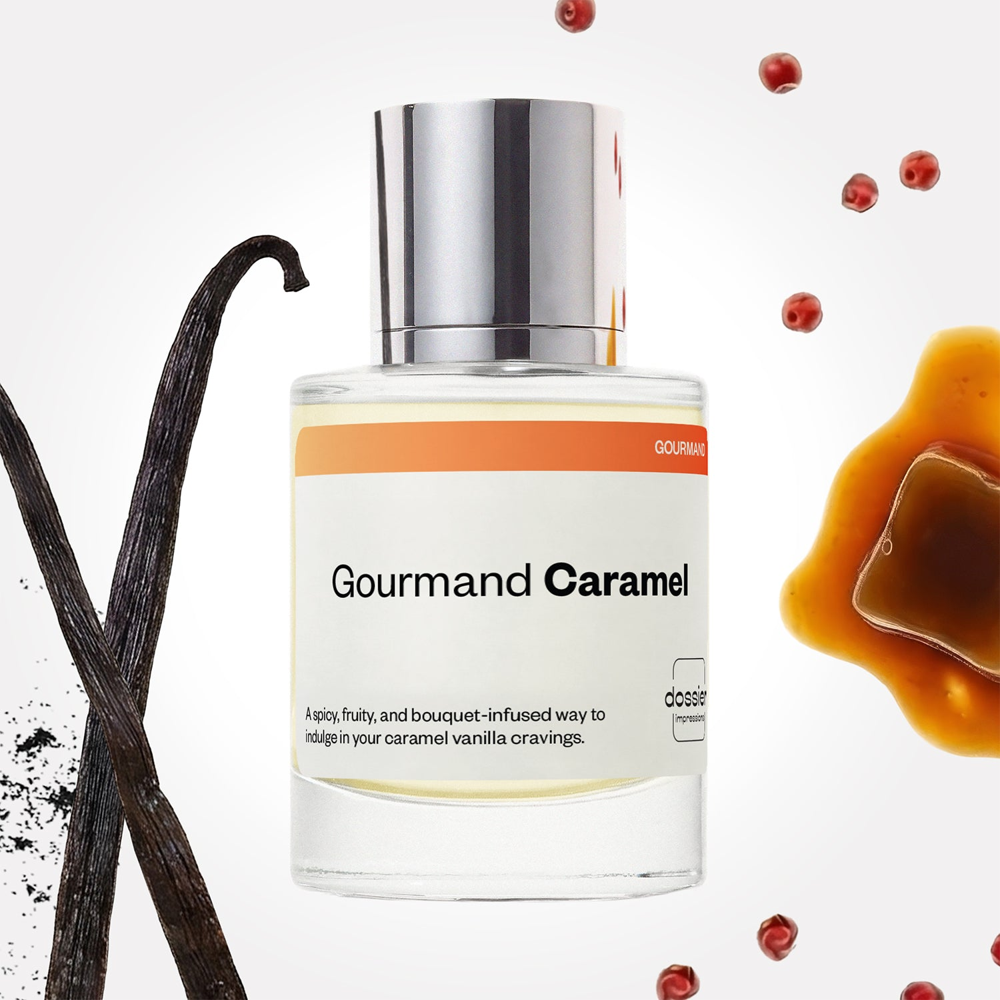

# Gourmand Caramel

- **Dossier Inspired by Rare Beauty's Rare**
- **URL:** https://dossier.co/products/gourmand-caramel
- **SEO title:** Gourmand Caramel

## Pricing (sizes)

| Size/SKU | Member price | List price | Currency |
|---|---|---|---|
| DI50GCAUS | 28.8 | 32 | USD |

## Content (scent notes, about, editorial)

Back Home / Perfumes / Dossier Impressions / GOURMAND CARAMEL 

Women 

New 

Gourmand Caramel

Eau de Parfum. Size: 50ml / 1.7oz 

members: $28.80

Guest:
$32

Inspired by Rare Beauty's R​are Inspired by Rare Beauty's R​are 
Inspired by Rare Beauty's R​are 

Retail price 75 Crafted in France 
Scent Family: gourmand 

Add to Cart 

Scent Notes Main Notes:

Pink Pepper

Caramel

Vanilla

top: The first notes you smell 
Pink Pepper, Pear, Melon 
middle: The heart of the perfume 
Caramel, Jasmine, Lily of the valley 
base: The notes that linger all day 
Vanilla, Tonka Bean, Cacao, Musks 
ingredients: Alcohol Denat., Fragrance/Parfum, Water/Aqua/Eau, Tetramethyl Acetyloctahydronaphthalenes, Vanillin, Benzyl Salicylate, Hydroxycitronellal, Limonene, Citrus Aurantium Peel Oil, Coumarin, Pinene, Benzyl Cinnamate, Rose Ketones, Isoeugenyl Acetate, Citral, Benzyl Alcohol, Beta-Caryophyllene, Citronellol, Linalool, Terpineol, Terpinolene, Benzyl Benzoate, Linalyl Acetate, Alpha-Terpinene. 

Vegan
Cruelty-free

Clean ingredients

About Your perfect cozy caramel and vanilla fragrance. Inspired by Rare EDP by Rare Beauty, Gourmand Caramel is your ultimate warm and grown-up gourmand indulgence.

The fragrance opens with a kick of pink pepper spice supported by fruity notes for a vibrant, energizing first impression. It quickly unfolds into a more scrumptious, sensual scent with a caramel-dominant heart, imbued with elegant white floral notes.

Once settled on the skin, the fragrance lingers with delectable depth. Indulge in a vanilla-forward base interlaced with cacao, tonka bean, and soft musk notes for a wearable, dessert-worthy second skin.

A fancy fireplace-ready fixation that’s luxuriously guilt-free.

Scent Intensity: Significant 

Concentration: 28%

Gender: Feminine 

Shipping
Free shipping with 2+ items. 

Standard Shipping (with 2+ items) Auto-selected with 2+ items 
FREE 

Standard Shipping Auto-selected under 2 items 
$3.95 

Express shipping: 2 business days Select in checkout 
$19.00 

Returns
Free exchanges for all. Free returns with 

Exchanges
Free exchange, 1 time per order for all.

Returns
D+ members get 1 FREE return per order.
Non-members incur a $3.99/bottle return fee, 1 time per order.
Returns must be postmarked within 30 days of the initial order. Learn More 

FAQs Are these fragrances long lasting? They are designed to be very long lasting, just like designer fragrances, in some cases even longer, depending on the composition. 
When does the new packaging come out? We'll begin rolling out our new packaging across the U.S. and international markets soon! If you want to shop IRL - our new packaging first hits stores on January 11, 2026 at Walmart. Please note that if you are shopping online, you may receive a combination of our current and new packaging while we transition our inventory. 
How will I know what scent I like? We get it, shopping for perfumes online is hard! That's why we created a scent quiz, which will find the perfect scent for you Take the quiz (opens in new tab) 
Unsure about something? Ask us! help@dossier.co 

Best Layered With Combine 2 of our perfumes to create a third scent with layering, curated by our nose. Learn more 

You Might Love 

4.3 

Rated 4.3 out of 5 stars 

Based on 13 reviews 

Reviews 13 (tab expanded) Questions (tab collapsed) 

Filters 
Write a Review (Opens in a new window) 

13 reviews 
Sort Highest Rating Most Helpful Photos & Videos Most Recent Oldest Lowest Rating Least Helpful 

CD 

Christa D. 
Verified Reviewer 

6/29/26 

Rated 5 out of 5 stars 

Nice scent
This is sweet, but not too sweet, could be layered for more sweetness or more florals or good as a stand alone. Very enjoyable and good from the start. 

Read More Read more about this review 

Was this helpful? Yes, this review from Christa D. was helpful. 0 people voted yes No, this review from Christa D. was not helpful. 0 people voted no 

DP 

Dossier Perfumes 
6/29/26 
Hey Christa! We’re thrilled it’s hitting the sweet spot without going overboard and that layering options give you extra fun. Thanks for sharing how it shines right from first spritz! ✨

K 

Katina 

6/29/26 

Rated 5 out of 5 stars 

5 Stars
LOVE LOVE LOVE! One of my favorites

Read More Read more about this review 

Was this helpful? Yes, this review from Katina was helpful. 0 people voted yes No, this review from Katina was not helpful. 0 people voted no 

A 

Amara 

6/26/26 

Rated 5 out of 5 stars 

5 Stars
Smells almost identical to Rare which is one of my all time favorites!

Read More Read more about this review 

Was this helpful? Yes, this review from Amara was helpful. 0 people voted yes No, this review from Amara was not helpful. 0 people voted no 

TF 

Tammy F. 
Verified Buyer 

6/18/26 

Rated 5 out of 5 stars 

The Gourmand Caramel is Yummy!
The Gourmand Caramel smells good enough to eat! It’s everything it’s supposed to be. I LIVE it!

Read More Read more about this review 

Was this helpful? Yes, this review from Tammy F. was helpful. 0 people voted yes No, this review from Tammy F. was not helpful. 0 people voted no 

DP 

Dossier Perfumes 
6/18/26 
Tammy, you just made our day! We love how it hits that crave-worthy vibe—enjoy every spritz ✨

M 

Meg 
Verified Buyer 

6/16/26 

Rated 5 out of 5 stars 

Took me a minute!
It took me a minute to really like this. I was hoping for a stronger salty caramel fragrance. As it began to dry down the caramel smell started coming through and I find myself really enjoying it. It’s a complex scent and I find part of its charm has been seeing which scents I can detect throughout the day, as the fragrance definitely shifts through scents. I get a cozy cashmere aroma, a sweet caramel, and an almost orange blossom floral with a kick of spice. Looking forward to wearing this fall as it invokes all those autumny feels 😉 u won’t be bored wearing this fragrance!

Read More Read more about this review 

Was this helpful? Yes, this review from Meg was helpful. 0 people voted yes No, this review from Meg was not helpful. 0 people voted no 

DP 

Dossier Perfumes 
6/16/26 
Meg, we’re so glad it grew on you and reveals new layers throughout the day. It really shines in fall and keeps things interesting. Enjoy every spritz ✨

Loading... 

Loading... 

Show More 

Inspired by  Baccarat Rouge 540 
Inspired by  Black Opium 
Inspired by  Love, Don't Be Shy 
Inspired by  Good Girl 
Inspired by  Libre 
Inspired by  Flowerbomb 
Inspired by  Light Blue 
Inspired by  Not a Perfume 
Inspired by  Aventus 
Inspired by  Bleu de Chanel 
Inspired by  Mon Paris 
Inspired by  Coco Mademoiselle 
Inspired by  Tom Ford for Men 
Inspired by  For Her 
Inspired by  J'Adore Dior 
Inspired by  Alien 
Inspired by  Black Opium Perfume 
Inspired by  Lost Cherry Perfume 

GET UP TO 30% OFF 

Find us at these retailers. 

Be the first to know. 
Submit 

Shop the following countries. United States 

Discover.
AI Scent Finder 
Blog (opens in new tab) 
Scent Family 
Layering 
Scent Quiz 

Help.
Contact Us 
Returns 
FAQ 
Testimonials 
Accessibility 

More.
Store Locator 
Boutique 
Refer A Friend 
Index 

Download our app now.

Find us at these retailers. 

Be the first to know. 
Submit 

Shop the following countries. United States 

Discover.
AI Scent Finder 
Blog (opens in new tab) 
Scent Family 
Layering 
Scent Quiz 

Help.
Contact Us 
Returns 
FAQ 
Testimonials 
Accessibility 

More.

## Main Image

