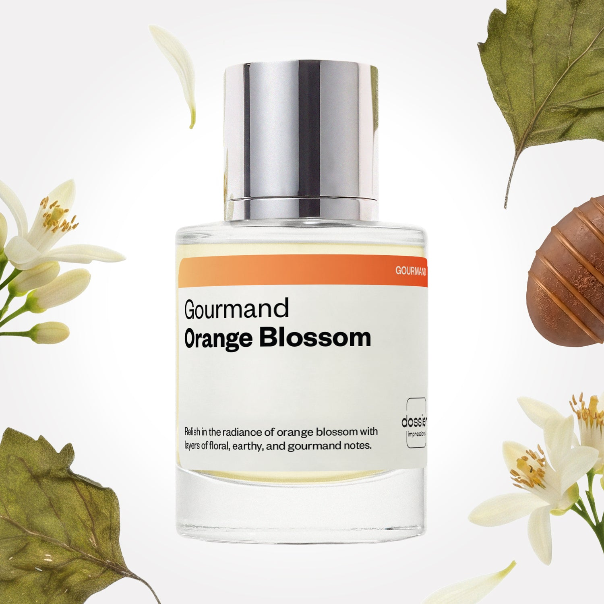

# Gourmand Orange Blossom

- **Dossier Inspired by Lancome's La Vie Est Belle**
- **URL:** https://dossier.co/products/gourmand-orange-blossom
- **SEO title:** La Vie Est Belle by Lancôme Dupe Perfume: Gourmand Orange Blossom - Dossier Perfumes

## Pricing (sizes)

| Size/SKU | Member price | List price | Currency |
|---|---|---|---|
| DI50GOBUS | 26.1 | 29 | USD |

## Content (scent notes, about, editorial)

Back Home / Perfumes / Dossier Impressions / GOURMAND ORANGE BLOSSOM 

Women 

It's back! 

Gourmand Orange Blossom

Eau de Parfum. Size: 50ml / 1.7oz 

members: $26.10

Guest:
$29

Inspired by Lancome's La Vie Est Belle Inspired by Lancome's La Vie Est Belle 
Inspired by Lancome's La Vie Est Belle 

Retail price 125 Crafted in France 
Scent Family: gourmand 

Add to Cart 

Scent Notes This perfume is: Dense sweetness and warm spice 
Main Notes:

Orange Blossom

Blackcurrant

Hazelnut

Patchouli

Praline

Vanilla

Tonka Bean

top: The first notes you smell 
Orange Blossom, Blackcurrant, Hazelnut 
middle: The heart of the perfume 
Orris, Jasmine Sambac, Patchouli 
base: The notes that linger all day 
Praline, Vanilla, Tonka Bean 
ingredients: Alcohol Denat., Fragrance/Parfum, Water/Aqua/Eau, Linalyl Acetate, Linalool, Tetramethyl Acetyloctahydronaphthalenes, Benzyl Salicylate, Hexamethylindanopyran, Citrus Aurantium Bergamia (Bergamot) Peel Oil, Limonene, Citrus Aurantium Peel Oil, Pogostemon Cablin Oil, Alpha-Isomethyl Ionone, Citronellol, Pinene, Coumarin, Beta-Caryophyllene, Rose Ketones, Citral, Geranyl Acetate, Terpineol, Terpinolene, Benzyl Alcohol, Geraniol, Hexadecanolactone, Alpha-Terpinene, Acetyl Cedrene, Benzyl Benzoate, Eugenol. 

Vegan
Cruelty-free

Clean ingredients

About Gourmand Orange Blossom (inspired by Lancome's La Vie Est Belle) starts as a floral trio of jasmine, orange blossom, and orris, blended with a fizzy touch of blackcurrant and hazelnut. As it evaporates, the fragrance develops woody patchouli facets, enlightened with warm praline, brown sugar, and vanilla notes.

Thanks to the natural harmony between orange blossom and gourmand notes, Gourmand Orange Blossom (our impression of Lancome's La Vie Est Belle) is an elegant and sensual composition, full of radiance. 

Scent Intensity: Significant 

Concentration: 18%

Gender: Feminine 

Shipping
Free shipping with 2+ items. 

Standard Shipping (with 2+ items) Auto-selected with 2+ items 
FREE 

Standard Shipping Auto-selected under 2 items 
$3.95 

Express shipping: 2 business days Select in checkout 
$19.00 

Returns
Free exchanges for all. Free returns with 

Exchanges
Free exchange, 1 time per order for all.

Returns
D+ members get 1 FREE return per order.
Non-members incur a $3.99/bottle return fee, 1 time per order.
Returns must be postmarked within 30 days of the initial order. Learn More 

FAQs Are these fragrances long lasting? They are designed to be very long lasting, just like designer fragrances, in some cases even longer, depending on the composition. 
When does the new packaging come out? We'll begin rolling out our new packaging across the U.S. and international markets soon! If you want to shop IRL - our new packaging first hits stores on January 11, 2026 at Walmart. Please note that if you are shopping online, you may receive a combination of our current and new packaging while we transition our inventory. 
How will I know what scent I like? We get it, shopping for perfumes online is hard! That's why we created a scent quiz, which will find the perfect scent for you Take the quiz (opens in new tab) 
Unsure about something? Ask us! help@dossier.co 

Details We are not associated or affiliated with the brands mentioned here in any way.
Gourmand Orange Blossom

A sleek and sublime finish

Inspired by the wild elegance of black currants, iris, and pear, Lancôme’s La Vie Est Belle Eau De Parfum Spray (the scent that inspired Dossier’s Gourmand Orange Blossom) is a unique take on a warm and spicy fragrance. It may have been launched in 2013, but it’s still winning awards and hearts.

With its deep evolving notes and lingering finishes, the luxury fragrance that Gourmand Orange Blossom is inspired by emphasizes the beauty of life. It is about finding your spark and living it. It is about discovering yourself and inspiring others to do the same. And this particularly invigorating women’s perfume helps you do just that. It is one addictive floral gourmand fragrance and one that can be likened to a shot of tequila – with all that intense verve and force.

Lancôme La Vie Est Belle’s seductive grip on iris, orange flower, and pear delivers a mesmerizing smell that celebrates the joys of femininity. It also has flowery hints of pralines, vanilla, patchouli, and Tonka beans working together to produce a sleek and sublime finish.

Only a handful of fragrances match this legendary aroma.  Putting it on it is like putting on the agility of a hummingbird, the gracefulness of a swan, and the elegance of a gazelle. 
The luxury fragrance that Gourmand Orange Blossom is inspired by is intense but not intimidating, majestic but not arrogant, ingenious but not boastful, and firm but not cruel. Embrace it like you do the morning sunlight, cherish it like you do a lullaby, and wear it proudly like the lark spreads its wings. If you like the idea of smelling like the auroral clouds just after rainfall, this is the perfume for you.

Maybe you would love for the Lancôme La Vie Est Belle Eau De Parfum to be yours, but can’t get to one right now. Fear not, Dossier’s Gourmand Orange Blossom has got you covered. Our Lancôme La Vie Est Belle dupe packs a punch with jasmine, pralines, and vanilla. It starts off with a rush of black currants, iris, and pear, before evolving into a comfy, sweet orange blossom and Tonka bean scent as it settles into your skin. A striking fragrance that always turns heads, our dupe gets you noticed, makes you feel wealthy, and brings out the best in you. It’s a warming, somewhat spicy scent that’s ideal for the winter months.

You Might Love 

4.6 

Rated 4.6 out of 5 stars 

Based on 1,738 reviews 

Reviews 1,738 (tab expanded) Questions 9 (tab collapsed) 

Filters 
Write a Review (Opens in a new window) 

1,738 reviews 
Sort Highest Rating Most Helpful Photos & Videos Most Recent Oldest Lowest Rating Least Helpful 

JS 

Julie S. 

6/19/26 

Rated 5 out of 5 stars 

Who knew this was gonna smell this amazing!
I can’t believe how lovely this fragrance is! It’s just sweet enough if you don’t want a cupcake style sweet, but you want a little bit of **** sweet. The magic is in the dry down here. I’m such a sucker for patchouli and I really feel it grounds the whole fragrance in a very sensual way plus the praline and the Tonka bean are the chefs kiss. I’ve really been getting into black Current and orange blossom Fragrances lately you’re not gonna believe this, but I’ve never even smelled the OG and now I don’t even have to! Another home run for dossier. I will never stop being a member here because your dupes are literally spot on! Your customer service is great and I’m so glad that you are now really aping it up by bringing in some of the top viral Fragrances out there you just keep it coming. I’m not going anywhere! This fragrance definitely leans feminine for me. I like combining it with the Gormand patchouli and the dupe you have of Killian‘s love don’t be shy for an extra sweet boost. Now you absolutely MUST DUPE Kayali Freedom Musk Santal!!!! 🔥

Read More Read more about this review 

Was this helpful? Yes, this review from Julie S. was helpful. 0 people voted yes No, this review from Julie S. was not helpful. 0 people voted no 

DP 

Dossier Perfumes 
6/19/26 
Julie, we’re thrilled Gourmand Orange Blossom is delivering that patchouli lift and delight. Thanks for riding this scent journey with us and cheering us on! 😊

IG 

Ileana G. 
Verified Buyer 

6/10/26 

Rated 5 out of 5 stars 

quality 
Loved it, very rich fragrance and good fixative 

Read More Read more about this review 
Translated from Spanish Show original 

Was this helpful? Yes, this review from Ileana G. was helpful. 0 people voted yes No, this review from Ileana G. was not helpful. 0 people voted no 

DP 

Dossier Perfumes 
6/10/26 
¡Genial! Gracias por compartirlo, nos alegra que disfrutes la fragancia y su fijación 😊

D 

Dina 
Verified Reviewer 

6/5/26 

Rated 5 out of 5 stars 

Exactly like the original!
Original on one wrist. Dossier on the other. NO difference. What a great product!

Read More Read more about this review 

Was this helpful? Yes, this review from Dina was helpful. 0 people voted yes No, this review from Dina was not helpful. 0 people voted no 

DP 

Dossier Perfumes 
6/5/26 
Dina, that side-by-side test feels like victory! We’re thrilled it matched so perfectly, enjoy rockin’ your signature scent 😊

M 

Mel 

6/3/26 

Rated 5 out of 5 stars 

5 Stars
My 3rd bottle

Read More Read more about this review 

Was this helpful? Yes, this review from Mel was helpful. 0 people voted yes No, this review from Mel was not helpful. 0 people voted no 

CT 

Cristian T. 
Verified Buyer 

5/23/26 

Rated 5 out of 5 stars 

Cristian’s review
It smells great, i like that while its androgynous it doesn’t lean towards one or the other, its a little elegant too, came perfectly fine. Plus I referred you guys to my aunt. Definitely will buy either the same scent again or another some time down the line, thanks!

Read More Read more about this review 

Was this helpful? Yes, this review from Cristian T. was helpful. 0 people voted yes No, this review from Cristian T. was not helpful. 0 people voted no 

DP 

Dossier Perfumes 
5/23/26 
So happy it feels balanced and elegant, and arrived just right. Thanks for sharing us with your aunt! We can’t wait to have you back for another spritz 😊

Loading... 

Loading... 

Show More 

Inspired by  Baccarat Rouge 540 
Inspired by  Black Opium 
Inspired by  Love, Don't Be Shy 
Inspired by  Good Girl 
Inspired by  Libre 
Inspired by  Flowerbomb 
Inspired by  Light Blue 
Inspired by  Not a Perfume 
Inspired by  Aventus 
Inspired by  Bleu de Chanel 
Inspired by  Mon Paris 
Inspired by  Coco Mademoiselle 
Inspired by  Tom Ford for Men 
Inspired by  For Her 
Inspired by  J'Adore Dior 
Inspired by  Alien 
Inspired by  Black Opium Perfume 
Inspired by  Lost Cherry Perfume 

GET UP TO 30% OFF 

Find us at these retailers. 

Be the first to know. 
Submit 

Shop the following countries. United States 

Discover.
AI Scent Finder 
Blog (opens in new tab) 
Scent Family 
Layering 
Scent Quiz 

Help.
Contact Us 
Returns 
FAQ 
Testimonials 
Accessibility 

More.
Store Locator 
Boutique 
Refer A Friend 
Index 

Download our app now.

Find us at these retailers. 

Be the first to know. 
Submit 

Shop the following countries. United States 

Discover.
AI Scent Finder 
Blog (opens in new tab) 
Scent Family 
Layering 
Scent Quiz 

Help.
Contact Us 
Returns 
FAQ 
Testimonials 
Accessibility 

More.

## Main Image

