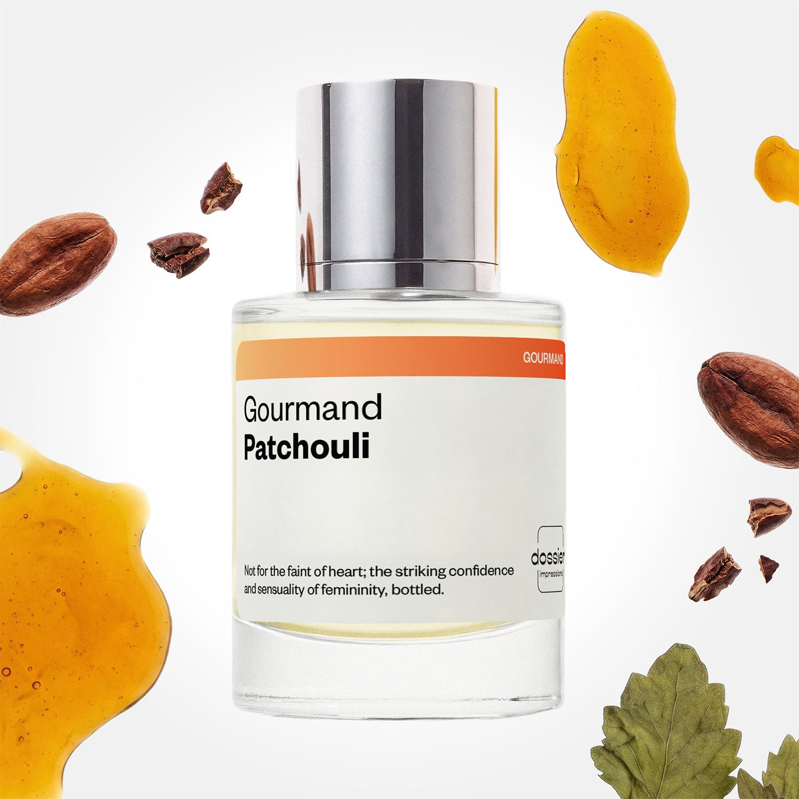

# Gourmand Patchouli

- **Dossier Inspired by Mugler's Angel**
- **URL:** https://dossier.co/products/gourmand-patchouli
- **SEO title:** Thierry Mugler's Angel Dupe Perfume: Gourmand Patchouli - Dossier Perfumes

## Pricing (sizes)

| Size/SKU | Member price | List price | Currency |
|---|---|---|---|
| DI50GOPUS | 28.8 | 32 | USD |

## Content (scent notes, about, editorial)

Back Home / Perfumes / Dossier Impressions / GOURMAND PATCHOULI 

Women 

It's back! 

Gourmand Patchouli

Eau de Parfum. Size: 50ml / 1.7oz 

members: $28.80

Guest:
$32

Inspired by Mugler's Angel Inspired by Mugler's Angel 
Inspired by Mugler's Angel 

Retail price 150 Crafted in France 
Scent Family: gourmand 

Add to Cart 

Scent Notes This perfume is: Instantly hypnotizing 
Main Notes:

Patchouli

Honey

Plum

Cocoa

top: The first notes you smell 
Mandarin, Berries, Passion Fruit 
middle: The heart of the perfume 
Patchouli, Honey, Plum 
base: The notes that linger all day 
Caramel, Vanilla, Cocoa 
ingredients: Alcohol Denat., Fragrance/Parfum, Water/Aqua/Eau, Pogostemon Cablin Oil, Hexamethylindanopyran, Coumarin, Citrus Aurantium Bergamia (Bergamot) Peel Oil, Vanillin, Limonene, Linalyl Acetate, Pinene, Santalol, Beta-Caryophyllene, Linalool, Santalum Album (Sandalwood) Oil, Eugenol, Acetyl Cedrene, Hexyl Cinnamal, Geraniol, Citrus Aurantium Peel Oil, Terpineol, Geranyl Acetate, Citronellol, Terpinolene, Citral, Alpha-Terpinene, Rose Ketones, Laurus Nobilis Leaf Oil, Isoeugenol, Anise Alcohol. 

Vegan
Cruelty-free

Clean ingredients

About Taking us back to childhood, Gourmand Patchouli (inspired by Mugler's Angel) stirs the senses with notes of cacao, marshmallow, cotton candy and grilled almonds. Combined with base notes of patchouli, this scent is layered, multi-faceted, and elaborate enough to transport you back to summer nights by the campfire. 

Intoxicating, yummy, and assertive, Gourmand Patchouli (our impression of Mugler's Angel) is a real statement that can quickly have you under its spell. 

Scent Intensity: Statement 

Concentration: 18%

Gender: Feminine 

Shipping
Free shipping with 2+ items. 

Standard Shipping (with 2+ items) Auto-selected with 2+ items 
FREE 

Standard Shipping Auto-selected under 2 items 
$3.95 

Express shipping: 2 business days Select in checkout 
$19.00 

Returns
Free exchanges for all. Free returns with 

Exchanges
Free exchange, 1 time per order for all.

Returns
D+ members get 1 FREE return per order.
Non-members incur a $3.99/bottle return fee, 1 time per order.
Returns must be postmarked within 30 days of the initial order. Learn More 

FAQs Are these fragrances long lasting? They are designed to be very long lasting, just like designer fragrances, in some cases even longer, depending on the composition. 
When does the new packaging come out? We'll begin rolling out our new packaging across the U.S. and international markets soon! If you want to shop IRL - our new packaging first hits stores on January 11, 2026 at Walmart. Please note that if you are shopping online, you may receive a combination of our current and new packaging while we transition our inventory. 
How will I know what scent I like? We get it, shopping for perfumes online is hard! That's why we created a scent quiz, which will find the perfect scent for you Take the quiz (opens in new tab) 
Unsure about something? Ask us! help@dossier.co 

Details We are not associated or affiliated with the brands mentioned here in any way.
Gourmand Patchouli

A Sensuality of Cosmic Proportions

l Mugler Angel Eau de Parfum (the perfume that Dossier’s Gourmand Patchouli is inspired by) was the fragrance that changed everything when it was released in 1992. No other scent came remotely close to it. Widely regarded as the first gourmand fragrance, Mugler Angel never gets old – it will always remain one of the most extraordinary perfume hits of the last three decades.

The luxury perfume that Gourmand Patchouli is inspired by gives off a strong celestial vibe, blending all that’s sweet and sensual into a multilayered olfactory experience. The scent of patchouli evokes memories of youth, while a touch of chocolate comforts the senses. It’s a pleasing harmonization, providing good contrast and easing back on some of the scent’s more aggressive aspects.

And make no mistake – there’s nothing light and airy about Mugler Angel – no matter how otherworldly or ethereal its name might suggest it to be. This is an unapologetically potent concoction that can easily overwhelm if you’re not careful.

An extensive list of many notes (more than 30!) and patchouli-dominated character may put some people off the luxury Eau de Parfum that Gourmand Patchouli is inspired by. But don’t let this scare you away. Quite the contrary, the fragrance exudes this aura of beautiful sophistication – particularly in how flawlessly it manages to pack all these notes into one bottle.

The luxury perfume that Gourmand Patchouli is inspired by opens with effervescent citrus and tart berries, giving a bright, crisp sensation. At its heart, you’ll find a voluptuous blend of red currant, sparkling bergamot, and delicate praline. The luxury perfume that Gourmand Patchouli is inspired by further lightens its gourmand decadence with a curious accord of fresh, watery notes. And while the opulent top notes start to fade, patchouli slowly folds itself into the fragrance to create an earthy, dry scent that harmonizes well with the luscious middle notes. Finally, the fragrance dries down to a dark, smooth accord of bitter chocolate and lingering patchouli. 

At Dossier, we’ve created the perfect dupe fragrance inspired by the legendary Mugler Angel. The Gourmand Patchouli dupe is a replica scent that offers all the patchouli you could desire in an earthy, feminine fragrance. Delicious, intoxicating, and assertive – we do have to advise caution – thisdupe will have you addicted to it in very little time at all.

Best Layered With Combine 2 of our perfumes to create a third scent with layering, curated by our nose. Learn more 

You Might Love 

4.0 

Rated 4.0 out of 5 stars 

Based on 1,217 reviews 

Reviews 1,217 (tab expanded) Questions 3 (tab collapsed) 

Filters 
Write a Review (Opens in a new window) 

1,217 reviews 
Sort Highest Rating Most Helpful Photos & Videos Most Recent Oldest Lowest Rating Least Helpful 

SF 

Sydney F. 
Verified Buyer 

6/26/26 

Rated 5 out of 5 stars 

Gourmand Patchouli 
Smells great, lasts all day without fading or being too over powering.

Read More Read more about this review 

Was this helpful? Yes, this review from Sydney F. was helpful. 0 people voted yes No, this review from Sydney F. was not helpful. 0 people voted no 

DP 

Dossier Perfumes 
6/26/26 
Sydney, love that it holds up all day without feeling too over the top. Thanks for sharing!

R 

Riley 

6/22/26 

Rated 5 out of 5 stars 

5 Stars
I loved everything about this fragrance 💖

Read More Read more about this review 

Was this helpful? Yes, this review from Riley was helpful. 0 people voted yes No, this review from Riley was not helpful. 0 people voted no 

TL 

Terri L. 
Verified Buyer 

6/11/26 

Rated 5 out of 5 stars 

Love it!! ❤️
I've been looking for a scent that has a touch of patchouli and I found it in Gourmand Patchouli. I love patchouli but find that it can be really strong. This perfume is just right. It's now one of my regular "go to's"
Thank you!

Read More Read more about this review 

Was this helpful? Yes, this review from Terri L. was helpful. 0 people voted yes No, this review from Terri L. was not helpful. 0 people voted no 

DP 

Dossier Perfumes 
6/11/26 
Terri, thanks so much for sharing this! We’re thrilled Gourmand Patchouli nails that gentle patchouli vibe you love and comfortably earned a spot in your daily lineup. Enjoy every spritz!

R 

Robin 

5/31/26 

Rated 5 out of 5 stars 

5 Stars
Its smells just like Angel by Mugler! ❤️

Read More Read more about this review 

Was this helpful? Yes, this review from Robin was helpful. 0 people voted yes No, this review from Robin was not helpful. 0 people voted no 

R 

Raysa 

5/24/26 

Rated 5 out of 5 stars 

5 Stars
I bought it for a friend’s retirement party as a gift and she absolutely loves it. She says it smells just like Angel!

Read More Read more about this review 

Was this helpful? Yes, this review from Raysa was helpful. 0 people voted yes No, this review from Raysa was not helpful. 0 people voted no 

Loading... 

Loading... 

Show More 

Inspired by  Baccarat Rouge 540 
Inspired by  Black Opium 
Inspired by  Love, Don't Be Shy 
Inspired by  Good Girl 
Inspired by  Libre 
Inspired by  Flowerbomb 
Inspired by  Light Blue 
Inspired by  Not a Perfume 
Inspired by  Aventus 
Inspired by  Bleu de Chanel 
Inspired by  Mon Paris 
Inspired by  Coco Mademoiselle 
Inspired by  Tom Ford for Men 
Inspired by  For Her 
Inspired by  J'Adore Dior 
Inspired by  Alien 
Inspired by  Black Opium Perfume 
Inspired by  Lost Cherry Perfume 

GET UP TO 30% OFF 

Find us at these retailers. 

Be the first to know. 
Submit 

Shop the following countries. United States 

Discover.
AI Scent Finder 
Blog (opens in new tab) 
Scent Family 
Layering 
Scent Quiz 

Help.
Contact Us 
Returns 
FAQ 
Testimonials 
Accessibility 

More.
Store Locator 
Boutique 
Refer A Friend 
Index 

Download our app now.

Find us at these retailers. 

Be the first to know. 
Submit 

Shop the following countries. United States 

Discover.
AI Scent Finder 
Blog (opens in new tab) 
Scent Family 
Layering 
Scent Quiz 

Help.
Contact Us 
Returns 
FAQ 
Testimonials 
Accessibility 

More.

## Main Image

