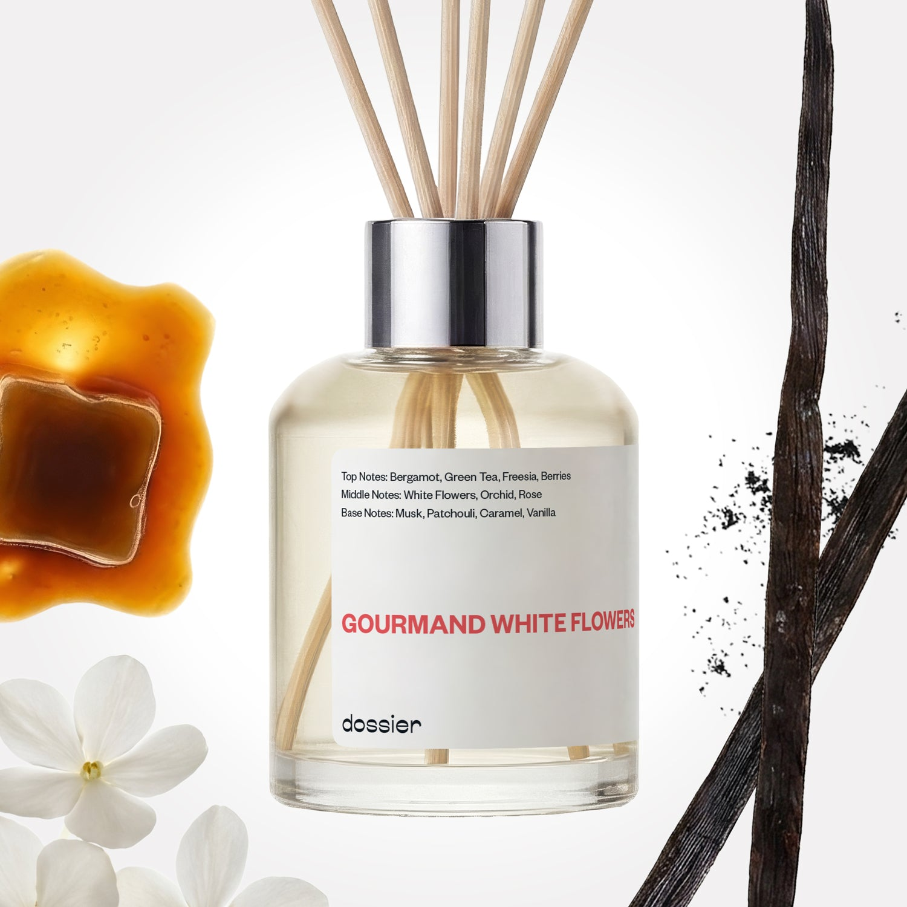

# Gourmand White Flowers Room Diffuser

- **Dossier Inspired by Viktor&Rolf's Flowerbomb Perfume**
- **URL:** https://dossier.co/products/gourmand-white-flowers-diffuser
- **SEO title:** flowerbomb diffuser Dupe impression - Gourmand White Flowers Room Diffuser

## Pricing (sizes)

| Size/SKU | Member price | List price | Currency |
|---|---|---|---|
| 40397936885827 | 34.2 | 38 | USD |

## Content (scent notes, about, editorial)

Back Home / Home Scents / Diffusers / GOURMAND WHITE FLOWERS ROOM DIFFUSER 

Sold out 

Gourmand White Flowers Room Diffuser

Size: 100ml / 3.4oz 

members: $34.20

Guest:
$38

Inspired by Viktor&Rolf's Flowerbomb Perfume Inspired by Viktor&Rolf's Flowerbomb Perfume 
Inspired by Viktor&Rolf's Flowerbomb Perfume 

Crafted in France 
Scent Family: gourmand 

Notify Me 

Scent Notes This perfume is: Sparkling, enchanting, youthful 
Main Notes:

White Flowers

Orchid

Rose

Caramel

Vanilla

top: The first notes you smell 
Bergamot, Green Tea, Freesia, Berries 
middle: The heart of the perfume 
White Flowers, Orchid, Rose 
base: The notes that linger all day 
Musk, Patchouli, Caramel, Vanilla 
ingredients: Bergamot Ess, Patchouli Ess, Benzoin Res, Hedione, Musk T, Benzyl Salicylate, Osyrol, Beta Ionone, Linalol, Ethyl Linalol, Iso E Super, Linalyl Acetate, Trimofix, Cedramber, Sandalore, Ethyl Vanilline, Ethyl Maltol, Coumarine 

Vegan
Cruelty-free

Clean ingredients

About In need of an instant mood booster? Treat yourself to a perfectly balanced blend of fizzy berries, rich caramel, woods, and a joyful bouquet of white flowers.

Concentration: 22%

About this diffuser. 
The perfume diffuses in its environment by a natural and gradual evaporation through the wooden sticks.
The oil concentrate is diluted in alcohol, just like your favorite EDP or perfume is.
The formula of each diffuser has been reworked to both comply with the air care standards and to function optimally when used with wooden sticks.
Our diffusers are formulated for safe and stress free sniffing, no additives necessary.

LEARN MORE 

Tips How to Use.
Set up is easy: Place the reeds into the fragrance, sit back and relax as the smell of luxury fills the room.
Keep it fresh: Turn the reeds over from time to time. Doing this every 2-3 days will improve the diffusion of fragrance in the room.
24/7 luxury: For every 100ml diffuser, the fragrance will last at least one month when used continuously.
Hit pause: Reeds can be removed to "take a break" from the scent, and put back in the fragrance whenever you want. Save it for a special occasion or keep the good smells flowing 24/7, it’s up to you!

Shipping + Returns
Free exchanges for all. Free returns with 

Standard Shipping (with 2+ items) Auto-selected with 2+ items 
FREE 

Standard Shipping Auto-selected under 2 items 
$3.95 

Express shipping: 2 business days Select in checkout 
$19.00 

Returns for Diffusers
We cannot accept any returns for diffusers that had been used. In order to return a diffuser, proceed to our regular returns portal, and upload and image of your unused diffuser. If your diffuser has been used, your return request will be denied. 

FAQs Are these fragrances long lasting? They are designed to be very long lasting, just like designer fragrances, in some cases even longer, depending on the composition. 
When does the new packaging come out? We'll begin rolling out our new packaging across the U.S. and international markets soon! If you want to shop IRL - our new packaging first hits stores on January 11, 2026 at Walmart. Please note that if you are shopping online, you may receive a combination of our current and new packaging while we transition our inventory. 
How will I know what scent I like? We get it, shopping for perfumes online is hard! That's why we created a scent quiz, which will find the perfect scent for you Take the quiz (opens in new tab) 
Unsure about something? Ask us! help@dossier.co 

Details An escape into the surreal splendor of the bright side

Flowerbomb, the 17-year-old explosive floral bouquet from Viktor & Rolf, encapsulates the very essence of purity, passion, and love. Think of it as the tasty olfactory equivalent of a chilly fountain in the middle of summer. 

First, there are notes of tea, bergamot, and Osmanthus – and then, there are touches of orchids, jasmine, and orange flowers. The overall effect is an aroma that is sensual and dreamy at the same time – a heavenly fragrance that sings of blossoming blooms and fragrant petals. 

The twist comes with the addition of patchouli, musk, and vanilla – a mystical combo that awakens the senses and arouses a feeling of superior calmness. Viktor & Rolf Flowerbomb is the perfume you need if you want an escape into the surreal splendor of the bright side. It echoes the lovely charms of mother nature, including the frozen tufts of grass across the snowfields, the dewy earth smiling at the blue sky, and the jungle foliage dancing to the tune of the north winds. 

Clean and charismatic, it gives you entry into the lovely green floral world: a fresh and flowery dynamic explosion of adaptability, individuality, and mystery. Viktor & Rolf Flowerbomb is an enchanted rose in the palm of your hand that casts a love spell on anybody who gets too close.
Feel the gentle breeze of isle air on your skin, as this mind-transporting fragrance conjures up a summer holiday on the lush volcanic French Polynesian islands. 

Even the perfume’s bottle has become awe-inspiring, with the semblance of a priceless diamond. If you’re not one for a dull-smelling perfume in a dull-looking bottle, but rather are a lover of the direct opposite, the Viktor & Rolf Flowerbomb is the perfume for you. 

So, how much does it go for? Most online retailers sell the Viktor & Rolf Flowerbomb Ruby Orchid for $33.00, Viktor & Rolf Flowerbomb Midnight for $168, Viktor & Rolf Flowerbomb Eau De Parfum for $118, Viktor & Rolf Flowerbomb 3-piece Perfume Set for $170, and Viktor & Rolf Flowerbomb Bloom for $165. You’ll also get the Viktor & Rolf Flowerbomb Eau De Parfum gift set for $135, Viktor & Rolf Flowerbomb Mariage Eau de Parfum for $115, Viktor & Rolf Flowerbomb Nectar for $175, Viktor & Rolf Flowerbomb Dew Eau de Parfum for $33.00 – $168.00, and Viktor & Rolf Flowerbomb Haute Couture Eau de Parfum for $2,500.00. 

Finally, if you want a scent that is inspired by the Flowerbomb Eau de Parfum but at a more affordable price, Dossier’s Gourmand White Flowers is your best choice. Featuring enveloping floral and spicy notes, our Viktor & Rolf Flowerbomb dupe is a zestful classic that conjures a feeling of calm, akin to taking a stroll along the beach on a moonlit night. It is uniquely designed to produce a mind’s eye view of the lotus and the yellow-pond lily as they yield to the sway of the ocean currents. Look no further if you want a truly sublime and delicious fragrance that provides sensual undertones to floral and spicy sensations. 

You Might Love 

4.6 

Rated 4.6 out of 5 stars 

Based on 57 reviews 

Reviews 57 (tab expanded) Questions (tab collapsed) 

Filters 
Write a Review (Opens in a new window) 

57 reviews 
Sort Highest Rating Most Helpful Photos & Videos Most Recent Oldest Lowest Rating Least Helpful 

K 

Krista 
Verified Reviewer 

6/29/26 

Rated 5 out of 5 stars 

SO GOOD PLEASE RESTOCK
The diffusers were the only reason I got the membership! Please bring them back! 

Read More Read more about this review 

Was this helpful? Yes, this review from Krista was helpful. 0 people voted yes No, this review from Krista was not helpful. 0 people voted no 

DP 

Dossier Perfumes 
6/29/26 
Krista, we hear you, those diffusers are missed around here too. Hopefully they’ll be back before long 😊

PM 

Pauline M. 

9/22/25 

Rated 5 out of 5 stars 

Light and effective.
I put this diffuser in my laundry room just inside the garage door (the family smokers smoke in the garage). This diffuser has eliminated the lingering stale smoke smell in my laundry room and also permeates throughout the house in a way that is unobtrusive but so fresh and pleasant. Every time I come home I am surprised how nice it smells. I have three dogs, one cat and two elementary aged kids. Kind of a big deal. I am already thinking about my next diffuser purchases from your company.

Read More Read more about this review 

Was this helpful? Yes, this review from Pauline M. was helpful. 0 people voted yes No, this review from Pauline M. was not helpful. 0 people voted no 

DP 

Dossier Perfumes 
9/26/25 
Pauline, fighting off smoke, pets, and kids? That diffuser’s basically the unsung hero of your house :u1F9B8:‍♀️. Glad it’s holding it down for you!

CF 

Cecilia F. 

9/4/25 

Rated 5 out of 5 stars 

I love it
excellent scent

Read More Read more about this review 
Translated from Spanish Show original 

Was this helpful? Yes, this review from Cecilia F. was helpful. 0 people voted yes No, this review from Cecilia F. was not helpful. 0 people voted no 

DP 

Dossier Perfumes 
9/8/25 
Gracias, Cecilia. Nos alegra que te encante.

CN 

Catherine N. 

3/1/25 

Rated 5 out of 5 stars 

Love, love, love the Diffuser
I love the diffuser. Every time I walk in my room, I remark on how wonderful it smells. Can't wait to try others.

Read More Read more about this review 

Was this helpful? Yes, this review from Catherine N. was helpful. 0 people voted yes No, this review from Catherine N. was not helpful. 0 people voted no 

DP 

Dossier Perfumes 
3/3/25 
Yass Catherine! That’s what we call a scent-sational home upgrade! Walking into a room that smells that good? Pure bliss. Can’t wait for you to try our other diffusers!

FD 

Felecia D. 

Verified Buyer 

3/1/25 

Rated 5 out of 5 stars 

Exceptional Scent
I put this in my bedroom and it scents the entire space without overwhelming the room. I'm obsessed!

Read More Read more about this review 

Was this helpful? Yes, this review from Felecia D. was helpful. 0 people voted yes No, this review from Felecia D. was not helpful. 0 people voted no 

DP 

Dossier Perfumes 
3/3/25 
Yass Felecia; that’s how you level up a space! A scent that fills the room without being too much? Total home fragrance goals!

Loading... 

Loading... 

Show More 

Inspired by  Baccarat Rouge 540 
Inspired by  Black Opium 
Inspired by  Love, Don't Be Shy 
Inspired by  Good Girl 
Inspired by  Libre 
Inspired by  Flowerbomb 
Inspired by  Light Blue 
Inspired by  Not a Perfume 
Inspired by  Aventus 
Inspired by  Bleu de Chanel 
Inspired by  Mon Paris 
Inspired by  Coco Mademoiselle 
Inspired by  Tom Ford for Men 
Inspired by  For Her 
Inspired by  J'Adore Dior 
Inspired by  Alien 
Inspired by  Black Opium Perfume 
Inspired by  Lost Cherry Perfume 

GET UP TO 30% OFF 

Find us at these retailers. 

Be the first to know. 
Submit 

Shop the following countries. United States 

Discover.
AI Scent Finder 
Blog (opens in new tab) 
Scent Family 
Layering 
Scent Quiz 

Help.
Contact Us 
Returns 
FAQ 
Testimonials 
Accessibility 

More.
Store Locator 
Boutique 
Refer A Friend 
Index 

Download our app now.

Find us at these retailers. 

Be the first to know. 
Submit 

Shop the following countries. United States 

Discover.
AI Scent Finder 
Blog (opens in new tab) 
Scent Family 
Layering 
Scent Quiz 

Help.
Contact Us 
Returns 
FAQ 
Testimonials 
Accessibility 

More.

## Main Image

