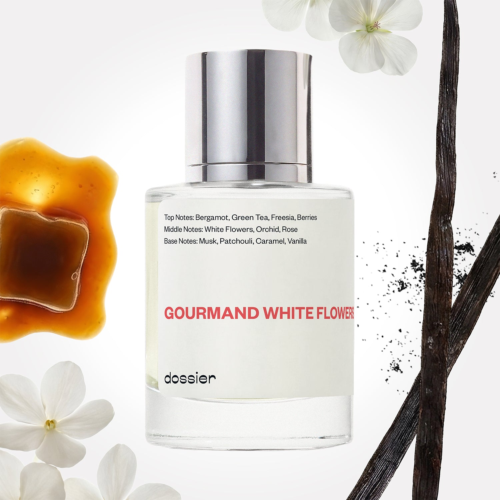

# Gourmand White Flowers

- **Dossier Inspired by Viktor&Rolf's Flowerbomb**
- **URL:** https://dossier.co/products/gourmand-white-flowers
- **SEO title:** Viktor&Rolf's Flowerbomb Dupe Perfume: Gourmand White Flowers - Dossier Perfumes

## Pricing (sizes)

| Size/SKU | Member price | List price | Currency |
|---|---|---|---|
| Fragrance+50ml/1.7oz | 26.1 | 29 | USD |
| 100ml | 44.1 | 49 | USD |
| 2x50ml | 52.2 | 58 | USD |

## Content (scent notes, about, editorial)

Back Home / Perfumes / Dossier Impressions / GOURMAND WHITE FLOWERS 

Women 

Bestseller 

Gourmand White Flowers

Eau de Parfum. Size: 100ml / 3.4oz 

members: $44.10

Guest:
$49

Inspired by Viktor&Rolf's Flowerbomb Inspired by Viktor&Rolf's Flowerbomb 
Inspired by Viktor&Rolf's Flowerbomb 

Retail price 180 Size
50ml $29

Best Value
100ml $49

Crafted in France 
Scent Family: gourmand 

Add to Cart 

Scent Notes This perfume is: Layers of sweet and sexy 
Main Notes:

White Flowers

Orchid

Rose

Caramel

Vanilla

top: The first notes you smell 
Bergamot, Green Tea, Freesia, Berries 
middle: The heart of the perfume 
White Flowers, Orchid, Rose 
base: The notes that linger all day 
Musk, Patchouli, Caramel, Vanilla 
ingredients: Alcohol Denat., Fragrance/Parfum, Water/Aqua/Eau, Benzyl Salicylate, Linalool, Tetramethyl Acetyloctahydronaphthalenes, Linalyl Acetate, Hexamethylindanopyran, Vanillin, Citrus Aurantium Bergamia (Bergamot) Peel Oil, Limonene, Coumarin, Pinene, Benzyl Alcohol, Rose Ketones, Hexadecanolactone, Benzyl Benzoate, Geranyl Acetate, Citral, Terpineol, Geraniol, Beta-Caryophyllene, Terpinolene, Cinnamyl Alcohol, Citronellol, Rose Flower Oil/Extract. 

Vegan
Cruelty-free

Clean ingredients

About Gourmand White Flowers (inspired by Viktor&Rolf's Flowerbomb) offers a sparkle of green tea, berries, caramel, and vanilla notes that play with orchid, jasmine, and rose. The fragrance trail is an intriguing woody orris accord that entwines with the floral heart.

Warm and feminine, Gourmand White Flowers (our impression of Viktor&Rolf's Flowerbomb) succeeds at being both sweet and sexy, with a powdery veil that offers sophistication to the gourmand notes. 

Scent Intensity: Significant 

Concentration: 18%

Gender: Feminine 

Shipping
Free shipping with 2+ items. 

Standard Shipping (with 2+ items) Auto-selected with 2+ items 
FREE 

Standard Shipping Auto-selected under 2 items 
$3.95 

Express shipping: 2 business days Select in checkout 
$19.00 

Returns
Free exchanges for all. Free returns with 

Exchanges
Free exchange, 1 time per order for all.

Returns
D+ members get 1 FREE return per order.
Non-members incur a $3.99/bottle return fee, 1 time per order.
Returns must be postmarked within 30 days of the initial order. Learn More 

FAQs Are these fragrances long lasting? They are designed to be very long lasting, just like designer fragrances, in some cases even longer, depending on the composition. 
When does the new packaging come out? We'll begin rolling out our new packaging across the U.S. and international markets soon! If you want to shop IRL - our new packaging first hits stores on January 11, 2026 at Walmart. Please note that if you are shopping online, you may receive a combination of our current and new packaging while we transition our inventory. 
How will I know what scent I like? We get it, shopping for perfumes online is hard! That's why we created a scent quiz, which will find the perfect scent for you Take the quiz (opens in new tab) 
Unsure about something? Ask us! help@dossier.co 

Details We are not associated or affiliated with the brands mentioned here in any way.
Gourmand White Flowers

An escape into the surreal splendor of the bright side

Flowerbomb, the 17-year-old explosive floral bouquet from Viktor & Rolf and the inspiration for Dossier’s Gourmand White Flowers, encapsulates the very essence of purity, passion, and love. Think of it as the tasty olfactory equivalent of a chilly fountain in the middle of summer. 

First, there are notes of tea, bergamot, and Osmanthus – and then, there are touches of orchids, jasmine, and orange flowers. The overall effect is an aroma that is sensual and dreamy at the same time – a heavenly fragrance that sings of blossoming blooms and fragrant petals. 

The twist comes with the addition of patchouli, musk, and vanilla – a mystical combo that awakens the senses and arouses a feeling of superior calmness. The luxury fragrance that Gourmand White Flowers is inspired by is the perfume you need if you want an escape into the surreal splendor of the bright side. It echoes the lovely charms of mother nature, including the frozen tufts of grass across the snowfields, the dewy earth smiling at the blue sky, and the jungle foliage dancing to the tune of the north winds. 

Clean and charismatic, it gives you entry into the lovely green floral world: a fresh and flowery dynamic explosion of adaptability, individuality, and mystery. The luxury fragrance that Gourmand White Flowers is inspired by is an enchanted rose in the palm of your hand that casts a love spell on anybody who gets too close.
Feel the gentle breeze of isle air on your skin, as this mind-transporting fragrance conjures up a summer holiday on the lush volcanic French Polynesian islands. 

Even the perfume’s bottle has become awe-inspiring, with the semblance of a priceless diamond. If you’re not one for a dull-smelling perfume in a dull-looking bottle, but rather are a lover of the direct opposite, the Viktor & Rolf Flowerbomb is the perfume for you. 

Finally, if you want a scent that is inspired by the Flowerbomb Eau de Parfum but at a more affordable price, Dossier’s Gourmand White Flowers is your best choice. Featuring enveloping floral and spicy notes, our dupe is a zestful classic that conjures a feeling of calm, akin to taking a stroll along the beach on a moonlit night. It is uniquely designed to produce a mind’s eye view of the lotus and the yellow-pond lily as they yield to the sway of the ocean currents. Look no further if you want a truly sublime and delicious fragrance that provides sensual undertones to floral and spicy sensations. 

Best Layered With Combine 2 of our perfumes to create a third scent with layering, curated by our nose. Learn more 

You Might Love 

4.6 

Rated 4.6 out of 5 stars 

Based on 4,109 reviews 

Reviews 4,109 (tab expanded) Questions 2 (tab collapsed) 

Filters 
Write a Review (Opens in a new window) 

4,109 reviews 
Sort Highest Rating Most Helpful Photos & Videos Most Recent Oldest Lowest Rating Least Helpful 

K 

Kelly 

6/29/26 

Rated 5 out of 5 stars 

Good stuff
I like this one. It doesn't smell exactly like Flower Bomb but definitely close enought so if you are looking to save money on a " knock-off" I wouldabsolutely recommend this one. Very nice fragrance 

Read More Read more about this review 

Was this helpful? Yes, this review from Kelly was helpful. 0 people voted yes No, this review from Kelly was not helpful. 0 people voted no 

DP 

Dossier Perfumes 
6/29/26 
Kelly, we’re thrilled you found a wallet-friendly way to enjoy those gourmand vibes without splashing on a high-end bottle. Thanks for recommending it and happy exploring more scents! ✨

EA 

Edilix A. 
Verified Buyer 

6/21/26 

Rated 5 out of 5 stars 

White flower 
Smells amazing 

Read More Read more about this review 

Was this helpful? Yes, this review from Edilix A. was helpful. 0 people voted yes No, this review from Edilix A. was not helpful. 0 people voted no 

DP 

Dossier Perfumes 
6/21/26 
We’re thrilled to hear that, Edilix! Thanks so much 😊

SB 

Sunny B. 
Verified Buyer 

6/12/26 

Rated 5 out of 5 stars 

Gourmand White Flowers
BEST EVER!!! SMELL SO GOOD! Seriously smells just like Flower Bomb. It is long lasting and strong. I get many compliments when wearing this.

Read More Read more about this review 

Was this helpful? Yes, this review from Sunny B. was helpful. 0 people voted yes No, this review from Sunny B. was not helpful. 0 people voted no 

DP 

Dossier Perfumes 
6/12/26 
Sunny, we’re so thrilled that Gourmand White Flowers is delivering those long-lasting vibes and all those compliments. Thanks for sharing your experience, here’s to many more radiant moments!

TM 

Tanika M. 
Verified Buyer 

6/10/26 

Rated 5 out of 5 stars 

One of my favs
This is very close to the real deal it is one of my favs

Read More Read more about this review 

Was this helpful? Yes, this review from Tanika M. was helpful. 0 people voted yes No, this review from Tanika M. was not helpful. 0 people voted no 

DP 

Dossier Perfumes 
6/10/26 
Tanika, we’re thrilled it’s become one of your favorites ✨

CB 

Crystal B. 
Verified Buyer 

6/9/26 

Rated 5 out of 5 stars 

Gourmand White Flowers 
It smells so similar to Victor & Rolf Flower Bomb. Smells good and last a long time. 

Read More Read more about this review 

Was this helpful? Yes, this review from Crystal B. was helpful. 0 people voted yes No, this review from Crystal B. was not helpful. 0 people voted no 

DP 

Dossier Perfumes 
6/9/26 
Crystal, we’re thrilled Gourmand White Flowers is lasting well and winning you compliments. Thanks for sharing your experience!

Loading... 

Loading... 

Show More 

Inspired by  Baccarat Rouge 540 
Inspired by  Black Opium 
Inspired by  Love, Don't Be Shy 
Inspired by  Good Girl 
Inspired by  Libre 
Inspired by  Flowerbomb 
Inspired by  Light Blue 
Inspired by  Not a Perfume 
Inspired by  Aventus 
Inspired by  Bleu de Chanel 
Inspired by  Mon Paris 
Inspired by  Coco Mademoiselle 
Inspired by  Tom Ford for Men 
Inspired by  For Her 
Inspired by  J'Adore Dior 
Inspired by  Alien 
Inspired by  Black Opium Perfume 
Inspired by  Lost Cherry Perfume 

GET UP TO 30% OFF 

Find us at these retailers. 

Be the first to know. 
Submit 

Shop the following countries. United States 

Discover.
AI Scent Finder 
Blog (opens in new tab) 
Scent Family 
Layering 
Scent Quiz 

Help.
Contact Us 
Returns 
FAQ 
Testimonials 
Accessibility 

More.
Store Locator 
Boutique 
Refer A Friend 
Index 

Download our app now.

Find us at these retailers. 

Be the first to know. 
Submit 

Shop the following countries. United States 

Discover.
AI Scent Finder 
Blog (opens in new tab) 
Scent Family 
Layering 
Scent Quiz 

Help.
Contact Us 
Returns 
FAQ 
Testimonials 
Accessibility 

More.

## Main Image

