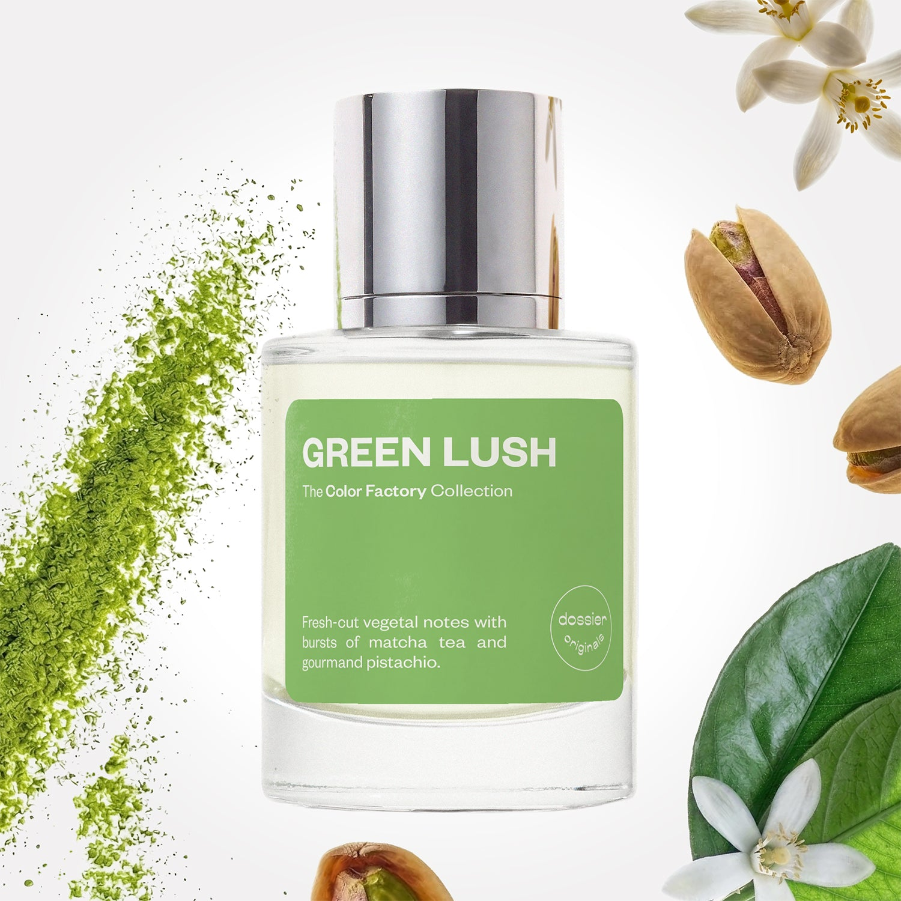

# Green Lush

- **Dossier Dossier Originals**
- **URL:** https://dossier.co/products/green-lush
- **SEO title:** Green Lush

## Pricing (sizes)

| Size/SKU | Member price | List price | Currency |
|---|---|---|---|
| 50ml | 35.1 | 39 | USD |
| BF+Free | 0 | 0 | USD |

## Content (scent notes, about, editorial)

Back Home / Perfumes / Dossier Originals / GREEN LUSH 

Unisex 

New 

Green Lush

Eau de Parfum. Size: 50ml / 1.7oz 

members: $35.10

Guest:
$39

Dossier Originals: The color factory collection 

Crafted in France 
Scent Family: fresh 

Add to Cart 

Scent Notes Main Notes:

Bergamot

Matcha Accord

Petitgrain

Pistachio

top: The first notes you smell 
bergamot, Lemon, Cassis, Mint 
middle: The heart of the perfume 
matcha accord, Galbanum, Eucalyptus, Sage, petitgrain 
base: The notes that linger all day 
pistachio , Violet Leaf, White Musks 
ingredients: Alcohol Denat., Fragrance/Parfum, Water/Aqua/Eau, Limonene, Citrus Aurantium Bergamia (Bergamot) Peel Oil, Linalyl Acetate, Citrus Limon (Lemon) Peel Oil, Citrus Aurantium Peel Oil, Linalool, Pinene, Hexyl Cinnamal, Citral, Terpineol, Menthol, Geraniol, Mentha Viridis (Spearmint) Leaf Oil, Terpinolene, Carvone, Benzaldehyde, Beta-Caryophyllene, Eucalyptus Globulus Oil, Citronellol, Alpha-Terpinene, Camphor, Geranyl Acetate, Rose Ketones, Methyl 2-Octynoate, Amyl Cinnamal, Farnesol, Benzyl Salicylate. 

Vegan
Cruelty-free

Clean ingredients

About Sniff freshly cut zest that’s bright, fresh, and sweetened with matcha tea and pistachio bliss. 

Green lush opens with a refreshing citrus burst of bergamot, lemon. mint, and a hint of cassis. 
The fragrance then unfolds into a heart of matcha (tea) accord interlaced with green, earthy, and clarifying notes of galbanum, eucalyptus, sage, and petitgrain before drying down to a sweet and sensual base of pistachio accord, supported by notes of violet leaf and white musks.

Enjoy a sensual, subtle gourmand twist on a typical down-to-earthy grassy fragrance. 

Scent Intensity: Significant 

Concentration: 18%

Gender: Unisex 

Shipping
Free shipping with 2+ items. 

Standard Shipping (with 2+ items) Auto-selected with 2+ items 
FREE 

Standard Shipping Auto-selected under 2 items 
$3.95 

Express shipping: 2 business days Select in checkout 
$19.00 

Returns
Free exchanges for all. Free returns with 

Exchanges
Free exchange, 1 time per order for all.

Returns
D+ members get 1 FREE return per order.
Non-members incur a $3.99/bottle return fee, 1 time per order.
Returns must be postmarked within 30 days of the initial order. Learn More 

FAQs Are these fragrances long lasting? They are designed to be very long lasting, just like designer fragrances, in some cases even longer, depending on the composition. 
When does the new packaging come out? We'll begin rolling out our new packaging across the U.S. and international markets soon! If you want to shop IRL - our new packaging first hits stores on January 11, 2026 at Walmart. Please note that if you are shopping online, you may receive a combination of our current and new packaging while we transition our inventory. 
How will I know what scent I like? We get it, shopping for perfumes online is hard! That's why we created a scent quiz, which will find the perfect scent for you Take the quiz (opens in new tab) 
Unsure about something? Ask us! help@dossier.co 

Best Layered With Combine 2 of our perfumes to create a third scent with layering, curated by our nose. Learn more 

You Might Love 

3.1 

Rated 3.1 out of 5 stars 

Based on 38 reviews 

Reviews 38 (tab expanded) Questions (tab collapsed) 

Filters 
Write a Review (Opens in a new window) 

38 reviews 
Sort Highest Rating Most Helpful Photos & Videos Most Recent Oldest Lowest Rating Least Helpful 

A 

Aviel 

6/12/26 

Rated 5 out of 5 stars 

5 Stars
Great scent

Read More Read more about this review 

Was this helpful? Yes, this review from Aviel was helpful. 0 people voted yes No, this review from Aviel was not helpful. 0 people voted no 

J 

Jed 
Verified Reviewer 

5/24/26 

Rated 5 out of 5 stars 

Unique & Uplifting
I can see this one being a little more on the adventurous side.
Very green and fresh. Very creamy and slightly gourmand-y. Feels like you're walking down by the citrus trees in your very vegetal garden with a little bit of your matcha latte splashed on your face. The citrus is very fresh and just slightly bitter. There's almost a tomato leaf-like note in here. Maybe the galbanum? The Petigrain gives it a nice aromatic touch that leans almost bitter sweet. The pistachio in the base rounds out all the sharper vegetal notes so that it's soft and creamy (maybe you got your matcha latte with pistachio milk?) Overall just a really great experience that develops as it dries down!
Spring in a bottle but can also see this being fresh and citrusy enough to be great as a summer scent as well.

Read More Read more about this review 

Was this helpful? Yes, this review from Jed was helpful. 0 people voted yes No, this review from Jed was not helpful. 0 people voted no 

DP 

Dossier Perfumes 
5/24/26 
Hey Jed! Love how you pick up all those layered green and creamy vibes. It shifts on skin like a stroll through a spring garden. Enjoy it this summer too!

TC 

Tania C. 

7/9/25 

Rated 5 out of 5 stars 

Beautiful Calm & Complex
I went to the new Dossier store in SoHo, NY and I thought this was outstanding. I couldn’t stop sniffing my wrists and planning to purchase it. It is subtle, memorable, complex and calming.

Read More Read more about this review 

Was this helpful? Yes, this review from Tania C. was helpful. 0 people voted yes No, this review from Tania C. was not helpful. 0 people voted no 

DP 

Dossier Perfumes 
7/14/25 
You in SoHo, nose-deep in Dossier? Iconic behavior, Tania! Come back soon, we’ve got more magic waiting!

MC 

Mona C. 

6/10/25 

Rated 5 out of 5 stars 

So soft and sweet! Very
So soft and sweet! Very fresh scent! Love this for spring and summer!!

Read More Read more about this review 

Was this helpful? Yes, this review from Mona C. was helpful. 0 people voted yes No, this review from Mona C. was not helpful. 0 people voted no 

DP 

Dossier Perfumes 
6/19/25 
Yes, Mona! You've perfectly captured why we created this fragrance. Enjoy!

G 

Goddess 

5/17/25 

Rated 5 out of 5 stars 

5 Stars
My skin is quite dry, causing certain fragrance notes to become prominent. I also experience headaches from green notes. Therefore, I was eager to test Green Lush. Upon application to clean skin, the mint, sage, and eucalyptus were immediately apparent. After drying, the violet emerged, complemented by white musks, creating a pleasant and easily wearable fragrance suitable for professional settings. I am confident my patients will find it agreeable and unobtrusive.

Read More Read more about this review 

Was this helpful? Yes, this review from Goddess was helpful. 0 people voted yes No, this review from Goddess was not helpful. 0 people voted no 

DP 

Dossier Perfumes 
5/20/25 
Dry skin drama and picky notes, Leilani? A real perfumer’s puzzle. But it sounds like you cracked the code with this one: fresh, mellow, and totally work-approved. Doctor’s orders: keep on smelling this good!

Loading... 

Loading... 

Show More 

Inspired by  Baccarat Rouge 540 
Inspired by  Black Opium 
Inspired by  Love, Don't Be Shy 
Inspired by  Good Girl 
Inspired by  Libre 
Inspired by  Flowerbomb 
Inspired by  Light Blue 
Inspired by  Not a Perfume 
Inspired by  Aventus 
Inspired by  Bleu de Chanel 
Inspired by  Mon Paris 
Inspired by  Coco Mademoiselle 
Inspired by  Tom Ford for Men 
Inspired by  For Her 
Inspired by  J'Adore Dior 
Inspired by  Alien 
Inspired by  Black Opium Perfume 
Inspired by  Lost Cherry Perfume 

GET UP TO 30% OFF 

Find us at these retailers. 

Be the first to know. 
Submit 

Shop the following countries. United States 

Discover.
AI Scent Finder 
Blog (opens in new tab) 
Scent Family 
Layering 
Scent Quiz 

Help.
Contact Us 
Returns 
FAQ 
Testimonials 
Accessibility 

More.
Store Locator 
Boutique 
Refer A Friend 
Index 

Download our app now.

Find us at these retailers. 

Be the first to know. 
Submit 

Shop the following countries. United States 

Discover.
AI Scent Finder 
Blog (opens in new tab) 
Scent Family 
Layering 
Scent Quiz 

Help.
Contact Us 
Returns 
FAQ 
Testimonials 
Accessibility 

More.

## Main Image

