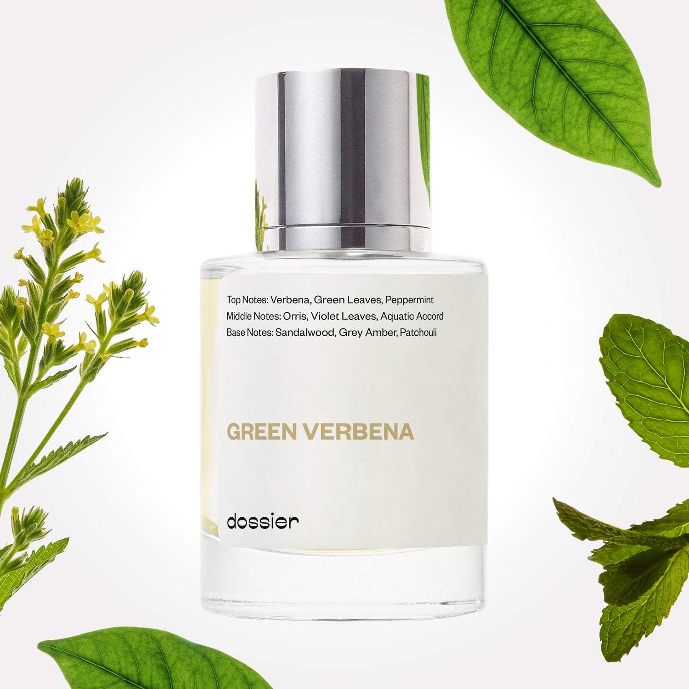

# Green Verbena

- **Dossier Inspired by Creed's Green Irish Tweed**
- **URL:** https://dossier.co/products/green-verbena
- **SEO title:** Creed's Green Irish Tweed Dupe Perfume: Green Verbena - Dossier Perfumes

## Pricing (sizes)

| Size/SKU | Member price | List price | Currency |
|---|---|---|---|
| 32212797063235 | 48.6 | 54 | USD |

## Content (scent notes, about, editorial)

Back Home / Perfumes / Dossier Impressions / GREEN VERBENA 

Unisex 

It's back! 

Green Verbena

Eau de Parfum. Size: 50ml / 1.7oz 

members: $48.60

Guest:
$54

Inspired by Creed's Green Irish Tweed Inspired by Creed's Green Irish Tweed 
Inspired by Creed's Green Irish Tweed 

Retail price 345 Crafted in France 
Scent Family: herbal 

Notify Me 

Scent Notes This perfume is: A myriad of fresh and green 
Main Notes:

Verbena

Green Leaves

Peppermint

top: The first notes you smell 
Verbena, Green Leaves, Peppermint 
middle: The heart of the perfume 
Orris, Violet Leaves, Aquatic accord 
base: The notes that linger all day 
Sandalwood, Grey Amber, Patchouli 
ingredients: Alcohol, Water, Parfum/Perfume, alpha-iso-Methylionone, Citral, Coumarin, Citronellol, Limonene, Eugenol, Farnesol, Geraniol, Hydroxycitronellal, Linalool, Methyl 2-octynoate (Methyl heptine carbonate). 

Vegan
Cruelty-free

Clean ingredients

About Green Verbena (inspired by Creed's Green Irish Tweed) opens with a fresh, peerless, expressive combination of verbena, peppermint and green leaves. The heart of the fragrance continues in the same spirit, with the astonishing pairing of violet and the aquatic nature of orris, subtly supported by a woody ambery accord.

Refined yet casual, vintage yet eternal, Green Verbena (our impression of Creed's Green Irish Tweed) is as effortlessly masculine as an English gentleman's country tweed. 

Scent Intensity: Significant 

Concentration: 18%

Gender: Unisex 

Shipping
Free shipping with 2+ items. 

Standard Shipping (with 2+ items) Auto-selected with 2+ items 
FREE 

Standard Shipping Auto-selected under 2 items 
$3.95 

Express shipping: 2 business days Select in checkout 
$19.00 

Returns
Free exchanges for all. Free returns with 

Exchanges
Free exchange, 1 time per order for all.

Returns
D+ members get 1 FREE return per order.
Non-members incur a $3.99/bottle return fee, 1 time per order.
Returns must be postmarked within 30 days of the initial order. Learn More 

FAQs Are these fragrances long lasting? They are designed to be very long lasting, just like designer fragrances, in some cases even longer, depending on the composition. 
When does the new packaging come out? We'll begin rolling out our new packaging across the U.S. and international markets soon! If you want to shop IRL - our new packaging first hits stores on January 11, 2026 at Walmart. Please note that if you are shopping online, you may receive a combination of our current and new packaging while we transition our inventory. 
How will I know what scent I like? We get it, shopping for perfumes online is hard! That's why we created a scent quiz, which will find the perfect scent for you Take the quiz (opens in new tab) 
Unsure about something? Ask us! help@dossier.co 

Details We are not associated or affiliated with the brands mentioned here in any way.
Green Verbena

A Timeless Scent for The Modern Man

Fougères are well known for their savory spices and woody notes, making them a popular designer fragrance choice. Green, aromatic, and incredibly fresh, Creed’s Green Irish Tweed (the fragrance that Dossier’s Green Verbena is inspired by) fits right into this category. Natural woodiness meets pure masculinity in this delectable concoction that never strays too far into overwhelming territory.

The old adage holds true: a classic never goes out of style. Similarly, the luxury fragrance that Green Verbena is inspired by is a timeless classic, effortlessly relevant, and impeccable. No surprise, then, that the luxury scent that Green Verbena is inspired by is still one of the oldest fragrances produced and sold worldwide today.

The luxury fragrance that Green Verbena is inspired by opens with aromatic lemon and verbena, perfectly cooled down with a hint of peppermint. We’d describe the scent as mossy and earthy, with a citrusy kick provided by the lemon verbena. What we like most about this fragrance is how nicely it settles into its heart – transforming into an incredibly refined and elegant aroma that’s very easy to like. Also present in an arrangement of geranium and lavender that helps create the classic fougère structure. To finish it off, a deep, rich cedarwood scent is sprinkled over bright oakmoss, creating a scent that’s at the same time uplifting and distinctly forest-like.

The luxury fragrance that Green Verbena is inspired by shares several similarities with another iconic scent – Creed Aventus (the luxury fragrance that Dossier’s Musky Oakmoss is inspired by). These are probably the two most popular perfumes from the French perfume house today. And one question we often get is: which one should I pick? How would you rank the two?

Both fragrances smell strong and masculine while remaining fairly woody. But that’s about where their similarities end. For one, the luxury fragrance that Dossier’s Musky Oakmoss is inspired by smells sweet and citrusy. On the other hand, the luxury fragrance that Green Verbena is inspired by comes across as fresh and woody with fewer sweeter notes.

This scent profile makes the luxury fragrance that Dossier’s Musky Oakmoss is inspired by an excellent choice for any weather and any situation. In contrast, we’d save the luxury cologne that Green Verbena is inspired by for cooler weather (think spring) or evening dates since it has a more mature, refined scent.

Creed perfumes are some of the most sophisticated fragrances in the world, and aficionados claim they’re impossible to dupe. Whether or not that’s true, what we do know for sure is that the luxury brand’s perfumes are, of course, super expensive and out of reach for most people. So, what’s a devotee to this luxury brand do when he or she wants Creed’s Green Irish Tweed but can’t justify the $320 price tag for a 50 ml (1.7 oz) bottle? Try this: Dossier’s Green Verbena. Our dupe gives hints of woodsy and earthy smells, reminiscent of the original fragrance, but for only a fraction of the price. Discover our dupe for a powerful, elegant, and effortlessly masculine fragrance.

You Might Love 

4.1 

Rated 4.1 out of 5 stars 

Based on 291 reviews 

Reviews 291 (tab expanded) Questions (tab collapsed) 

Filters 
Write a Review (Opens in a new window) 

291 reviews 
Sort Highest Rating Most Helpful Photos & Videos Most Recent Oldest Lowest Rating Least Helpful 

CS 

carlos s. 

10/15/25 

Rated 5 out of 5 stars 

Excellent perfum
I loved

Read More Read more about this review 

Was this helpful? Yes, this review from carlos s. was helpful. 0 people voted yes No, this review from carlos s. was not helpful. 0 people voted no 

DP 

Dossier Perfumes 
10/15/25 
Amazing to hear you’re loving it, Carlos 😊 Enjoy all the compliments headed your way.

JL 

Jason L. 

8/27/25 

Rated 5 out of 5 stars 

Stick it out!
For some reason, I think this fragrance smells awful when you first spray it on! It takes a minute to mellow out, and then you start to latch onto a bunch of great, subtle little nuances. There's something wonderfully fresh that lingers on and lasts quite a while (minty?). Worth trying on fully to see if you like it. . . I love this one!

Read More Read more about this review 

Was this helpful? Yes, this review from Jason L. was helpful. 0 people voted yes No, this review from Jason L. was not helpful. 0 people voted no 

DP 

Dossier Perfumes 
9/1/25 
Jason, that advice is golden! Some scents are slow-burning love stories, and we're so glad this one won you over once it settled. Thanks for giving it a full chance!

C 

Casey 

8/7/25 

Rated 5 out of 5 stars 

5 Stars
New favorite!

Read More Read more about this review 

Was this helpful? Yes, this review from Casey was helpful. 0 people voted yes No, this review from Casey was not helpful. 0 people voted no 

DP 

Dossier Perfumes 
8/22/25 
That’s amazing, Casey. Finding a new go-to is always a special moment!

C 

Casey 

8/7/25 

Rated 5 out of 5 stars 

5 Stars
New favorite!

Read More Read more about this review 

Was this helpful? Yes, this review from Casey was helpful. 0 people voted yes No, this review from Casey was not helpful. 0 people voted no 

DP 

Dossier Perfumes 
8/22/25 
That’s amazing, Casey. Finding a new go-to is always a special moment!

S 

Santrea 

7/30/25 

Rated 5 out of 5 stars 

5 Stars
smells so good!

Read More Read more about this review 

Was this helpful? Yes, this review from Santrea was helpful. 0 people voted yes No, this review from Santrea was not helpful. 0 people voted no 

DP 

Dossier Perfumes 
9/4/25 
That’s what we love to hear, Santrea; nothing beats a scent that just makes you smile! 🌸

Loading... 

Loading... 

Show More 

Inspired by  Baccarat Rouge 540 
Inspired by  Black Opium 
Inspired by  Love, Don't Be Shy 
Inspired by  Good Girl 
Inspired by  Libre 
Inspired by  Flowerbomb 
Inspired by  Light Blue 
Inspired by  Not a Perfume 
Inspired by  Aventus 
Inspired by  Bleu de Chanel 
Inspired by  Mon Paris 
Inspired by  Coco Mademoiselle 
Inspired by  Tom Ford for Men 
Inspired by  For Her 
Inspired by  J'Adore Dior 
Inspired by  Alien 
Inspired by  Black Opium Perfume 
Inspired by  Lost Cherry Perfume 

GET UP TO 30% OFF 

Find us at these retailers. 

Be the first to know. 
Submit 

Shop the following countries. United States 

Discover.
AI Scent Finder 
Blog (opens in new tab) 
Scent Family 
Layering 
Scent Quiz 

Help.
Contact Us 
Returns 
FAQ 
Testimonials 
Accessibility 

More.
Store Locator 
Boutique 
Refer A Friend 
Index 

Download our app now.

Find us at these retailers. 

Be the first to know. 
Submit 

Shop the following countries. United States 

Discover.
AI Scent Finder 
Blog (opens in new tab) 
Scent Family 
Layering 
Scent Quiz 

Help.
Contact Us 
Returns 
FAQ 
Testimonials 
Accessibility 

More.

## Main Image

