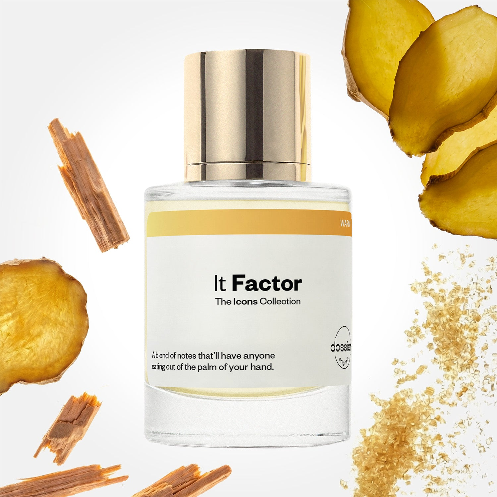

# It Factor

- **Dossier Dossier Originals**
- **URL:** https://dossier.co/products/it-factor
- **SEO title:** It Factor

## Pricing (sizes)

| Size/SKU | Member price | List price | Currency |
|---|---|---|---|
| 50ml | 44.1 | 49 | USD |
| BF+Free | 90 | 100 | USD |
| travel+duo+(50ml+11ml) | 56.7 | 63 | USD |

## Content (scent notes, about, editorial)

Back Home / Perfumes / Dossier Originals / IT FACTOR 

Unisex 

New 

It Factor

Eau de Parfum. Size: 50ml / 1.7oz 

members: $44.10

Guest:
$49

Dossier Originals: The icons collection 
Our most noteworthy fragrances EVER.
Expertly crafted magic with your most beloved notes via the Creative Lab.

Crafted in France 
Scent Family: warm 

Add to Cart 

Scent Notes Main Notes:

Ginger

Cardamom

Incense

Silky Musk

Brown Sugar

Sandalwood

Vanilla Extract

top: The first notes you smell 
Ginger, Cardamom 
middle: The heart of the perfume 
Violet, Incense, Silky Musk 
base: The notes that linger all day 
Brown Sugar, Sandalwood, Vanilla Extract, Tonka Bean 
ingredients: Alcohol Denat., Fragrance/Parfum, Tetramethyl Acetyloctahydronaphthalenes, Water/Aqua/Eau, Vanillin, Hexamethylindanopyran, Juniperus Virginiana Oil, Linalyl Acetate, Linalool, Limonene, Citrus Aurantium Peel Oil, Alpha-Isomethyl Ionone, Pinene, Coumarin, Terpinolene, Benzaldehyde, Beta-Caryophyllene, Citral, Rose Ketones, Citronellol, Geranyl Acetate, Benzyl Benzoate, Terpineol, Geraniol, Farnesol, Benzyl Alcohol, Benzyl Cinnamate, Cinnamal, Eugenol, Isoeugenol, Alpha-Terpinene, Camphor, Carvone. 

Vegan
Cruelty-free

Clean ingredients

About Warm, sensual, and delectable. It Factor is the French expression “oh là là” in a bottle. Enjoy a comforting, invigorating, and spicy blend upon first sniff, thanks to the top notes of ginger and cardamom. 

The scent then opens up and embraces its sultry side with smoky incense, silky musk, and underlying violet notes at the heart. Once settled on the skin, the gourmand and creamy facets of the fragrance come out to play. Relish in a lingering blend of delectable brown sugar, sandalwood, vanilla extract, and tonka bean at the base. 

Captivating, addictive, and utterly intoxicating. This scent will have others saying, “Call me?” all day. 

Scent Intensity: Statement 

Concentration: 25%

Gender: Unisex 

Shipping
Free shipping with 2+ items. 

Standard Shipping (with 2+ items) Auto-selected with 2+ items 
FREE 

Standard Shipping Auto-selected under 2 items 
$3.95 

Express shipping: 2 business days Select in checkout 
$19.00 

Returns
Free exchanges for all. Free returns with 

Exchanges
Free exchange, 1 time per order for all.

Returns
D+ members get 1 FREE return per order.
Non-members incur a $3.99/bottle return fee, 1 time per order.
Returns must be postmarked within 30 days of the initial order. Learn More 

FAQs Are these fragrances long lasting? They are designed to be very long lasting, just like designer fragrances, in some cases even longer, depending on the composition. 
When does the new packaging come out? We'll begin rolling out our new packaging across the U.S. and international markets soon! If you want to shop IRL - our new packaging first hits stores on January 11, 2026 at Walmart. Please note that if you are shopping online, you may receive a combination of our current and new packaging while we transition our inventory. 
How will I know what scent I like? We get it, shopping for perfumes online is hard! That's why we created a scent quiz, which will find the perfect scent for you Take the quiz (opens in new tab) 
Unsure about something? Ask us! help@dossier.co 

Best Layered With Combine 2 of our perfumes to create a third scent with layering, curated by our nose. Learn more 

You Might Love 

4.4 

Rated 4.4 out of 5 stars 

Based on 216 reviews 

Reviews 216 (tab expanded) Questions (tab collapsed) 

Filters 
Write a Review (Opens in a new window) 

216 reviews 
Sort Highest Rating Most Helpful Photos & Videos Most Recent Oldest Lowest Rating Least Helpful 

J 

Jeanette 

6/17/26 

Rated 5 out of 5 stars 

5 Stars
Amazing by itself or to layer. Long lasting!

Read More Read more about this review 

Was this helpful? Yes, this review from Jeanette was helpful. 0 people voted yes No, this review from Jeanette was not helpful. 0 people voted no 

C 

Christine 

6/3/26 

Rated 5 out of 5 stars 

Go to 
Not a bot, real person here. I was shopping in target a few months back and saw their display. I smelled pretty much all of them but this one I sprayed on me. The scent lingers on the clothes throughout the day and I find it to be the most comforting but also **** spicy, creamy smell. I’m usually a coconut scent girly but this is my favorite for when I’m going out, or feeling myself. I catch whiffs throughout the day when sprayed on clothes and I love it! Lasts long, would recommend.

Read More Read more about this review 

Was this helpful? Yes, this review from Christine was helpful. 0 people voted yes No, this review from Christine was not helpful. 0 people voted no 

DP 

Dossier Perfumes 
6/3/26 
Christine, we’re thrilled that you found your go-to vibe in store and that it keeps giving you those cozy spicy creamy moments all day long. Thanks for recommending!

K 

Kelly 

5/30/26 

Rated 5 out of 5 stars 

5 Stars
Delicious! A vanilla potion for adults. Will absolutely be buying this again.

Read More Read more about this review 

Was this helpful? Yes, this review from Kelly was helpful. 0 people voted yes No, this review from Kelly was not helpful. 0 people voted no 

E 

Emmie 
Verified Buyer 

5/26/26 

Rated 5 out of 5 stars 

Obsessed 
This is THE perfume. It’s warm and spicy, and not overwhelming. I usually only like fresh/ citrusy perfumes and I am so excited I finally found a perfume like this that I like. Also I have literally everyone stopping me and asking me what Im wearing. Its addictive and unique. 10/10

Read More Read more about this review 

Was this helpful? Yes, this review from Emmie was helpful. 0 people voted yes No, this review from Emmie was not helpful. 0 people voted no 

DP 

Dossier Perfumes 
5/26/26 
Emmie, we can’t get over how this scent flipped your fresh citrus love on its head, but in the best way. It’s so cool everyone’s asking. Keep enjoying those compliments!

CS 

Constantin S. 
Verified Buyer 

5/21/26 

Rated 5 out of 5 stars 

Perfect scentt
This has quickly become one of my favorite fragrances. It opens with this addictive spicy blend of ginger and cardamom, then dries down into the warmest mix of sandalwood, vanilla, brown sugar, and musk. It smells clean, cozy, ****, and expensive all at once. The longevity is amazing, and every time I wear it, someone asks what I’m wearing. Definitely one of the best warm unisex scents I’ve tried lately.

Read More Read more about this review 

Was this helpful? Yes, this review from Constantin S. was helpful. 0 people voted yes No, this review from Constantin S. was not helpful. 0 people voted no 

DP 

Dossier Perfumes 
5/21/26 
Constantin, wow we’re thrilled IT Factor is hitting the spot! Glad it’s lasting and sparking compliments. Keep layering this gem whenever you want that cozy warmth going strong.

Loading... 

Loading... 

Show More 

Inspired by  Baccarat Rouge 540 
Inspired by  Black Opium 
Inspired by  Love, Don't Be Shy 
Inspired by  Good Girl 
Inspired by  Libre 
Inspired by  Flowerbomb 
Inspired by  Light Blue 
Inspired by  Not a Perfume 
Inspired by  Aventus 
Inspired by  Bleu de Chanel 
Inspired by  Mon Paris 
Inspired by  Coco Mademoiselle 
Inspired by  Tom Ford for Men 
Inspired by  For Her 
Inspired by  J'Adore Dior 
Inspired by  Alien 
Inspired by  Black Opium Perfume 
Inspired by  Lost Cherry Perfume 

GET UP TO 30% OFF 

Find us at these retailers. 

Be the first to know. 
Submit 

Shop the following countries. United States 

Discover.
AI Scent Finder 
Blog (opens in new tab) 
Scent Family 
Layering 
Scent Quiz 

Help.
Contact Us 
Returns 
FAQ 
Testimonials 
Accessibility 

More.
Store Locator 
Boutique 
Refer A Friend 
Index 

Download our app now.

Find us at these retailers. 

Be the first to know. 
Submit 

Shop the following countries. United States 

Discover.
AI Scent Finder 
Blog (opens in new tab) 
Scent Family 
Layering 
Scent Quiz 

Help.
Contact Us 
Returns 
FAQ 
Testimonials 
Accessibility 

More.

## Main Image

