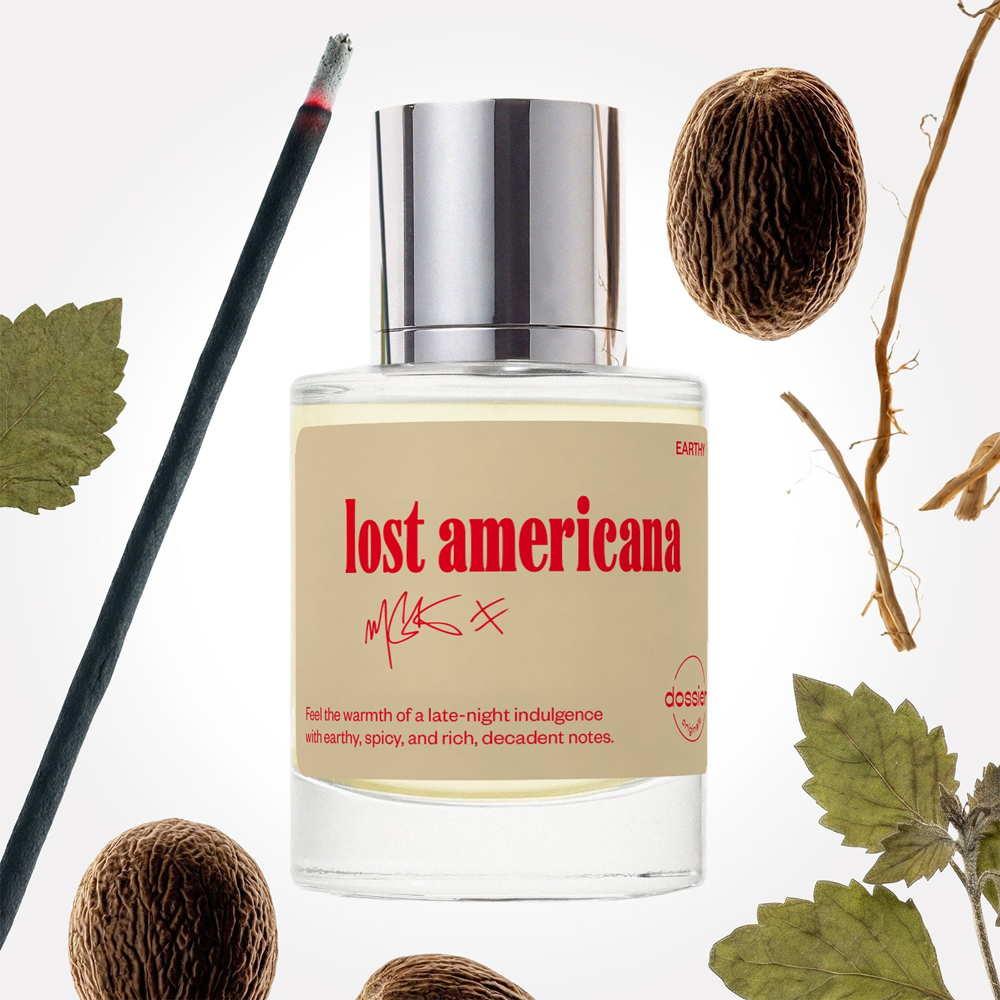

# Lost Americana

- **Dossier Dossier Originals**
- **URL:** https://dossier.co/products/lost-americana
- **SEO title:** LOST AMERICANA

## Pricing (sizes)

| Size/SKU | Member price | List price | Currency |
|---|---|---|---|
| 50ml | 44.1 | 49 | USD |
| 2x50ml | 88.2 | 98 | USD |

## Content (scent notes, about, editorial)

Back Home / Perfumes / Dossier Originals / LOST AMERICANA 

Unisex 

Lost Americana

Eau de Parfum. Size: 50ml / 1.7oz 

members: $44.10

Guest:
$49

Dossier Originals: mgk Collection 
Every fragrance has an origin story—this is lost americana's. From evocative nostalgia to alluring indulgence, discover the pure chemistry of our collab with mgk.

Crafted in France 
Scent Family: earthy 

Add to Cart 

Scent Notes Main Notes:

Incense

Nutmeg

Vetiver

Patchouli

top: The first notes you smell 
Incense, Almond, Pink Pepper 
middle: The heart of the perfume 
Nutmeg, Myrrh, Cinnamon 
base: The notes that linger all day 
Vetiver, Patchouli, Suede, Vanilla, Chocolate 
ingredients: Alcohol Denat., Fragrance/Parfum, Water/Aqua/Eau, Tetramethyl Acetyloctahydronaphthalenes, Pogostemon Cablin Oil, Coumarin, Citrus Aurantium Bergamia (Bergamot) Peel Oil, Linalyl Acetate, Linalool, Limonene, Pinene, Beta-Caryophyllene, Cinnamyl Alcohol, Acetyl Cedrene, Benzaldehyde, Cinnamomum Zeylanicum Bark Oil, Cinnamal, Rose Ketones, Citral, Vanillin, Eugenol, Terpinolene, Alpha-Terpinene, Benzyl Benzoate, Geranyl Acetate, Terpineol, Isoeugenol, Benzyl Cinnamate, Geraniol.

Vegan
Cruelty-free

Clean ingredients

About Crafted by mgk and Dossier, this perfume is a co-creation of the musician and Creative Lab’s most evocative notes.

Rich, earthy, spicy, and undeniably sexy. This scent is an after-hours cocktail of allure, energy, and powerful chemistry. lost americana hits all the right notes with intoxicating warmth and an enveloping essence. 

The fragrance opens with a comforting kiss of incense, almond, and a spark of pink pepper. It then unfolds to a heart of nutmeg, myrrh, and cinnamon notes, melting into your skin like a warm embrace. Once settled, the scent translates to a galaxy of earthy and decadent notes. Enjoy a lingering harmony of vetiver, patchouli, suede, vanilla, and a hint of chocolate at the base. Your smoky late-night fantasy awaits. 

Scent Intensity: Statement 

Concentration: 18%

Gender: Unisex 

Shipping
Free shipping with 2+ items. 

Standard Shipping (with 2+ items) Auto-selected with 2+ items 
FREE 

Standard Shipping Auto-selected under 2 items 
$3.95 

Express shipping: 2 business days Select in checkout 
$19.00 

Returns
Free exchanges for all. Free returns with 

Exchanges
Free exchange, 1 time per order for all.

Returns
D+ members get 1 FREE return per order.
Non-members incur a $3.99/bottle return fee, 1 time per order.
Returns must be postmarked within 30 days of the initial order. Learn More 

FAQs Are these fragrances long lasting? They are designed to be very long lasting, just like designer fragrances, in some cases even longer, depending on the composition. 
When does the new packaging come out? We'll begin rolling out our new packaging across the U.S. and international markets soon! If you want to shop IRL - our new packaging first hits stores on January 11, 2026 at Walmart. Please note that if you are shopping online, you may receive a combination of our current and new packaging while we transition our inventory. 
How will I know what scent I like? We get it, shopping for perfumes online is hard! That's why we created a scent quiz, which will find the perfect scent for you Take the quiz (opens in new tab) 
Unsure about something? Ask us! help@dossier.co 

Best Layered With Combine 2 of our perfumes to create a third scent with layering, curated by our nose. Learn more 

You Might Love 

4.5 

Rated 4.5 out of 5 stars 

Based on 508 reviews 

Reviews 508 (tab expanded) Questions 2 (tab collapsed) 

Filters 
Write a Review (Opens in a new window) 

508 reviews 
Sort Highest Rating Most Helpful Photos & Videos Most Recent Oldest Lowest Rating Least Helpful 

PW 

Patrick W. 
Verified Buyer 

6/29/26 

Rated 5 out of 5 stars 

Sweet
I think it smells really good probably one of the best colognes I’ve ever smelled recently

Read More Read more about this review 

Was this helpful? Yes, this review from Patrick W. was helpful. 0 people voted yes No, this review from Patrick W. was not helpful. 0 people voted no 

DP 

Dossier Perfumes 
6/29/26 
We’re so happy you’re loving Lost Americana, Patrick! Thanks for sharing your enthusiasm with us ✨

AB 

Amy B. 
Verified Buyer 

6/27/26 

Rated 5 out of 5 stars 

Yikes
Ive heard your discontinuing this! Its so good! You cant!

Read More Read more about this review 

Was this helpful? Yes, this review from Amy B. was helpful. 0 people voted yes No, this review from Amy B. was not helpful. 0 people voted no 

DP 

Dossier Perfumes 
6/27/26 
Hey Amy! We promise it’s not going anywhere—you can keep enjoying it! And if you ever want to mix things up, feel free to explore our full lineup for even more vibe options.😊

JS 

jim s. 
Verified Buyer 

6/25/26 

Rated 5 out of 5 stars 

TeamJesus 
Definitely way exceeded my expectations. Smells amazing and as a bonus it is long lasting. 

Read More Read more about this review 

Was this helpful? Yes, this review from jim s. was helpful. 0 people voted yes No, this review from jim s. was not helpful. 0 people voted no 

DP 

Dossier Perfumes 
6/25/26 
Jim, that’s awesome to hear! We love that it’s blowing expectations and sticking around all day. Thanks! 🙌

JK 

Jordan K. 
Verified Buyer 

6/21/26 

Rated 5 out of 5 stars 

BEST COLOGNE EVER
This fragrance is phenomenal! I’m a huge mgk fan and I just had to have it. The smell is unlike other fragrances I’ve had and I’m absolutely in love with this. I will get it again!

Read More Read more about this review 

Was this helpful? Yes, this review from Jordan K. was helpful. 0 people voted yes No, this review from Jordan K. was not helpful. 0 people voted no 

DP 

Dossier Perfumes 
6/21/26 
Jordan, thanks for sharing your love for this scent✨ We’re thrilled it’s one you’ll reach for again. Can’t wait to welcome you back when it’s time for another bottle!

SC 

stephanie c. (Nova) 

6/20/26 

Rated 5 out of 5 stars 

5 Stars
Gotta love me some mgk stuff any time i had bought this same smell a few months back and smells the exact samee i love it so much🥰🥰

Read More Read more about this review 

Was this helpful? Yes, this review from stephanie c. (Nova) was helpful. 0 people voted yes No, this review from stephanie c. (Nova) was not helpful. 0 people voted no 

Loading... 

Loading... 

Show More 

Inspired by  Baccarat Rouge 540 
Inspired by  Black Opium 
Inspired by  Love, Don't Be Shy 
Inspired by  Good Girl 
Inspired by  Libre 
Inspired by  Flowerbomb 
Inspired by  Light Blue 
Inspired by  Not a Perfume 
Inspired by  Aventus 
Inspired by  Bleu de Chanel 
Inspired by  Mon Paris 
Inspired by  Coco Mademoiselle 
Inspired by  Tom Ford for Men 
Inspired by  For Her 
Inspired by  J'Adore Dior 
Inspired by  Alien 
Inspired by  Black Opium Perfume 
Inspired by  Lost Cherry Perfume 

GET UP TO 30% OFF 

Find us at these retailers. 

Be the first to know. 
Submit 

Shop the following countries. United States 

Discover.
AI Scent Finder 
Blog (opens in new tab) 
Scent Family 
Layering 
Scent Quiz 

Help.
Contact Us 
Returns 
FAQ 
Testimonials 
Accessibility 

More.
Store Locator 
Boutique 
Refer A Friend 
Index 

Download our app now.

Find us at these retailers. 

Be the first to know. 
Submit 

Shop the following countries. United States 

Discover.
AI Scent Finder 
Blog (opens in new tab) 
Scent Family 
Layering 
Scent Quiz 

Help.
Contact Us 
Returns 
FAQ 
Testimonials 
Accessibility 

More.

## Main Image

