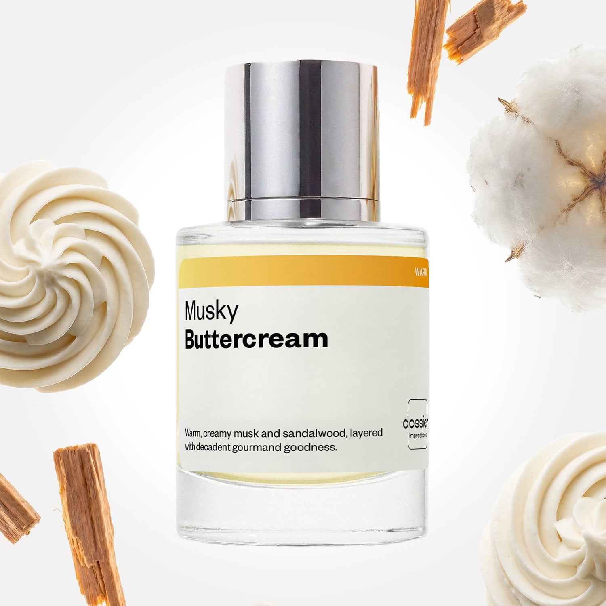

# Musky Buttercream

- **Dossier Inspired by Glossier's You Rêve**
- **URL:** https://dossier.co/products/musky-buttercream
- **SEO title:** Musky Buttercream

## Pricing (sizes)

| Size/SKU | Member price | List price | Currency |
|---|---|---|---|
| 50ml | 28.8 | 32 | USD |

## Content (scent notes, about, editorial)

Back Home / Perfumes / Dossier Impressions / MUSKY BUTTERCREAM 

Unisex 

New 

Musky Buttercream

Eau de Parfum. Size: 50ml / 1.7oz 

members: $28.80

Guest:
$32

Inspired by Glossier's You Rêve Inspired by Glossier's You Rêve 
Inspired by Glossier's You Rêve 

Retail price 82 Crafted in France 
Scent Family: warm 

Add to Cart 

Scent Notes Main Notes:

Buttercream

White Musks

Sandalwood

top: The first notes you smell 
Hazelnut, Red Fruits, Coconut 
middle: The heart of the perfume 
Buttercream, Orris 
base: The notes that linger all day 
White Musks, Sandalwood, Ambroxan 
ingredients: Alcohol Denat., Fragrance/Parfum, Water/Aqua/Eau, Tetramethyl Acetyloctahydronaphthalenes, Santalol, Benzyl Salicylate, Santalum Album (Sandalwood) Oil, Trimethylcyclopentenyl Methylisopentenol, Pinene, Juniperus Virginiana Oil, Benzaldehyde, Vanillin, Linalool, Farnesol, Beta-Caryophyllene, Benzyl Alcohol, Limonene. 

Vegan
Cruelty-free

Clean ingredients

About A second skin scent so scrumptious, you’ll wish you could bathe in it (but, please don’t eat this!).

Inspired by Glossier’s You Rêve, Musky Buttercream is the warm, creamy, and gourmand fragrance of your dreams. Elevated with a whisper of powdery refinement.

It opens with notes of hazelnut, red fruits, and coconut, creating a sweet, warm, nutty accord. The scent then unfolds into a buttercream-centric heart, supported by powdery orris for a sumptuous elegance.

Once melted into the skin, the white musk and creamy sandalwood notes linger for hours with a whiff of ambroxan.

Think: Pure heavenly indulgence enrolled in etiquette classes. But for your senses.

Scent Intensity: Soft 

Concentration: 20%

Gender: Unisex 

Shipping
Free shipping with 2+ items. 

Standard Shipping (with 2+ items) Auto-selected with 2+ items 
FREE 

Standard Shipping Auto-selected under 2 items 
$3.95 

Express shipping: 2 business days Select in checkout 
$19.00 

Returns
Free exchanges for all. Free returns with 

Exchanges
Free exchange, 1 time per order for all.

Returns
D+ members get 1 FREE return per order.
Non-members incur a $3.99/bottle return fee, 1 time per order.
Returns must be postmarked within 30 days of the initial order. Learn More 

FAQs Are these fragrances long lasting? They are designed to be very long lasting, just like designer fragrances, in some cases even longer, depending on the composition. 
When does the new packaging come out? We'll begin rolling out our new packaging across the U.S. and international markets soon! If you want to shop IRL - our new packaging first hits stores on January 11, 2026 at Walmart. Please note that if you are shopping online, you may receive a combination of our current and new packaging while we transition our inventory. 
How will I know what scent I like? We get it, shopping for perfumes online is hard! That's why we created a scent quiz, which will find the perfect scent for you Take the quiz (opens in new tab) 
Unsure about something? Ask us! help@dossier.co 

Best Layered With Combine 2 of our perfumes to create a third scent with layering, curated by our nose. Learn more 

You Might Love 

3.7 

Rated 3.7 out of 5 stars 

Based on 46 reviews 

Reviews 46 (tab expanded) Questions (tab collapsed) 

Filters 
Write a Review (Opens in a new window) 

46 reviews 
Sort Highest Rating Most Helpful Photos & Videos Most Recent Oldest Lowest Rating Least Helpful 

CD 

Christa D. 
Verified Reviewer 

5/31/26 

Rated 5 out of 5 stars 

Great scent
I love musk and sandalwood and scents I can layer. I work in medical settings and this is perfect to not overwhelm the senses. I am so happy I picked this up.

Read More Read more about this review 

Was this helpful? Yes, this review from Christa D. was helpful. 0 people voted yes No, this review from Christa D. was not helpful. 0 people voted no 

DP 

Dossier Perfumes 
6/1/26 
Christa! We love that our scent is gentle enough for your workdays and still fun to layer. Thanks for sharing and glad it fits right into your routine! 😊

JJ 

Julia J. 
Verified Buyer 

5/21/26 

Rated 5 out of 5 stars 

OMG!!
Complements complements complements!! Every time I wear it people chase me down to ask what I am wearing! The smell is incredible!! My new go to fragrance!!!

Read More Read more about this review 

Was this helpful? Yes, this review from Julia J. was helpful. 0 people voted yes No, this review from Julia J. was not helpful. 0 people voted no 

DP 

Dossier Perfumes 
5/21/26 
Julia, wow that’s amazing! It’s so fun when compliments keep rolling in and your go-to becomes a real head-turner. Thanks for sharing the love, it means the world! 😊

RK 

Rafiatou K. 
Verified Buyer 

5/12/26 

Rated 5 out of 5 stars 

My fave
No comment am in love

Read More Read more about this review 

Was this helpful? Yes, this review from Rafiatou K. was helpful. 0 people voted yes No, this review from Rafiatou K. was not helpful. 0 people voted no 

DP 

Dossier Perfumes 
5/12/26 
Rafiatou, we’re so happy you’re loving it! Thanks for the love and happy spritzing 😊

LT 

Lisa T. 
Verified Buyer 

5/9/26 

Rated 5 out of 5 stars 

So darn good!!!!
I am obsessed with this fragrance. It is creamy but not too sweet. Perfect for any time of year.

Read More Read more about this review 

Was this helpful? Yes, this review from Lisa T. was helpful. 0 people voted yes No, this review from Lisa T. was not helpful. 0 people voted no 

DP 

Dossier Perfumes 
5/9/26 
Lisa, we’re so happy you’re loving that creamy vibe without overwhelming sweetness, and it works any season, thanks for sharing!

S 

SG 
Verified Buyer 

5/4/26 

Rated 5 out of 5 stars 

Fluffy
This is another that’s very light and airy. I get creamy and a light sweetness but idk if I would necessarily say I get buttercream, at least not the type of buttercream scent I was expecting to get. However it’s still a very pretty fragrance and it layers beautifully with other frags in my collection 

Read More Read more about this review 

Was this helpful? Yes, this review from SG was helpful. 0 people voted yes No, this review from SG was not helpful. 0 people voted no 

DP 

Dossier Perfumes 
5/4/26 
Hey there! We love that it feels so light and creamy on you, even if the buttercream note is more subtle than you expected. Happy layering adventures! 😊

Loading... 

Loading... 

Show More 

Inspired by  Baccarat Rouge 540 
Inspired by  Black Opium 
Inspired by  Love, Don't Be Shy 
Inspired by  Good Girl 
Inspired by  Libre 
Inspired by  Flowerbomb 
Inspired by  Light Blue 
Inspired by  Not a Perfume 
Inspired by  Aventus 
Inspired by  Bleu de Chanel 
Inspired by  Mon Paris 
Inspired by  Coco Mademoiselle 
Inspired by  Tom Ford for Men 
Inspired by  For Her 
Inspired by  J'Adore Dior 
Inspired by  Alien 
Inspired by  Black Opium Perfume 
Inspired by  Lost Cherry Perfume 

GET UP TO 30% OFF 

Find us at these retailers. 

Be the first to know. 
Submit 

Shop the following countries. United States 

Discover.
AI Scent Finder 
Blog (opens in new tab) 
Scent Family 
Layering 
Scent Quiz 

Help.
Contact Us 
Returns 
FAQ 
Testimonials 
Accessibility 

More.
Store Locator 
Boutique 
Refer A Friend 
Index 

Download our app now.

Find us at these retailers. 

Be the first to know. 
Submit 

Shop the following countries. United States 

Discover.
AI Scent Finder 
Blog (opens in new tab) 
Scent Family 
Layering 
Scent Quiz 

Help.
Contact Us 
Returns 
FAQ 
Testimonials 
Accessibility 

More.

## Main Image

