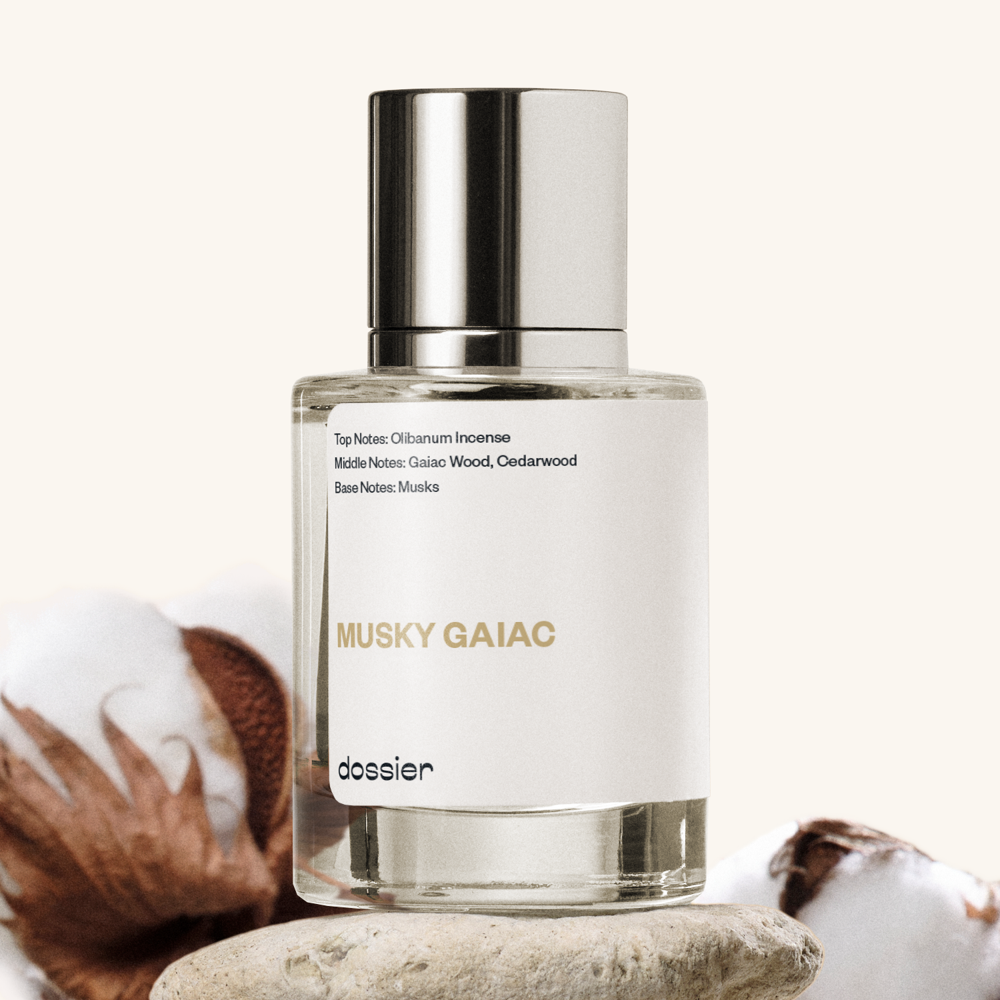

# Musky Gaiac

- **Dossier Inspired by Le Labo Fragrances' Gaïac 10**
- **URL:** https://dossier.co/products/musky-gaiac
- **SEO title:** Le Labo's Gaiac 10 Dupe Perfume: Musky Gaiac - Dossier Perfumes

## Pricing (sizes)

| Size/SKU | Member price | List price | Currency |
|---|---|---|---|
| 39393208762435 | 44.1 | 49 | USD |

## Content (scent notes, about, editorial)

Back Home / Perfumes / Dossier Impressions / MUSKY GAIAC 

Unisex 

Sold out 

Musky Gaiac

Eau de Parfum. Size: 50ml / 1.7oz 

members: $44.10

Guest:
$49

Inspired by Le Labo's Gaïac 10 Inspired by Le Labo's Gaïac 10 
Inspired by Le Labo's Gaïac 10 

Retail price 365 Crafted in France 

Notify Me 

Scent Notes This perfume is: Luxe, effortlessly mysterious 
Main Notes:

Olibanum

Incense

Musks

top: The first notes you smell 
Olibanum Incense 
middle: The heart of the perfume 
Gaiac Wood, Cedarwood 
base: The notes that linger all day 
Musks 
ingredients: vegan | paraben & phthalate-free | colorant & uv filter free 
Alcohol, Water, Parfum/Perfume, Limonene, Farnesol, Geraniol, Hydroxycitronellal, Isoeugenol, Linalool. 

Vegan
Cruelty-free

Clean ingredients

About Gaiac, a dense wood barely used in perfumery, has a very particular smoky and dry smell, with leathery tones. 

Musky Gaiac (inspired by Le Labo's Gaiac 10) is a tribute to this unique raw material. The composition enhances its natural smoky effect with incense, and its woody dryness with cedarwood. Then, modern musks wrap the fragrance to convey a smooth comfort, harmoniously balancing the initial sharpness.

Minimalistic, assertive and poetic, as a Japanese Haïku, Musky Gaiac (our impression of Le Labo's Gaiac 10) is a very modern addictive statement, playing with natural skin odor, far away from sweet and loud perfumery structures.

Scent Intensity: Significant 

Concentration: 18%

Gender: Unisex 

Shipping
Free shipping with 2+ items. 

Standard Shipping (with 2+ items) Auto-selected with 2+ items 
FREE 

Standard Shipping Auto-selected under 2 items 
$3.95 

Express shipping: 2 business days Select in checkout 
$19.00 

Returns
Free exchanges for all. Free returns with 

Exchanges
Free exchange, 1 time per order for all.

Returns
D+ members get 1 FREE return per order.
Non-members incur a $3.99/bottle return fee, 1 time per order.
Returns must be postmarked within 30 days of the initial order. Learn More 

FAQs Are these fragrances long lasting? They are designed to be very long lasting, just like designer fragrances, in some cases even longer, depending on the composition. 
When does the new packaging come out? We'll begin rolling out our new packaging across the U.S. and international markets soon! If you want to shop IRL - our new packaging first hits stores on January 11, 2026 at Walmart. Please note that if you are shopping online, you may receive a combination of our current and new packaging while we transition our inventory. 
How will I know what scent I like? We get it, shopping for perfumes online is hard! That's why we created a scent quiz, which will find the perfect scent for you Take the quiz (opens in new tab) 
Unsure about something? Ask us! help@dossier.co 

Details We are not associated or affiliated with the brands mentioned here in any way.
Musky Gaiac

Dive into a blissful lake of infinite serenity surrounded by the Japanese forest floor

Refreshingly lovely with an edge of clarity and candor, Le Labo’s Gaiac 10 Eau de Parfum (the fragrance that Dossier’s Musky Gaiac is inspired by) is a true chef-d’oeuvre. It imbues you with a heavenly tranquillity and transforms you with heady allure and delectable class.

Succumb to your innate desires as this floral permeates you with addictive top notes of spicy black pepper and guaiac wood. These smoothly blend with soft middle notes of opulent amber, white musk, and the depth of cedar wood to ground you in an earthy Japanese forest. The serene calmness you experience here is akin to meditating in the shades of Iriomote’s mangroves. Nothing compares to the calmness and cosiness this bouquet provides.

An empyrean source of quietness and peace, the luxury scent that Musky Gaiac is inspired by invites you to relax around elegantly aureate Japanese blossom and the woody essential oils of oriental warmth and remedy.

Enliven your senses and pamper yourself with this olfactory version of Shiraito Falls. It is a fun affair right from first spritz. Talk of a beatific fragrance so sweet and so sophisticated, it matches the gorgeousness of the Osaka cherry blossoms. This is the perfume for people who believe in themselves and are willing to go to any length to actualize their dreams. The luxury scent that Musky Gaiac is inspired byis a scent of intelligence, flair, and self-assurance.

Capitalizing primarily on the woody notes, this fragrance maintains an air of refreshing lightness and grounded strength that will make heads turn. It is the very essence of modest integrity – and one that humbly complements your inner and outer beauty. Plus, there’s a big bonus: the bottle. With a clean and methodical design, the bottle of the Le Labo Gaiac 10 Eau de Parfum perfectly suits the liquid it holds as it does not boast wealth or grandeur, but instead exudes calm modesty, meekness, and gentleness.

Le Labo Gaiac 10 is available for purchase on various ecommerce websites where it goes for $198.00 and $289.00 for the 50 ml and 100 ml respectively. Also, you can get the smaller samples (between 1 ml and 9 ml) for $9.00-$62.00.

If you want a scent that is as tranquil as the blue seas of the Kerama Islands, Dossier’s Musky Gaiac is the fragrance for you. Crafted with dense guaiac wood as the dominating aroma, our Le Labo Gaiac 10 dupe is a pleasurable leathery experience of Japanese haiku and signature minimalism. Enriched with sprinkles of subtle additions in olibanum and warm cedarwood, this floral brims with love and gives off a tasty fragrance comparable to the winds of Beppu Onsen. Undercurrents of warmth smoothly interlace to harmonize the sharpness of black pepper. Truly, there are few scents as timeless as Musky Gaiac: a gorgeous flower with a strange but comforting aroma. This is what you don if you wish to take a quick tour around the wedded rocks of Ise. Look no further if the magic of Yakushima Kagoshima tickles your fancy.

Best Layered With Combine 2 of our perfumes to create a third scent with layering, curated by our nose. Learn more 

You Might Love 

4.0 

Rated 4.0 out of 5 stars 

Based on 415 reviews 

Reviews 415 (tab expanded) Questions 2 (tab collapsed) 

Filters 
Write a Review (Opens in a new window) 

415 reviews 
Sort Highest Rating Most Helpful Photos & Videos Most Recent Oldest Lowest Rating Least Helpful 

S 

Sophia 

6/16/26 

Rated 5 out of 5 stars 

I miss you Musky Gaiac
Dossier’s BEST perfume, patiently waiting to get it back ! PLEASEEEEEE come back ! 

Read More Read more about this review 

Was this helpful? Yes, this review from Sophia was helpful. 0 people voted yes No, this review from Sophia was not helpful. 0 people voted no 

DP 

Dossier Perfumes 
6/16/26 
Sophia! We know missing Musky Gaiac is real and we'll pass along your love. Keep an eye on our catalog!

T 

Trixy 

6/14/26 

Rated 5 out of 5 stars 

Why?
The last time I bought this I got 4 bottles, unbeknownst to me it was going to be discontinued. Seriously dossier listen to your customers bring it back this is do much better than the Og. I would buy 10 bottles

Read More Read more about this review 

Was this helpful? Yes, this review from Trixy was helpful. 0 people voted yes No, this review from Trixy was not helpful. 0 people voted no 

DP 

Dossier Perfumes 
6/15/26 
Hey Trixy, we’re bummed too that it’s gone. Thank you for the love and feedback. While it’s retired, feel free to explore our full catalog at dossier.co 🙌

C 

Cyrus 
Verified Reviewer 

5/24/26 

Rated 5 out of 5 stars 

Please bring it back 
I recently purchased the real Gaiac 10 when I was in Tokyo because I finally run out of Musky Gaiac. Musky Gaiac smells the same as the original Gaiac 10 to me. Please bring it back. We want it back.

Read More Read more about this review 

Was this helpful? Yes, this review from Cyrus was helpful. 0 people voted yes No, this review from Cyrus was not helpful. 0 people voted no 

DP 

Dossier Perfumes 
5/24/26 
Cyrus, we hear you missing Musky Gaiac! We wish we could wave a wand too. While it isn’t back right now, explore our catalog or reach out at help@dossier.co .

A 

Amber 

4/29/26 

Rated 5 out of 5 stars 

The best scent EVER
I’m so sad this was discontinued. It was plainly THE BEST and I have a small amount left in my bottle that I refuse to use. PATIENTLY URGENTLY waiting on its return

Read More Read more about this review 

Was this helpful? Yes, this review from Amber was helpful. 0 people voted yes No, this review from Amber was not helpful. 0 people voted no 

DP 

Dossier Perfumes 
4/29/26 
Hey Amber, sorry to hear you’re missing that scent much! We know how special it feels, and while it’s resting for now, our catalog is always ready to surprise you.

S 

Steve 

3/7/26 

Rated 5 out of 5 stars 

Bring this back!
Loved this scent, really wish they'd bring it back

Read More Read more about this review 

Was this helpful? Yes, this review from Steve was helpful. 0 people voted yes No, this review from Steve was not helpful. 0 people voted no 

DP 

Dossier Perfumes 
3/7/26 
Steve, we hear you! That scent was special and we miss it too 😊

Loading... 

Loading... 

Show More 

Inspired by  Baccarat Rouge 540 
Inspired by  Black Opium 
Inspired by  Love, Don't Be Shy 
Inspired by  Good Girl 
Inspired by  Libre 
Inspired by  Flowerbomb 
Inspired by  Light Blue 
Inspired by  Not a Perfume 
Inspired by  Aventus 
Inspired by  Bleu de Chanel 
Inspired by  Mon Paris 
Inspired by  Coco Mademoiselle 
Inspired by  Tom Ford for Men 
Inspired by  For Her 
Inspired by  J'Adore Dior 
Inspired by  Alien 
Inspired by  Black Opium Perfume 
Inspired by  Lost Cherry Perfume 

GET UP TO 30% OFF 

Find us at these retailers. 

Be the first to know. 
Submit 

Shop the following countries. United States 

Discover.
AI Scent Finder 
Blog (opens in new tab) 
Scent Family 
Layering 
Scent Quiz 

Help.
Contact Us 
Returns 
FAQ 
Testimonials 
Accessibility 

More.
Store Locator 
Boutique 
Refer A Friend 
Index 

Download our app now.

Find us at these retailers. 

Be the first to know. 
Submit 

Shop the following countries. United States 

Discover.
AI Scent Finder 
Blog (opens in new tab) 
Scent Family 
Layering 
Scent Quiz 

Help.
Contact Us 
Returns 
FAQ 
Testimonials 
Accessibility 

More.

## Main Image

