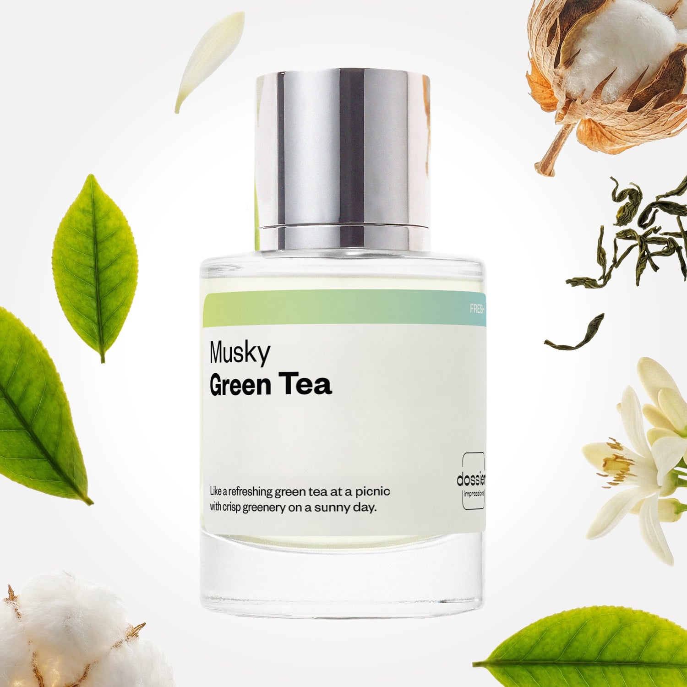

# Musky Green Tea

- **Dossier Inspired by Creed's Silver Mountain Water**
- **URL:** https://dossier.co/products/musky-green-tea
- **SEO title:** Creed's Green Irish Tweed Dupe Perfume: Green Verbena - Dossier Perfumes Creed's Silver Mountain Water Dupe Perfume: Musky Green Tea - Dossier Perfumes

## Pricing (sizes)

| Size/SKU | Member price | List price | Currency |
|---|---|---|---|
| DI50MGTUS | 44.1 | 49 | USD |

## Content (scent notes, about, editorial)

Back Home / Perfumes / Dossier Impressions / MUSKY GREEN TEA 

Unisex 

Musky Green Tea

Eau de Parfum. Size: 50ml / 1.7oz 

members: $44.10

Guest:
$49

Inspired by Creed's Silver Mountain Water Inspired by Creed's Silver Mountain Water 
Inspired by Creed's Silver Mountain Water 

Retail price 345 Crafted in France 
Scent Family: fresh 

Add to Cart 

Scent Notes This perfume is: A sunny picnic under a tree // grass 
Main Notes:

Green Tea

Bergamot

Mandarin

Neroli

Musks

Sandalwood

Orris

top: The first notes you smell 
Green Tea, Bergamot, Mandarin 
middle: The heart of the perfume 
Petitgrain, Neroli, Blackcurrant 
base: The notes that linger all day 
Musk, Sandalwood, Orris 
ingredients: Alcohol, Water, Parfum/Perfume, alpha-iso-Methylionone, Benzyl alcohol, Citral, Coumarin, Limonene, Eugenol, Farnesol, Geraniol, Linalool. 

Vegan
Cruelty-free

Clean ingredients

About Musky Green Tea (inspired by Creed's Silver Mountain Water) opens on a crisp and invigorating note, combined with an exhilarating splash of green tea, neroli, petitgrain, and black current. This burst of unexpected freshness creates a cooling effect that is incredibly long-lasting. Pair that with hints of clean muskiness and rough sandalwood, and this is a scent that has no problem standing all on its own.

Pure and bright, Musky Green Tea (our impression of Creed's Silver Mountain Water) evokes the crispness of an invigorating breeze of fresh mountainous air, and the coolness of sparkling streams in the Swiss Alps.

Scent Intensity: Soft 

Concentration: 18%

Gender: Unisex 

Shipping
Free shipping with 2+ items. 

Standard Shipping (with 2+ items) Auto-selected with 2+ items 
FREE 

Standard Shipping Auto-selected under 2 items 
$3.95 

Express shipping: 2 business days Select in checkout 
$19.00 

Returns
Free exchanges for all. Free returns with 

Exchanges
Free exchange, 1 time per order for all.

Returns
D+ members get 1 FREE return per order.
Non-members incur a $3.99/bottle return fee, 1 time per order.
Returns must be postmarked within 30 days of the initial order. Learn More 

FAQs Are these fragrances long lasting? They are designed to be very long lasting, just like designer fragrances, in some cases even longer, depending on the composition. 
When does the new packaging come out? We'll begin rolling out our new packaging across the U.S. and international markets soon! If you want to shop IRL - our new packaging first hits stores on January 11, 2026 at Walmart. Please note that if you are shopping online, you may receive a combination of our current and new packaging while we transition our inventory. 
How will I know what scent I like? We get it, shopping for perfumes online is hard! That's why we created a scent quiz, which will find the perfect scent for you Take the quiz (opens in new tab) 
Unsure about something? Ask us! help@dossier.co 

Details We are not associated or affiliated with the brands mentioned here in any way.
Musky Green Tea

A Fragrance That Rivals the Splendor of The Alps

A little over 20 years ago, the house of Creed surprised perfume connoisseurs all over the world a contemporary unisex Eau de Parfum that has since gone on to become one of their most beloved fragrances of all time. A bestseller since its introduction (and even till today), Creed’s Silver Mountain Water (the fragrance that inspired Dossier’s Musky Green Tea) embodies the pristine feeling of snow-capped peaks, with sweet blends of milky-sweet black currants and bergamot in between. This is a fragrance better described as an invigorating breath of fresh, icy mountain air – bringing with it the sheer beauty and splendor of the Swiss Alps.

The luxury cologne that Musky Green Tea is inspired by holds its freshness and clean scent over time while retaining a hint of woodiness. This scent is made up of a natural, subtle sweetness that works in harmony with warm notes such as black currant and musk, making it smell incredibly fruity and fresh.

Citrus notes dominate the opening and remain throughout the entire lifespan of the fragrance. It’s a delightful combination of bergamot and mandarin orange that’s exhilarating and, if anything, ends too soon. Shortly after, the scent skips to notes of green tea and black currant, giving off a more green/herbal type of vibe that adds a new dimension to the scent. The black currant and citrus notes together are rather sharp, but fortunately, the tea note seems to temper them quite a bit. Finally, the luxury fragrance that Musky Green Tea is inspired by delves into a base of smooth sandalwood and creamy musk, leaving you with an icy freshness on the skin – a true hallmark of this enlivening scent.

For a scent this fresh, the luxury fragrance that Musky Green Tea is inspired by is best worn on warmer days. This isn’t a particularly ‘sexy’ scent or overly sophisticated in any way, making it ideal for everyday wear. We’d definitely wear it for casual activities, such as work, social meetings, or gym sessions.

As for performance, it’ll easily outlast the industry benchmark of six hours. You will most certainly get compliments in the first hour or two, as projection and sillage are at their best during that period.

The luxury scent that Musky Green Tea is inspired by is available for purchase on the house of Creed’s website. Prices start at $320 for the 50 ml (1.7 Fl Oz) eau de parfum, $430 for the 100 ml (3.4 Fl Oz) bottle, and go up to $1,535 for the 1000 ml (33.3 Fl Oz) bottle. For about $4.99, you can also order a sample to get a better idea of the fragrance before you buy.

For a Silver Mountain Water clone that comes close to the real deal, try Dossier’s Musky Green Tea, a refreshing, well-balanced fragrance that echoes the original in both notes and energy. Our dupe is pure and bright, evoking the crispness of a refreshing mountain breeze combined with the coolness of the Alpine waters. Pair that with hints of clean muskiness and rough sandalwood, and you get a high-quality dupe that promises an amazing journey into the great outdoors. 

Best Layered With Combine 2 of our perfumes to create a third scent with layering, curated by our nose. Learn more 

You Might Love 

4.4 

Rated 4.4 out of 5 stars 

Based on 1,063 reviews 

Reviews 1,063 (tab expanded) Questions 2 (tab collapsed) 

Filters 
Write a Review (Opens in a new window) 

1,063 reviews 
Sort Highest Rating Most Helpful Photos & Videos Most Recent Oldest Lowest Rating Least Helpful 

C 

Cornelius 

6/27/26 

Rated 5 out of 5 stars 

5 Stars
Refreshing

Read More Read more about this review 

Was this helpful? Yes, this review from Cornelius was helpful. 0 people voted yes No, this review from Cornelius was not helpful. 0 people voted no 

A 

Adam 

6/22/26 

Rated 5 out of 5 stars 

5 Stars
Excellent

Read More Read more about this review 

Was this helpful? Yes, this review from Adam was helpful. 0 people voted yes No, this review from Adam was not helpful. 0 people voted no 

LJ 

Laiba J. 
Verified Buyer 

6/17/26 

Rated 5 out of 5 stars 

Perfect clean scent
I like the clean girl aesthetic from this scent. Their customer service is extremely nice and would take immediate action to satisfy their customer. Very impressed!

Read More Read more about this review 

Was this helpful? Yes, this review from Laiba J. was helpful. 0 people voted yes No, this review from Laiba J. was not helpful. 0 people voted no 

DP 

Dossier Perfumes 
6/17/26 
Laiba thank you for loving that clean vibe and noticing our team’s hustle! We’re so happy you feel well taken care of. Keep enjoying that spritz ✨

B 

Bea 

6/16/26 

Rated 5 out of 5 stars 

5 Stars
My go to perfume. Everyone always comments how good I smell. Wish they had larger bottles 🥹

Read More Read more about this review 

Was this helpful? Yes, this review from Bea was helpful. 0 people voted yes No, this review from Bea was not helpful. 0 people voted no 

A 

Ashley 

6/10/26 

Rated 5 out of 5 stars 

5 Stars
I love the fragrance

Read More Read more about this review 

Was this helpful? Yes, this review from Ashley was helpful. 0 people voted yes No, this review from Ashley was not helpful. 0 people voted no 

Loading... 

Loading... 

Show More 

Inspired by  Baccarat Rouge 540 
Inspired by  Black Opium 
Inspired by  Love, Don't Be Shy 
Inspired by  Good Girl 
Inspired by  Libre 
Inspired by  Flowerbomb 
Inspired by  Light Blue 
Inspired by  Not a Perfume 
Inspired by  Aventus 
Inspired by  Bleu de Chanel 
Inspired by  Mon Paris 
Inspired by  Coco Mademoiselle 
Inspired by  Tom Ford for Men 
Inspired by  For Her 
Inspired by  J'Adore Dior 
Inspired by  Alien 
Inspired by  Black Opium Perfume 
Inspired by  Lost Cherry Perfume 

GET UP TO 30% OFF 

Find us at these retailers. 

Be the first to know. 
Submit 

Shop the following countries. United States 

Discover.
AI Scent Finder 
Blog (opens in new tab) 
Scent Family 
Layering 
Scent Quiz 

Help.
Contact Us 
Returns 
FAQ 
Testimonials 
Accessibility 

More.
Store Locator 
Boutique 
Refer A Friend 
Index 

Download our app now.

Find us at these retailers. 

Be the first to know. 
Submit 

Shop the following countries. United States 

Discover.
AI Scent Finder 
Blog (opens in new tab) 
Scent Family 
Layering 
Scent Quiz 

Help.
Contact Us 
Returns 
FAQ 
Testimonials 
Accessibility 

More.

## Main Image

