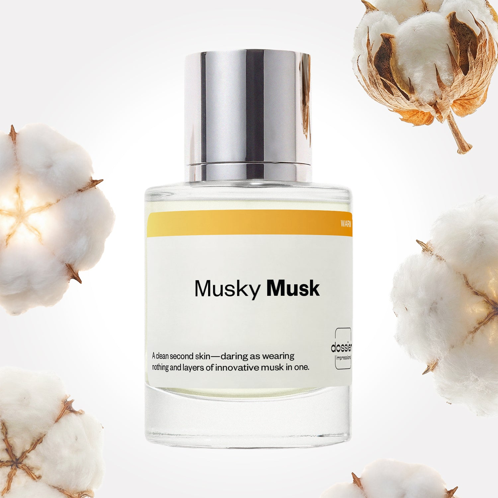

# Musky Musk

- **Dossier Inspired by Juliette has a Gun's Not a Perfume**
- **URL:** https://dossier.co/products/musky-musk
- **SEO title:** Juliette has a Gun's Not a Dupe Perfume: Musky Musk - Dossier Perfumes

## Pricing (sizes)

| Size/SKU | Member price | List price | Currency |
|---|---|---|---|
| 50ml | 28.8 | 32 | USD |
| 100ml | 44.1 | 49 | USD |
| 200ml | 88.2 | 98 | USD |
| Top+5+for+Her+Bundle | 169.2 | 188 | USD |
| 2x50ml | 57.6 | 64 | USD |

## Content (scent notes, about, editorial)

Back Home / Perfumes / Dossier Impressions / MUSKY MUSK 

Women 

New 

Musky Musk

Eau de Parfum. Size: 100ml / 3.4oz 

members: $44.10

Guest:
$49

Inspired by Juliette Has A Gun's Not a Perfume Inspired by Juliette Has A Gun's Not a Perfume 
Inspired by Juliette Has A Gun's Not a Perfume 

Retail price 150 Size
50ml $32

Best Value
100ml $49

Crafted in France 
Scent Family: warm 

Add to Cart 

Scent Notes This perfume is: Fresh out of the shower 
Main Notes:

Habanolide

Musks

top: The first notes you smell 
middle: The heart of the perfume 
Cetalox, Iso E Super 
base: The notes that linger all day 
Habanolide, Musks 
ingredients: Alcohol, Water, Parfum/Perfume, Limonene. 

Vegan
Cruelty-free

Clean ingredients

About Musky Musk (inspired by Juliette has a Gun's Not a Perfume) is the U.F.O. of the world of perfumery. Its construction focuses on a high-tech and high-end synthetic molecule: cetalox. Clean, pure, musky, slightly woody, hyper modern, the smell of cetalox is unique. 

Musky Musk (our impression of Juliette has a Gun's Not a Perfume) is a radically disruptive approach of perfumery, offering a scent that mingles with the scent of one's own skin, enhancing it without covering it up. A warning though: cetalox is a base note. Therefore, this special construction gives an extremely discreet fragrance when applied. The aura of the fragrance develops very gradually, to reveal all its potential after a few hours.

Scent Intensity: Soft 

Concentration: 15%

Gender: Feminine 

Shipping
Free shipping with 2+ items. 

Standard Shipping (with 2+ items) Auto-selected with 2+ items 
FREE 

Standard Shipping Auto-selected under 2 items 
$3.95 

Express shipping: 2 business days Select in checkout 
$19.00 

Returns
Free exchanges for all. Free returns with 

Exchanges
Free exchange, 1 time per order for all.

Returns
D+ members get 1 FREE return per order.
Non-members incur a $3.99/bottle return fee, 1 time per order.
Returns must be postmarked within 30 days of the initial order. Learn More 

FAQs Are these fragrances long lasting? They are designed to be very long lasting, just like designer fragrances, in some cases even longer, depending on the composition. 
When does the new packaging come out? We'll begin rolling out our new packaging across the U.S. and international markets soon! If you want to shop IRL - our new packaging first hits stores on January 11, 2026 at Walmart. Please note that if you are shopping online, you may receive a combination of our current and new packaging while we transition our inventory. 
How will I know what scent I like? We get it, shopping for perfumes online is hard! That's why we created a scent quiz, which will find the perfect scent for you Take the quiz (opens in new tab) 
Unsure about something? Ask us! help@dossier.co 

Details We are not associated or affiliated with the brands mentioned here in any way.
Musky Musk

Alluring And Unprecedented

Not A Perfume (the luxury scent that inspired Dossier’s Musky Musk) is one of the more iconic fragrances from the niche French perfume brand, Juliette Has A Gun. Launched in 2010, this extraordinary eau de parfum captures all the unconventional elements of extreme, irreverence, and conceptual expression present in our modern minimalist culture.

Slap on a label, and into a bottle they all go.

Juliette Has A Gun’s iconic fragrance is called its name because, well, it’s not a perfume. The name says it all. The formula contains only one ingredient — Cetalox (also known as ambroxan), a synthetic form of ambergris.

Cetalox is most commonly used as the base note in modern fragrances and is typically layered in with other notes. But here in the luxury scent that Musky Musk is inspired by, there are no other notes — at least not in the traditional sense.

There is no top note. Or the ever-enriching middle note. There is only ever — Cetalox.

But that’s not to say that it lacks in the scent department. Rather, Cetalox (or ambroxan) as a base scent is intoxicating. It’s a deep woody scent with hints of sweetness and animalistic notes that give an intriguing edge to the luxury scent that Musky Musk is inspired by.

And for a perfume that isn’t a perfume, this sure smells like one. It smells incredible, too. Initially, the scents are clean and rather bright, similar to the smell of freshly washed clothes drying in the sun. However, soon the bright opening mellows out into a deep, musky scent with hints of wood. It leaves behind a woody, warm, soft scent without any spice to it, and just ever so slightly powdery.

The luxury scent that Musky Musk is inspired by doesn’t evolve; it’s not a composition, but rather a fragrance that changes and adapts based on the wearer’s skin. Overall, this is a very androgynous but sweet scent that remains very fresh with its minimalist approach. And for something with only one ingredient, we have to admit it certainly smells sophisticated enough. Bonus points also for its insane longevity.

For a similar aromatic experience, check out our own Juliette Has A Gun’s Not A Perfume dupe at Dossier.co. Musky Musk offers a fresh approach to perfumery with a scent accentuated by the wearer’s own. But be warned: Cetalox is a base note. So you can expect a soft, subtle beginning when you wear our replica. The aroma of the fragrance develops slowly over time, revealing its full potential only after a few hours.

Best Layered With Combine 2 of our perfumes to create a third scent with layering, curated by our nose. Learn more 

You Might Love 

4.3 

Rated 4.3 out of 5 stars 

Based on 2,558 reviews 

Reviews 2,558 (tab expanded) Questions 1 (tab collapsed) 

Filters 
Write a Review (Opens in a new window) 

2,558 reviews 
Sort Highest Rating Most Helpful Photos & Videos Most Recent Oldest Lowest Rating Least Helpful 

AY 

Amber Y. 
Verified Buyer 

7/1/26 

Rated 5 out of 5 stars 

LOVE THIS
I wear a lot of brands such as Chanel, creed, Versace— this perfume is such. Nice light floral and sweet scent. My boyfriend and I love it!

Read More Read more about this review 

Was this helpful? Yes, this review from Amber Y. was helpful. 0 people voted yes No, this review from Amber Y. was not helpful. 0 people voted no 

DP 

Dossier Perfumes 
7/1/26 
Amber! We’re so happy you and your boyfriend are loving Dossier’s take on a light floral sweet scent. Thanks for sharing the love and keep enjoying those spritzes! 🌸

J 

Jeanette 

6/10/26 

Rated 5 out of 5 stars 

5 Stars
Exceeded my expectations!

Read More Read more about this review 

Was this helpful? Yes, this review from Jeanette was helpful. 0 people voted yes No, this review from Jeanette was not helpful. 0 people voted no 

AA 

Arica-Rae A. 
Verified Buyer 

6/10/26 

Rated 5 out of 5 stars 

My Favorite Perfume and the perfect Impression! 
I love the “Not a Perfume” by Juliette Has a Gun and this impression smells just like it! Lasts all day and I get so many compliments. Fresh simple scent for every day wear. 

Read More Read more about this review 

Was this helpful? Yes, this review from Arica-Rae A. was helpful. 0 people voted yes No, this review from Arica-Rae A. was not helpful. 0 people voted no 

DP 

Dossier Perfumes 
6/10/26 
Arica, we’re thrilled this impression is checking all your boxes and earning compliments all day. Here’s to more fresh simplicity, happy spritzing and endless smiles! 💫

HA 

Helga A. A. 
Verified Buyer 

6/6/26 

Rated 5 out of 5 stars 

Amazing 
Very good scent

Read More Read more about this review 

Was this helpful? Yes, this review from Helga A. A. was helpful. 0 people voted yes No, this review from Helga A. A. was not helpful. 0 people voted no 

DP 

Dossier Perfumes 
6/7/26 
Helga, thanks for sharing! We’re thrilled you’re enjoying your scent 😊

D 

Dionne 

6/4/26 

Rated 5 out of 5 stars 

5 Stars
I LOVE anything with Musk undertones! Will order again !!

Read More Read more about this review 

Was this helpful? Yes, this review from Dionne was helpful. 0 people voted yes No, this review from Dionne was not helpful. 0 people voted no 

Loading... 

Loading... 

Show More 

Inspired by  Baccarat Rouge 540 
Inspired by  Black Opium 
Inspired by  Love, Don't Be Shy 
Inspired by  Good Girl 
Inspired by  Libre 
Inspired by  Flowerbomb 
Inspired by  Light Blue 
Inspired by  Not a Perfume 
Inspired by  Aventus 
Inspired by  Bleu de Chanel 
Inspired by  Mon Paris 
Inspired by  Coco Mademoiselle 
Inspired by  Tom Ford for Men 
Inspired by  For Her 
Inspired by  J'Adore Dior 
Inspired by  Alien 
Inspired by  Black Opium Perfume 
Inspired by  Lost Cherry Perfume 

GET UP TO 30% OFF 

Find us at these retailers. 

Be the first to know. 
Submit 

Shop the following countries. United States 

Discover.
AI Scent Finder 
Blog (opens in new tab) 
Scent Family 
Layering 
Scent Quiz 

Help.
Contact Us 
Returns 
FAQ 
Testimonials 
Accessibility 

More.
Store Locator 
Boutique 
Refer A Friend 
Index 

Download our app now.

Find us at these retailers. 

Be the first to know. 
Submit 

Shop the following countries. United States 

Discover.
AI Scent Finder 
Blog (opens in new tab) 
Scent Family 
Layering 
Scent Quiz 

Help.
Contact Us 
Returns 
FAQ 
Testimonials 
Accessibility 

More.

## Main Image

