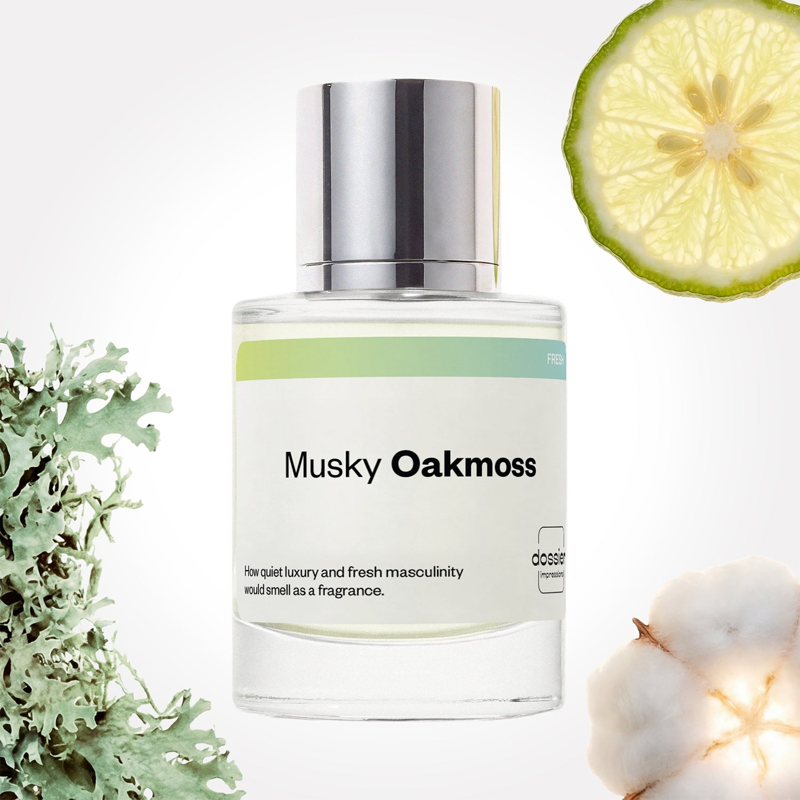

# Musky Oakmoss

- **Dossier Inspired by Creed's Aventus**
- **URL:** https://dossier.co/products/musky-oakmoss
- **SEO title:** Creed Aventus Dupe Perfume: Musky Oakmoss - Dossier Perfumes

## Pricing (sizes)

| Size/SKU | Member price | List price | Currency |
|---|---|---|---|
| DI50MOUS | 44.1 | 49 | USD |
| DOSWA50MO | 44.1 | 49 | USD |
| 32040786657347 | 44.1 | 49 | USD |

## Content (scent notes, about, editorial)

Back Home / Perfumes / Dossier Impressions / MUSKY OAKMOSS 

Men 

Bestseller 

Musky Oakmoss

Eau de Parfum. Size: 50ml / 1.7oz 

members: $44.10

Guest:
$49

Inspired by Creed's Aventus Inspired by Creed's Aventus 
Inspired by Creed's Aventus 

Retail price 365 Crafted in France 
Scent Family: fresh 

Add to Cart 

Scent Notes This perfume is: Exclusive, timeless, masculine 
Main Notes:

Bergamot

Musks

Oakmoss

Amber

top: The first notes you smell 
Apple, Pineapple, Bergamot 
middle: The heart of the perfume 
Rose, Birch Leaf, Patchouli 
base: The notes that linger all day 
Musk, Oakmoss, Amber 
ingredients: Alcohol, Water, Parfum/Perfume, Benzyl alcohol, Citral, Citronellol, Limonene, Eugenol, Farnesol, Geraniol, Linalool. 

Vegan
Cruelty-free

Clean ingredients

About Musky Oakmoss (inspired by Creed's Aventus) initially captures our attention with its clean, fresh burst of energy. After some time, it begins to take a turn into the most exclusive perfume writing structure: the Chypre (a blend of bergamot, rose, oakmoss, and patchouli). To end, the scent fades with a soft, subtle musk-infused undertone that’s guaranteed to leave you wanting more. 

Fresh, refined, and pleasantly surprising, Musky Oakmoss (our impression of Creed's Aventus) has a kind of British phlegm, hiding high sophistication under a casual appearance.

Scent Intensity: Significant 

Concentration: 15%

Gender: Masculine 

Shipping
Free shipping with 2+ items. 

Standard Shipping (with 2+ items) Auto-selected with 2+ items 
FREE 

Standard Shipping Auto-selected under 2 items 
$3.95 

Express shipping: 2 business days Select in checkout 
$19.00 

Returns
Free exchanges for all. Free returns with 

Exchanges
Free exchange, 1 time per order for all.

Returns
D+ members get 1 FREE return per order.
Non-members incur a $3.99/bottle return fee, 1 time per order.
Returns must be postmarked within 30 days of the initial order. Learn More 

FAQs Are these fragrances long lasting? They are designed to be very long lasting, just like designer fragrances, in some cases even longer, depending on the composition. 
When does the new packaging come out? We'll begin rolling out our new packaging across the U.S. and international markets soon! If you want to shop IRL - our new packaging first hits stores on January 11, 2026 at Walmart. Please note that if you are shopping online, you may receive a combination of our current and new packaging while we transition our inventory. 
How will I know what scent I like? We get it, shopping for perfumes online is hard! That's why we created a scent quiz, which will find the perfect scent for you Take the quiz (opens in new tab) 
Unsure about something? Ask us! help@dossier.co 

Details We are not associated or affiliated with the brands mentioned here in any way.
Musky Oakmoss

A Quality Creed Aventus Dupe at a Fraction of the Price 

Creed Aventus (the fragrance that Dossier’s Musky Oakmoss is inspired by) for men is the vanguard of a secular renaissance of masculine virtue, celebrating the exuberance and strength of iconic leaders like Napoleon Bonaparte and Alexander the Great. Taking cues from the power of conquest, strength, and romantic soul, Creed’s iconic cologne grants an undeniable sense of confidence, allowing men all over the world to start each day fresh with sanguine confidence. But what does the luxury scent Musky Oakmoss is inspired by smell like?

The luxury scent that Musky Oakmoss is inspired by is a unique blend of woody, sweet, and citrusy scents. 

The luxury scent that Musky Oakmoss is inspired by opens with a refreshing pineapple note — a bold yet aggressive choice unlike any other. Fresh apple and bergamot add to its juicy sharpness, providing even more tartness to the composition. Skilled perfume connoisseurs might also pick up on the faint hints of blackcurrant that further intensify the fruity fragrance. An aftertaste of smoky flavor may accompany the first fruity blast. This is the birch, which keeps its sharpness but adds some power and anchor to the composition. It acts as a vital component of the blend, keeping it from becoming overly sweet or tangy. Finally, the luxury scent that Musky Oakmoss is inspired by rounds it all off with a pleasant yet slightly musky vanilla note, leaving behind a lingering fragrance that embodies the courage and ability of a true Napoleon.

The scent may linger on your skin for over 12 hours, which is impressive as far as perfumes go. The luxury scent that Musky Oakmoss is inspired by also has excellent projection and sillage, making it noticeable even from a distance. 

Naturally all this comes with a price tantamount to the iconic status of the luxury scent that Musky Oakmoss is inspired by And at $335 per 1.7 Fl oz bottle, the luxury scent that Musky Oakmoss is inspired by sits comfortably at the top premium range of its products. Remember that above a certain price point, you’re not just paying for the fragrance — you’re paying for the brand, for the bottle, and for the market’s perception of the fragrance’s value. 

Dossier’s Musky Oakmoss embodies similar characteristics of strength, power, and success. Our Creed Aventus clone is engineered to reflect the same taste notes as the original masterpiece. With the same fruity punch swinging in tandem with a soft, subtle musk-infused undertone, our dupe hits all the right notes when it comes to quality, excellence, and class — all at a fraction of the original cost.

Best Layered With Combine 2 of our perfumes to create a third scent with layering, curated by our nose. Learn more 

You Might Love 

4.4 

Rated 4.4 out of 5 stars 

Based on 2,008 reviews 

Reviews 2,008 (tab expanded) Questions 2 (tab collapsed) 

Filters 
Write a Review (Opens in a new window) 

2,008 reviews 
Sort Highest Rating Most Helpful Photos & Videos Most Recent Oldest Lowest Rating Least Helpful 

L 

Latanza 

6/28/26 

Rated 5 out of 5 stars 

5 Stars
It was a gift, but the person loved it

Read More Read more about this review 

Was this helpful? Yes, this review from Latanza was helpful. 0 people voted yes No, this review from Latanza was not helpful. 0 people voted no 

A 

Adam 

6/22/26 

Rated 5 out of 5 stars 

5 Stars
Excellent

Read More Read more about this review 

Was this helpful? Yes, this review from Adam was helpful. 0 people voted yes No, this review from Adam was not helpful. 0 people voted no 

RG 

Runa G. 
Verified Buyer 

6/22/26 

Rated 5 out of 5 stars 

Creed Inspired.
The scents replicate an expensive Creed men's perfume. My husband love it. He save $300 plus..Loving it...

Read More Read more about this review 

Was this helpful? Yes, this review from Runa G. was helpful. 0 people voted yes No, this review from Runa G. was not helpful. 0 people voted no 

DP 

Dossier Perfumes 
6/22/26 
So glad you and your husband are enjoying Musky Oakmoss, saving big, and finding your new favorite scent 😊

MD 

Matthew D. 
Verified Buyer 

6/18/26 

Rated 5 out of 5 stars 

Adventus deliciousness
Smells so good, almost the original but so nice and for $49 can't go wrong but love dossier, their fragrances are amazing and so varied but really high quality

Read More Read more about this review 

Was this helpful? Yes, this review from Matthew D. was helpful. 0 people voted yes No, this review from Matthew D. was not helpful. 0 people voted no 

DP 

Dossier Perfumes 
6/18/26 
Matthew, we’re so happy you’re loving the scent and value ✨ Knowing our fragrances feel high quality and varied truly makes our day. Thanks for sharing your thoughts with us!

JP 

Juan P. p. 
Verified Buyer 

5/19/26 

Rated 5 out of 5 stars 

It was amazing 
Good, but I dropped it when I used it once!! I’m so disappointed in myself but I would definitely order more! 

Read More Read more about this review 

Was this helpful? Yes, this review from Juan P. p. was helpful. 0 people voted yes No, this review from Juan P. p. was not helpful. 0 people voted no 

DP 

Dossier Perfumes 
5/19/26 
Juan, thanks for sharing! Sorry it took a tumble, but glad you’ll reorder 😊 Next time, keep it on a stable spot to avoid drops and enjoy every spritz safely.

Loading... 

Loading... 

Show More 

Inspired by  Baccarat Rouge 540 
Inspired by  Black Opium 
Inspired by  Love, Don't Be Shy 
Inspired by  Good Girl 
Inspired by  Libre 
Inspired by  Flowerbomb 
Inspired by  Light Blue 
Inspired by  Not a Perfume 
Inspired by  Aventus 
Inspired by  Bleu de Chanel 
Inspired by  Mon Paris 
Inspired by  Coco Mademoiselle 
Inspired by  Tom Ford for Men 
Inspired by  For Her 
Inspired by  J'Adore Dior 
Inspired by  Alien 
Inspired by  Black Opium Perfume 
Inspired by  Lost Cherry Perfume 

GET UP TO 30% OFF 

Find us at these retailers. 

Be the first to know. 
Submit 

Shop the following countries. United States 

Discover.
AI Scent Finder 
Blog (opens in new tab) 
Scent Family 
Layering 
Scent Quiz 

Help.
Contact Us 
Returns 
FAQ 
Testimonials 
Accessibility 

More.
Store Locator 
Boutique 
Refer A Friend 
Index 

Download our app now.

Find us at these retailers. 

Be the first to know. 
Submit 

Shop the following countries. United States 

Discover.
AI Scent Finder 
Blog (opens in new tab) 
Scent Family 
Layering 
Scent Quiz 

Help.
Contact Us 
Returns 
FAQ 
Testimonials 
Accessibility 

More.

## Main Image

