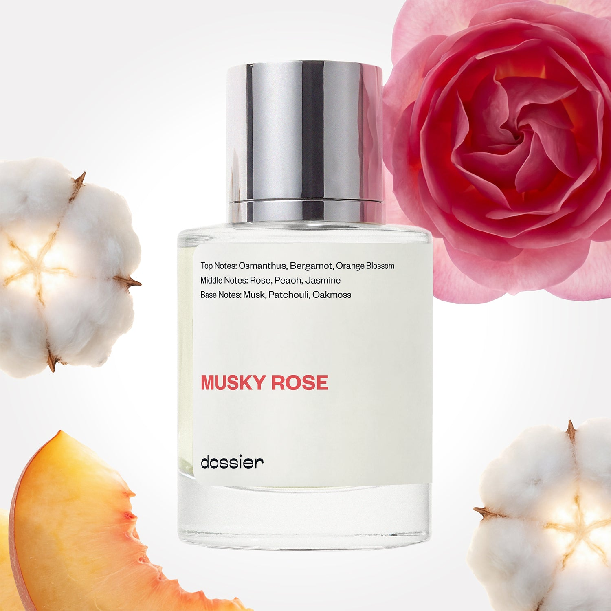

# Musky Rose

- **Dossier Inspired by Narciso Rodriguez's For Her**
- **URL:** https://dossier.co/products/musky-rose
- **SEO title:** Narciso Rodriguez's For Her Dupe Perfume: Musky Rose - Dossier Perfumes

## Pricing (sizes)

| Size/SKU | Member price | List price | Currency |
|---|---|---|---|
| 32222158880835 | 28.8 | 32 | USD |

## Content (scent notes, about, editorial)

Back Home / Perfumes / Dossier Impressions / MUSKY ROSE 

Women 

It's back! 

Musky Rose

Eau de Parfum. Size: 50ml / 1.7oz 

members: $28.80

Guest:
$32

Inspired by Narciso Rodriguez's For Her Inspired by Narciso Rodriguez's For Her 
Inspired by Narciso Rodriguez's For Her 

Retail price 125 Crafted in France 
Scent Family: flowery 

Notify Me 

Scent Notes This perfume is: Lush velvet as a perfume 
Main Notes:

Rose

Peach

Jasmine

Musks

Patchouli

Oakmoss

top: The first notes you smell 
Osmanthus, Bergamot, Orange Blossom 
middle: The heart of the perfume 
Rose, Peach, Jasmine 
base: The notes that linger all day 
Musk, Patchouli, Oakmoss 
ingredients: Alcohol, Water, Parfum/Perfume, Amyl Cinnamal, Hexyl Cinnamal, Benzyl alcohol, Benzyl Benzoate, Benzyl Salicylate, Cinnamaldehyde, Cinnamyl alcohol, Citral, Citronellol, Limonene, Eugenol, Geraniol, Hydroxycitronellal, Linalool. 

Vegan
Cruelty-free

Clean ingredients

About Musky Rose (inspired by Narciso Rodriguez For Her) is a journey to the heart of musks with multiple and subtle facets that give the scent a radiant and soulful composition. Thanks to rose, osmanthus flower, and orange blossom, the fragrance also develops a soft sensuality on a pink pastel frame, while amber and wood add mystery and depth to the composition. 
Intimate and precisely balanced, Musky Rose (our impression of Narciso Rodriguez For Her) is a light veil, perfect for layering on your skin with a velvety finish. 

Scent Intensity: Soft 

Concentration: 15%

Gender: Feminine 

Shipping
Free shipping with 2+ items. 

Standard Shipping (with 2+ items) Auto-selected with 2+ items 
FREE 

Standard Shipping Auto-selected under 2 items 
$3.95 

Express shipping: 2 business days Select in checkout 
$19.00 

Returns
Free exchanges for all. Free returns with 

Exchanges
Free exchange, 1 time per order for all.

Returns
D+ members get 1 FREE return per order.
Non-members incur a $3.99/bottle return fee, 1 time per order.
Returns must be postmarked within 30 days of the initial order. Learn More 

FAQs Are these fragrances long lasting? They are designed to be very long lasting, just like designer fragrances, in some cases even longer, depending on the composition. 
When does the new packaging come out? We'll begin rolling out our new packaging across the U.S. and international markets soon! If you want to shop IRL - our new packaging first hits stores on January 11, 2026 at Walmart. Please note that if you are shopping online, you may receive a combination of our current and new packaging while we transition our inventory. 
How will I know what scent I like? We get it, shopping for perfumes online is hard! That's why we created a scent quiz, which will find the perfect scent for you Take the quiz (opens in new tab) 
Unsure about something? Ask us! help@dossier.co 

Details We are not associated or affiliated with the brands mentioned here in any way.
Musky Rose

A peculiar and endearing aroma

For good reason, the 2003 launch of the Narciso Rodriguez For Her Eau de Parfum (which inspired Dossier’s Musky Rose) sent shockwaves through the fragrance industry and chills down the spines of competitors. The perfume seemed to understand better than anyone the innate taste of the modern woman. It had an uncharted perspective on what it meant to explore femininity.

Oozing with the confidence of floral chypre and the esteem of musk nuance, the scent of the luxury perfume that Musky Rose is inspired by is so sweet it almost hypnotizes you. Open it just once, and you’ll quickly be surrounded by the allure of orange flower, osmanthus, and amber. Dare to apply it and you’ll live the mysterious pleasantness of vanilla, patchouli, and vetiver. Absolutely fascinating is the feeling here – and it’s so real it brings on inspiring visions of the Canadian Rockies, with the pristine, glacial lakes.

All in all, the Narciso Rodriguez For Her Eau de Parfum is a multi-faceted fragrance that brings a sweet and tidy touch to the table. It highlights the sensuality of the scent and redefines feminine beauty.

And as for how long it lasts, the fragrance stays alive throughout the day, surprising you with another note just when you think it’s gone. Indeed, it takes something special to create such a peculiar and endearing aroma without using any synthetic ingredients.

For those who have just started wearing perfumes, this enigmatic smell is a great place to start. It is a warm mixture that you’ll want to smother your body in – and an aromatic retreat for anyone who’s been craving one for a long time. Take a deep breath and experience the warm embrace of the pristine, transporting sunset. You will definitely feel in sync with nature wearing this.

The luxury perfume that Musky Rose is inspired by is available for purchase on all the major online retailers. You can get a 100 ml Narciso Rodriguez BPI-007 For Her, 3.3 oz EDP Spray for $79.79, Rollerball for $22.99, and 3.3 oz Eau de Parfum Spray, 3.3 oz for $74.90.

If you want a more affordable alternative to the Narciso Rodriguez For Her, Dossier’s Musky Rose is a good choice. Starring notes of African orange flower, musk, amber, bergamot, and patchouli, our dupe is more than just a replica. It is a contemporary classic, expertly crafted to capture the moment when the caterpillars sprout wings and launch into the temperate morning air. It is a beautifully crafted scent that makes use of perfumes’ capacity to transport the imagination to both actual and imagined places. This is a must-try for anyone seeking to hire a stunning scent escort for the day (and night).

Best Layered With Combine 2 of our perfumes to create a third scent with layering, curated by our nose. Learn more 

You Might Love 

3.9 

Rated 3.9 out of 5 stars 

Based on 534 reviews 

Reviews 534 (tab expanded) Questions 2 (tab collapsed) 

Filters 
Write a Review (Opens in a new window) 

534 reviews 
Sort Highest Rating Most Helpful Photos & Videos Most Recent Oldest Lowest Rating Least Helpful 

R 

Robyn 

6/2/26 

Rated 5 out of 5 stars 

Beautiful 
This is a must have. The first time I wore this I was at work and a Patient told me how good I smelled. She said I smelled clean like I wasn’t even wearing perfume. I love it. I also have the OG Narciso edt and I actually like this dossier version better. Idk why. Maybe it’s because to me it’s slightly lighter slightly fresher and it’s kind of like a combo of the for her edp and the edt together. It’s just kind of perfect. And yes it lasts all day. He sprayed on early in the morning before I go to work and later on after work I was still in my work uniform and I went to my daughter‘s house and she said mom you smell so good. What is that and I could still smell it on myself and you’re talking 8+ hours after spraying it on and I don’t overspray. I’m not an oversprayer. It’s clean and soft and sophisticated. 

Read More Read more about this review 

Was this helpful? Yes, this review from Robyn was helpful. 0 people voted yes No, this review from Robyn was not helpful. 0 people voted no 

DP 

Dossier Perfumes 
6/2/26 
Robyn, wow that story made our day! And hearing it lasts all day without overspraying is just the cherry on top. Here’s to many more compliments ahead 😊

SS 

Sue S. 

9/15/25 

Rated 5 out of 5 stars 

Love it
It smells just like the original ❣️️❣️️

Read More Read more about this review 

Was this helpful? Yes, this review from Sue S. was helpful. 0 people voted yes No, this review from Sue S. was not helpful. 0 people voted no 

DP 

Dossier Perfumes 
9/15/25 
That’s music to our noses, Sue! Nothing better than smelling spot-on without the luxury price tag. ❣️️

KM 

Kay M. 

8/20/25 

Rated 5 out of 5 stars 

I love this perfume. I've
I love this perfume. I've gotten lots of compliments on it

Read More Read more about this review 

Was this helpful? Yes, this review from Kay M. was helpful. 0 people voted yes No, this review from Kay M. was not helpful. 0 people voted no 

DP 

Dossier Perfumes 
8/21/25 
The compliments say it all, Kay! Keep turning heads!

KC 

KL C. 

8/14/25 

Rated 5 out of 5 stars 

A nice subtle rose perfume
Musky rose is a subtle rose floral with a musky dry down. It’s not the strongest scent. It’s a good every day perfume

Read More Read more about this review 

Was this helpful? Yes, this review from KL C. was helpful. 0 people voted yes No, this review from KL C. was not helpful. 0 people voted no 

DP 

Dossier Perfumes 
8/21/25 
Everyday rose! This is such a versatile staple. Enjoy it, KL!

RA 

Renee A. 

6/12/25 

Rated 5 out of 5 stars 

Perfect balance of Clean, Sexy, and Feminine
Absolutely obsessed with this scent. I think it smells exactly like the original. This will always be a staple for my every day perfume.

Read More Read more about this review 

Was this helpful? Yes, this review from Renee A. was helpful. 0 people voted yes No, this review from Renee A. was not helpful. 0 people voted no 

DP 

Dossier Perfumes 
6/20/25 
Wow, Renee, that’s the dream combo! 💥 So glad it became your everyday staple!

Loading... 

Loading... 

Show More 

Inspired by  Baccarat Rouge 540 
Inspired by  Black Opium 
Inspired by  Love, Don't Be Shy 
Inspired by  Good Girl 
Inspired by  Libre 
Inspired by  Flowerbomb 
Inspired by  Light Blue 
Inspired by  Not a Perfume 
Inspired by  Aventus 
Inspired by  Bleu de Chanel 
Inspired by  Mon Paris 
Inspired by  Coco Mademoiselle 
Inspired by  Tom Ford for Men 
Inspired by  For Her 
Inspired by  J'Adore Dior 
Inspired by  Alien 
Inspired by  Black Opium Perfume 
Inspired by  Lost Cherry Perfume 

GET UP TO 30% OFF 

Find us at these retailers. 

Be the first to know. 
Submit 

Shop the following countries. United States 

Discover.
AI Scent Finder 
Blog (opens in new tab) 
Scent Family 
Layering 
Scent Quiz 

Help.
Contact Us 
Returns 
FAQ 
Testimonials 
Accessibility 

More.
Store Locator 
Boutique 
Refer A Friend 
Index 

Download our app now.

Find us at these retailers. 

Be the first to know. 
Submit 

Shop the following countries. United States 

Discover.
AI Scent Finder 
Blog (opens in new tab) 
Scent Family 
Layering 
Scent Quiz 

Help.
Contact Us 
Returns 
FAQ 
Testimonials 
Accessibility 

More.

## Main Image

