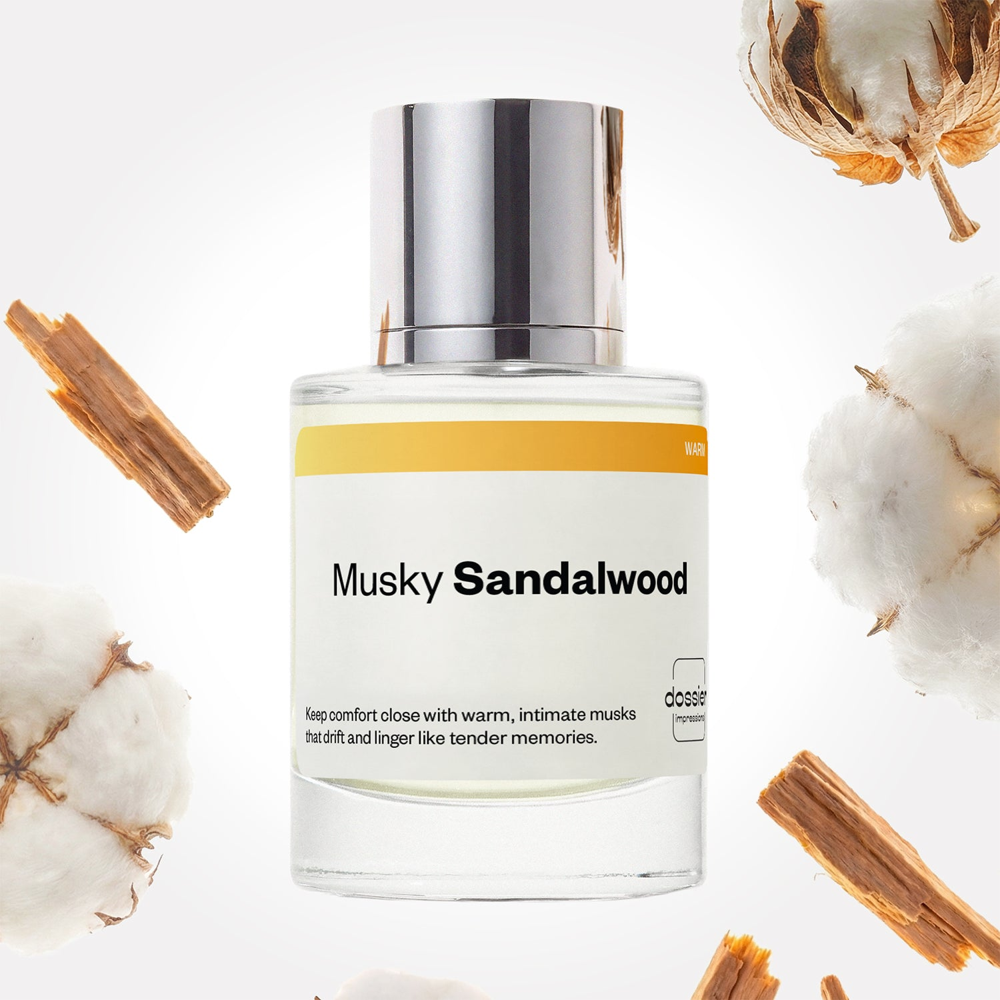

# Musky Sandalwood

- **Dossier Inspired by Phlur's Missing Person**
- **URL:** https://dossier.co/products/musky-sandalwood
- **SEO title:** Musky Sandalwood

## Pricing (sizes)

| Size/SKU | Member price | List price | Currency |
|---|---|---|---|
| 50ml | 28.8 | 32 | USD |

## Content (scent notes, about, editorial)

Back Home / Perfumes / Dossier Impressions / MUSKY SANDALWOOD 

Unisex 

New 

Musky Sandalwood

Eau de Parfum. Size: 50ml / 1.7oz 

members: $28.80

Guest:
$32

Inspired by Phlur's Missing Person Inspired by Phlur's Missing Person 
Inspired by Phlur's Missing Person 

Retail price 99 Crafted in France 
Scent Family: warm 

Add to Cart 

Scent Notes Main Notes:

Musks

top: The first notes you smell 
Lily of the Valley, Neroli 
middle: The heart of the perfume 
Jasmine, Solar Notes 
base: The notes that linger all day 
Musks, Sandalwood, Oakmoss 
ingredients: Alcohol Denat., Fragrance/Parfum, Benzyl Salicylate, Hydroxycitronellal, Hexamethylindanopyran, Benzyl Alcohol, Benzyl Benzoate, Trimethylcyclopentenyl Methylisopentenol. 

Vegan
Cruelty-free

Clean ingredients

About Musky Sandalwood (inspired by Phlur’s Missing Person) is a ballad of airy, yet intimate warmth and skin-like softness. Clean, white musks take the lead with quiet sensuality, lingering through the day like a tender touch.

Subtle traces of sandalwood, lily of the valley, and jasmine gently whisper in the background, bringing a hint of texture to the musky blend.

Alluring, yet understated—it settles into skin with the lived-in comfort and closeness you crave. Effortlessly wearable, uniquely irresistible, and made to satiate the senses.

Scent Intensity: Soft 

Concentration: 35%

Gender: Unisex 

Shipping
Free shipping with 2+ items. 

Standard Shipping (with 2+ items) Auto-selected with 2+ items 
FREE 

Standard Shipping Auto-selected under 2 items 
$3.95 

Express shipping: 2 business days Select in checkout 
$19.00 

Returns
Free exchanges for all. Free returns with 

Exchanges
Free exchange, 1 time per order for all.

Returns
D+ members get 1 FREE return per order.
Non-members incur a $3.99/bottle return fee, 1 time per order.
Returns must be postmarked within 30 days of the initial order. Learn More 

FAQs Are these fragrances long lasting? They are designed to be very long lasting, just like designer fragrances, in some cases even longer, depending on the composition. 
When does the new packaging come out? We'll begin rolling out our new packaging across the U.S. and international markets soon! If you want to shop IRL - our new packaging first hits stores on January 11, 2026 at Walmart. Please note that if you are shopping online, you may receive a combination of our current and new packaging while we transition our inventory. 
How will I know what scent I like? We get it, shopping for perfumes online is hard! That's why we created a scent quiz, which will find the perfect scent for you Take the quiz (opens in new tab) 
Unsure about something? Ask us! help@dossier.co 

Best Layered With Combine 2 of our perfumes to create a third scent with layering, curated by our nose. Learn more 

You Might Love 

4.4 

Rated 4.4 out of 5 stars 

Based on 41 reviews 

Reviews 41 (tab expanded) Questions (tab collapsed) 

Filters 
Write a Review (Opens in a new window) 

41 reviews 
Sort Highest Rating Most Helpful Photos & Videos Most Recent Oldest Lowest Rating Least Helpful 

C 

Chantal 

6/30/26 

Rated 5 out of 5 stars 

5 Stars
Love it! Will be purchasing more!!!

Read More Read more about this review 

Was this helpful? Yes, this review from Chantal was helpful. 0 people voted yes No, this review from Chantal was not helpful. 0 people voted no 

MH 

Michelle H. 
Verified Buyer 

6/22/26 

Rated 5 out of 5 stars 

Smells Great!
Smell great and has a lasting scent. 

Read More Read more about this review 

Was this helpful? Yes, this review from Michelle H. was helpful. 0 people voted yes No, this review from Michelle H. was not helpful. 0 people voted no 

DP 

Dossier Perfumes 
6/22/26 
Michelle, thanks for sharing! We’re thrilled it lasts and you love it 💫

SJ 

Sheila J. 
Verified Buyer 

6/21/26 

Rated 5 out of 5 stars 

musky sandalwood
Love this so much sandalwood is one of my favorite scents

Read More Read more about this review 

Was this helpful? Yes, this review from Sheila J. was helpful. 0 people voted yes No, this review from Sheila J. was not helpful. 0 people voted no 

DP 

Dossier Perfumes 
6/21/26 
Sheila! So happy this hit the sandalwood spot for you 😊 Thanks for sharing!

AF 

Amber F. 
Verified Buyer 

6/19/26 

Rated 5 out of 5 stars 

Near perfect dupe!
This smells very similar to Phlur’s Missing Person. The scents are nearly identical, and I am thrilled to have found this more affordable option! My husband loves both scents on me and can’t tell the difference. 🙌🏻 

Read More Read more about this review 

Was this helpful? Yes, this review from Amber F. was helpful. 0 people voted yes No, this review from Amber F. was not helpful. 0 people voted no 

DP 

Dossier Perfumes 
6/19/26 
Hey Amber! We’re so happy you and your husband are loving this and that it’s delivering all those compliments. Thanks for sharing your experience and happy spritzing 🙌🏻

HH 

Heather H. 
Verified Buyer 

6/15/26 

Rated 5 out of 5 stars 

Love this 
Love it & have worn it many times so far 

Read More Read more about this review 

Was this helpful? Yes, this review from Heather H. was helpful. 0 people voted yes No, this review from Heather H. was not helpful. 0 people voted no 

DP 

Dossier Perfumes 
6/15/26 
Heather, so glad you’ve been reaching for it again and again 😊

Loading... 

Loading... 

Show More 

Inspired by  Baccarat Rouge 540 
Inspired by  Black Opium 
Inspired by  Love, Don't Be Shy 
Inspired by  Good Girl 
Inspired by  Libre 
Inspired by  Flowerbomb 
Inspired by  Light Blue 
Inspired by  Not a Perfume 
Inspired by  Aventus 
Inspired by  Bleu de Chanel 
Inspired by  Mon Paris 
Inspired by  Coco Mademoiselle 
Inspired by  Tom Ford for Men 
Inspired by  For Her 
Inspired by  J'Adore Dior 
Inspired by  Alien 
Inspired by  Black Opium Perfume 
Inspired by  Lost Cherry Perfume 

GET UP TO 30% OFF 

Find us at these retailers. 

Be the first to know. 
Submit 

Shop the following countries. United States 

Discover.
AI Scent Finder 
Blog (opens in new tab) 
Scent Family 
Layering 
Scent Quiz 

Help.
Contact Us 
Returns 
FAQ 
Testimonials 
Accessibility 

More.
Store Locator 
Boutique 
Refer A Friend 
Index 

Download our app now.

Find us at these retailers. 

Be the first to know. 
Submit 

Shop the following countries. United States 

Discover.
AI Scent Finder 
Blog (opens in new tab) 
Scent Family 
Layering 
Scent Quiz 

Help.
Contact Us 
Returns 
FAQ 
Testimonials 
Accessibility 

More.

## Main Image

