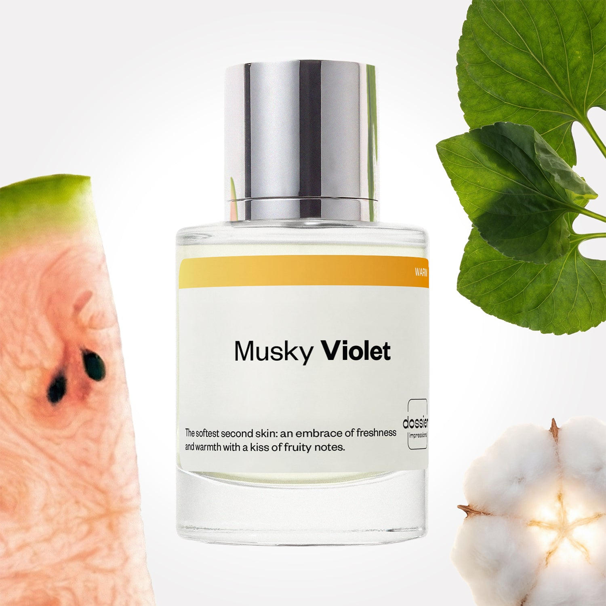

# Musky Violet

- **Dossier Inspired by Byredo’s Mojave Ghost**
- **URL:** https://dossier.co/products/musky-violet
- **SEO title:** Musky Violet

## Pricing (sizes)

| Size/SKU | Member price | List price | Currency |
|---|---|---|---|
| DI50MVUS | 44.1 | 49 | USD |

## Content (scent notes, about, editorial)

Back Home / Perfumes / Dossier Impressions / MUSKY VIOLET 

Unisex 

New 

Musky Violet

Eau de Parfum. Size: 50ml / 1.7oz 

members: $44.10

Guest:
$49

Inspired by Byredo's Mojave Ghost Inspired by Byredo's Mojave Ghost 
Inspired by Byredo's Mojave Ghost 

Retail price 230 Crafted in France 
Scent Family: warm 

Add to Cart 

Scent Notes Main Notes:

Watermelon

Violet Leaf

Musks

Sandalwood

top: The first notes you smell 
watermelon, green apple, peach 
middle: The heart of the perfume 
violet leaf, iris, jasmine, rose 
base: The notes that linger all day 
musks, sandalwood, cedarwood, vetiver 
ingredients: Alcohol Denat., Water, Parfum/Perfume, Camphor, Citral, Tetramethyl Acetyloctahydronaphthalenes, Jasmine Oil/Extract, Juniperus Virginiana Oil, Pinene, Rose Flower Oil/Extract, Rose Ketones, Santalol, Terpineol, Hexamethylindanopyran, Acetyl cedrene, Alpha-isomethyl Ionone, Benzyl Alcohol, Benzyl Benzoate, Cinnamal, Citronellol, Limonene, Eugenol, Farnesol, Geraniol, Linalool, Linalyl Acetate, Santalum Album Oil.

Vegan
Cruelty-free

Clean ingredients

About Spritz yourself a gentle embrace with this subtle and almost veil-like second-skin scent. Musky Violet transports you into a desert of sweetness before evolving into a balance of fresh, green notes and a warm, creamy base. The fragrance opens with a fruit mélange of watermelon, green apple, and peach. Watery and lush freshness violet leaf meets powdery floral notes of iris, rose, and jasmin at the heart. Once settled on the skin, the scent dries down to a comforting, sensual base of musks, sandalwood, cedarwood, and vetiver. Enjoy the bliss of intimate touch in a bottle.

Scent Intensity: Soft 

Concentration: 12%

Gender: Unisex 

Shipping
Free shipping with 2+ items. 

Standard Shipping (with 2+ items) Auto-selected with 2+ items 
FREE 

Standard Shipping Auto-selected under 2 items 
$3.95 

Express shipping: 2 business days Select in checkout 
$19.00 

Returns
Free exchanges for all. Free returns with 

Exchanges
Free exchange, 1 time per order for all.

Returns
D+ members get 1 FREE return per order.
Non-members incur a $3.99/bottle return fee, 1 time per order.
Returns must be postmarked within 30 days of the initial order. Learn More 

FAQs Are these fragrances long lasting? They are designed to be very long lasting, just like designer fragrances, in some cases even longer, depending on the composition. 
When does the new packaging come out? We'll begin rolling out our new packaging across the U.S. and international markets soon! If you want to shop IRL - our new packaging first hits stores on January 11, 2026 at Walmart. Please note that if you are shopping online, you may receive a combination of our current and new packaging while we transition our inventory. 
How will I know what scent I like? We get it, shopping for perfumes online is hard! That's why we created a scent quiz, which will find the perfect scent for you Take the quiz (opens in new tab) 
Unsure about something? Ask us! help@dossier.co 

Best Layered With Combine 2 of our perfumes to create a third scent with layering, curated by our nose. Learn more 

You Might Love 

4.1 

Rated 4.1 out of 5 stars 

Based on 72 reviews 

Reviews 72 (tab expanded) Questions (tab collapsed) 

Filters 
Write a Review (Opens in a new window) 

72 reviews 
Sort Highest Rating Most Helpful Photos & Videos Most Recent Oldest Lowest Rating Least Helpful 

E 

Eden 
Verified Buyer 

6/21/26 

Rated 5 out of 5 stars 

Lighter, less sweet version
I have the original and I quite like having a supplementary option for when I want a lighter version. A lot of Dossier's scents are the Lite versions in my experience. Full disclosure I was given this as a gift after three scents I bought did not work out for me. I appreciate that this brand cares about the experience as a whole.

Read More Read more about this review 

Was this helpful? Yes, this review from Eden was helpful. 0 people voted yes No, this review from Eden was not helpful. 0 people voted no 

DP 

Dossier Perfumes 
6/22/26 
Eden! Love that you’re enjoying the lighter take and glad our catalog gives options for every mood. Thanks for sharing how the experience still shines, here’s to more happy spritzes!

J 

Jennifer 

6/3/26 

Rated 5 out of 5 stars 

5 Stars
I haven’t smelled the original, but I dont need to. This one is tens across the board for me, and the way the violet and sandalwood notes dance together on my skin makes this a love for me!

Read More Read more about this review 

Was this helpful? Yes, this review from Jennifer was helpful. 0 people voted yes No, this review from Jennifer was not helpful. 0 people voted no 

AZ 

Aram Z. 
Verified Buyer 

5/31/26 

Rated 5 out of 5 stars 

Amazing product
Thank you for Good Quality

Read More Read more about this review 

Was this helpful? Yes, this review from Aram Z. was helpful. 0 people voted yes No, this review from Aram Z. was not helpful. 0 people voted no 

DP 

Dossier Perfumes 
5/31/26 
We’re thrilled you love the quality, Aram! Thanks a bunch for the kind words 😊

DE 

Duane E. 
Verified Buyer 

5/21/26 

Rated 5 out of 5 stars 

Good scent
I like it

Read More Read more about this review 

Was this helpful? Yes, this review from Duane E. was helpful. 0 people voted yes No, this review from Duane E. was not helpful. 0 people voted no 

DP 

Dossier Perfumes 
5/21/26 
Hey Duane! So happy you’re enjoying this scent. Thanks for sharing your thoughts 😊

T 

Tanya 

5/19/26 

Rated 5 out of 5 stars 

5 Stars
Got it quickly smells good long lasting.

Read More Read more about this review 

Was this helpful? Yes, this review from Tanya was helpful. 0 people voted yes No, this review from Tanya was not helpful. 0 people voted no 

Loading... 

Loading... 

Show More 

Inspired by  Baccarat Rouge 540 
Inspired by  Black Opium 
Inspired by  Love, Don't Be Shy 
Inspired by  Good Girl 
Inspired by  Libre 
Inspired by  Flowerbomb 
Inspired by  Light Blue 
Inspired by  Not a Perfume 
Inspired by  Aventus 
Inspired by  Bleu de Chanel 
Inspired by  Mon Paris 
Inspired by  Coco Mademoiselle 
Inspired by  Tom Ford for Men 
Inspired by  For Her 
Inspired by  J'Adore Dior 
Inspired by  Alien 
Inspired by  Black Opium Perfume 
Inspired by  Lost Cherry Perfume 

GET UP TO 30% OFF 

Find us at these retailers. 

Be the first to know. 
Submit 

Shop the following countries. United States 

Discover.
AI Scent Finder 
Blog (opens in new tab) 
Scent Family 
Layering 
Scent Quiz 

Help.
Contact Us 
Returns 
FAQ 
Testimonials 
Accessibility 

More.
Store Locator 
Boutique 
Refer A Friend 
Index 

Download our app now.

Find us at these retailers. 

Be the first to know. 
Submit 

Shop the following countries. United States 

Discover.
AI Scent Finder 
Blog (opens in new tab) 
Scent Family 
Layering 
Scent Quiz 

Help.
Contact Us 
Returns 
FAQ 
Testimonials 
Accessibility 

More.

## Main Image

