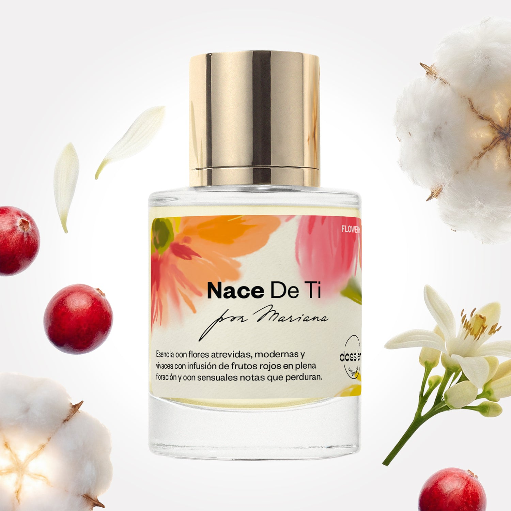

# Nace De Ti

- **Dossier Dossier Originals**
- **URL:** https://dossier.co/products/nace-de-ti
- **SEO title:** Nace De Ti

## Pricing (sizes)

| Size/SKU | Member price | List price | Currency |
|---|---|---|---|
|  | 44.1 | 49 | USD |

## Content (scent notes, about, editorial)

Back Home / Perfumes / Dossier Originals / NACE DE TI 

Women 

New 

Nace De Ti

Eau de Parfum. Size: 50ml / 1.7oz 

members: $44.10

Guest:
$49

Dossier Originals: The Mariana Collection 
An exclusive, bold, modern floral scent with fruity & sensual notes. Co-created with Mariana Guerrero Ramírez (1.3M+ TikTok followers), the viral florist shop owner and mom blended this scent for those who do it all.

Crafted in France 
Scent Family: flowery 

Notify Me 

Scent Notes Main Notes:

Cranberry

Orange Flower

Musks

top: The first notes you smell 
cranberry, Blackcurrant, Peach, Melon 
middle: The heart of the perfume 
orange flower, Peony, Iris, Jasmine 
base: The notes that linger all day 
musks, Patchouli, Cedarwood, Vetiver 
ingredients: Alcohol Denat., Water/ Aqua/Eau, Parfum/Perfume, Camphor, Carvone, Citral, Citrus Aurantium Peel Oil, Tetramethyl Acetyloctahydronaphthalenes, Jasmine Oil/Extract, Pinene, Rose Ketones, Terpineol, Sclareol, Hexamethylindanopyran, Acetyl cedrene, Alpha-isomethyl Ionone, Alpha-Terpinene, Amyl Salicylate, Benzaldehyde, Benzyl Alcohol, Benzyl Benzoate, Benzyl Salicylate, Beta-caryophyllene, Citrus Limon Peel Oil, Coumarin, Citronellol, Limonene, Eugenol, Geraniol, Geranyl Acetate, Hexadecanolactone, Hydroxycitronellal, Isoeugenyl Acetate, Linalool, Linalyl Acetate, Pogostemon Cablin Oil, Terpinolene, Vanillin. 

Vegan
Cruelty-free

Clean ingredients

About An energy shot for your floral fragrance collection. This vibrant, metallic fragrance offers a fresh and unique twist on your classic floral perfume with revitalizing top notes and an earthy base. Nace De Ti opens with a burst of cranberry with supporting bergamot and neroli flower notes. The fragrance then evolves to a floral heart with orange flower in full bloom arranged in an olfactory bouquet with orris butter, peony, and jasmine sambac. Once settled on the skin, enveloping musk notes come to the forefront at the base, intermingled with cedarwood and vetiver notes. It’s floriculture at its finest––for day, night, or any occasion––in every spritz.

Scent Intensity: Significant 

Concentration: 18%

Gender: Feminine 

Shipping
Free shipping with 2+ items. 

Standard Shipping (with 2+ items) Auto-selected with 2+ items 
FREE 

Standard Shipping Auto-selected under 2 items 
$3.95 

Express shipping: 2 business days Select in checkout 
$19.00 

Returns
Free exchanges for all. Free returns with 

Exchanges
Free exchange, 1 time per order for all.

Returns
D+ members get 1 FREE return per order.
Non-members incur a $3.99/bottle return fee, 1 time per order.
Returns must be postmarked within 30 days of the initial order. Learn More 

FAQs Are these fragrances long lasting? They are designed to be very long lasting, just like designer fragrances, in some cases even longer, depending on the composition. 
When does the new packaging come out? We'll begin rolling out our new packaging across the U.S. and international markets soon! If you want to shop IRL - our new packaging first hits stores on January 11, 2026 at Walmart. Please note that if you are shopping online, you may receive a combination of our current and new packaging while we transition our inventory. 
How will I know what scent I like? We get it, shopping for perfumes online is hard! That's why we created a scent quiz, which will find the perfect scent for you Take the quiz (opens in new tab) 
Unsure about something? Ask us! help@dossier.co 

Best Layered With Combine 2 of our perfumes to create a third scent with layering, curated by our nose. Learn more 

You Might Love 

5.0 

Rated 5.0 out of 5 stars 

Based on 1 review 

Reviews 1 (tab expanded) Questions (tab collapsed) 

Filters 
Write a Review (Opens in a new window) 

1 review 
Sort Highest Rating Most Helpful Photos & Videos Most Recent Oldest Lowest Rating Least Helpful 

TM 

Tanuja M. 

12/11/25 

Rated 5 out of 5 stars 

I'm obsessed ❤️️❤️️❤️️❤️️
I have a confession. I might be obsessed with Dossier perfumes. These might be the best fragrance impressions I have ever used. They last. And I mean they really last. My clothes still smell amazing even days later. I have tried other brands that promise the world and deliver a faint whisper of scent. Dossier doesn’t whisper, it stays loud and proud.
I keep coming back to Dossier like it’s my go to perfume soulmate. If you want long wear, great scent, and serious bang for your buck, this is it. My only wish is that they would make more dupes for Burberry London Dreams, Glossier Deux, and the new Bella Hadid fragrances. Until then I’ll just be over here wearing Dossier every day and smiling at my own scent cloud.

Read More Read more about this review 

Was this helpful? Yes, this review from Tanuja M. was helpful. 0 people voted yes No, this review from Tanuja M. was not helpful. 0 people voted no 

DP 

Dossier Perfumes 
12/11/25 
Okay, Tanuja, your energy is everything! That "perfume soulmate" line? Iconic. Thanks for all the love and for making us part of your everyday scent cloud. We're smiling right along with you.

Loading... 

Loading... 

Inspired by  Baccarat Rouge 540 
Inspired by  Black Opium 
Inspired by  Love, Don't Be Shy 
Inspired by  Good Girl 
Inspired by  Libre 
Inspired by  Flowerbomb 
Inspired by  Light Blue 
Inspired by  Not a Perfume 
Inspired by  Aventus 
Inspired by  Bleu de Chanel 
Inspired by  Mon Paris 
Inspired by  Coco Mademoiselle 
Inspired by  Tom Ford for Men 
Inspired by  For Her 
Inspired by  J'Adore Dior 
Inspired by  Alien 
Inspired by  Black Opium Perfume 
Inspired by  Lost Cherry Perfume 

GET UP TO 30% OFF 

Find us at these retailers. 

Be the first to know. 
Submit 

Shop the following countries. United States 

Discover.
AI Scent Finder 
Blog (opens in new tab) 
Scent Family 
Layering 
Scent Quiz 

Help.
Contact Us 
Returns 
FAQ 
Testimonials 
Accessibility 

More.
Store Locator 
Boutique 
Refer A Friend 
Index 

Download our app now.

Find us at these retailers. 

Be the first to know. 
Submit 

Shop the following countries. United States 

Discover.
AI Scent Finder 
Blog (opens in new tab) 
Scent Family 
Layering 
Scent Quiz 

Help.
Contact Us 
Returns 
FAQ 
Testimonials 
Accessibility 

More.

## Main Image

