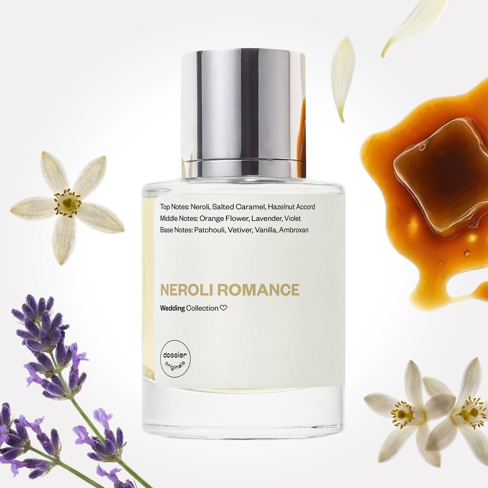

# Neroli Romance

- **Dossier Dossier Originals**
- **URL:** https://dossier.co/products/neroli-romance
- **SEO title:** Neroli Romance

## Pricing (sizes)

| Size/SKU | Member price | List price | Currency |
|---|---|---|---|
| 50ml | 35.1 | 39 | USD |
| BF+Free | 0 | 0 | USD |

## Content (scent notes, about, editorial)

Back Home / Perfumes / Dossier Originals / NEROLI ROMANCE 

Unisex 

New 

Neroli Romance

Eau de Parfum. Size: 50ml / 1.7oz 

members: $35.10

Guest:
$39

Dossier Originals: The wedding 

The union of traditionally masculine and feminine notes––marrying an unexpected match made for each other. 
Crafted in France 
Scent Family: flowery 

Add to Cart 

Scent Notes Main Notes:

Salted Caramel

Orange Flower

Lavender

top: The first notes you smell 
Neroli, Salted Caramel, Hazelnut Accord 
middle: The heart of the perfume 
Orange Flower, Lavender, Violet 
base: The notes that linger all day 
Patchouli, Vetiver, Vanilla, Ambroxan 
ingredients: Alcohol Denat., Water, Parfum/Perfume, alpha-Isomethyl ionone, Benzyl Benzoate, Citral, Citronellol, Limonene, Eugenol, Farnesol, Geraniol, Isoeugenol, Linalool. 

Vegan
Cruelty-free

Clean ingredients

About Neroli Romance Wedding Edition unifies the playful aroma of caramelized lavender with a heart of delicate, airy Neroli to signify fresh and sweet new beginnings. Neroli, interlaced with notes of lavender and orange flower, transport you to the luscious blossoms that cover fields throughout the South of France. 

This fragrance was custom-made for our Co-founder’s wedding day to denote her Southern French roots through prominent neroli and orange flowers, traditional wedding symbols in the region. 

Juxtaposing traditional feminine floral and gourmands with classically masculine lavender notes, Neroli Romance Wedding Edition embodies the harmony and elegance of contemporary romance. 

Scent Intensity: Significant 

Concentration: 18%

Gender: Unisex 

Shipping
Free shipping with 2+ items. 

Standard Shipping (with 2+ items) Auto-selected with 2+ items 
FREE 

Standard Shipping Auto-selected under 2 items 
$3.95 

Express shipping: 2 business days Select in checkout 
$19.00 

Returns
Free exchanges for all. Free returns with 

Exchanges
Free exchange, 1 time per order for all.

Returns
D+ members get 1 FREE return per order.
Non-members incur a $3.99/bottle return fee, 1 time per order.
Returns must be postmarked within 30 days of the initial order. Learn More 

FAQs Are these fragrances long lasting? They are designed to be very long lasting, just like designer fragrances, in some cases even longer, depending on the composition. 
When does the new packaging come out? We'll begin rolling out our new packaging across the U.S. and international markets soon! If you want to shop IRL - our new packaging first hits stores on January 11, 2026 at Walmart. Please note that if you are shopping online, you may receive a combination of our current and new packaging while we transition our inventory. 
How will I know what scent I like? We get it, shopping for perfumes online is hard! That's why we created a scent quiz, which will find the perfect scent for you Take the quiz (opens in new tab) 
Unsure about something? Ask us! help@dossier.co 

Best Layered With Combine 2 of our perfumes to create a third scent with layering, curated by our nose. Learn more 

You Might Love 

4.1 

Rated 4.1 out of 5 stars 

Based on 95 reviews 

Reviews 95 (tab expanded) Questions (tab collapsed) 

Filters 
Write a Review (Opens in a new window) 

95 reviews 
Sort Highest Rating Most Helpful Photos & Videos Most Recent Oldest Lowest Rating Least Helpful 

S 

Shari 

6/13/26 

Rated 5 out of 5 stars 

5 Stars
Smells yummy!

Read More Read more about this review 

Was this helpful? Yes, this review from Shari was helpful. 0 people voted yes No, this review from Shari was not helpful. 0 people voted no 

KB 

Kim B. 
Verified Buyer 

6/3/26 

Rated 5 out of 5 stars 

Worth every penny!
I was a little skeptical at first because I usually like to smell perfumes before buying them. I decided to take a chance and ordered a bottle, and I'm so glad I did. I absolutely fell in love with it! It smelled even better than I expected and quickly had me coming back to purchase more. So far, I haven't come across a scent that I don't like. I'm very impressed with the quality and variety of fragrances.

Read More Read more about this review 

Was this helpful? Yes, this review from Kim B. was helpful. 0 people voted yes No, this review from Kim B. was not helpful. 0 people voted no 

DP 

Dossier Perfumes 
6/3/26 
Kim, trying perfume without sniffing first can be scary, but so glad you took the leap. We love hearing you keep exploring our scents and loving the quality!

BD 

Betsey D. 
Verified Buyer 

4/29/26 

Rated 5 out of 5 stars 

I adore strong scents!
I love strong pleasant perfume scents that definitely let you know it's there but doesn't overpower. Neroli Romance hits that mark perfectly! (So does Ambery Saffron 😍).

Read More Read more about this review 

Was this helpful? Yes, this review from Betsey D. was helpful. 0 people voted yes No, this review from Betsey D. was not helpful. 0 people voted no 

DP 

Dossier Perfumes 
4/29/26 
Betsey, we’re so happy you found that perfect balance of strong yet pleasant with Neroli Romance. It’s great to hear you’re loving Ambery Saffron too. Thanks for sharing your thoughts!

DG 

Debra G. 
Verified Buyer 

4/11/26 

Rated 5 out of 5 stars 

My layering scent
I accidentally stumbled across a combination that I get so many compliments on. I layer Neroli Romance with Aquatic Vanilla and it makes a sift, long lasting floral. It sounds strange but I get si many compliments. 

Read More Read more about this review 

Was this helpful? Yes, this review from Debra G. was helpful. 0 people voted yes No, this review from Debra G. was not helpful. 0 people voted no 

DP 

Dossier Perfumes 
4/11/26 
Debra, wow that combo is genius! It’s awesome you’re getting so many compliments. Layering scents is a way to create something for you. Keep experimenting, who knows what spark you’ll uncover!

MB 

Melissa B. 
Verified Buyer 

4/9/26 

Rated 5 out of 5 stars 

Love this fragrance
Gorgeous scent. Get so many compliments.

Read More Read more about this review 

Was this helpful? Yes, this review from Melissa B. was helpful. 0 people voted yes No, this review from Melissa B. was not helpful. 0 people voted no 

DP 

Dossier Perfumes 
4/9/26 
Melissa, that’s amazing! We’re so happy your fragrance is earning all those compliments ✨

Loading... 

Loading... 

Show More 

Inspired by  Baccarat Rouge 540 
Inspired by  Black Opium 
Inspired by  Love, Don't Be Shy 
Inspired by  Good Girl 
Inspired by  Libre 
Inspired by  Flowerbomb 
Inspired by  Light Blue 
Inspired by  Not a Perfume 
Inspired by  Aventus 
Inspired by  Bleu de Chanel 
Inspired by  Mon Paris 
Inspired by  Coco Mademoiselle 
Inspired by  Tom Ford for Men 
Inspired by  For Her 
Inspired by  J'Adore Dior 
Inspired by  Alien 
Inspired by  Black Opium Perfume 
Inspired by  Lost Cherry Perfume 

GET UP TO 30% OFF 

Find us at these retailers. 

Be the first to know. 
Submit 

Shop the following countries. United States 

Discover.
AI Scent Finder 
Blog (opens in new tab) 
Scent Family 
Layering 
Scent Quiz 

Help.
Contact Us 
Returns 
FAQ 
Testimonials 
Accessibility 

More.
Store Locator 
Boutique 
Refer A Friend 
Index 

Download our app now.

Find us at these retailers. 

Be the first to know. 
Submit 

Shop the following countries. United States 

Discover.
AI Scent Finder 
Blog (opens in new tab) 
Scent Family 
Layering 
Scent Quiz 

Help.
Contact Us 
Returns 
FAQ 
Testimonials 
Accessibility 

More.

## Main Image

