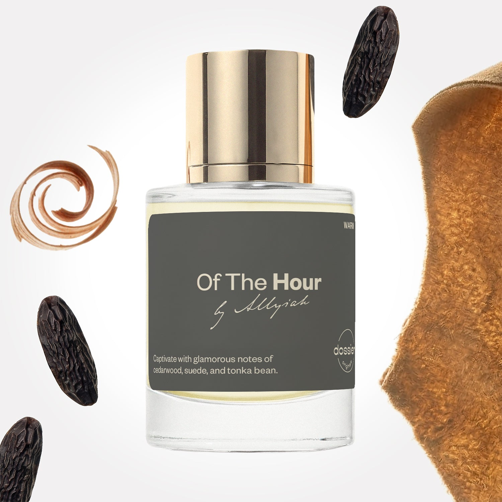

# Of The Hour

- **Dossier Dossier Originals**
- **URL:** https://dossier.co/products/of-the-hour
- **SEO title:** Of The Hour

## Pricing (sizes)

| Size/SKU | Member price | List price | Currency |
|---|---|---|---|
| 42335174688835 | 44.1 | 49 | USD |
| 42335053316163 | 44.1 | 49 | USD |
| TTSALLBDL | 88.2 | 98 | USD |

## Content (scent notes, about, editorial)

Back Home / Perfumes / Dossier Originals / OF THE HOUR 

Unisex 

Of The Hour

Eau de Parfum. Size: 50ml / 1.7oz 

members: $44.10

Guest:
$49

Co-created by Allyiah and the Dossier Creative Lab, this day-to-night scent duo blends radiant citrus, soft florals, and sensually rich, gender-neutral woods.
Dossier Originals: 
The Allyiah Collection 

Crafted in France 
Scent Family: warm 

Add to Cart 

Complete Allyiah's routine Better Days 
& Of The Hour Size: 2 x 50ml / 1.7 fl. oz per bottle 
: $88.20

Guest: $98

Regular price: $98.00 

Add Both to cart 

Complete Allyiah's routine Better Days 
& Of The Hour Size: 2 x 50ml / 1.7 fl. oz per bottle 
: $88.20

Guest: $98

Regular price: $98.00 

Add Both to cart 

Scent Notes Main Notes:

Cedarwood

Suede

Tonka Bean

top: The first notes you smell 
Almond, Coconut, Pink Pepper, Chamomile, Bergamot 
middle: The heart of the perfume 
Orange Flower, White Flowers, White Woods, Cedarwood 
base: The notes that linger all day 
Suede, Vanilla, Tonka Bean, Cistus 
ingredients: Alcohol Denat., Water, Parfum/Perfume, Camphor, Carvone, Citral, Citrus Aurantium Peel Oil, Tetramethyl Acetyloctahydronaphthalenes, Juniperus Virginiana Oil, Pinene, Terpineol, Sclareol, Alpha-Terpinene, Benzaldehyde, Benzyl Alcohol, Benzyl Benzoate, Benzyl Cinnamate, Benzyl Salicylate, Beta-caryophyllene, Cinnamal, Coumarin, Citronellol, Limonene, Eugenol, Farnesol, Geraniol, Geranyl Acetate, Hydroxycitronellal, Isoeugenol, Linalool, Linalyl Acetate, Terpinolene, Vanillin. 

Vegan
Cruelty-free

Clean ingredients

About Step out for a sexy night out on the town with this alluring and elegant fragrance to look good, feel good, and smell good until the sun comes up.

Of The Hour embodies cosmopolitan glamour with a deep, moody, and slightly masculine edge. This scent features notes of cedarwood, suede, and tonka bean with hints of spices and sweetness for a balanced finish. 

Embrace your spot on the fragrance VIP list with city glamour, bottled. 

Scent Intensity: Significant 

Concentration: 18%

Gender: Unisex 

Shipping
Free shipping with 2+ items. 

Standard Shipping (with 2+ items) Auto-selected with 2+ items 
FREE 

Standard Shipping Auto-selected under 2 items 
$3.95 

Express shipping: 2 business days Select in checkout 
$19.00 

Returns
Free exchanges for all. Free returns with 

Exchanges
Free exchange, 1 time per order for all.

Returns
D+ members get 1 FREE return per order.
Non-members incur a $3.99/bottle return fee, 1 time per order.
Returns must be postmarked within 30 days of the initial order. Learn More 

FAQs Are these fragrances long lasting? They are designed to be very long lasting, just like designer fragrances, in some cases even longer, depending on the composition. 
When does the new packaging come out? We'll begin rolling out our new packaging across the U.S. and international markets soon! If you want to shop IRL - our new packaging first hits stores on January 11, 2026 at Walmart. Please note that if you are shopping online, you may receive a combination of our current and new packaging while we transition our inventory. 
How will I know what scent I like? We get it, shopping for perfumes online is hard! That's why we created a scent quiz, which will find the perfect scent for you Take the quiz (opens in new tab) 
Unsure about something? Ask us! help@dossier.co 

Best Layered With Combine 2 of our perfumes to create a third scent with layering, curated by our nose. Learn more 

You Might Love 

4.4 

Rated 4.4 out of 5 stars 

Based on 262 reviews 

Reviews 262 (tab expanded) Questions (tab collapsed) 

Filters 
Write a Review (Opens in a new window) 

262 reviews 
Sort Highest Rating Most Helpful Photos & Videos Most Recent Oldest Lowest Rating Least Helpful 

SC 

Stefano C. 
Verified Buyer 

6/21/26 

Rated 5 out of 5 stars 

Strong - Stays on - Get compliments
As strong and long wear as a super premium fragrance. Not a common smell. Smells special, unique and expensive.

Read More Read more about this review 

Was this helpful? Yes, this review from Stefano C. was helpful. 0 people voted yes No, this review from Stefano C. was not helpful. 0 people voted no 

DP 

Dossier Perfumes 
6/21/26 
Hey Stefano, thanks for sharing! We’re thrilled it’s lasting strong and earning compliments. Enjoy exploring more signature vibes!

N 

Norma 
Verified Buyer 

6/8/26 

Rated 5 out of 5 stars 

Musk
Love these type of fragrance it smells like a strong independent woman. Love that it's unisex. Lasting. 

Read More Read more about this review 

Was this helpful? Yes, this review from Norma was helpful. 0 people voted yes No, this review from Norma was not helpful. 0 people voted no 

DP 

Dossier Perfumes 
6/8/26 
Norma, love hearing that it’s giving strong independent vibes and lasting power! 🙌

GG 

Georgina G. 
Verified Buyer 

6/5/26 

Rated 5 out of 5 stars 

On the hour 
It's amazing and differently a must have 

Read More Read more about this review 

Was this helpful? Yes, this review from Georgina G. was helpful. 0 people voted yes No, this review from Georgina G. was not helpful. 0 people voted no 

DP 

Dossier Perfumes 
6/5/26 
Georgina, we’re so happy Of The Hour made your day, now go enjoy every spritz!

TG 

Towonner Govan 

6/4/26 

Rated 5 out of 5 stars 

5 Stars
I love them

Read More Read more about this review 

Was this helpful? Yes, this review from Towonner Govan was helpful. 0 people voted yes No, this review from Towonner Govan was not helpful. 0 people voted no 

AM 

April M. 
Verified Buyer 

6/2/26 

Rated 5 out of 5 stars 

YOU FANCY HUH?
This fragrance is sooo fancy but yet sooooo ****. My friend said you smell so Good.

Read More Read more about this review 

Was this helpful? Yes, this review from April M. was helpful. 0 people voted yes No, this review from April M. was not helpful. 0 people voted no 

DP 

Dossier Perfumes 
6/2/26 
April, thanks for sharing this fancy vibe 😊 Hearing your friend’s compliments makes our day, enjoy that confidence boost!

Loading... 

Loading... 

Show More 

Inspired by  Baccarat Rouge 540 
Inspired by  Black Opium 
Inspired by  Love, Don't Be Shy 
Inspired by  Good Girl 
Inspired by  Libre 
Inspired by  Flowerbomb 
Inspired by  Light Blue 
Inspired by  Not a Perfume 
Inspired by  Aventus 
Inspired by  Bleu de Chanel 
Inspired by  Mon Paris 
Inspired by  Coco Mademoiselle 
Inspired by  Tom Ford for Men 
Inspired by  For Her 
Inspired by  J'Adore Dior 
Inspired by  Alien 
Inspired by  Black Opium Perfume 
Inspired by  Lost Cherry Perfume 

GET UP TO 30% OFF 

Find us at these retailers. 

Be the first to know. 
Submit 

Shop the following countries. United States 

Discover.
AI Scent Finder 
Blog (opens in new tab) 
Scent Family 
Layering 
Scent Quiz 

Help.
Contact Us 
Returns 
FAQ 
Testimonials 
Accessibility 

More.
Store Locator 
Boutique 
Refer A Friend 
Index 

Download our app now.

Find us at these retailers. 

Be the first to know. 
Submit 

Shop the following countries. United States 

Discover.
AI Scent Finder 
Blog (opens in new tab) 
Scent Family 
Layering 
Scent Quiz 

Help.
Contact Us 
Returns 
FAQ 
Testimonials 
Accessibility 

More.

## Main Image

