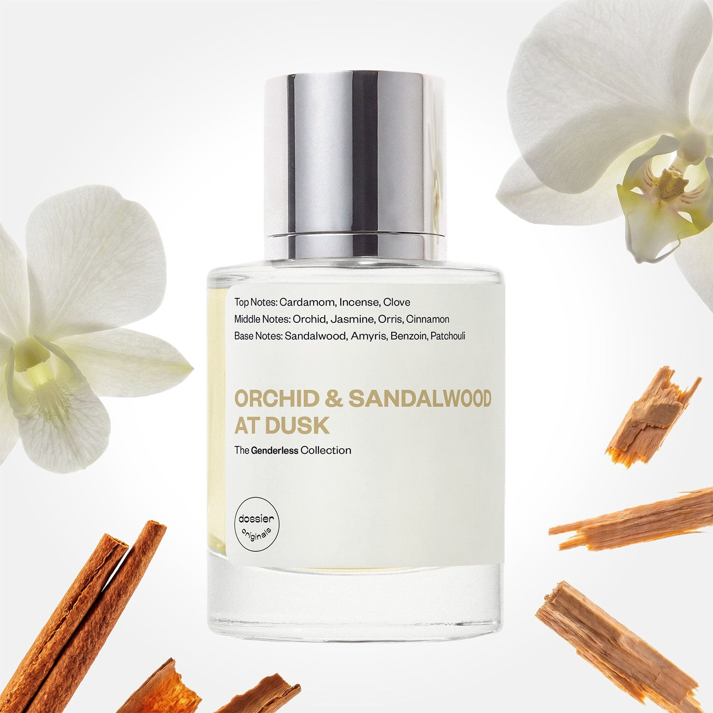

# Orchid & Sandalwood at Dusk

- **Dossier Dossier Originals**
- **URL:** https://dossier.co/products/orchid-sandalwood-at-dusk
- **SEO title:** Orchid & Sandalwood at Dusk

## Pricing (sizes)

| Size/SKU | Member price | List price | Currency |
|---|---|---|---|
| 50ml | 35.1 | 39 | USD |
| BF+Free | 0 | 0 | USD |

## Content (scent notes, about, editorial)

Back Home / Perfumes / Dossier Originals / ORCHID & SANDALWOOD AT DUSK 

Unisex 

New 

Orchid & Sandalwood at Dusk

Eau de Parfum. Size: 50ml / 1.7oz 

members: $35.10

Guest:
$39

Dossier Originals: The genderless nighttime editions 

Crafted in France 
Scent Family: warm 

Add to Cart 

Scent Notes Main Notes:

Orchid

Sandalwood

top: The first notes you smell 
Cardamom, Incense, Clove 
middle: The heart of the perfume 
Orchid, Jasmine, Orris, Cinnamon 
base: The notes that linger all day 
Sandalwood, Amyris, Benzoin, Patchouli 
ingredients: Alcohol Denat., Water, Parfum/Perfume, Hexyl Cinnamal, Benzyl Benzoate, Benzyl Salicylate, Cinnamal, Cinnamyl alcohol, Citral, Coumarin, Citronellol, Limonene, Eugenol, Farnesol, Geraniol, Linalool. 

Vegan
Cruelty-free

Clean ingredients

About Sensual, carnal, and spicy, velvety florals intermingled in a bottle.

Orchid & Sandalwood at Dusk enraptures the steamy sweetness of orchid with the rich woodiness of sandalwood notes, coated in hazy amber to unwind your mind and tantalize the senses for an elegant scent that lingers on the skin 

Scent Intensity: Statement 

Concentration: 18%

Gender: Unisex 

Shipping
Free shipping with 2+ items. 

Standard Shipping (with 2+ items) Auto-selected with 2+ items 
FREE 

Standard Shipping Auto-selected under 2 items 
$3.95 

Express shipping: 2 business days Select in checkout 
$19.00 

Returns
Free exchanges for all. Free returns with 

Exchanges
Free exchange, 1 time per order for all.

Returns
D+ members get 1 FREE return per order.
Non-members incur a $3.99/bottle return fee, 1 time per order.
Returns must be postmarked within 30 days of the initial order. Learn More 

FAQs Are these fragrances long lasting? They are designed to be very long lasting, just like designer fragrances, in some cases even longer, depending on the composition. 
When does the new packaging come out? We'll begin rolling out our new packaging across the U.S. and international markets soon! If you want to shop IRL - our new packaging first hits stores on January 11, 2026 at Walmart. Please note that if you are shopping online, you may receive a combination of our current and new packaging while we transition our inventory. 
How will I know what scent I like? We get it, shopping for perfumes online is hard! That's why we created a scent quiz, which will find the perfect scent for you Take the quiz (opens in new tab) 
Unsure about something? Ask us! help@dossier.co 

Best Layered With Combine 2 of our perfumes to create a third scent with layering, curated by our nose. Learn more 

You Might Love 

4.3 

Rated 4.3 out of 5 stars 

Based on 179 reviews 

Reviews 179 (tab expanded) Questions (tab collapsed) 

Filters 
Write a Review (Opens in a new window) 

179 reviews 
Sort Highest Rating Most Helpful Photos & Videos Most Recent Oldest Lowest Rating Least Helpful 

H 

Hanna 
Verified Buyer 

6/19/26 

Rated 5 out of 5 stars 

Did not expect to love this one so much!
Even though I love a lot of the notes here -- pink pepper, sandalwood, etc -- and tend to prefer a warm, woody smell, this wasn't one of the samples I was most excited to try. On first spray, I thought "oh, that's nice," but wasn't bowled over. Still, I gave it a skin test and by the end of the day I couldn't stop smelling it! I ordered a full-sized bottle the next day.
This is a super-mature (but not old lady), spicy scent, a little moody, but what I like best is that there's something almost juicy about it to my nose? Though it's NOWHERE in the notes, somehow, there's a tiny little splash of something almost like blackberry?
Anyway, I was very pleasantly surprised by this one and it's rapidly becoming a new favorite. 

Read More Read more about this review 

Was this helpful? Yes, this review from Hanna was helpful. 0 people voted yes No, this review from Hanna was not helpful. 0 people voted no 

DP 

Dossier Perfumes 
6/20/26 
Hanna! We love that you gave it a shot and by day’s end it kept you coming back. It’s awesome when a scent surprises you. Cheers to new favorites! 💫

TB 

tiff B. 
Verified Buyer 

6/15/26 

Rated 5 out of 5 stars 

OMG this scent
It smells so luxurious and beautiful and lasting throughout the day and I will be purchasing another bottle and also trying out other scents 

Read More Read more about this review 

Was this helpful? Yes, this review from tiff B. was helpful. 0 people voted yes No, this review from tiff B. was not helpful. 0 people voted no 

DP 

Dossier Perfumes 
6/15/26 
tiff, thank you so much for sharing your love! We’re thrilled it lasts all day and feels so luxe, and can’t wait for you to explore more of our catalog.

T 

Tanya 

6/11/26 

Rated 5 out of 5 stars 

5 Stars
Love this one. Very interesting fragrance. Subtle but definitely noticeable

Read More Read more about this review 

Was this helpful? Yes, this review from Tanya was helpful. 0 people voted yes No, this review from Tanya was not helpful. 0 people voted no 

IG 

Ivanna G. 
Verified Buyer 

6/7/26 

Rated 5 out of 5 stars 

Smells good 
Smells so good.

Read More Read more about this review 

Was this helpful? Yes, this review from Ivanna G. was helpful. 0 people voted yes No, this review from Ivanna G. was not helpful. 0 people voted no 

DP 

Dossier Perfumes 
6/7/26 
Ivanna, so glad you love it! Thanks for sharing your thoughts 😊

M 

Mistie 
Verified Reviewer 

5/16/26 

Rated 5 out of 5 stars 

Not your granny’s scent but mature
At first spray, I rolled my eyes — pure 1950s energy. But once it settled, it completely transformed. The blend feels unmistakably niche, polished and intentional, anchored by a note that carries itself with unapologetic confidence — and earns it. Best suited for colder weather or a night out when you want the fragrance to leave an impression.

Read More Read more about this review 

Was this helpful? Yes, this review from Mistie was helpful. 0 people voted yes No, this review from Mistie was not helpful. 0 people voted no 

DP 

Dossier Perfumes 
5/16/26 
Hey Mistie! We love that Orchid & Sandalwood at Dusk surprised you once it settled, shifting from retro vibes to something refined and confident. Perfect for chilly nights out.

Loading... 

Loading... 

Show More 

Inspired by  Baccarat Rouge 540 
Inspired by  Black Opium 
Inspired by  Love, Don't Be Shy 
Inspired by  Good Girl 
Inspired by  Libre 
Inspired by  Flowerbomb 
Inspired by  Light Blue 
Inspired by  Not a Perfume 
Inspired by  Aventus 
Inspired by  Bleu de Chanel 
Inspired by  Mon Paris 
Inspired by  Coco Mademoiselle 
Inspired by  Tom Ford for Men 
Inspired by  For Her 
Inspired by  J'Adore Dior 
Inspired by  Alien 
Inspired by  Black Opium Perfume 
Inspired by  Lost Cherry Perfume 

GET UP TO 30% OFF 

Find us at these retailers. 

Be the first to know. 
Submit 

Shop the following countries. United States 

Discover.
AI Scent Finder 
Blog (opens in new tab) 
Scent Family 
Layering 
Scent Quiz 

Help.
Contact Us 
Returns 
FAQ 
Testimonials 
Accessibility 

More.
Store Locator 
Boutique 
Refer A Friend 
Index 

Download our app now.

Find us at these retailers. 

Be the first to know. 
Submit 

Shop the following countries. United States 

Discover.
AI Scent Finder 
Blog (opens in new tab) 
Scent Family 
Layering 
Scent Quiz 

Help.
Contact Us 
Returns 
FAQ 
Testimonials 
Accessibility 

More.

## Main Image

