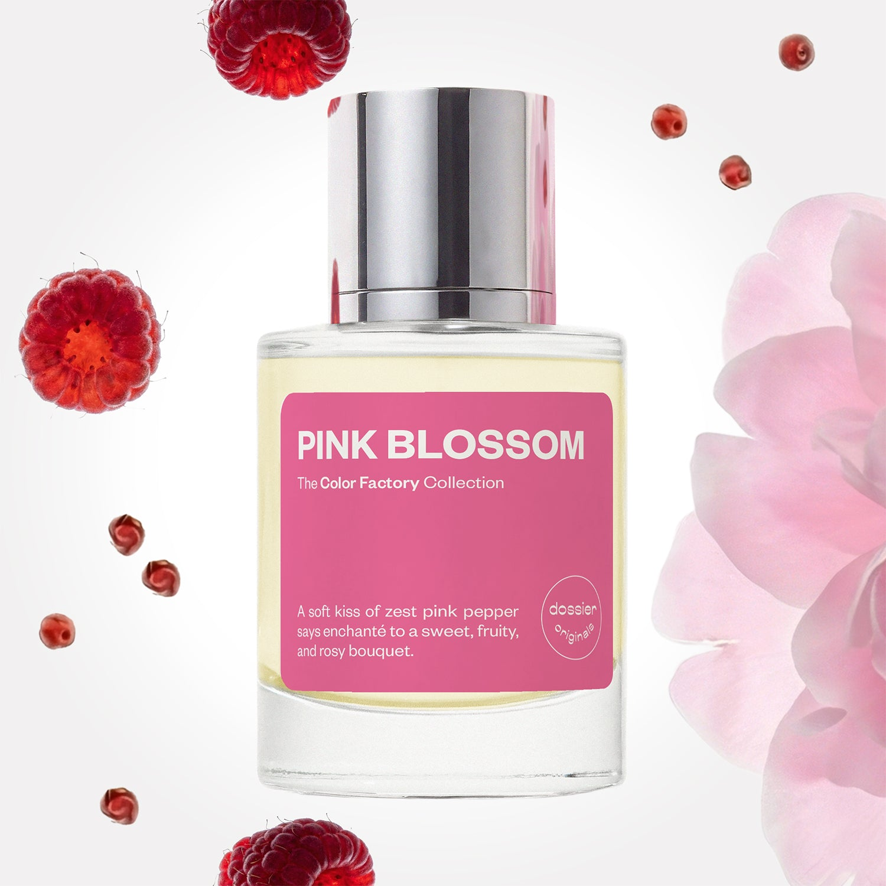

# Pink Blossom

- **Dossier Dossier Originals**
- **URL:** https://dossier.co/products/pink-blossom
- **SEO title:** Pink Blossom

## Pricing (sizes)

| Size/SKU | Member price | List price | Currency |
|---|---|---|---|
| DOS50PB | 35.1 | 39 | USD |

## Content (scent notes, about, editorial)

Back Home / Perfumes / Dossier Originals / PINK BLOSSOM 

Unisex 

New 

Pink Blossom

Eau de Parfum. Size: 50ml / 1.7oz 

members: $35.10

Guest:
$39

Dossier Originals: The color factory collection 

Crafted in France 
Scent Family: flowery 

Add to Cart 

Scent Notes Main Notes:

Cassis

Pink Pepper

Peony

Plum

Raspberry

top: The first notes you smell 
cassis, pink pepper , Mandarin 
middle: The heart of the perfume 
peony, plum , Rose, Violet 
base: The notes that linger all day 
raspberry , Patchouli, Musks, Vanilla 
ingredients: Alcohol Denat., Water, Parfum/Perfume, Camphor, Cananga Odorata Oil/Extract, Citral, Citrus Aurantium Bergamia Peel Oil, Tetramethyl Acetyloctahydronaphthalenes, Pinene, Rose Ketones, Terpineol, Dimethyl Phenethyl Acetate, Alpha-isomethyl Ionone, Alpha-Terpinene, Amyl Salicylate, Benzaldehyde, Benzyl Alcohol, Benzyl Benzoate, Benzyl Salicylate, Beta-caryophyllene, Cinnamal, Cinaamyl Alcohol, Citrus Limon Peel Oil, Citronellol, Limonene, Eugenol, Farnesol, Geraniol, Geranyl Acetate, Hydroxycitronellol, Linalool, Linalyl Acetate, Pogostemon Cablin Oil, Terpinolene, Vanillin 

Vegan
Cruelty-free

Clean ingredients

About Playful pink peppercorns and cassis notes woo you into a tender embrace of blushing floral and fruity notes. Pink Blossom interlaces sweet and romantic florals, juicy fruits, and warm, flirtatious notes to capture the essence of princess-like innocence with the cocoon of a sophisticated fragrance. 

The fragrance opens with cassis, mandarin, and pink pepper notes for a luscious greeting of fruity florals, zesty citrus, and a hint of complementary woodiness. It unfolds into a fruit-nestled floral heart of peony, plum, rose, and violet before drying down to reveal an enveloping sweet and tart base of raspberry, patchouli, musks, and vanilla. 

A lush garden full of soft and sweet blossoms with a hint of charm and serenity. 

Scent Intensity: Significant 

Concentration: 18%

Gender: Unisex 

Shipping
Free shipping with 2+ items. 

Standard Shipping (with 2+ items) Auto-selected with 2+ items 
FREE 

Standard Shipping Auto-selected under 2 items 
$3.95 

Express shipping: 2 business days Select in checkout 
$19.00 

Returns
Free exchanges for all. Free returns with 

Exchanges
Free exchange, 1 time per order for all.

Returns
D+ members get 1 FREE return per order.
Non-members incur a $3.99/bottle return fee, 1 time per order.
Returns must be postmarked within 30 days of the initial order. Learn More 

FAQs Are these fragrances long lasting? They are designed to be very long lasting, just like designer fragrances, in some cases even longer, depending on the composition. 
When does the new packaging come out? We'll begin rolling out our new packaging across the U.S. and international markets soon! If you want to shop IRL - our new packaging first hits stores on January 11, 2026 at Walmart. Please note that if you are shopping online, you may receive a combination of our current and new packaging while we transition our inventory. 
How will I know what scent I like? We get it, shopping for perfumes online is hard! That's why we created a scent quiz, which will find the perfect scent for you Take the quiz (opens in new tab) 
Unsure about something? Ask us! help@dossier.co 

Best Layered With Combine 2 of our perfumes to create a third scent with layering, curated by our nose. Learn more 

You Might Love 

3.7 

Rated 3.7 out of 5 stars 

Based on 43 reviews 

Reviews 43 (tab expanded) Questions 1 (tab collapsed) 

Filters 
Write a Review (Opens in a new window) 

43 reviews 
Sort Highest Rating Most Helpful Photos & Videos Most Recent Oldest Lowest Rating Least Helpful 

N 

Norma 
Verified Buyer 

6/8/26 

Rated 5 out of 5 stars 

Always gets compliments 
Very fragrant. I can smell it all day long. Others can smell it on me it comes n goes. Always getting compliments. Sometimes I can still smell it after days on my sweatshirts. 

Read More Read more about this review 

Was this helpful? Yes, this review from Norma was helpful. 0 people voted yes No, this review from Norma was not helpful. 0 people voted no 

DP 

Dossier Perfumes 
6/8/26 
Norma, we’re thrilled to hear those compliments keep rolling in and your scent sticks around even on sweaters. Thanks for sharing and here’s to more confident spritzes! 😊

L 

Lyn 
Verified Buyer 

4/26/26 

Rated 5 out of 5 stars 

Pink blossom 
My new delicious scent ... sweetttt

Read More Read more about this review 

Was this helpful? Yes, this review from Lyn was helpful. 0 people voted yes No, this review from Lyn was not helpful. 0 people voted no 

DP 

Dossier Perfumes 
4/26/26 
Lyn, thanks for sharing! Glad your new scent is bringing sweet vibes 😊

M 

Meg 

4/3/26 

Rated 5 out of 5 stars 

Omg! I am in love 🥰 
I absolutely love this scent! To me it smells like sun ripened raspberries and lasts all day without being overpowering! Definitely a new favorite!

Read More Read more about this review 

Was this helpful? Yes, this review from Meg was helpful. 0 people voted yes No, this review from Meg was not helpful. 0 people voted no 

DP 

Dossier Perfumes 
4/3/26 
Meg, we’re so happy this one is stealing the spotlight for you. And knowing it keeps you feeling fresh and balanced all day really makes our day. Thanks for sharing! 😊

A 

Amanda 

2/15/26 

Rated 5 out of 5 stars 

5 Stars
Amazing. Literally ALL my Dossier scents are absolutely beautiful. High quality and longevity is on point.

Read More Read more about this review 

Was this helpful? Yes, this review from Amanda was helpful. 0 people voted yes No, this review from Amanda was not helpful. 0 people voted no 

A 

Angelina 

Verified Buyer 

1/4/26 

Rated 5 out of 5 stars 

Long lasting!
Smells so good and lasted a while! Def will be using for nights I feel cutesy

Read More Read more about this review 

Was this helpful? Yes, this review from Angelina was helpful. 0 people voted yes No, this review from Angelina was not helpful. 0 people voted no 

DP 

Dossier Perfumes 
1/4/26 
Angelina, we’re so happy you loved it and its staying power! Here’s to all those cutesy nights ahead 😊

Loading... 

Loading... 

Show More 

Inspired by  Baccarat Rouge 540 
Inspired by  Black Opium 
Inspired by  Love, Don't Be Shy 
Inspired by  Good Girl 
Inspired by  Libre 
Inspired by  Flowerbomb 
Inspired by  Light Blue 
Inspired by  Not a Perfume 
Inspired by  Aventus 
Inspired by  Bleu de Chanel 
Inspired by  Mon Paris 
Inspired by  Coco Mademoiselle 
Inspired by  Tom Ford for Men 
Inspired by  For Her 
Inspired by  J'Adore Dior 
Inspired by  Alien 
Inspired by  Black Opium Perfume 
Inspired by  Lost Cherry Perfume 

GET UP TO 30% OFF 

Find us at these retailers. 

Be the first to know. 
Submit 

Shop the following countries. United States 

Discover.
AI Scent Finder 
Blog (opens in new tab) 
Scent Family 
Layering 
Scent Quiz 

Help.
Contact Us 
Returns 
FAQ 
Testimonials 
Accessibility 

More.
Store Locator 
Boutique 
Refer A Friend 
Index 

Download our app now.

Find us at these retailers. 

Be the first to know. 
Submit 

Shop the following countries. United States 

Discover.
AI Scent Finder 
Blog (opens in new tab) 
Scent Family 
Layering 
Scent Quiz 

Help.
Contact Us 
Returns 
FAQ 
Testimonials 
Accessibility 

More.

## Main Image

