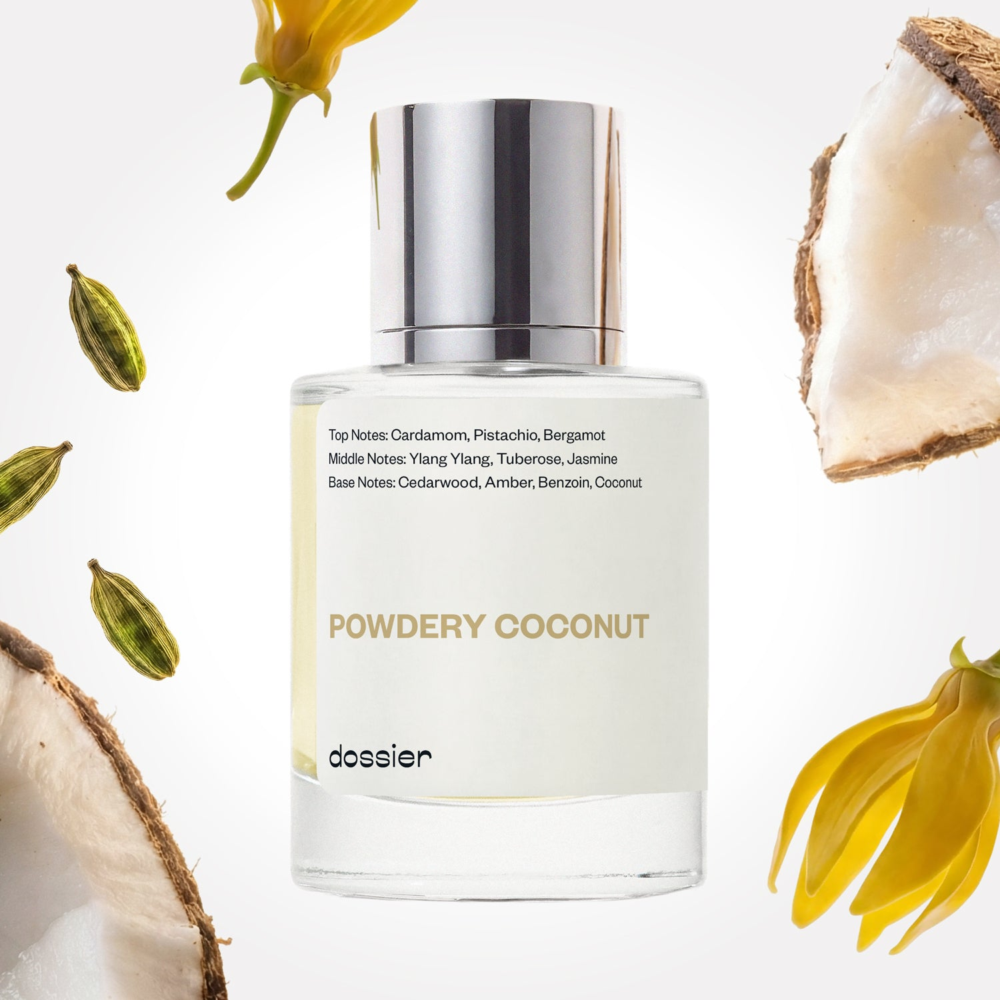

# Powdery Coconut

- **Dossier Inspired by Tom Ford's Soleil Blanc**
- **URL:** https://dossier.co/products/powdery-coconut
- **SEO title:** Tom Ford's Soleil Blanc Dupe Perfume: Powdery Coconut - Dossier Perfumes

## Pricing (sizes)

| Size/SKU | Member price | List price | Currency |
|---|---|---|---|
| 39527620214851 | 44.1 | 49 | USD |

## Content (scent notes, about, editorial)

Back Home / Perfumes / Dossier Impressions / POWDERY COCONUT 

Unisex 

Sold out 

Powdery Coconut

Eau de Parfum. Size: 50ml / 1.7oz 

members: $44.10

Guest:
$49

Inspired by Tom Ford's Soleil Blanc Inspired by Tom Ford's Soleil Blanc 
Inspired by Tom Ford's Soleil Blanc 

Retail price 300 Crafted in France 
Scent Family: warm 

Notify Me 

Scent Notes This perfume is: Tropical, spf and sunshine 
Main Notes:

Cardamom

Pistachio

Bergamot

Ylang Ylang

Tuberose

Jasmine

top: The first notes you smell 
Cardamom, Pistachio, Bergamot 
middle: The heart of the perfume 
Ylang Ylang, Tuberose, Jasmine 
base: The notes that linger all day 
Cedarwoood, Amber, Benzoin, Coconut 
ingredients: Alcohol, Water, Parfum/Perfume, Benzyl alcohol, Benzyl Benzoate, Benzyl Cinnamate, Benzyl Salicylate, Cinnamyl alcohol, Citral, Coumarin, Citronellol, Limonene, Eugenol, Farnesol, Geraniol, Hydroxycitronellal, Isoeugenol, Linalool. 

Vegan
Cruelty-free

Clean ingredients

About Powdery Coconut (inspired by Tom Ford's Soleil Blanc) opens with a surprising cardamon-pistachio duet, quickly joined by a bouquet of white flowers led by Ylang Ylang (an exotic flower with multiple sweet, spicy, and slightly fruity facets). The base of the fragrance strengthens the warmth of the heart thanks to amber and benzoin. Pair all of that with the coconut notes to help maintain the sunny character of the fragrance. 

Lush, unexpected, and warming, Powdery Coconut (our impression of Tom Ford's Soleil Blanc) is a highly qualitative solar fragrance that will inspire you to curl up in a surprisingly sultry bubble of comfort!

Scent Intensity: Significant 

Concentration: 18%

Gender: Unisex 

Shipping
Free shipping with 2+ items. 

Standard Shipping (with 2+ items) Auto-selected with 2+ items 
FREE 

Standard Shipping Auto-selected under 2 items 
$3.95 

Express shipping: 2 business days Select in checkout 
$19.00 

Returns
Free exchanges for all. Free returns with 

Exchanges
Free exchange, 1 time per order for all.

Returns
D+ members get 1 FREE return per order.
Non-members incur a $3.99/bottle return fee, 1 time per order.
Returns must be postmarked within 30 days of the initial order. Learn More 

FAQs Are these fragrances long lasting? They are designed to be very long lasting, just like designer fragrances, in some cases even longer, depending on the composition. 
When does the new packaging come out? We'll begin rolling out our new packaging across the U.S. and international markets soon! If you want to shop IRL - our new packaging first hits stores on January 11, 2026 at Walmart. Please note that if you are shopping online, you may receive a combination of our current and new packaging while we transition our inventory. 
How will I know what scent I like? We get it, shopping for perfumes online is hard! That's why we created a scent quiz, which will find the perfect scent for you Take the quiz (opens in new tab) 
Unsure about something? Ask us! help@dossier.co 

Best Layered With Combine 2 of our perfumes to create a third scent with layering, curated by our nose. Learn more 

You Might Love 

4.1 

Rated 4.1 out of 5 stars 

Based on 1,112 reviews 

Reviews 1,112 (tab expanded) Questions 2 (tab collapsed) 

Filters 
Write a Review (Opens in a new window) 

1,112 reviews 
Sort Highest Rating Most Helpful Photos & Videos Most Recent Oldest Lowest Rating Least Helpful 

K 

Kim 

6/17/26 

Rated 5 out of 5 stars 

5 Stars
Powdery coconut surprisingly, I really do love and it will layer well with so many fragrances.

Read More Read more about this review 

Was this helpful? Yes, this review from Kim was helpful. 0 people voted yes No, this review from Kim was not helpful. 0 people voted no 

S 

Sonjay 

6/15/26 

Rated 5 out of 5 stars 

5 Stars
Love it. Its a little softer than the inspired version. However still very beautiful

Read More Read more about this review 

Was this helpful? Yes, this review from Sonjay was helpful. 0 people voted yes No, this review from Sonjay was not helpful. 0 people voted no 

J 

Jeanette 

6/13/26 

Rated 5 out of 5 stars 

5 Stars
So impressed!

Read More Read more about this review 

Was this helpful? Yes, this review from Jeanette was helpful. 0 people voted yes No, this review from Jeanette was not helpful. 0 people voted no 

IP 

Ivan P. 
Verified Buyer 

6/11/26 

Rated 5 out of 5 stars 

Summer Days
When I first smelled Powdery Coconut, I was immediately enamored with how rich and savory it smelled. It captures a summertime luxurious vibe perfectly and I’m looking forward to making it my go to scent this summer!

Read More Read more about this review 

Was this helpful? Yes, this review from Ivan P. was helpful. 0 people voted yes No, this review from Ivan P. was not helpful. 0 people voted no 

M 

Maya 
Verified Buyer 

6/8/26 

Rated 5 out of 5 stars 

Been searching for this smell! 
This smells divine! Very upscale, powdery, vanilla-like, coconut cream sunscreen. I've been looking for a sunscreen scent, and this one is so beautiful without being chemical or fake or overpowering. Seems like it could pair well with other scents. I am so happy I blind bought this! I've never smelled the Tom Ford one. Thank you Dossier! 

Read More Read more about this review 

Was this helpful? Yes, this review from Maya was helpful. 0 people voted yes No, this review from Maya was not helpful. 0 people voted no 

DP 

Dossier Perfumes 
6/8/26 
Hey Maya! Wow, we’re thrilled you found that sunscreen vibe so gorgeous and light. Blind buying can really pay off, right? Have fun mixing it up with other scents 😊

Loading... 

Loading... 

Show More 

Inspired by  Baccarat Rouge 540 
Inspired by  Black Opium 
Inspired by  Love, Don't Be Shy 
Inspired by  Good Girl 
Inspired by  Libre 
Inspired by  Flowerbomb 
Inspired by  Light Blue 
Inspired by  Not a Perfume 
Inspired by  Aventus 
Inspired by  Bleu de Chanel 
Inspired by  Mon Paris 
Inspired by  Coco Mademoiselle 
Inspired by  Tom Ford for Men 
Inspired by  For Her 
Inspired by  J'Adore Dior 
Inspired by  Alien 
Inspired by  Black Opium Perfume 
Inspired by  Lost Cherry Perfume 

GET UP TO 30% OFF 

Find us at these retailers. 

Be the first to know. 
Submit 

Shop the following countries. United States 

Discover.
AI Scent Finder 
Blog (opens in new tab) 
Scent Family 
Layering 
Scent Quiz 

Help.
Contact Us 
Returns 
FAQ 
Testimonials 
Accessibility 

More.
Store Locator 
Boutique 
Refer A Friend 
Index 

Download our app now.

Find us at these retailers. 

Be the first to know. 
Submit 

Shop the following countries. United States 

Discover.
AI Scent Finder 
Blog (opens in new tab) 
Scent Family 
Layering 
Scent Quiz 

Help.
Contact Us 
Returns 
FAQ 
Testimonials 
Accessibility 

More.

## Main Image

